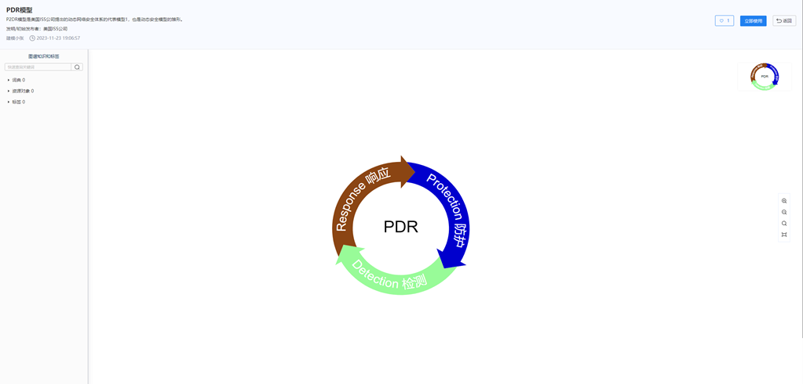
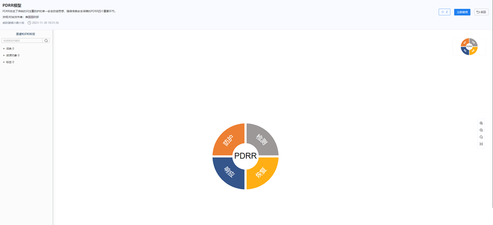
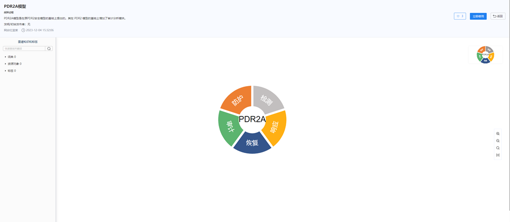
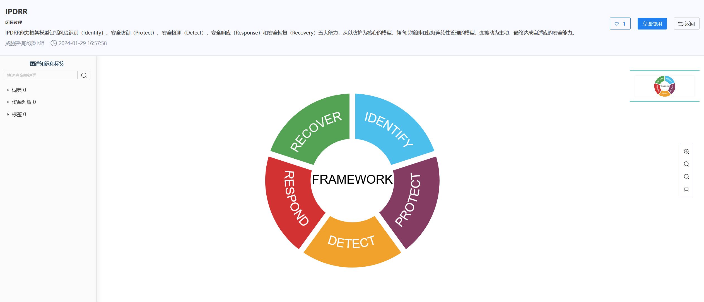
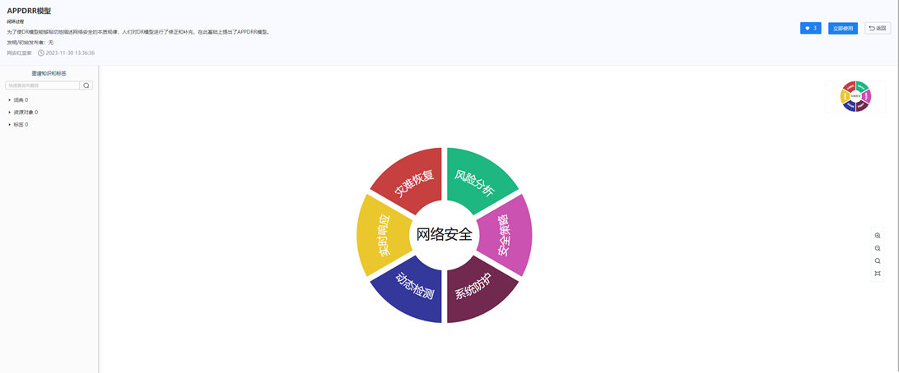
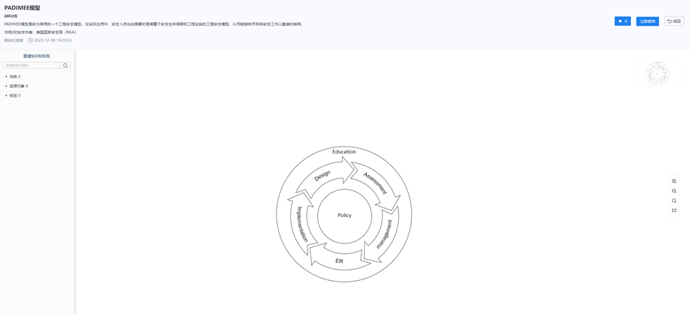
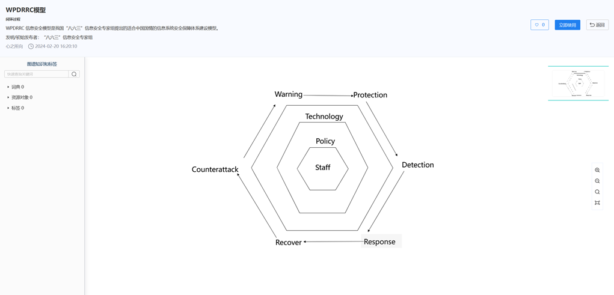
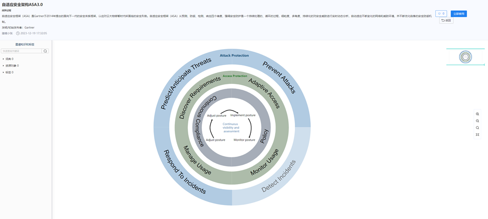
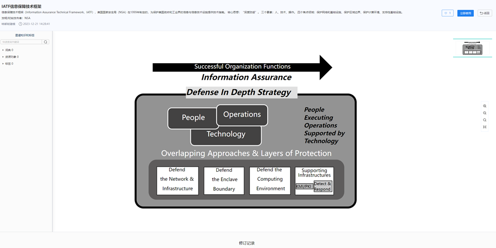

[30种经典网安模型介绍（上）](https://www.antiy.cn/research/technology_blog/mbsse_model01.html)
==================================================================================

安天2024年02月22日共 4378 字阅读需 5 分钟

网络安全建模可以帮助组织更全面、深入地理解其网络安全环境，从而更有效地预测和对抗潜在的威胁与风险。网络安全工作者也可以借助优秀的网络安全模型和框架的辅助更加直观清晰、更有条理的开展工作；网安模型还可以是网络安全规划、安全运营的重要辅助工具，使用网络安全模型对业务安全进行总结和指导，避免思维被局限，出现安全短板。

几个月前网络安全专家罗雄老师发表了《网络安全人士必知的35个安全框架及模型》\[1\]，为大家总结了35种业界经典的安全模型。这35种经典网络安全模型涵盖了安全生存、纵深防御、安全能力、成熟度、机密性模型、完整性模型、信息流模型等多个方面。这篇文章也成为了网络安全建模辅助工具社区广大用户探究网络安全建模的重要参考资料。

##### 35种经典网安模型发布情况

截至本文发布，得益于专家学者、业界同仁、网络安全爱好者及安天威胁建模兴趣小组的共同努力，[网络安全建模辅助工具平台的模型社区已完成并发布了其中30个模型](mbsse_model.html)（见下表1），供大家参考和使用。

同时，我们也将在近期以三篇文章连载的形式为大家介绍这30个模型。期待在这一系列的分享中，与大家一起更深层次的理解和应用网络安全建模的实用知识。

**经典网安模型发布情况如下：**

表1 经典网安模型发布情况

<table border="0" cellspacing="0" cellpadding="0" width="863"><tbody><tr><td width="106" style="font-weight: 700;">
<strong>序号</strong><o:p></o:p>
</td><td width="542" style="font-weight: 700;">
<strong>模型</strong><o:p></o:p>
</td><td width="216" style="font-weight: 700;">
<strong>是否上线</strong><o:p></o:p>
</td></tr><tr><td width="106">
<strong>1</strong><o:p></o:p>
</td><td width="542">
<strong>PDR</strong><strong>模型</strong><o:p></o:p>
</td><td width="216">
已上线<o:p></o:p>
</td></tr><tr><td width="106">
<strong>2</strong><o:p></o:p>
</td><td width="542">
<strong>P2DR</strong><strong>模型</strong><o:p></o:p>
</td><td width="216">
已上线<o:p></o:p>
</td></tr><tr><td width="106">
<strong>3</strong><o:p></o:p>
</td><td width="542">
<strong>PDRR</strong><strong>模型</strong><o:p></o:p>
</td><td width="216">
已上线<o:p></o:p>
</td></tr><tr><td width="106">
<strong>4</strong><o:p></o:p>
</td><td width="542">
<strong>PDR2A</strong><strong>模型</strong><o:p></o:p>
</td><td width="216">
已上线<o:p></o:p>
</td></tr><tr><td width="106">
<strong>5</strong><o:p></o:p>
</td><td width="542">
<strong>IPDRR</strong><strong>模型</strong><o:p></o:p>
</td><td width="216">
已上线<o:p></o:p>
</td></tr><tr><td width="106">
<strong>6</strong><o:p></o:p>
</td><td width="542">
<strong>APPDRR</strong><strong>模型</strong><o:p></o:p>
</td><td width="216">
已上线<o:p></o:p>
</td></tr><tr><td width="106">
<strong>7</strong><o:p></o:p>
</td><td width="542">
<strong>PADIMEE</strong><strong>模型</strong><o:p></o:p>
</td><td width="216">
已上线<o:p></o:p>
</td></tr><tr><td width="106">
<strong>8</strong><o:p></o:p>
</td><td width="542">
<strong>WPDRRC</strong><strong>模型</strong><o:p></o:p>
</td><td width="216">
已上线<o:p></o:p>
</td></tr><tr><td width="106">
<strong>9</strong><o:p></o:p>
</td><td width="542">
<strong>自适应安全架构ASA3.0</strong><o:p></o:p>
</td><td width="216">
已上线<o:p></o:p>
</td></tr><tr><td width="106">
<strong>10</strong><o:p></o:p>
</td><td width="542">
<strong>IATF</strong><strong>信息保障技术框架</strong><o:p></o:p>
</td><td width="216">
已上线<o:p></o:p>
</td></tr><tr><td width="106">
<strong>11</strong><o:p></o:p>
</td><td width="542">
<strong>网络生存模型</strong><o:p></o:p>
</td><td width="216">
未上线<o:p></o:p>
</td></tr><tr><td width="106">
<strong>12</strong><o:p></o:p>
</td><td width="542">
<strong>纵深防御模型</strong><o:p></o:p>
</td><td width="216">
已上线<o:p></o:p>
</td></tr><tr><td width="106">
<strong>13</strong><o:p></o:p>
</td><td width="542">
<strong>分层防护模型</strong><o:p></o:p>
</td><td width="216">
已上线<o:p></o:p>
</td></tr><tr><td width="106">
<strong>14</strong><o:p></o:p>
</td><td width="542">
<strong>SSE-CMM</strong><strong>模型</strong><o:p></o:p>
</td><td width="216">
已上线<o:p></o:p>
</td></tr><tr><td width="106">
<strong>15</strong><o:p></o:p>
</td><td width="542">
<strong>数据安全能力成熟度模型</strong><o:p></o:p>
</td><td width="216">
已上线<o:p></o:p>
</td></tr><tr><td width="106">
<strong>16</strong><o:p></o:p>
</td><td width="542">
<strong>软件安全能力成熟度模型</strong><o:p></o:p>
</td><td width="216">
已上线<o:p></o:p>
</td></tr><tr><td width="106">
<strong>17</strong><o:p></o:p>
</td><td width="542">
<strong>BLP</strong><strong>机密性模型</strong><o:p></o:p>
</td><td width="216">
已上线<o:p></o:p>
</td></tr><tr><td width="106">
<strong>18</strong><o:p></o:p>
</td><td width="542">
<strong>BiBa</strong><strong>完整性模型</strong><o:p></o:p>
</td><td width="216">
已上线<o:p></o:p>
</td></tr><tr><td width="106">
<strong>19</strong><o:p></o:p>
</td><td width="542">
<strong>信息流模型</strong><o:p></o:p>
</td><td width="216">
未上线<o:p></o:p>
</td></tr><tr><td width="106">
<strong>20</strong><o:p></o:p>
</td><td width="542">
<strong>信息系统安全保障评估模型</strong><o:p></o:p>
</td><td width="216">
已上线<o:p></o:p>
</td></tr><tr><td width="106">
<strong>21</strong><o:p></o:p>
</td><td width="542">
<strong>网络安全能力滑动标尺模型</strong><o:p></o:p>
</td><td width="216">
已上线<o:p></o:p>
</td></tr><tr><td width="106">
<strong>22</strong><o:p></o:p>
</td><td width="542">
<strong>数据安全治理框架（DSG）</strong><o:p></o:p>
</td><td width="216">
未上线<o:p></o:p>
</td></tr><tr><td width="106">
<strong>23</strong><o:p></o:p>
</td><td width="542">
<strong>数据安全架构5A方法论</strong><o:p></o:p>
</td><td width="216">
已上线<o:p></o:p>
</td></tr><tr><td width="106">
<strong>24</strong><o:p></o:p>
</td><td width="542">
<strong>等级保护模型</strong><o:p></o:p>
</td><td width="216">
未上线<o:p></o:p>
</td></tr><tr><td width="106">
<strong>25</strong><o:p></o:p>
</td><td width="542">
<strong>PETS</strong><strong>渗透测试框架</strong><o:p></o:p>
</td><td width="216">
已上线<o:p></o:p>
</td></tr><tr><td width="106">
<strong>26</strong><o:p></o:p>
</td><td width="542">
<strong>网络杀伤链（Kill&nbsp;Chain）</strong><o:p></o:p>
</td><td width="216">
已上线<o:p></o:p>
</td></tr><tr><td width="106">
<strong>27</strong><o:p></o:p>
</td><td width="542">
<strong>ATT&amp;CK</strong><strong>框架</strong><o:p></o:p>
</td><td width="216">
已上线<o:p></o:p>
</td></tr><tr><td width="106">
<strong>28</strong><o:p></o:p>
</td><td width="542">
<strong>钻石模型（The&nbsp;Diamond&nbsp;Model）</strong><o:p></o:p>
</td><td width="216">
已上线<o:p></o:p>
</td></tr><tr><td width="106">
<strong>29</strong><o:p></o:p>
</td><td width="542">
<strong>攻击树模型</strong><o:p></o:p>
</td><td width="216">
已上线<o:p></o:p>
</td></tr><tr><td width="106">
<strong>30</strong><o:p></o:p>
</td><td width="542">
<strong>STRIDE</strong><strong>模型</strong><o:p></o:p>
</td><td width="216">
已上线<o:p></o:p>
</td></tr><tr><td width="106">
<strong>31</strong><o:p></o:p>
</td><td width="542">
<strong>PASTA</strong><strong>威胁建模</strong><o:p></o:p>
</td><td width="216">
已上线<o:p></o:p>
</td></tr><tr><td width="106">
<strong>32</strong><o:p></o:p>
</td><td width="542">
<strong>零信任模型</strong><o:p></o:p>
</td><td width="216">
未上线<o:p></o:p>
</td></tr><tr><td width="106">
<strong>33</strong><o:p></o:p>
</td><td width="542">
<strong>NIST&nbsp;</strong><strong>网络安全框架</strong><o:p></o:p>
</td><td width="216">
已上线<o:p></o:p>
</td></tr><tr><td width="106">
<strong>34</strong><o:p></o:p>
</td><td width="542">
<strong>网络安全态势感知模型</strong><o:p></o:p>
</td><td width="216">
已上线<o:p></o:p>
</td></tr><tr><td width="106">
<strong>35</strong><o:p></o:p>
</td><td width="542">
<strong>LINDDUN</strong><strong>威胁建模</strong><o:p></o:p>
</td><td width="216">
已上线<o:p></o:p>
</td></tr></tbody></table>

本期我们重点介绍PDR模型、P2DR模型、PDRR模型、PDR2A模型、IPDRR模型、APPDRR模型、PADIMEE模型、WPDRRC模型以及自适应安全架构ASA3.0和IAFT信息保障技术框架这10种经典模型。了解详细模型内容可访问网络安全建模社区：[mbsse.antiy.cn](https://mbsse.antiy.cn/)。

##### 1.PDR模型

PDR模型是由美国国际互联网安全系统公司（以下简称：ISS）提出，它是最早体现主动防御思想的一种网络安全模型。模型包括保护、检测和响应三个环节。

保护（Protection）就是采用一切可能的措施来保护网络、系统以及信息的安全。保护通常采用的技术及方法主要包括加密、认证、访问控制、防火墙以及防病毒等。

检测（Detection）可以了解和评估网络和系统的安全状态，为安全防护和安全响应提供依据。检测技术主要包括入侵检测 、漏洞检测以及网络扫描等技术。

响应（Response）在安全模型中占有重要地位，是解决安全问题的最有效办法。解决安全问题就是解决紧急响应和异常处理问题，因此，建立应急响应机制，形成快速安全响应的能力，对网络和系统而言至关重要。

图1 PDR模型示例

##### 2.P2DR模型

P2DR模型源自美国ISS公司，它被认为是动态网络安全体系的代表模型，承载着动态安全模型的雏形。

P2DR模型中的防护、检测和响应形成了一个协同而动态的“闭环过程”。在整体安全策略的引导下，这一循环不断循环，以保障信息系统的整体安全。P2DR模型能为信息系统的安全提供坚实的防护基础，使得系统能够适应不断演变的威胁环境，实现动态而可持续的安全防护。

图2 P2DR模型示例

##### 3.PDRR模型

PDRR模型由美国国防部提出，是防护（Protection）、检测（Detection）、响应（Response）、恢复（Recovery）的缩写。PDRR改进了传统的只注重防护的单一安全防御思想，强调了信息安全保障的PDRR四个重要环节。

图3 PDRR模型示例

##### 4．PDR2A模型

PDR2A模型是在原PDR2安全模型的基础上提出的，由Protection（防护）、Detection（检测）、Response （响应）、Recovery（恢复）、Auditing（审计）组成。其在PDR2模型的基础上增加了审计分析模块。

图4 PDR2A模型示例

##### 5．IPDRR模型

IPDRR模型体现了安全保障系统化的思想，管理与技术结合来有效保障系统核心业务的安全。它包括风险识别（Identify）、安全防御（Protect）、安全检测（Detect）、安全响应（Response）和安全恢复（Recovery）五大能力。

这个框架从以防护为核心的模型，转向以检测和业务连续性管理的模型，变被动为主动，最终达成自适应的安全能力。通过持续的安全检测，可以及时发现并应对网络攻击事件，减少其对业务的影响，同时也可以对系统进行恢复和修复，确保系统的正常运行。

图5 IPDRR模型示例

##### 6．APPDRR模型

为了使DR模型能够贴切地描述网络安全的本质规律，网络安全工程师们在实践中对DR模型进行了修正和补充，在此基础上提出了APPDRR模型。APPDRR模型认为网络安全由风险评估（Assessment）、安全策略（Policy）、系统防护（Protection）、动态检测（Detection）、实时响应（Reaction）和灾难恢复（Restoration）六部分完成。APPDRR模型还隐含了网络安全的相对性和动态螺旋上升的过程，即：不存在百分之百的静态的网络安全，网络安全表现为一个不断改进的过程。

图6 APPDRR模型示例

##### 7.PADIMEE模型

PADIMEE模型是信息系统安全生命周期模型，它包括策略（Policy）、评估（Assessment）、设计（Design）、实现（Implementation）、管理（Management）、紧急响应（Emergency）和教育（Education）七个要素。整个模型以安全策略为核心，设计 - 实现 - 管理 - 评估围绕策略形成一个闭环，其中紧急响应是管理的一个组成部分，教育覆盖了各个环节。

图7 PADIMEE模型示例

##### 8．WPDRRC模型

WPDRRC安全模型是我国在PDR模型、P2DR模型及PDRR等模型的基础上提出的，适合我国国情的网络动态安全模型，重点在PDRR模型的前后增加了预警和反击功能。

WPDRRC模型有6个环节和3大要素：

6个环节包括预警、保护、检测、响应、恢复和反击，它们具有较强的时序性和动态性，能够较好地反映出信息系统安全保障体系的预警能力、保护能力、检测能力、响应能力、恢复能力和反击能力。

3大要素包括人员、策略和技术，人员是核心，策略是桥梁，技术是保证。3大要素落实在WPDRRC模型6个环节的各个方面，将安全策略变为安全现实。

图8 WPDRRC模型示例

##### 9.自适应安全架构ASA3.0

自适应安全框架（ASA）是Gartner于2014年提出的面向下一代的安全体系框架，以应对“云大物移智”时代所面临的安全形势。自适应安全框架（ASA）从预测、防御、检测、响应四个维度，强调安全防护是一个持续处理的、循环的过程，细粒度、多角度、持续化的对安全威胁进行实时动态分析，自动适应不断变化的网络和威胁环境，并不断优化自身的安全防御机制。

图9 自适应安全架构ASA3.0示例

##### 10．IATF信息保障技术框架

IATF提出信息安全保障的核心思想是纵深防御，采用一个多层次的、纵深的安全措施来保障信息系统安全。

IATF提出的深度防御战略3个核心要素为人、技术、和操作。

IATF关注网络和基础设施、区域边界、计算环境、支撑性基础设施4个焦点领域。基于4个焦点领域，结合IATF纵深防御思想进行安全防御从而形成保障框架。

图10 IATF信息保障技术框架示例

##### 总结

上述10种经典的网安模型在mbsse的模型社区中已发布，欢迎各位模型爱好者、研究者访问并获取使用，同时大家也可以在此基础上根据自身的实践经验进行创建建模尝试。

我们深知我们在网安模型建设中还有一些不足以及对模型研究的深度和广度还不够，我们会继续对网安模型进行更多深入研究，为大家分享更多优秀的网安模型。同时，我们也希望各位业内同仁和相关领域的研究者、爱好者试用、测试我们的平台，对我们的工作进行检验、提出批评，共同推动网络安全建模发展。

平台访问地址：[mbsse.antiy.cn](https://mbsse.antiy.cn/)

##### 参考资料

\[1\] 兰花豆说网络安全,网络安全人士必知的35个安全框架及模型\[R/OL\].(2023-11-02)

[https://mp.weixin.qq.com/s/PDaYX5S4HylHwIndaxKWzQ](https://mp.weixin.qq.com/s/PDaYX5S4HylHwIndaxKWzQ)

安天

web工具

威胁建模

网络安全模型

PDR模型

P2DR模型

PDRR模型

PDR2A模型

IPDRR模型

APPDRR模型

PADIMEE模型