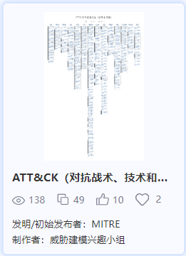

[30种经典网安模型介绍（下）](https://www.antiy.cn/research/technology_blog/mbsse_model03.html)
==================================================================================

安天2024年03月07日共 3569 字阅读需 4.5 分钟

本篇是MBSSE网络安全建模社区经典模型连载的最后一篇，我们将继续介绍**PETS渗透测试框架、网络杀伤链、ATT&CK框架、钻石模型、攻击树模型、STRIDE模型、PASTA威胁建模、NIST网络安全框架、网络安全态势感知模型、LINDDUN威胁建模**这几种模型。了解详细模型内容可访问 _网络安全建模社区：[mbsse.antiy.cn](https://mbsse.antiy.cn/)_。

##### 1.PETS渗透测试框架

PETS渗透测试框架分为：前期交互、情报搜集、威胁建模、漏洞分析、渗透攻击、后渗透攻击、报告阶段。它的核心理念是通过建立起进行渗透测试所要求的基本准则基线定义一次真正的渗透测试过程，得到了安全业界的广泛认同。

在前期交互阶段，通常是与客户组织进行讨论，来确定渗透测试的范围和目标。

在情报搜集阶段，需要使用各种可能的方法来收集将要攻击的客户组织的所有信息，包括使用社交媒体网络、Google Hacking技术、目标系统踩点等等。

在威胁建模阶段，主要使用在情报搜集阶段所获取到的信息，来标识出目标系统上可能存在的安全漏洞与弱点。

在漏洞分析阶段，综合从前面的几个环节中获取到信息，并从中分析和理解哪些攻击途径是可行的。

在渗透攻击阶段，对目标系统实施渗透攻击。

后渗透攻击阶段，从已经攻陷了客户组织的一些系统或取得管理权限之后开始，从一个系统攻入另一个系统，从而演示出能够对客户组织造成最重要业务影响的攻击途径。

报告阶段，是渗透测试过程中最为重要的因素，使用报告文档来交流在渗透测试过程中做了哪些、如何做的、以及客户组织如何修复所发现的安全漏洞和弱点。

图1 PETS渗透测试框架

##### 2.网络杀伤链

网络杀伤链模型(Cyber kill Chain)由美国洛克西德·马丁公司于2011年提出，网络空间攻击行为分为七个步骤。包括侦查跟踪、武器构建、载荷投递、漏洞利用、安装植入、命令与控制、目标达成。

网络杀伤链模型是网络攻击中威胁行为者必须完成的一系列阶段才能实现其目标。通过识别攻击的进展阶段，组织可以更好地防御和阻止网络事件。网络杀伤链模型精髓在于明确提出网络攻防过程中攻防双方互有优势，攻击方必须专一持续，而防守方若能阻断/瓦解攻击方的进攻组织环节，即成功地挫败对手攻击企图。

图2 网络杀伤链

##### 3.ATT&CK框架

ATT&CK，英文全称Adversarial Tactics, Techniques, and Common Knowledge，中文为对抗性的策略、技巧和常识。它是由美国MITRE机构2013首次提出的一套攻击行为知识库模型和框架，它将已知攻击者行为转换为结构化列表，汇总成战术和技术，并通过若干个矩阵以及结构化威胁信息表达式（STIX）、指标信息的可信自动化交换（TAXII）来表示。主要应用于评估攻防能力覆盖、APT情报分析、威胁狩猎及攻击模拟等领域。

ATT&CK Matrix for Enterprise中战术按照逻辑分布在多个矩阵中，以“初始访问”战术开始，经过“执行”、“持久化”、“提权”、“防御绕过”、“凭据访问”、“发现”、“横向移动”、“收集”、“命令与控制”、“数据泄露“、”影响“等共计14项战术。

图3 ATT&CK框架

##### 4.钻石模型

钻石模型是一个针对单个安全事件分析的模型，核心就是用来描述攻击者的技战术和目的。模型建立的基本元素是入侵活动事件，每个事件都有四个核心特征：对手、能力、基础设施及受害者。这些功能通过连线来代表它们之间的关系，并布置成菱形，因此得名“钻石模型”。

图4 钻石模型

##### 5.攻击树模型

攻击树（Attack trees） 为我们提供了一种正式而条理清晰的方法来描述系统所面临的安全威胁和系统可能受到的多种攻击。我们用树形结构来表示系统面临的攻击，其中根节点代表被攻击的目标，攻击者需要遵循不同的攻击路径到达目标节点。攻击树模型的节点包括基本事件、中间事件和最终事件，每个节点都表示系统中的一个潜在漏洞或安全问题。

攻击树模型是一种图形化的安全评估工具，它用于评估系统和网络的安全性，并确定防御和应对潜在攻击的策略。

图5 攻击树模型

##### 6.STRIDE模型

STRIDE模型是一个由微软提出的威胁建模方法，它旨在帮助应用程序设计人员预测和评估应用程序可能面临的潜在威胁。STRIDE模型包含六个不同的威胁类别，分别是：

1)身份欺诈 (Spoofing)：攻击者通过伪造身份来欺骗用户或系统。

2)篡改 (Tampering)：攻击者更改数据以满足自己的目的。

3)抵赖 (Repudiation)：攻击者否认自己的行为。

4)信息泄露 (Information Disclosure)：攻击者泄露敏感信息。

5)拒绝服务 (Denial of Service)：攻击者使系统或服务不可用。

6)特权提升 (Elevation of Privilege)：攻击者获得超出其权限的访问权限。

通过使用STRIDE模型，开发团队可以在设计阶段发现潜在威胁，并采取措施来减少这些风险。

图6 STRIDE模型

##### 7.PASTA威胁建模

VerSprite Security公司在2012年提出的PASTA（Process for Attack Simulation and Threat Analysis）通过风险为中心的威胁建模方法，针对应用程序或系统环境识别可行的威胁模式，量化可能影响业务或系统的风险。

PASTA代表攻击模拟和威胁分析过程，致力于使技术安全要求与业务目标保持一致。由七个步骤组成：定义目标、定义技术范围、应用程序分解、威胁分析、漏洞和弱点分析、攻击建模、风险与影响分析。

图7 PASTA威胁建模

##### 8.NIST网络安全框架

NIST框架是美国国家标准与技术研究院（NIST）提出的一种信息安全管理框架，旨在帮助组织建立和维护有效的信息安全管理系统。该框架包括五个核心组件：识别、保护、检测、响应和恢复。

NIST框架是一种有效的信息安全管理框架，通过实施NIST框架，组织可以更好地保护其信息系统，并更快地响应安全事件。

图8 NIST网络安全框架

##### 9.网络安全态势模型

网络安全态势感知模型是开展网络安全态势感知研究的前提和基础。基于大规模网络环境中的安全要素和特征，采用数据分析、挖掘和智能推演等方法，准确理解和量化当前网络空间的安全态势，有效检测网络空间中的各种攻击事件，预测未来网络空间安全态势的发展趋势，并对引起态势变化的安全要素进行溯源。国外研究的网络安全态势感知模型主要有JDL模型、Endsley模型和Tim Bass模型等。

Tim Bass模型基于入侵检测的多传感器数据包括四级，第0级为数据精炼，主要负责提取、过滤和校准入侵检测的多传感器原始数据；第1级为对象精炼，将数据规范化，统一格式后，进行关联分析，提炼分析对象，按相对重要性赋予权重；第2级为态势评估，根据提炼的分析对象和赋予的权重评估系统的安全状况；第3级为威胁评估，主要是基于网络安全态势库和对象库状况评估可能产生的威胁及其影响；第4级为资源管理，主要负责整个态势酸D过程的资源管理，优化态势初过程和评估预测结果。

图9 网络安全态势感知模型

##### 10.LINDDUN威胁建模

LINDDUN是一种隐私威胁建模方法，支持分析师系统地引发和减轻软件架构中的隐私威胁。LINDDUN提供支持以结构化方式指导完成威胁建模过程。此外，LINDDUN还提供隐私知识支持，让非隐私专家也能推理出隐私威胁。

LINDDUN的威胁建模过程为：定义DFD，将隐私威胁映射到DFD元素，识别威胁情景，区分威胁的优先级，引出缓解策略，选择相应的渗透测试。

图10 LINDDUN威胁建模

##### 总结

MBSSE网络安全建模社区经典模型连载系列在本篇就结束了。我们以三篇文章连载方式简单介绍了经典网安模型中的30种模型，同时展示了由各位网安模型爱好者贡献在建模社区的模型示例。随着MBSSE推出后不断被各位模型爱好者使用，每天都有网安模型爱好者在我们的模型社区中发布新模型。我们欢迎更多的网安模型爱好者们加入我们，通过网安模型或框架，指导网络安全策略的设计或改进，一起推动网安建模的发展。欢迎登陆网络安全辅助建模工具平台(访问地址：[mbsse.antiy.cn](https://mbsse.antiy.cn/))模型社区交流。

##### 参考资料

\[1\] 安天,经典的35种网络安全模型，mbsse社区已聚集30个\[R/OL\].(2024-01-30)

[https://www.antiy.cn/research/technology\_blog/mbsse\_model.html](https://www.antiy.cn/research/technology_blog/mbsse_model.html)

安天

web工具

威胁建模

网络安全模型

PETS渗透测试框架

网络杀伤链

ATT&CK框架

钻石模型

攻击树模型

STRIDE模型

PASTA威胁建模

NIST网络安全框架

网络安全态势感知模型

LINDDUN威胁建模