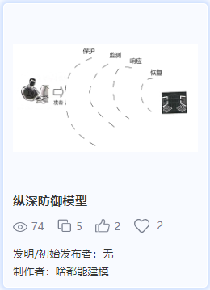
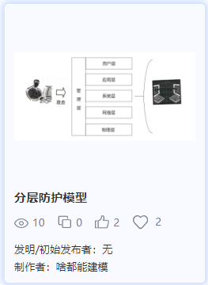
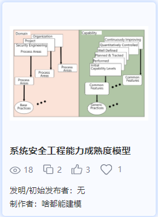
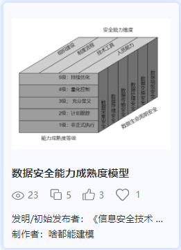
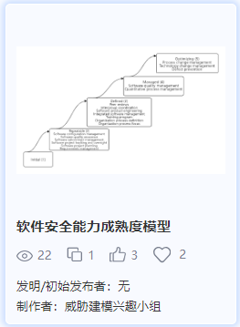
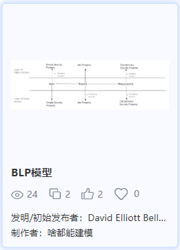
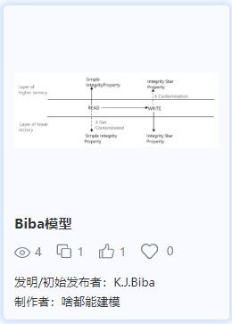
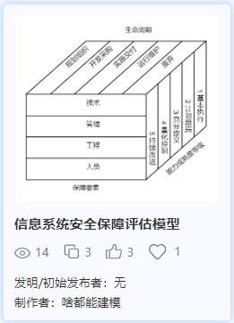
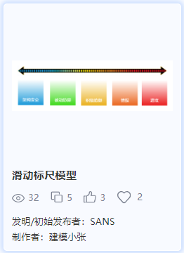
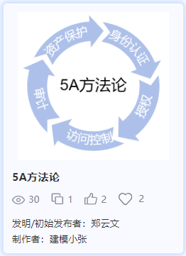

[30种经典网安模型介绍（中）](https://www.antiy.cn/research/technology_blog/mbsse_model02.html)
==================================================================================

安天2024年02月29日共 3679 字阅读需 4.5 分钟

我们在前面一篇文章中依次介绍了PDR模型、P2DR模型、PDRR模型、PDR2A模型、IPDRR模型、APPDRR模型、PADIMEE模型、WPDRRC模型、自适应安全框架ASA 3.0、IATF信息保障技术框架这几种模型。如果对这10种模型感兴趣的模型爱好者们可以访问[《30种经典网安模型介绍(上)》](mbsse_model01.html)这篇文章进行查看。

本篇将继续介绍**纵深防御模型、分层防护模型、SSE-CMM模型、数据安全能力成熟度模型、软件安全能力成熟度模型、BLP机密性模型、BiBa完整性模型、信息系统安全保障评估模型、网络安全能力滑动标尺模型、数据安全架构5A方法论**这10种模型。了解详细模型内容可访问 _网络安全建模社区：[mbsse.antiy.cn](https://mbsse.antiy.cn/)_。

##### 1.纵深防御模型

纵深防御模型的基本思路是将信息网络安全防护措施有机组合起来，针对保护对象，部署合适的安全措施，形成多道保护线，各安全防护措施能够相互支持和补救，尽可能地阻断攻击者的威胁。纵深防御也被称为深度防护战略（Defense-in-Depth），旨在通过多层次、多维度的安全措施，提高网络的安全性。

目前，安全业界认为网络需要建立四道防线：第一道防线是安全保护，能够阻止对网络的入侵和危害；第二道防线是安全监测，可以及时发现入侵和破坏；第三道防线是实施响应，当攻击发生时维持网络"打不垮"；第四道防线是恢复，使网络在遭受攻击后能够以最快的速度“起死回升”，最大限度地降低安全事件带来的损失。

图1 纵深防御模型示例

##### 2.分层防护模型

分层防护模型通过将保护对象划分为不同的层次，并为每一层部署相应的安全措施，提供多层次的保护手段来减轻潜在的威胁和攻击所造成的影响。

分层防护模型针对单独保护节点，以OSI7层模型为参考，对保护对象进行层次化保护。典型保护层次分为物理层、网络层、系统层、应用层、用户层、管理层，然后针对每层的安全威胁，部署合适的安全措施，进行分层防护。

分层防护模型采用多层次的安全策略和技术，形成了多重防御的体系结构，能够在不同层面上对威胁进行拦截和阻止，提高了整体的安全性。通过多层次的安全保护，有效降低受到攻击和数据泄露的风险，提高系统的稳定性和可靠性。

图2 分层防护模型示例

##### 3.SSE-CMM模型

SSE-CMM（Systems Security Engineering Capability Maturity Model）是系统安全工程能力成熟度模型。该模型基于能力成熟度模型（CMM）的概念，着重于系统安全工程的各个阶段，从而使组织能够逐步提高其系统安全工程的水平。

SSE-CMM包括五个不同的能力级别，分别是初始（Level 1）、可重复（Level 2）、定义的（Level 3）、管理的（Level 4）和优化的（Level 5）。每个级别表示组织在系统安全工程方面的成熟度水平。SSE-CMM 定义了一系列的过程领域，包括工程过程类（Engineering）、组织过程类（Organization）、项目过程类（Project）。

图3 SSE-CMM模型示例

##### 4.数据安全能力成熟度模型

DSMM（Data security capability maturity model）数据安全能力成熟度模型，由阿里巴巴作为主要起草单位编制的一份关于数据安全管理的标准。DSMM借鉴能力成熟度模型（CMM）的思想，将数据按照其生命周期分阶段采用不同的能力评估等级，分为数据采集安全、数据传输安全、数据存储安全、数据处理安全、数据交换安全、数据销毁安全六个阶段。DSMM从组织建设、制度流程、技术工具、人员能力四个安全能力维度的建设进行综合考量。DSMM划分成了1-5个等级，依次为非正式执行级、计划跟踪级、充分定义级、量化控制级、持续优化级，形成一个三维立体模型，全方面对数据安全进行能力建设。

图4 数据安全能力成熟度模型示例

##### 5.软件安全能力成熟度模型

软件安全能力成熟度模型分成五级，各级别的主要过程如下：

CMM1级-补丁修补：

CMM2级-渗透测试、安全代码评审；

CMM3级-漏洞评估、代码分析、安全编码标准；

CMM4级-软件安全风险识别、SDLC实施不同安全检查点；

CMM5级-改进软件安全风险覆盖率、评估安全差距。

图5 软件安全能力成熟度模型示例

##### 6.BLP机密性模型

BLP机密性模型是由David Bell和Leonard LaPadula提出的符合军事安全策略的计算机安全模型，简称BLP模型。该模型用于防止非授权信息的扩散，从而保证系统的安全。

BLP模型有两个特性：简单安全特性、\*特性。

简单安全特性：主体对客体进行读访问的必要条件是主体的安全级别不小于客体的安全级别，主体的范畴集合包含客体的全部范畴，即主体只能向下读，不能向上读。

\*特性：一个主体对客体进行写访问的必要条件是客体的安全级支配主体的安全级，即客体的保密级别不小于主体的保密级别，客体的范畴集合包含主体的全部范畴，即主体只能向上写，不能向下写。

图6 BLP机密性模型示例

##### 7.BiBa完整性模型

BiBa完整性模型是由美国计算机科学家Kenneth J. Biba于1975年提出的，旨在防止未经授权的信息修改。BiBa模型与Bell-LaPadula（BLP）模型不同，BLP主要关注机密性，而BiBa关注完整性。

BiBa模型具有三个安全特性：简单安全特性、\*特性、调用特性。

简单安全特性：主体对客体进行修改访问的必要条件是主体的完整性级别不小于客体的完整性级别，主体的范畴集合包含客体的全部范畴，即主体不能向下读。

\*特性：主体的完整性级别小于客体的完整性级别，不能修改客体，即主体不能向上写。

调用特性：主体的完整性级别小于另一个主体的完整性级别，不能调用另一个主体。

图7 BiBa完整性模型示例

##### 8.信息系统安全保障评估模型

国标 GB/T 20247.1-2006《信息安全技术 信息安全保障评估框架第一部分：简介和一般模型》，定义了信息系统安全保障评估模型。

信息系统安全保障评估模型以风险和策略为基础，在整个信息系统的生命周期中实施技术、管理、工程和人员保障要素。通过信息系统安全保障实现信息安全的安全特征：信息的保密性、完整性和可用性特征，从而达到保障组织机构执行其使命的根本目的。

图8 信息系统安全保障评估模型示例

##### 9.网络安全能力滑动标尺模型

2015年，美国系统网络安全协会(SANS)提出了网络安全滑动标尺模型。该模型将网络安全体系建设过程分为架构安全、被动防御、积极防御、威胁情报和进攻反制五个阶段，按照每个阶段的建设水平来对安全防护能力进行评估，并指导未来安全防护能力的建设。

第一阶段是架构安全，主要是从架构层面解决网络空间中信息系统的“自身肌体健康”问题，是整个网络安全的根基，可视为网络安全“木桶的底板”，没有安全的“底板”，讨论木桶“长板”“短板”没有任何意义。

第二阶段为被动防御，意即根据架构完善安全系统、掌握工具、方法，具备初级检测和防御能力。

第三阶段为主动防御，指主动分析检测、应对，从外部的攻击手段和手法进行学习，该阶段开始引入了渗透测试、攻防演练和外部威胁情报。

第四阶段为威胁情报，指利用流量、主机或其他各种数据通过机器学习，进行建模及大数据分析，开展攻击行为的自学习和自识别，进行攻击画像、标签等活动。

第五阶段为进攻反制，指利用技术和策略对对手进行反制威慑。

图9 网络安全能力滑动标尺模型示例

##### 10.数据安全架构5A方法论

《数据安全架构设计与实战》一书提出安全架构的5A方法论。数据安全架构5A方法论，分为身份认证、授权、访问控制、审计、资产保护。5A方法论是为达成信息资产的保密性(Confidentiality)、完整性(Integrity)和可用性(Availability)，三个性质简记为CIA，这个安全目标而采取的技术手段。

图10 数据安全架构5A方法论示例

##### 总结

上述10种经典的网安模型介绍完了，大家可以登陆网络安全辅助建模工具平台(访问地址：[mbsse.antiy.cn](https://mbsse.antiy.cn/))模型社区浏览获取；同时大家也可以在此基础上进行创新建模尝试。

在深入挖掘建模的工作中，我们充分感受到网络安全建模辅助工具社区用户们强大的力量，正是由于前人们提供的大量优质内容，我们才得以站在巨人的肩膀上，深入研究、更好地理解各种模型。在此，我们再次由衷感谢各位模型爱好者们贡献的各种优秀的网安模型。

下一篇我们将介绍剩余10种经典的网络安全模型，敬请期待~

##### 参考资料

\[1\] 安天,经典的35种网络安全模型，mbsse社区已聚集30个\[R/OL\].(2024-01-30)

[https://www.antiy.cn/research/technology\_blog/mbsse\_model.html](https://www.antiy.cn/research/technology_blog/mbsse_model.html)

安天

web工具

威胁建模

网络安全模型

纵深防御模型

分层防护模型

SSE-CMM模型

数据安全能力成熟度模型

软件安全能力成熟度模型

BLP机密性模型

BiBa完整性模型

信息系统安全保障评估模型

网络安全能力滑动标尺模型

数据安全架构5A方法论