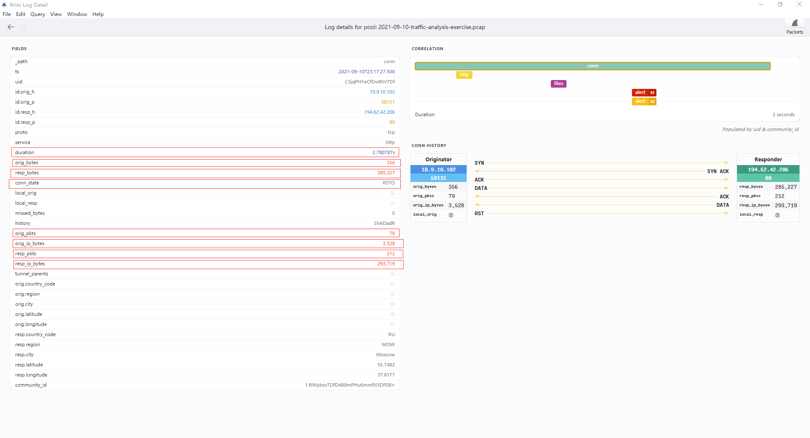
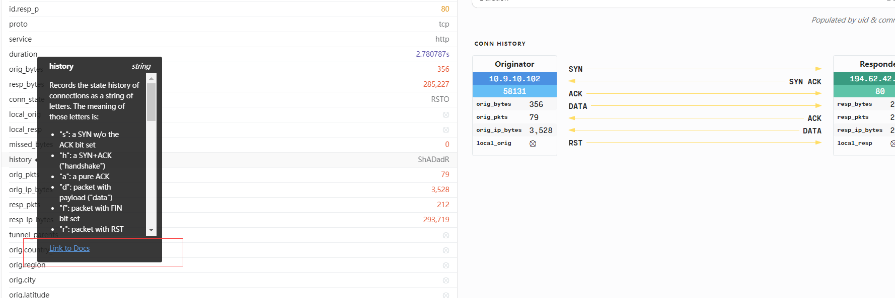
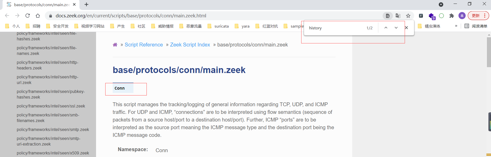

## **Brim Pcap分析软件**

下载：
<https://github.com/brimdata/brim/releases>

**一、conn连接日志截图**

**二、日志解释：**

1、conn_state：连接状态

-------------------------------------------------------------------------------------------------------------------------------
0x01 S0:	连接尝试，未响应。

0x02 S1:	连接已建立，未终止。

0x03 SF:	正常的建立和终止,注意，这是与状态S1相同的符号,您可以将两者区分开来，因为对于S1，摘要中不会有任何字节计数，而对于SF，则会有。

0x04 REJ:	连接尝试被拒绝。

0x05 S2:	发起者建立并 关闭连接(但没有应答者的应答)。 ps:单方面上传

pcap中{

src	->	dst [syn]

src	<-	dst [syn,ack]

src	->	dst [ack]

src	->	dst [fin,ack]

}

0x06 S3:	应答者建立连接并尝试关闭(但没有来自发起者的应答)。

pcap中{

src->dst [syn]

src<-dst [syn,ack]

src->dst [ack]

src<-dst [fin,ack]

}

0x07 RSTO:	连接建立，发起者中止(发送一个RST)。

0x08 RSTR:	响应者发送了一个RST。

0x09 RSTOS0:	发起者发送了一个SYN，然后是一个RST，我们从来没有看到来自响应者的一个SYN ACK。

0x10 RSTRH:	应答者发送了一个SYN ACK，然后是一个RST，我们从来没有见到一个SYN来自(声称)发起者。

0x11 SH:	发起人发送了一个SYN，然后是一个FIN，我们从来没有看到一个SYN ACK从响应(因此连接是"半"打开)。

0x12 SHR:	回复者发送了一个SYN ACK，后面跟着一个FIN，我们从来没见过发送者发送的SYN。

0x13 OTH:	没有看到SYN，只有中流流量(“部分连接”没有关闭)

-------------------------------------------------------------------------------------------------------------------------------

2、duration:连接持续了多长时间，对于三向或四向连接拆除，这将不包括最终的ACK

3、orig_bytes:发送者发送的有效负载字节数。对于TCP，这是从序列号中提取的，可能不准确

4、resp_bytes:响应者发送的有效负载字节数。对于TCP，这是从序列号中提取的，可能不准确

5、orig_pkts:发端发送的数据包个数

6、orig_ip_bytes:发起者发送的IP级字节数(如包上所示，取自IP里的 total_length报头字段累加和）

7、resp_pkts:应答器发送的包个数

8、resp_ip_bytes:响应者发送的IP级字节数(如包上所示，取自IP里total_length报头字段累加和)

**三、参考手册：**

<https://docs.zeek.org/en/current/scripts/base/protocols/conn/main.zeek.html>

**结束！**

