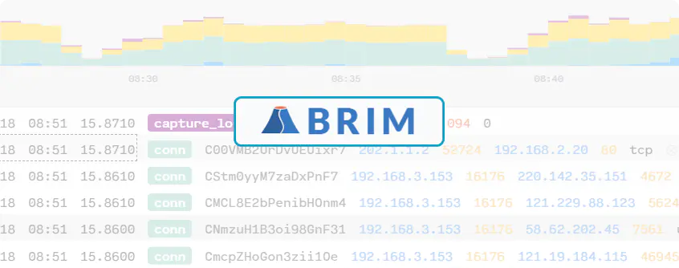
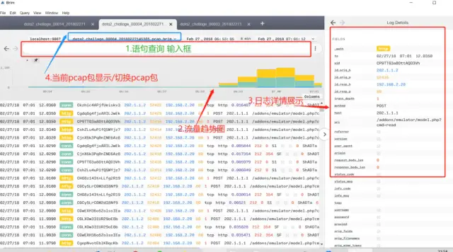
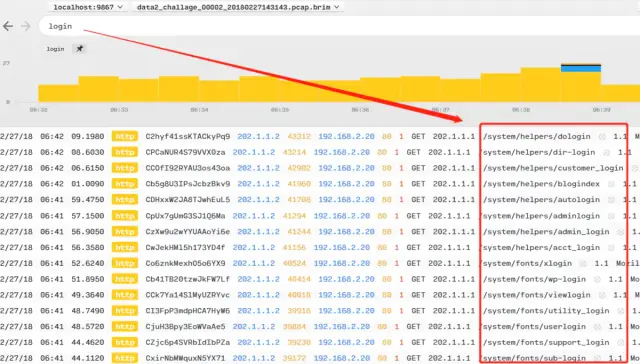
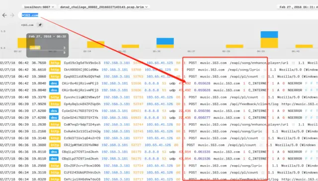
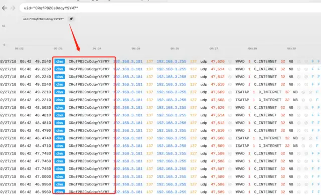
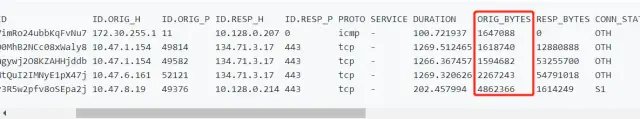

# [工具推荐 | 流量分析工具Brim 使用笔记](https://mp.weixin.qq.com/s/4bLl4mvgP9vSDkrILO-NBQ)

> 对于流量数据如果数据包过大，wireshark分析会非常吃力，加载就变得异常缓慢，Brim神器，可以说是懒人的福音。
>
> 官网：https://www.brimsecurity.com/
>
> 文章来源：https://1990day.com/skills/brim_note.html




### 一、简介

Brim是一款由美国供应商Brim Security开发并开源的流量分析工具，可以轻松处理非常大的数据包捕获（pcap）文件。

Brim由多个开源组件构建而成，包括：结构化日志查询引擎zq；用于多平台用户界面的Electron和React；以及从数据包捕获文件生成网络分析数据的Zeek。

### 二、安装

该软件支持 Win / Mac os  ，下载安装即可使用。

官方下载地址：

https://www.brimsecurity.com/download/

### 三、面板




### 四、语法

#### 常用查询

IP

```abnf
目的IP：
id.resp_h=


源IP：
id.orig_h=
```

协议

```sqf
语句：_path

例：
_path="SSL"

_path="http"
```

关联

```armasm
语句：and 
例：查询所有目的ip 192.168.1.30 的http日志 
id.resp_h=192.168.1.30 and http
```

排除

```routeros
语句：not
例：流量数据日志中出现大量web扫描日志，我要排除404无效的http请求
not status_code=404
```

#### 裸词：

需要查询数据中包含 “login” 或者 “admin” ,又或者只需要看http的请求，那么直接输入“关键词”进行查询。

查询：

```ebnf
 login
```

结果呈现如下，日志查询结果均包含login：




#### **通配符：**

要查找关键词之间或旁边可能包含任意字符串的值，可以使用一个或多个glob-style 的通配符。

例如，搜索查找包含Web服务器主机名的事件，这些域名中包含字母cdn，例如

www.cdn.amazon.com

 www.herokucdn.com。

查询：

```avrasm
*163.com
```

结果呈现如下，日志查询结果均包含163.com的所有子域结果：




比如我要查询包含163 这个字符相近的域名呢？

```apache
www.*163*.com
```

它可能会出来很多近似结果，当然这取决于你的数据日志中是否包含这些域名：

```apache
www.163-services.com
www.163e.com
www.1633.com
www.163apis.com
```

#### 字段/值 匹配

可以缩小搜索范围，使其仅包括在特定字段中包含特定值的事件。例如，以下搜索将仅匹配指定字段指定值，该字段`uid`被设置为精确值`ChhAfsfyuz4n2hFMe`。

```routeros
查询：uid=CRqfPB2CsOdqyYSYM7
```

输出了精确的查询结果：




#### 比较/筛选

除了通过=测试等式之外，还可以使用其他常见的比较操作符 !=、<、>、<=和=>。

例如，下面的搜索查找传输了许多字节的连接

查询：

```apache
 orig_bytes > 1000000
```

输出：




查询字节大于 1000000 的结果。

比较查询可以从大量相同特征中查询不一样特征的数据，便于快速定位分析。

**其他更多的搜索语法可以参考 ：**

https://github.com/brimsec/zq/

https://cloud.tencent.com/developer/article/1669423


