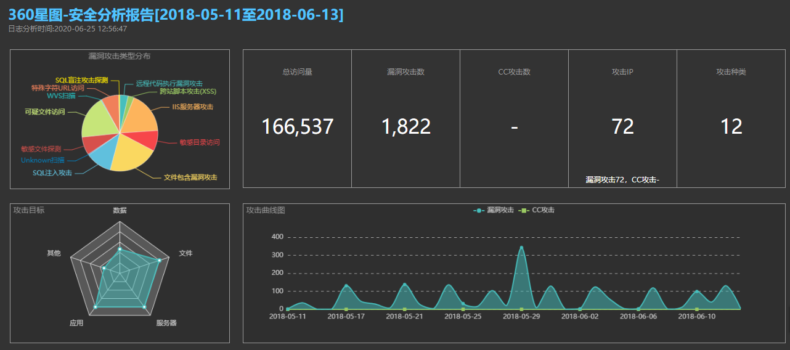
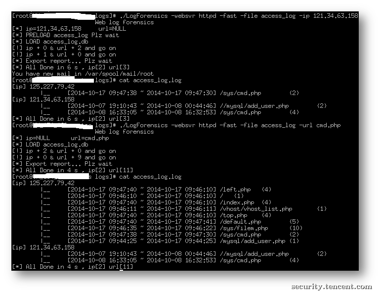
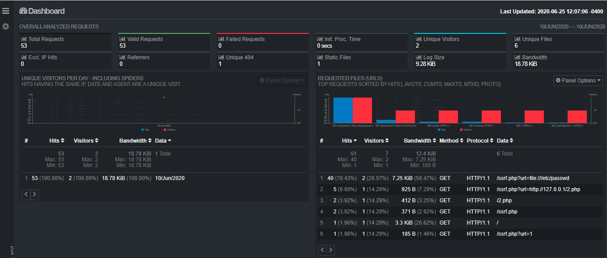
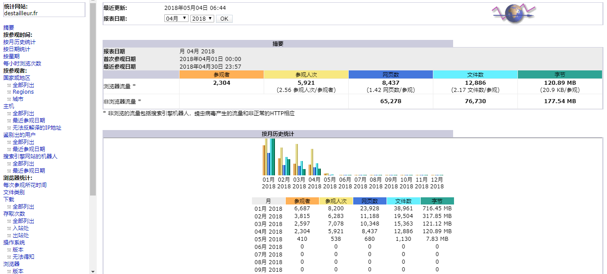
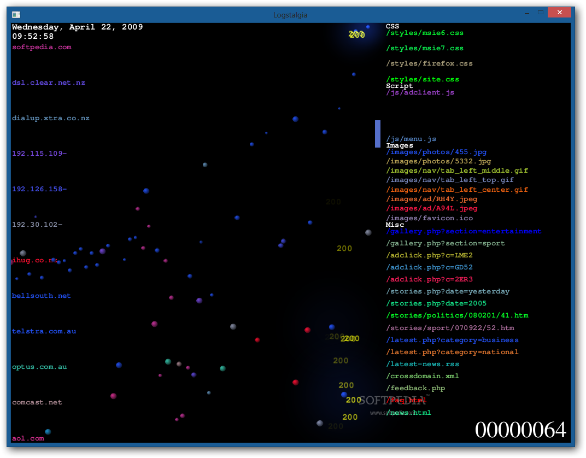
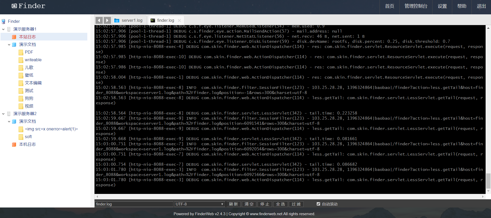
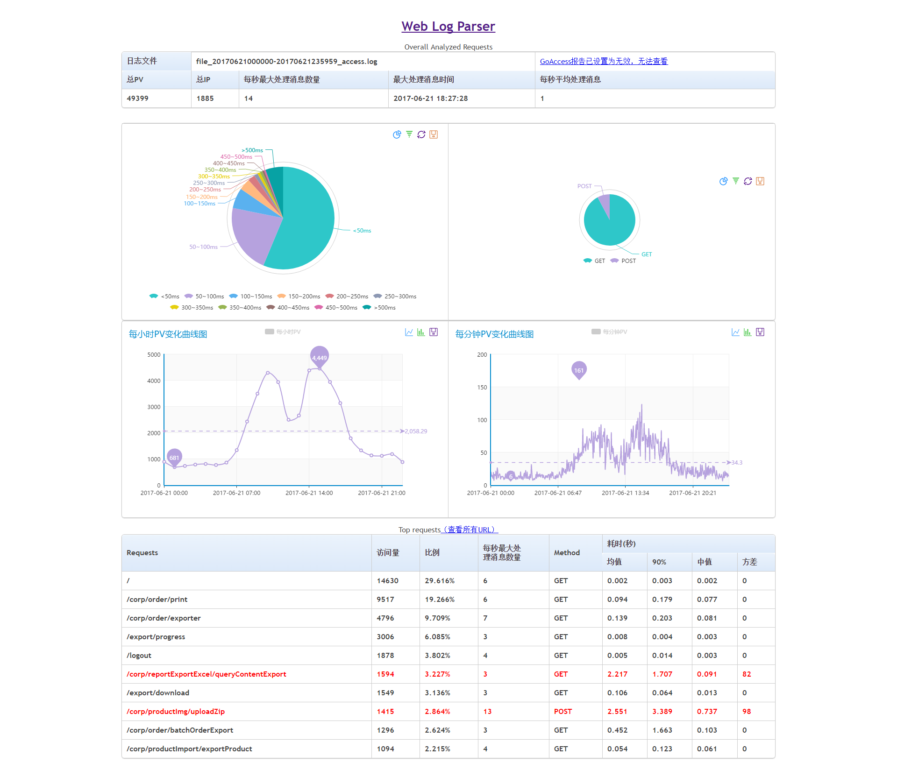
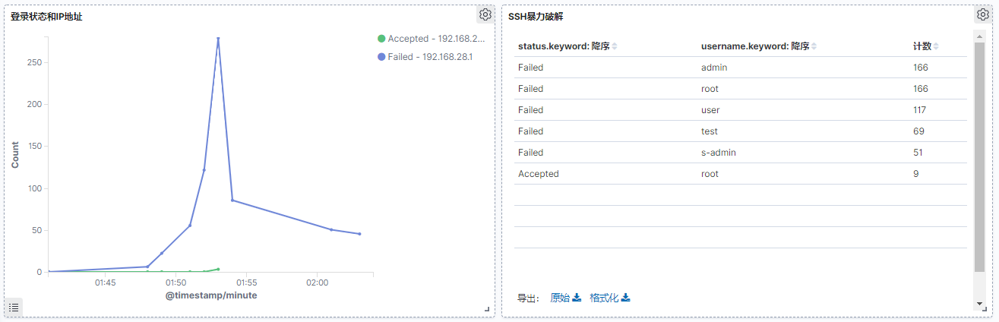
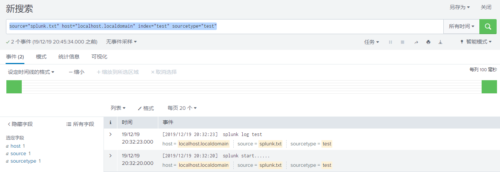
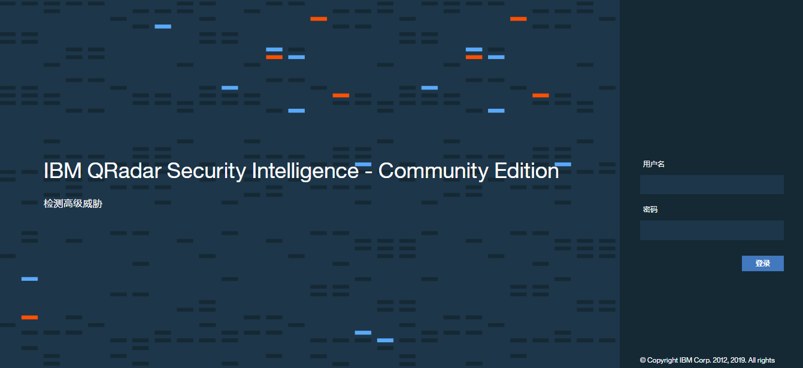

# [推荐 | 10个好用的Web日志安全分析工具](https://www.cnblogs.com/xiaozi/p/13198071.html)

## 10个好用的Web日志安全分析工具

经常听到有朋友问，有没有比较好用的web日志安全分析工具？
首先，我们应该清楚，日志文件不但可以帮助我们溯源，找到入侵者攻击路径，而且在平常的运维中，日志也可以反应出很多的安全攻击行为。

一款简单好用的Web日志分析工具，可以大大提升效率，目前业内日志分析工具比较多，今天推荐十个比较好用的Web日志安全分析工具。

**1、360星图**

一款非常好用的网站访问日志分析工具，可以有效识别Web漏洞攻击、CC攻击、恶意爬虫扫描、异常访问等行为。一键自动化分析，输出安全分析报告，支持iis/apache/nginx日志，支持自定义格式。

下载地址：https://wangzhan.qianxin.com/activity/xingtu

**2、LogForensics**

TSRC提供的一款日志分析工具，可从单一可疑线索作为调查起点，遍历所有可疑url（CGI）和来源IP。

相关下载地址：https://security.tencent.com/index.php/opensource/detail/15

**3、GoAccess**

一款可视化 Web 日志分析工具，通过Web 浏览器或者 *nix 系统下的终端程序即可访问。能为系统管理员提供快速且有价值的 HTTP 统计，并以在线可视化服务器的方式呈现。
官网地址：https://www.goaccess.cc/*

*\*4、AWStats**

一款功能强大的开源日志分析系统，可以图形方式生成高级Web，流媒体，ftp或邮件服务器统计信息。

官网地址：http://www.awstats.org/

**5、Logstalgia**

一款非常炫酷且可视化日志分析工具，可以直观的展示CC攻击和网站的日志分析，并以可视化的3D效果展示出来。

下载地址：http://www.softpedia.com/get/Internet/Servers/Server-Tools/Logstalgia.shtml

**6、FinderWeb**

程序员的看日志利器，支持,tail, less, grep，支持超大的文本文件，从几M到几十G的日志文件都流畅自如。

下载使用：http://www.finderweb.net/download.html

**7、web-log-parser**

一款开源的分析web日志工具，采用python语言开发，具有灵活的日志格式配置。

github项目地址：https://github.com/JeffXue/web-log-parser

****

**8、ELK**

开源实时日志分析的ELK平台，由ElasticSearch、Logstash和Kiabana三个开源项目组成，在企业级日志管理平台中十分常见。

下载使用：https://www.elastic.co/cn/elastic-stack

**9、Splunk**

一款顶级的日志分析软件，如果你经常用 grep、awk、sed、sort、uniq、tail、head 来分析日志，那么你可以很容易地过渡到Splunk。

下载地址：https://www.splunk.com/zh-hans_cn/download/splunk-enterprise.html

**10、IBM QRadar**

Qradar有一个免费的社区版本，功能上和商用版本差别不大，适合小规模日志和流量分析使用。

下载地址：https://developer.ibm.com/qradar/ce/

