[Wireshark Tutorial: Changing Your Column Display](https://unit42.paloaltonetworks.com/unit42-customizing-wireshark-changing-column-display/)
=============================================================================================================================================

2023-08-31共 54396 字阅读需 216.5 分钟

> Unit 42 shares a lesson on customizing Wireshark to better meet security researcher needs.

This post is also available in: [日本語(Japanese)](https://unit42.paloaltonetworks.jp/unit42-customizing-wireshark-changing-column-display/)

Executive Summary
-----------------

[Wireshark](https://www.wireshark.org/) is a free protocol analyzer that can record and display packet captures (pcaps) of network traffic. IT professionals use this tool to investigate a wide range of network issues. Security professionals also use Wireshark to review traffic generated from malware.

What makes Wireshark so useful? It is very customizable. Wireshark’s default column display provides a wealth of information, but you should customize the columns to meet your specific needs.

This article is the first in [a series of Wireshark tutorials](https://unit42.paloaltonetworks.com/tag/wireshark-tutorial/) that provides customization options helpful for investigating malicious network traffic. It was first published in August 2018 and has been updated for 2023.

| **Related Unit 42 Topics** | [**pcap**](https://unit42.paloaltonetworks.com/tag/pcap/)**,** [**Wireshark**](https://unit42.paloaltonetworks.com/tag/wireshark/)**,** [**Wireshark Tutorial**](https://unit42.paloaltonetworks.com/tag/wireshark-tutorial/) |
| -------------------------- | ------------------------------------------------------------ |

Table of Contents
-----------------

Requirements
------------

We recommend using a non-Windows environment like BSD, Linux or macOS. Pcaps from Windows infections may contain malicious binaries that present a risk of infection when using Wireshark on a Windows computer. For this tutorial, we use the [Xubuntu](https://xubuntu.org/) Linux distro.

If possible, review pcaps using the most recent version of Wireshark for your environment. Recent versions have more features, capabilities and bug fixes than older versions. We recommend at least version 3.6.2 or later. In this tutorial, we use Wireshark version 4.0.7.

Wireshark users must have a basic understanding of network traffic, and this series of tutorials focuses on [IPv4](https://en.wikipedia.org/wiki/Internet_Protocol_version_4) traffic. The term “basic understanding” means different things to different people, but the knowledge does not have to be extensive.

For example, readers should know the difference between a public IPv4 address and an internal, nonroutable IPv4 address. Basic network knowledge includes recognizing TCP and UDP traffic and knowing about DNS. Readers should also have some idea how network traffic is routed between an internal client like a desktop computer and an external server like a website.

Ultimately, this series of tutorials assumes readers have some sort of background and interest in reviewing malicious network traffic.

Supporting Material
-------------------

The pcap for this tutorial is hosted at [our GitHub repository](https://github.com/PaloAltoNetworks/Unit42-Wireshark-tutorials/blob/main/Wireshark-tutorial-column-setup.pcap.zip). Download the pcap as shown below in Figure 1.

Figure 1. Saving the pcap for this tutorial from our GitHub repository.

The name of your downloaded ZIP archive should be Wireshark-tutorial-column-setup.pcap.zip. Use _infected_ as the password to unlock the ZIP archive as shown below in Figure 2.

Figure 2. Extracting our pcap from the password-protected zip archive.

The extracted pcap for this tutorial is named Wireshark-tutorial-column-setup.pcap. Now that we have our pcap, let’s check our version of Wireshark.

Wireshark Version Check
-----------------------

Without any pcap loaded, Wireshark displays its version number on the welcome screen as shown below in Figure 3.

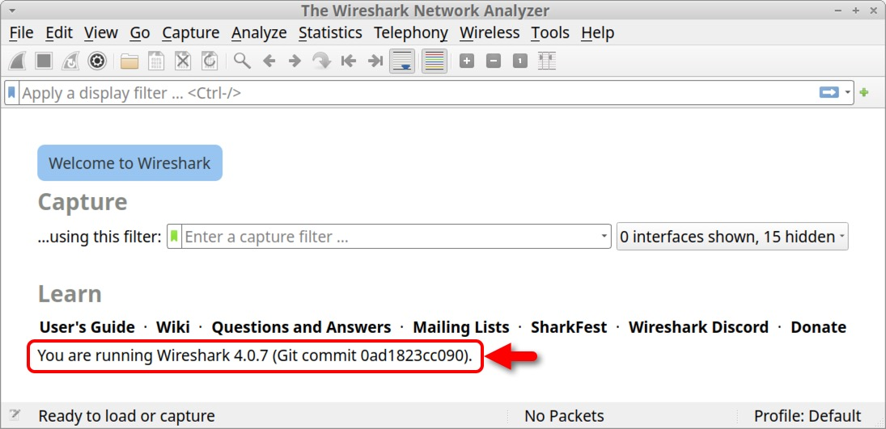

Figure 3. Wireshark’s version number displayed on its welcome screen.

We can also select “About Wireshark” under the Help menu to view the version number as shown below in Figure 4.

Figure 4. Wireshark’s version number from About Wireshark under the Help menu.

Configuration Profiles
----------------------

After confirming you have Wireshark version 3.6.2 or newer, select Configuration Profiles under Wireshark’s Edit menu. Make a copy of the default configuration profile by clicking the Copy button as shown below in Figure 5.

Figure 5. Copying the default configuration profile in Wireshark.

After copying the default profile, give it a new name. We suggest changing the name to “Customized” as shown below in Figure 6.

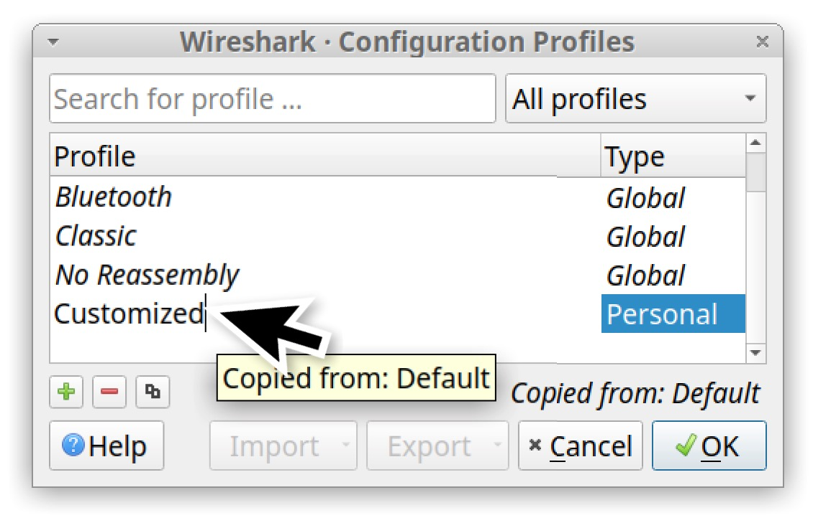

Figure 6. Renaming the copy of the default configuration profile.

If this newly created profile is still selected when we close the Configuration Profiles window, any customizations to Wireshark will be stored to this newly created profile.

Web Traffic and the Default Wireshark Column Display
----------------------------------------------------

Malware distribution frequently occurs through web traffic. Data exfiltration and command and control activity can also use web traffic. However, when reviewing such malicious activity, Wireshark's default column options are not ideal.

Fortunately, we can customize Wireshark’s column display to provide a better view of web traffic. To view the default layout of Wireshark, open the pcap we previously downloaded for this tutorial. The default layout for Wireshark version 4.0.7 is shown below in Figure 7.

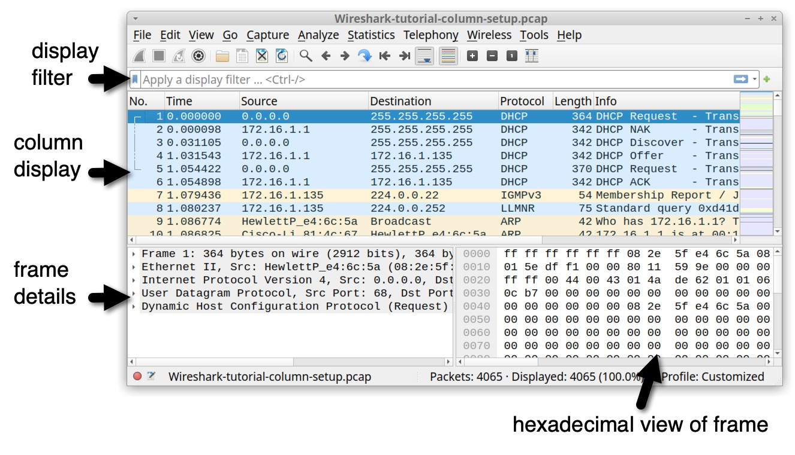

Figure 7. Default layout for Wireshark version 4.0.7 after opening our pcap.

Examine your column display. Wireshark’s default columns are listed below in Table 1.

<table><tbody><tr><td><b>Column Name</b></td><td><b>Column Description</b></td></tr><tr><td>No.</td><td>Frame number from the beginning of the pcap. The first frame is always 1.</td></tr><tr><td>Time</td><td>Seconds broken down to the microsecond from the first frame of the pcap. The first frame is always 0.000000.</td></tr><tr><td>Source</td><td>Source address, commonly an IPv4, IPv6 or Ethernet address.</td></tr><tr><td>Destination</td><td>Destination address, commonly an IPv4, IPv6 or Ethernet address.</td></tr><tr><td>Protocol</td><td>Protocol used in the Ethernet frame, IP packet or TCP segment (ARP, DNS, TCP, HTTP, etc.).</td></tr><tr><td>Length</td><td>Length of the frame in bytes.</td></tr><tr><td>Info</td><td>Information about the Ethernet frame, IP packet or TCP segment.</td></tr></tbody></table>

_Table 1. Columns used in Wireshark’s default display._

To better examine Windows-based malware traffic, this tutorial customizes Wireshark to use the columns shown below in Table 2.

<table><tbody><tr><td><b>Column Name</b></td><td><b>Column Description</b></td></tr><tr><td>Time</td><td>Date and time in UTC.</td></tr><tr><td>Source address</td><td>IPv4, IPv6 or Ethernet sourceaddress.</td></tr><tr><td>Source port</td><td>TCP or UDP port used by the source address for IPv4 or IPv6 traffic.</td></tr><tr><td>Destination address</td><td>IPv4, IPv6 or Ethernet destinationaddress.</td></tr><tr><td>Destination port</td><td>TCP or UDP port used by the destination address for IPv4 or IPv6 traffic.</td></tr><tr><td>Domain</td><td>Domain name used in HTTP or HTTPS traffic.</td></tr><tr><td>Info</td><td>Information about the Ethernet frame, IP packet or TCP segment.</td></tr></tbody></table>

_Table 2. Columns for our customized Wireshark column display._

To customize our Wireshark column display, we will first change the Time column to show the date and time in Universal Coordinated Time (UTC).

Changing Date and Time to UTC
-----------------------------

When publicly sharing information about a malware infection, the recipients can be in any part of the world. Due to the different time-zones, a standard format for reporting the time of malicious activity is UTC.

To change Wireshark's time display format, under the View menu, go to "Time Display Format," and change the value from "Seconds Since Beginning of Capture" to "UTC Date and Time of Day." Use the same menu path to change the resolution from "Automatic" to "Seconds." Figure 8 shows the menu paths for these options.

Figure 8. Changing Wireshark’s time display format to UTC date and time.

When finished, the column display shows the UTC date and time as noted below in Figure 9. Now when we review a pcap, we immediately know the date and time of the network traffic.

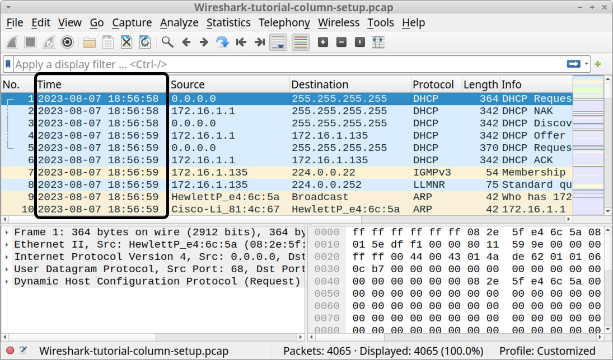

Figure 9. UTC date and time in our updated Wireshark column display.

Our next step in customizing Wireshark is to remove columns we do not need for our day-to-day work.

Removing Columns
----------------

The No., Protocol and Length columns are not necessary when reviewing web-based traffic, so we suggest removing them. To remove these columns, right-click on the column header and select "Remove this Column" from the menu as shown below in Figure 10.

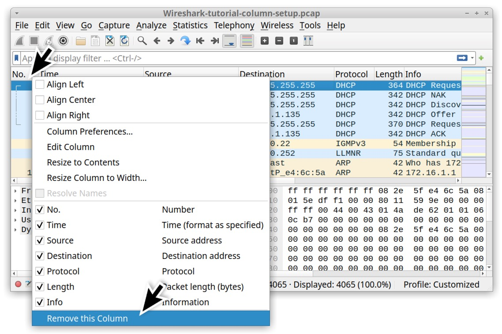

Figure 10. Removing the No. column in Wireshark.

Your updated column display should now show only four columns: Time, Source, Destination and Info, as noted in Figure 11.

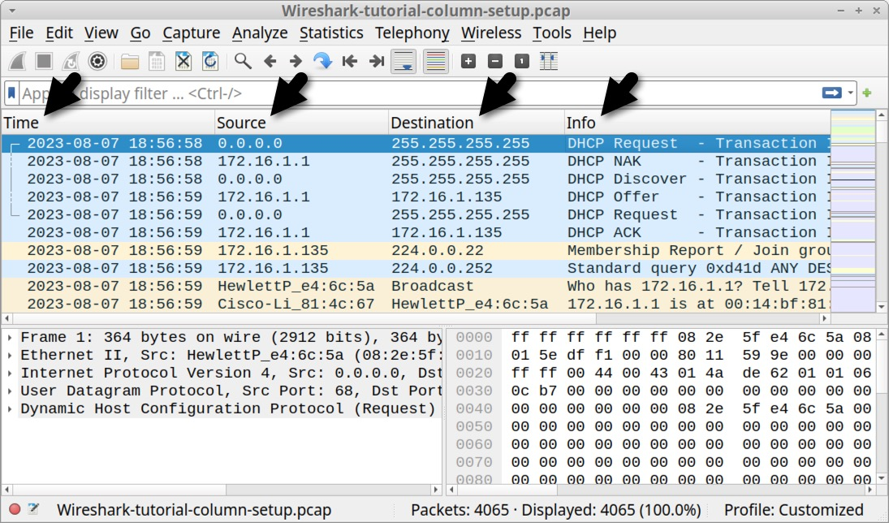

Figure 11. The four columns remaining in our updated column display.

After removing the unnecessary columns, we are ready to add new columns to our Wireshark display.

Adding Columns
--------------

We can add columns in Wireshark using the Column Preferences window. To open this window, right-click on any of the column headers, then select “Column Preferences…” in the resulting menu as shown below in Figure 12.

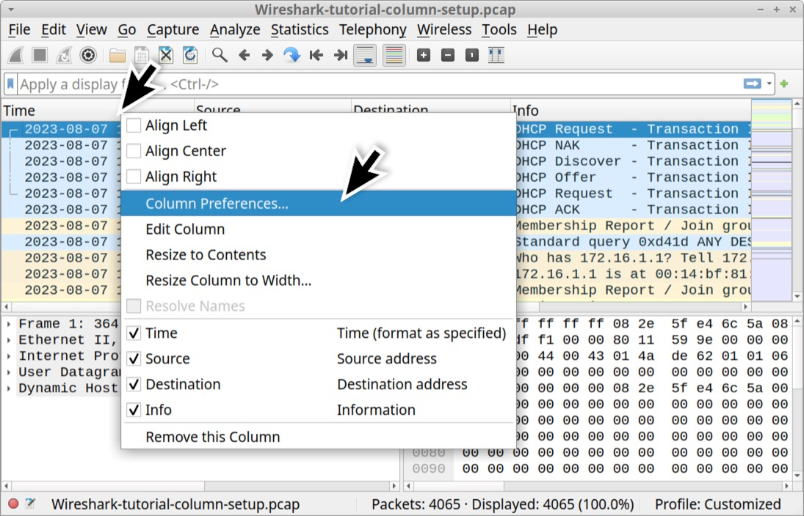

Figure 12. Getting to the Column Preferences window.

This brings up the Column Preferences window, which lists all of Wireshark’s columns, viewed or hidden. Near the bottom-left side of the Column Preferences window are two buttons. One is labeled with a plus sign to add columns. The other has a minus sign to remove columns. Left-click on the plus sign as shown below in Figure 13.

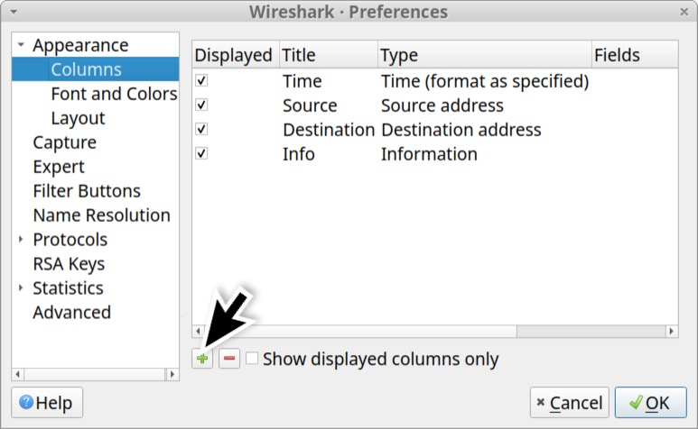

Figure 13. The button to add a new column to Wireshark’s column display.

A new entry with the title “New Column” should appear at the bottom of the list. Double-click on the title to change the column name as shown below in Figure 14.

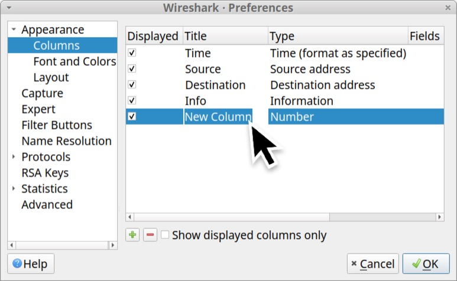

Figure 14. Renaming the newly created column.

Name this new column “Src port” and change the column type from number by double-clicking on column type setting as shown below in Figure 15.

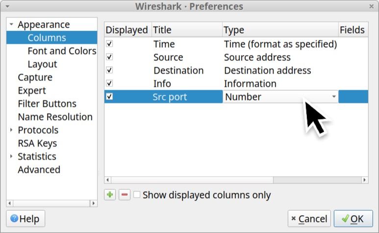

Figure 15. Getting ready to change our newly created column’s type.

Click again to bring up a scrollable list of options for the column type. Scroll down and select “Src port (unresolved)” for the column type as shown below in Figure 16.

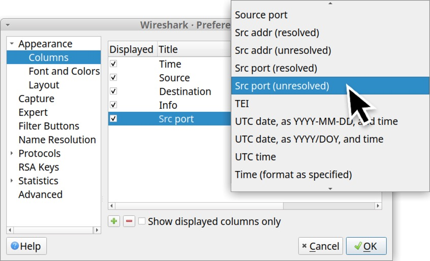

Figure 16. Selecting Src port (unresolved).

Next, create a new column entry, label it “Dst port” and select “Dest port (unresolved)” as the column type as shown below in Figure 17.

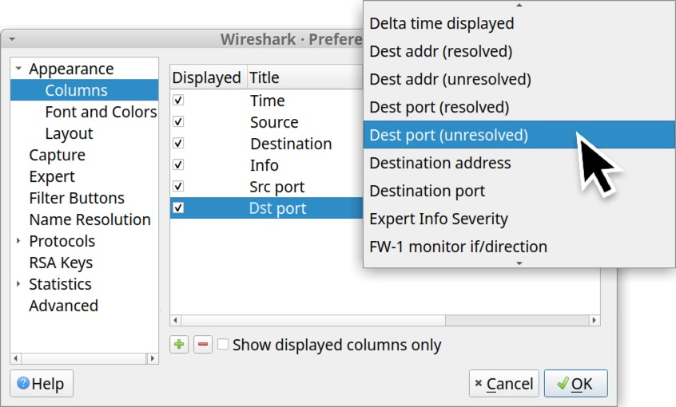

Figure 17. Selecting Dest port (unresolved) for a newly created Dst port column.

When finished, the Column Preferences window should show the two newly created columns as shown below in Figure 18.

Figure 18. Our two newly created columns for Wireshark’s column display.

We can drag these columns to place Src port after the Source address and Dst port after the Destination address entry. Left-click to select, hold the mouse button and drag the entry to its new position in the list. Figure 19 shows an attempt to move the Dst port column to a position immediately after the Destination address entry.

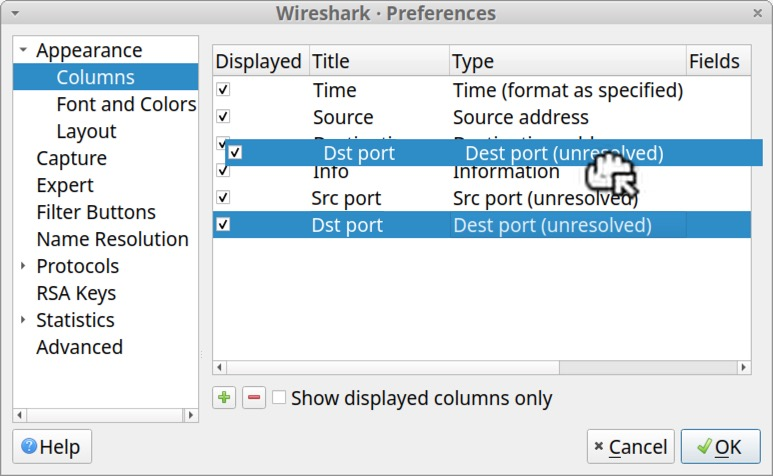

Figure 19. Moving our newly created Dst port column entry.

After moving our newly created Src port and Dst port entries, we suggest changing the column type for your Source address to “Src addr (unresolved)” and Destination address to “Dest addr (unresolved).” If you do this, the Column Preferences window should appear similar to Figure 20.

Figure 20. Our updated column list in the Column Preferences window.

After completing these changes, click OK to close the Column Preferences window. Wireshark should now display the following six columns (read: label - type):

*   Time - Time (format as specified)
*   Src - Src addr (unresolved)
*   Src port - Src port (unresolved)
*   Dst - Dest addr (unresolved)
*   Dst port - Dest port (unresolved)
*   Info - Information

Figure 21 shows an example of what this should look like.

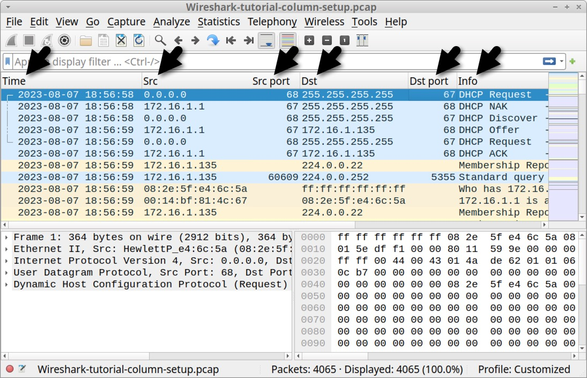

Figure 21. Wireshark’s column display after updating our columns.

Figure 21 reveals our newly created Src port and Dst port columns are aligned to the right, while all the other columns are aligned to the left. Right click the column header for each of our right-aligned columns to bring up a menu, then click the “Align Left” checkbox to align these columns to the left. Figure 22 shows an example for the Src port column.

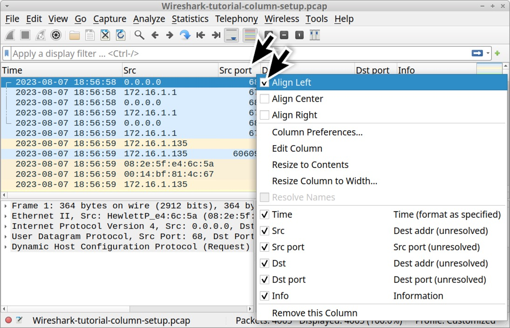

Figure 22. Aligning our newly created Src port column to the left.

When finished, the Src port and Dst port columns should be aligned to the left, matching all the other columns as shown below in Figure 23.

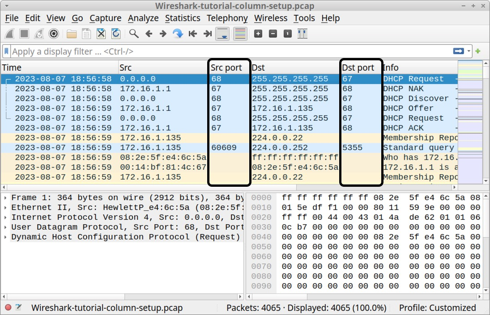

Figure 23. Src port and Dst port columns now aligned to the left.

While we can add several different types of columns through the Column Preferences window, we cannot add every conceivable column type. For example, we cannot add a column showing the domains associated with web traffic this way. Fortunately we can add a customized column that reveals these web traffic domains.

Adding Customized Columns
-------------------------

Wireshark allows users to add customized columns based on almost any value found in the frame details window. To better view the frame details, we should temporarily hide the hexadecimal view. Under the View menu, uncheck "Packet Bytes" as shown below in Figure 24.

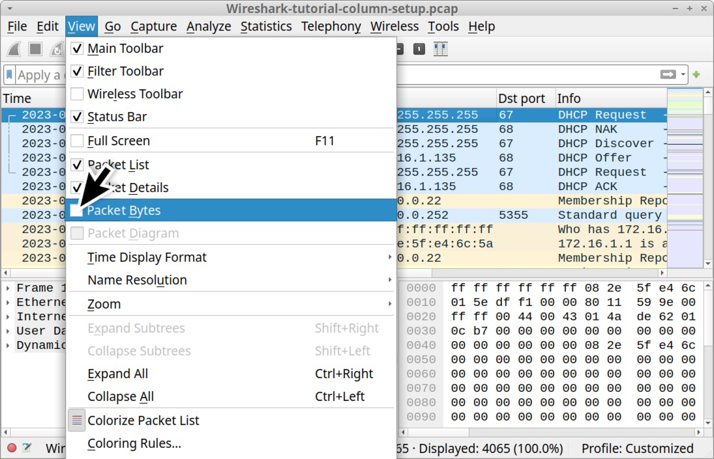

Figure 24. Hiding the hexadecimal panel by unchecking the Packet Bytes view.

Now we should only have two sections displaying pcap data: the column display and the frame details.

First, we should create a customized column for domains used in unencrypted HTTP web traffic. In Wireshark, type http.request in the Wireshark filter bar and hit enter. Select the first frame in your column display. In the frame details section, expand the line for Hypertext Transmission Protocol. Then find the “Host” line. In this case, it should have msftconnecttest in the name. Left-click on that line to select it, then right-click to bring up a menu. Select “Apply as Column” as shown below in Figure 25.

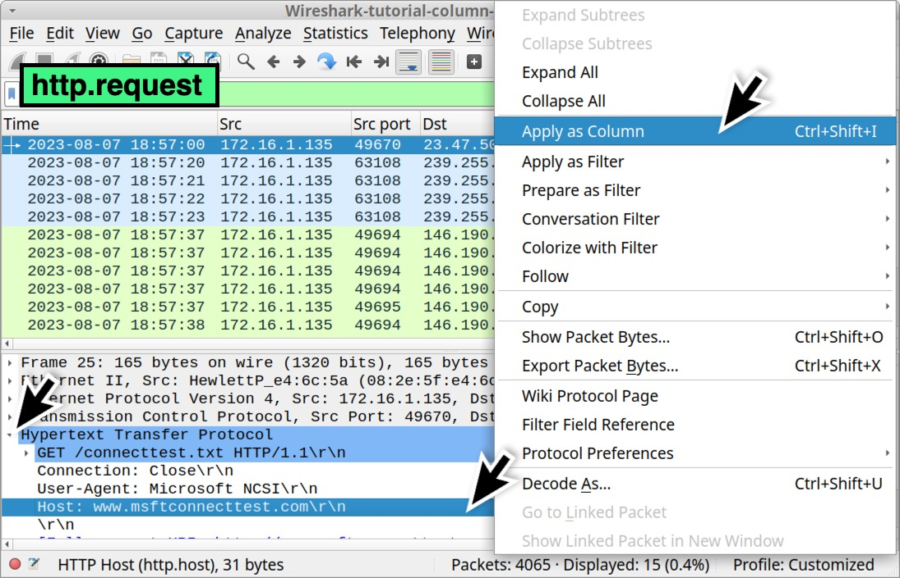

Figure 25. Under the frame details window, find the line to create an HTTP hostname column.

This should create a new column titled Host as shown below in Figure 26.

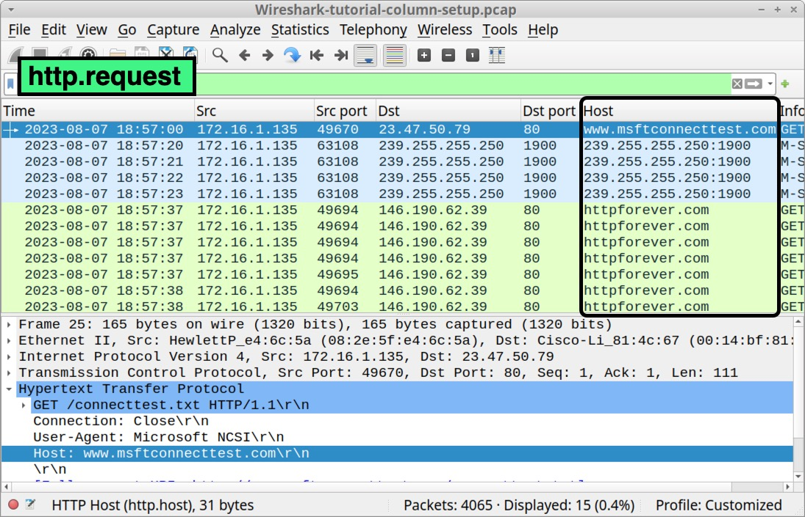

Figure 26. Newly created Host column shown when viewing HTTP traffic in our pcap.

Next, let’s create another customized column for domains used in encrypted HTTPS web traffic. Clear your Wireshark filter bar, then type tls.handshake.type eq 1 and hit enter. Select the first frame in your column display.

In the frame details panel, expand the line for Transport Layer Security. Under that, expand the line for TLSv1.2 Record Layer: Handshake Protocol: Client Hello. Under that, expand the line that reads Handshake Protocol Client Hello. The expanded frame details are shown below in Figure 27.

Figure 27. Filtering on HTTPS traffic and expanding items in the frame details window.

Scroll down in the frame details section to find and expand the line that starts with Extension: server\_name. Under that, find and expand the line that reads Server Name: Indication extension. Under that is a line that reads Server Name: geo.prod.do.dsp.mp.microsoft.com. Left-click on that line to select it, right-click to bring up a menu and select Apply as Column as shown below in Figure 28.

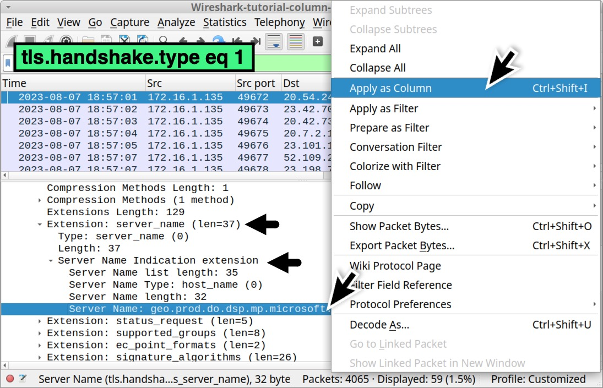

Figure 28. Under the frame details window, find the line to create an HTTPS server name column.

This should create a new column to the right of our recently created Host column titled “Server Name” as shown below in Figure 29.

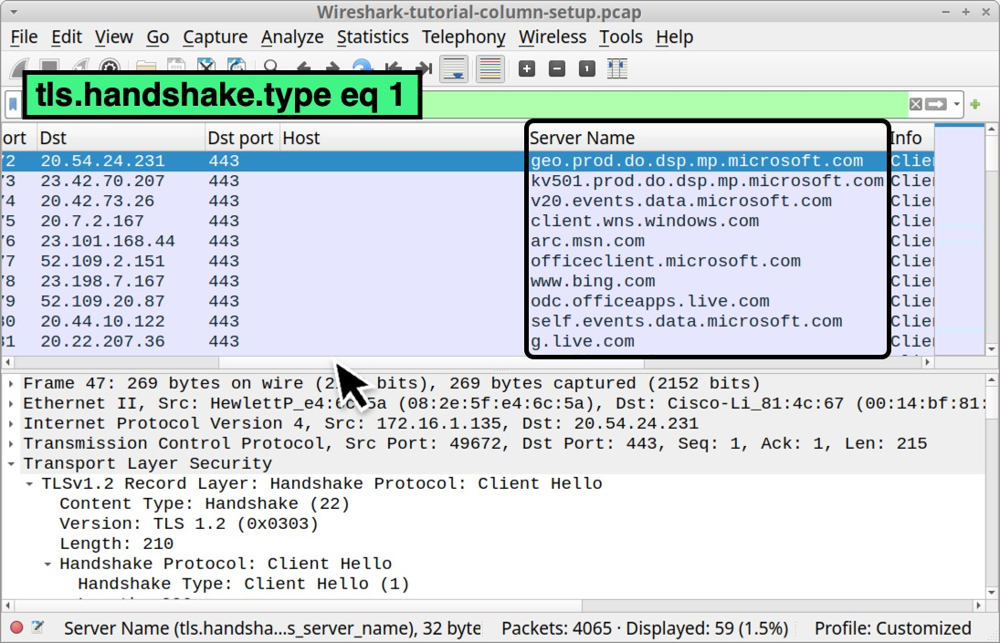

Figure 29. Newly created Server Name column shown when viewing HTTPS traffic in our pcap.

Right-click any of the column headers to bring up a menu to reach our Column Preferences window again. In our Column Preferences window, we see these two newly created customized columns as shown below in Figure 30.

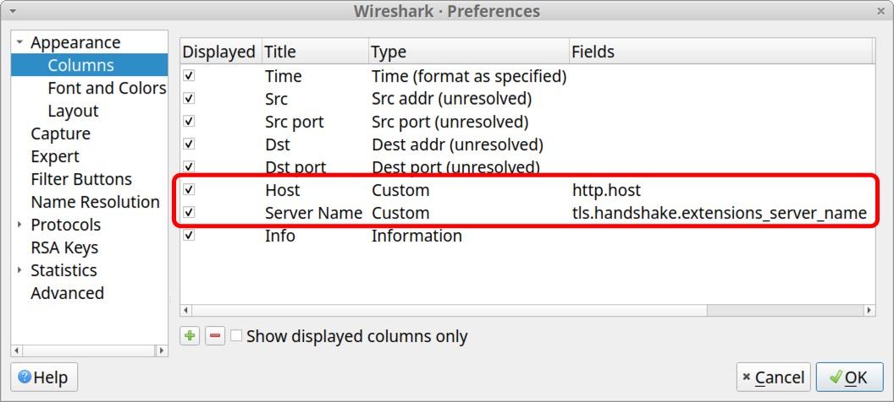

Figure 30. Our two newly created customized columns in the Column Preferences window.

To save screen space, we should combine these two columns into a single column. First, double-click on the Fields value in the Server Name entry and copy the text reading tls.handshake.extensions\_server\_name as shown below in Figure 31.

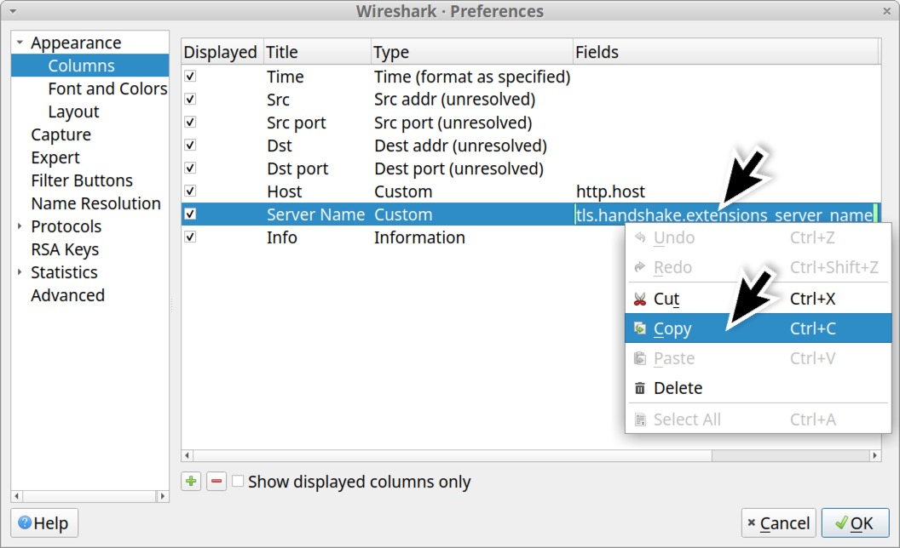

Figure 31. Copying the Fields value from the Server Name column.

Next, use the or operand to combine that text with the Fields value for the Host entry. The new value for the Host entry should read http.host or tls.handshake.extensions\_server\_name as shown below in Figure 32.

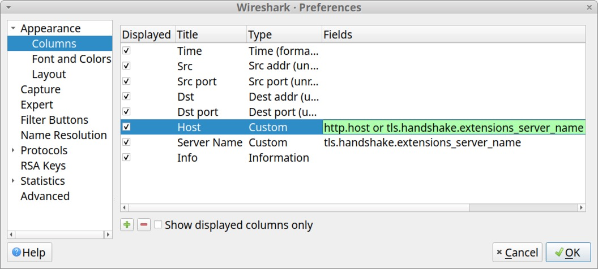

Figure 32. New Fields value for our recently created Host column.

Since both Fields values are now in the Host entry, delete the Server Name entry as shown below in Figure 33.

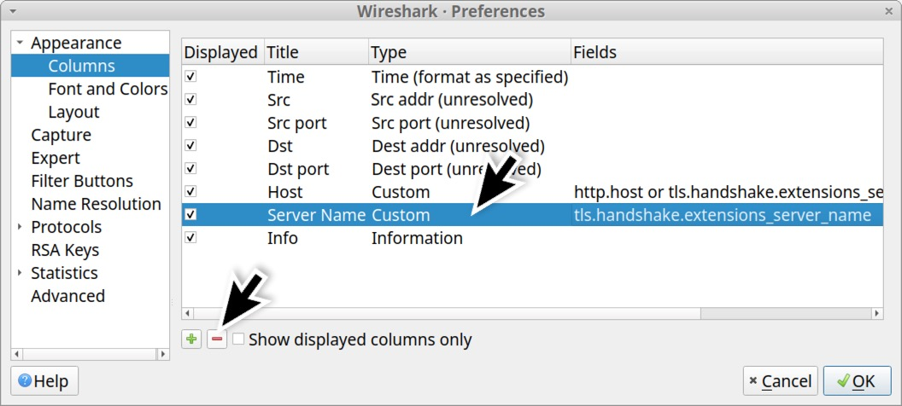

Figure 33. Delete the Server Name column, because it is no longer needed.

When finished, the list in your Column Preferences window should appear similar to Figure 34.

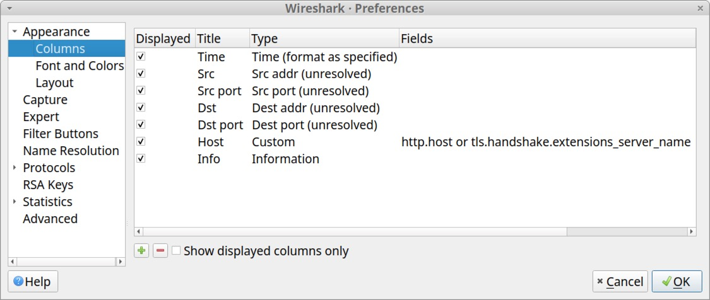

Figure 34. Our updated column display list.

Close the Column Preference window. Now we can filter for both HTTP and HTTPS activity, and any domains associated with this web traffic will appear in our updated Host column.

Type the following in your Wireshark filter:

http.request or tls.handshake.type eq 1

Scroll through the results in your updated Wireshark column display. The results should look similar to the Wireshark screenshot in Figure 35.

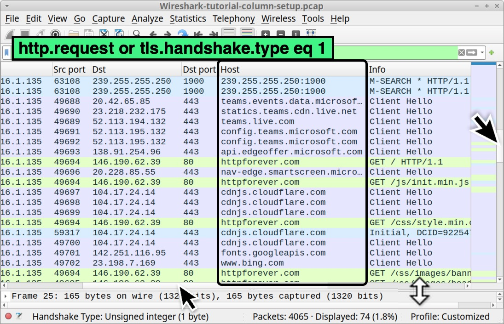

Figure 35. Updated Host column showing domains associated with web traffic.

Now that we have created all of our columns, we can hide any of them as needed.

Hiding Columns
--------------

When reviewing pcaps of web traffic generated by malware, the activity is often collected from a single internal IP address used by the infected host. One such example is a pcap generated by an online sandbox that analyzes malware. When investigating an alert for a suspected infection, investigators pull traffic from the internal IP associated with that alert, if the traffic is available.

In these cases, filtering on web traffic will reveal the same internal IP address in our Src column. For this tutorial, we captured our pcap from an internal IP address at 172.16.1\[.\]135, so our column display will only show that IP in the Src column when filtering for web traffic.

Because of this, we can hide the Src and Src port columns to better focus on the web traffic.

To hide any column in Wireshark, left-click on any of the column headers, then uncheck the columns you want to hide. Figure 36 shows unchecked boxes for the Src and Src port columns.

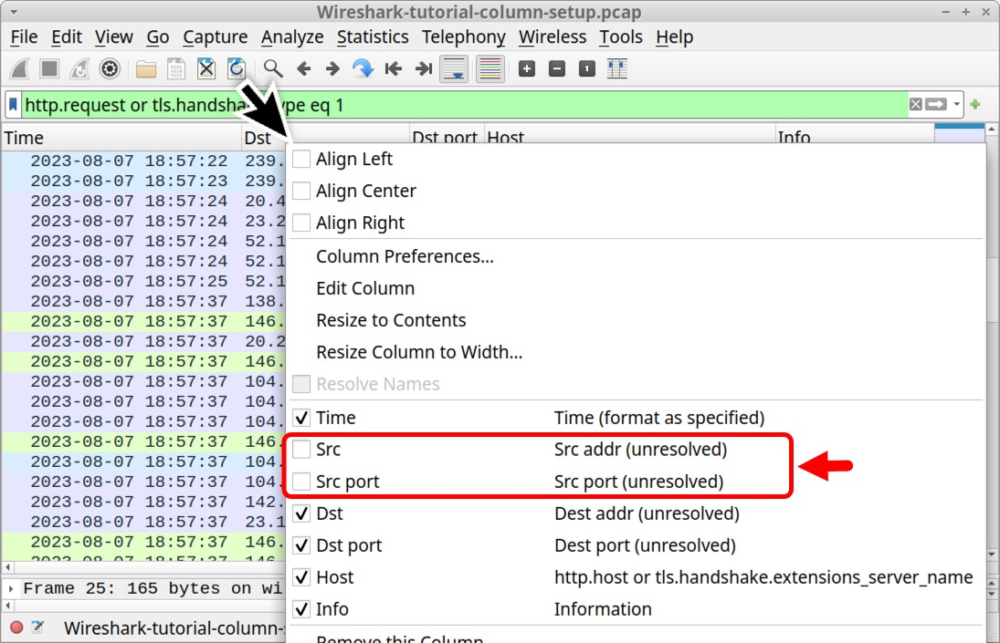

Figure 36. Hiding the Src and Src port columns by unchecking the boxes.

Hiding these columns provides a better idea of the traffic when viewing web activity. For example, we see the host generated unencrypted web traffic to the site httpforever\[.\]com on Aug. 7, 2023, at 18:57 UTC as revealed below in Figure 37.

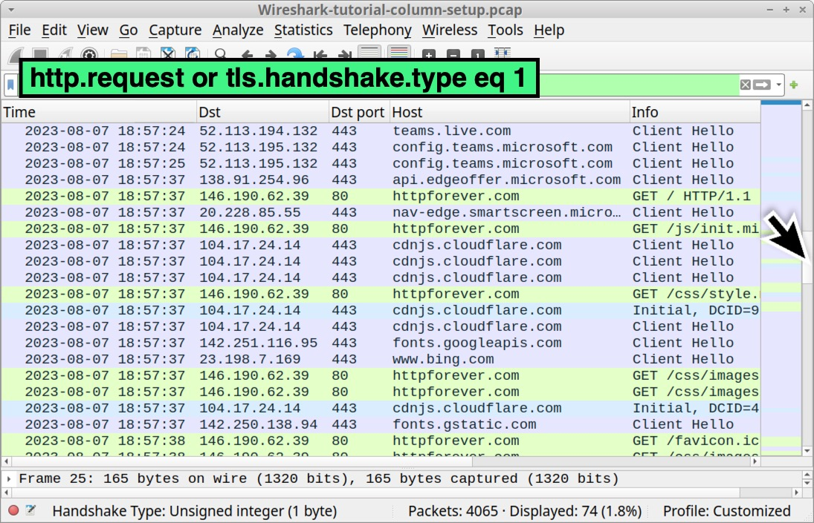

Figure 37. A more concise view of the web traffic in our pcap.

Now that we have customized our column display, we should export our updated configuration profile.

Exporting Your Updated Configuration Profile
--------------------------------------------

Recent versions of Wireshark allow users to export or load personal configuration profiles. This is useful when installing Wireshark in a new environment. Instead of redoing all the steps in this tutorial, we can load the profile saved from a previously exported configuration.

To export our newly customized configuration profile, select “Configuration Profiles…” under the Edit menu as shown below in Figure 38.

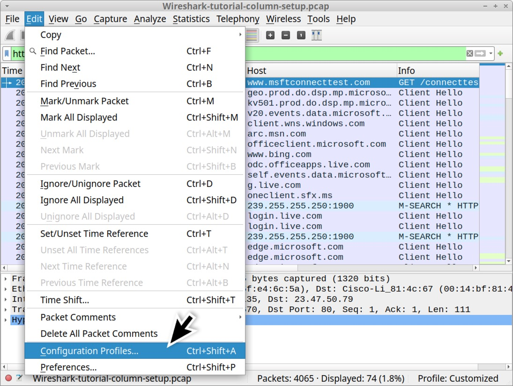

Figure 38. Menu path for the Configuration Profiles window.

The Configuration Profiles window should still have our customized profile selected. To export this profile, click on the Export button as shown below in Figure 39. You can export multiple personal profiles you have created.

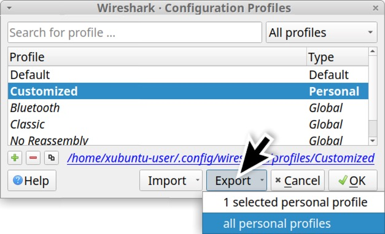

Figure 39. Exporting your personal profile(s) from the Configuration Profile window.

Exported profile(s) are saved as a ZIP archive. If necessary, ensure your saved filename has a .zip file extension as shown below in Figure 40.

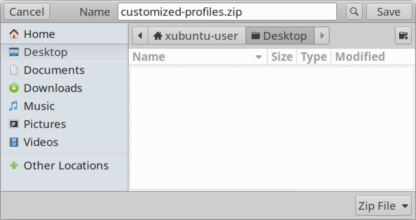

Figure 40. Save your exported profile(s) as a ZIP archive.

To import a saved profile, click the Import button in your Configuration Profiles window as shown below in Figure 41.

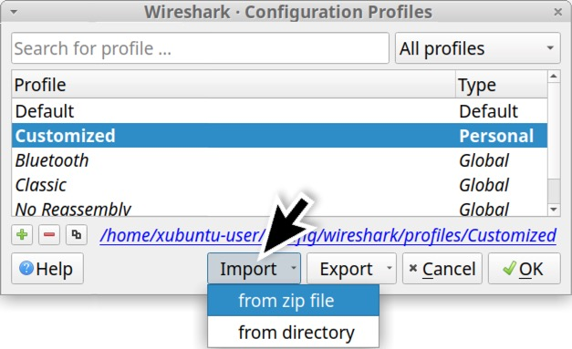

Figure 41. Importing a previously exported configuration profile from the Configuration Profiles window.

Conclusion
----------

Wireshark’s default configuration works well for many people, but users can customize Wireshark to better fit their specific needs. For example, the customizations in this tutorial can be extremely useful when reviewing web traffic to determine an infection chain.

Our [next tutorial in this series](https://unit42.paloaltonetworks.com/using-wireshark-display-filter-expressions/) focuses on [display filter expressions](https://www.wireshark.org/docs/wsug_html_chunked/ChWorkBuildDisplayFilterSection.html) useful for investigating suspicious network traffic.

Additional Resources
--------------------

*   [Wireshark Tutorial: Display Filter Expressions](https://unit42.paloaltonetworks.com/using-wireshark-display-filter-expressions/) - Unit 42, Palo Alto Networks
*   [Wireshark Tutorial: Identifying Hosts and Users](https://unit42.paloaltonetworks.com/using-wireshark-identifying-hosts-and-users/) - Unit 42, Palo Alto Networks
*   [Wireshark Tutorial: Exporting Objects From a Pcap](https://unit42.paloaltonetworks.com/using-wireshark-exporting-objects-from-a-pcap/) - Unit 42, Palo Alto Networks
*   [Wireshark Tutorial: Decrypting HTTPS Traffic](https://unit42.paloaltonetworks.com/wireshark-tutorial-decrypting-https-traffic/) - Unit 42, Palo Alto Networks
*   [Wireshark Tutorial: Wireshark Workshop Videos Now Available](https://unit42.paloaltonetworks.com/wireshark-workshop-videos/) - Unit 42, Palo Alto Networks
*   [Full List of Wireshark Tutorials and Quizzes](https://unit42.paloaltonetworks.com/tag/wireshark-tutorial/) - Unit 42, Palo Alto Networks

Most Read Articles
------------------

[Wireshark Tutorial: Exporting Objects From a Pcap](https://unit42.paloaltonetworks.com/using-wireshark-exporting-objects-from-a-pcap/)

218,100

people reacted

### [Wireshark Tutorial: Exporting Objects From a Pcap](https://unit42.paloaltonetworks.com/using-wireshark-exporting-objects-from-a-pcap/)

*   By [Brad Duncan](https://unit42.paloaltonetworks.com/author/bduncan/ "Posts byBrad Duncan")
*   March 1, 2024 at 6:00 AM

129

12 min. read

[The Art of Domain Deception: Bifrost's New Tactic to Deceive Users](https://unit42.paloaltonetworks.com/new-linux-variant-bifrost-malware/)

5,440

people reacted

### [The Art of Domain Deception: Bifrost's New Tactic to Deceive Users](https://unit42.paloaltonetworks.com/new-linux-variant-bifrost-malware/)

*   By [Anmol Maurya](https://unit42.paloaltonetworks.com/author/anmol-maurya/ "Posts byAnmol Maurya") and [Siddharth Sharma](https://unit42.paloaltonetworks.com/author/siddharth-sharma/ "Posts bySiddharth Sharma")
*   February 29, 2024 at 3:00 AM

15

6 min. read

[Threat Group Assessment: Muddled Libra (Updated)](https://unit42.paloaltonetworks.com/muddled-libra/)

34,284

people reacted

### [Threat Group Assessment: Muddled Libra (Updated)](https://unit42.paloaltonetworks.com/muddled-libra/)

*   By [Kristopher Russo](https://unit42.paloaltonetworks.com/author/kristopher-russo/ "Posts byKristopher Russo"), [Austin Dever](https://unit42.paloaltonetworks.com/author/austin-dever/ "Posts byAustin Dever") and [Amer Elsad](https://unit42.paloaltonetworks.com/author/amer-elsad/ "Posts byAmer Elsad")
*   March 8, 2024 at 2:58 PM

37

13 min. read

#### Get updates from  

Palo Alto  
Networks!

Sign up to receive the latest news, cyber threat intelligence and research from us

By submitting this form, you agree to our [Terms of Use](https://www.paloaltonetworks.com/legal-notices/terms-of-use) and acknowledge our [Privacy Statement](https://www.paloaltonetworks.com/legal-notices/privacy).

pcap

Wireshark

Wireshark Tutorial