[Wireshark Tutorial: Identifying Hosts and Users](https://unit42.paloaltonetworks.com/using-wireshark-identifying-hosts-and-users/)
===================================================================================================================================

2023-10-10共 41239 字阅读需 164.5 分钟

> Learn how to identify host and user data in Wireshark, a malware traffic analysis tool.

This post is also available in: [日本語(Japanese)](https://unit42.paloaltonetworks.jp/using-wireshark-identifying-hosts-and-users/)

Executive Summary
-----------------

When a host within an organization's network is infected or otherwise compromised, responders need to quickly identify the affected host and user. In some organizations, this could involve reviewing a packet capture (pcap) of network traffic generated by the affected host.

This tutorial uses Wireshark to identify host and user data in pcaps. This is the third in [a series of tutorials](https://unit42.paloaltonetworks.com/tag/wireshark-tutorial/) that provide tips and tricks to help security professionals more effectively use Wireshark. This article was first published in March 2019 and is being updated for 2023.

| **Related Unit 42 Topics** | [**pcap**](https://unit42.paloaltonetworks.com/tag/pcap/)**,** [**Wireshark**](https://unit42.paloaltonetworks.com/tag/wireshark/)**,** [**Wireshark Tutorial**](https://unit42.paloaltonetworks.com/tag/wireshark-tutorial/) |
| -------------------------- | ------------------------------------------------------------ |

Table of Contents
-----------------

Requirements and Supporting Material
------------------------------------

To fully understand this tutorial, readers should have reviewed the material in our previous tutorials on [customizing Wireshark’s column display](https://unit42.paloaltonetworks.com/unit42-customizing-wireshark-changing-column-display/) and [using display filter expressions](https://unit42.paloaltonetworks.com/using-wireshark-display-filter-expressions/). Requirements also include a recent version of Wireshark, at least version 3.6.2 or later.

This tutorial features Wireshark version 4.0.8 with a customized column display from our previous tutorials. We strongly recommend using the most recent version of Wireshark available for your operating system (OS).

To follow this tutorial, readers should have a basic understanding of network traffic.

The pcaps used for this tutorial are in a password-protected ZIP archive located at our [GitHub repository](https://github.com/PaloAltoNetworks/Unit42-Wireshark-tutorials/blob/main/Wireshark-tutorial-identifying-hosts-and-users-5-pcaps.zip). Download the file named Wireshark-tutorial-identifying-hosts-and-users-5-pcaps.zip. Use _infected_ as the password and extract the five pcaps, as shown below in Figure 1.

Figure 1. Acquiring the pcaps for this tutorial.

The five extracted pcaps are:

*   Wireshark-tutorial-identifying-hosts-and-users-1-of-5.pcap
*   Wireshark-tutorial-identifying-hosts-and-users-2-of-5.pcap
*   Wireshark-tutorial-identifying-hosts-and-users-3-of-5.pcap
*   Wireshark-tutorial-identifying-hosts-and-users-4-of-5.pcap
*   Wireshark-tutorial-identifying-hosts-and-users-5-of-5.pcap

Host Information from Dynamic Host Configuration Protocol (DHCP) Traffic
------------------------------------------------------------------------

Any host generating traffic within a network should have three identifiers: a [MAC address](https://en.wikipedia.org/wiki/MAC_address), an [IP address](https://en.wikipedia.org/wiki/IP_address) and a [hostname](https://en.wikipedia.org/wiki/Hostname).

Our first pcap for this tutorial is Wireshark-tutorial-identifying-hosts-and-users-1-of-5.pcap. This pcap is based on traffic to and from an Ethernet address at f8:ff:c2:04:a5:7b.

Using our basic web filter, we can correlate the IP address at 172.16.1\[.\]38 with its associated MAC address at f8:ff:c2:04:a5:7b, as shown below in Figure 2.

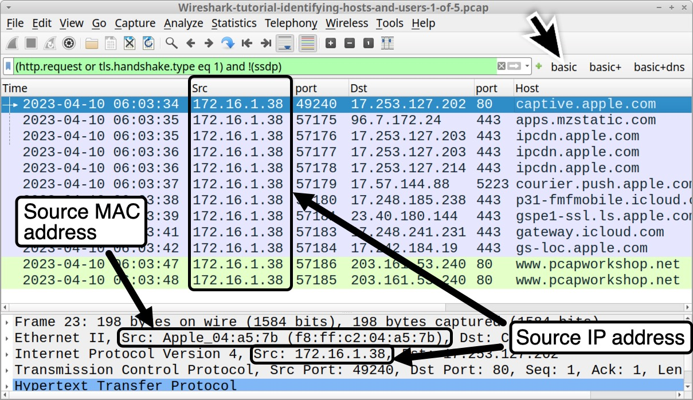

Figure 2. Correlating an IP address with a MAC address.

[DHCP](https://wiki.wireshark.org/DHCP) traffic might reveal the hostname using this IP address. First, type dhcp in the Wireshark filter bar to filter for DHCP traffic, as shown below in Figure 3.

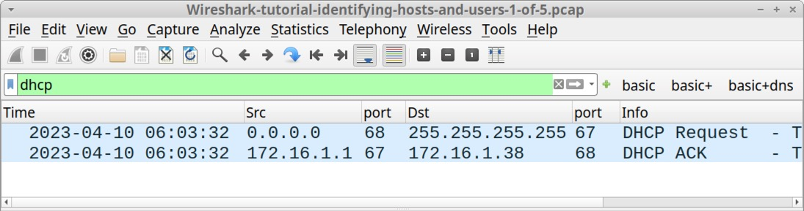

Figure 3. Filtering on DHCP traffic in Wireshark.

Select the first frame in the results, the one that displays DHCP Request in the Info column. Then go to the frame details section and expand the line for Dynamic Host Configuration Protocol (Request), as shown below in Figure 4.

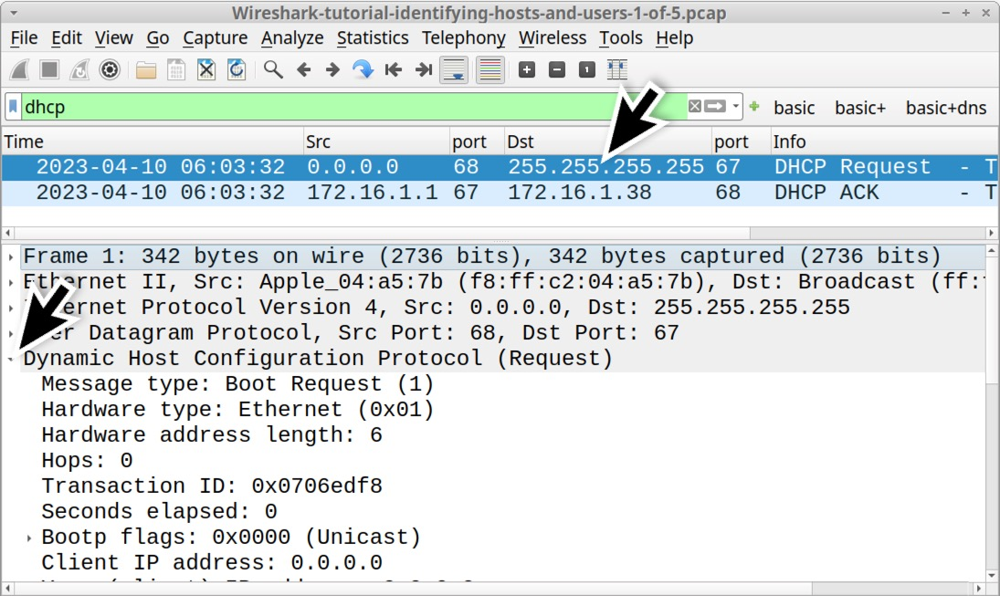

Figure 4. Expanding the Dynamic Host Configuration Protocol line from a DHCP request.

Scroll down the frame details section, then expand the lines for Option: (50) Requested IP Address and Option: (12) Host Name as indicated below in Figure 5. This reveals the client’s MAC address at f8:ff:c2:04:a5:7b with hostname jeremiahs-MBP and a requested IP address of 172.16.1\[.\]38.

Figure 5. Correlating the MAC address, IP address and hostname from DHCP traffic.

By default, Wireshark attempts to resolve the first 3 bytes of a MAC address to a vendor identification. In Figure 5, the vendor identification of the MAC address shows Apple\_. That and the hostname ending with MBP indicate this might be an Apple MacBook Pro. This pcap also contains traffic to various Apple domains, further indicating this is an Apple host.

However, mobile devices often anonymize MAC addresses and users can easily change these to spoof different vendors. Due to anonymization and spoofing, we should never base host identification solely on a MAC address.

Host Information from NetBIOS Name Service (NBNS) Traffic
---------------------------------------------------------

Depending on how frequently a DHCP lease is renewed, we might not have DHCP traffic in our pcap. Fortunately, we can use [NBNS](https://wiki.wireshark.org/NetBIOS/NBNS) traffic to identify hostnames for computers running Microsoft Windows or Apple hosts running macOS.

Filter on nbns for our first pcap and review details under the Info column. This should reveal the same hostname we previously found in the DHCP traffic, displaying JEREMIAHS-MBP, as noted below in Figure 6.

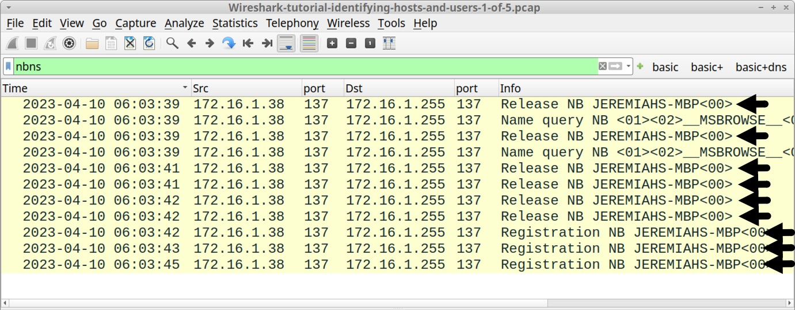

Figure 6. Finding the hostname from NBNS traffic in our first pcap.

To examine NBNS traffic from a Windows host, open our second pcap Wireshark-tutorial-identifying-hosts-and-users-2-of-5.pcap and filter on nbns.

This pcap is from a MAC address at 78:c2:3b:b8:93:e8 using an internal IP address of 172.16.1\[.\]101. The Windows hostname is DESKTOP-HVKYP4S as shown below in Figure 7.

Figure 7. Correlating the MAC address, IP address and hostname filtering on NBNS traffic.

Device Models and Operating System (OS) from HTTP Traffic
---------------------------------------------------------

Unencrypted HTTP traffic to a web browser can reveal the OS. This information is contained in the User-Agent line from the HTTP request headers.

However, use this method with caution. Certain [browser extensions](https://chrome.google.com/webstore/detail/user-agent-switcher-for-c/djflhoibgkdhkhhcedjiklpkjnoahfmg) or a tool like [cURL](https://osxdaily.com/2011/07/16/change-user-agent-with-curl/) can easily change or spoof the User-Agent line in HTTP traffic. Various malware samples over the past several years have also [spoofed the User-Agent line](https://blog.talosintelligence.com/web-proxies-user-agent-strings-and/) in their command and control traffic.

In 2023, this method has become unreliable because browser developers are [reducing information contained in the User-Agent line](https://developer.chrome.com/en/blog/user-agent-reduction-deprecation-trial/), so most up-to-date web browsers no longer report the actual OS version used by the host.

While increasingly unreliable, this method can still help identify the platform type (Windows, Apple device, Linux or Android) from browser-generated unencrypted HTTP traffic.

Open our third pcap Wireshark-tutorial-identifying-hosts-and-users-3-of-5.pcap in Wireshark. A Windows host generated this traffic in an environment with both IPv4 and IPv6 enabled.

We can find unencrypted web traffic to a web browser by filtering on http.accept\_language. This reveals all HTTP requests with an [Accept-Language](https://developer.mozilla.org/en-US/docs/Web/HTTP/Headers/Accept-Language) header line commonly generated by web browsers.

This filter avoids web traffic generated by the OS and other applications, so we can focus on any unencrypted HTTP traffic generated by a browser. The results reveal several unencrypted HTTP GET requests tooutdoornebraska\[.\]gov over TCP port 80 as shown below in Figure 8.

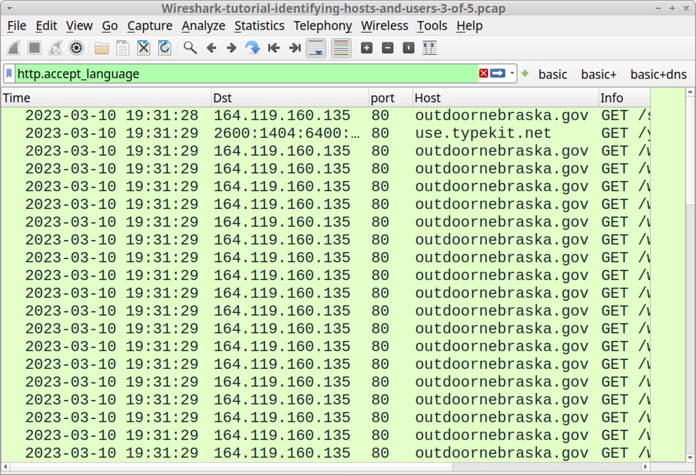

Figure 8. Filtering on our third pcap for unencrypted HTTP traffic to a web browser.

Select any of the HTTP GET requests to outdoornebraska\[.\]gov and follow the TCP stream, as shown below in Figure 9.

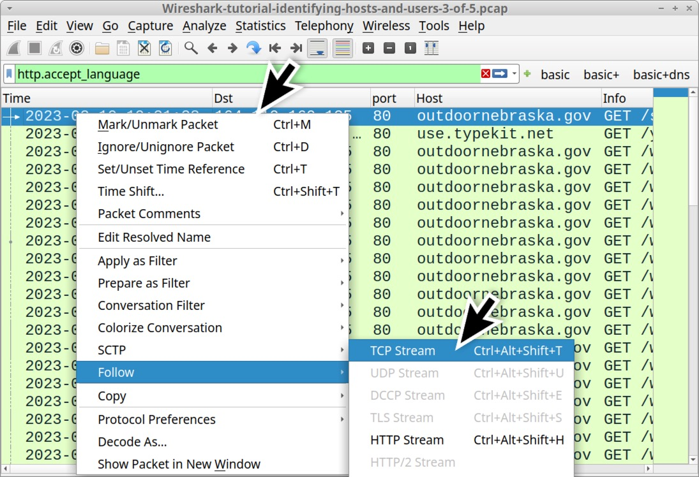

Figure 9. Following the TCP stream for an HTTP GET request to outdoornebraska\[.\]gov.

This TCP stream has HTTP request headers with a User-Agent line shown in Figure 10. This User-Agent line was generated by the Microsoft Edge web browser version 110.0.1587.69 from a Windows 11 host on March 10, 2023.

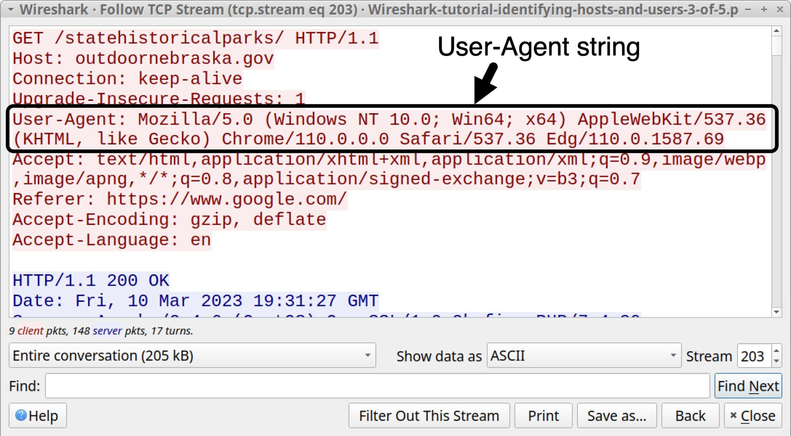

Figure 10. TCP stream with the User-Agent line generated by Microsoft Edge.

Note the following string in the User-Agent line above in Figure 10:

(Windows NT 10.0; Win64; x64)

Windows NT 10.0 represents either Windows 10 or Windows 11. For User-Agent lines, these Windows NT strings represent different versions of Microsoft Windows noted below in Table 1.

<table><tbody><tr><td><b>Windows NT version</b></td><td><b>Windows OS Version</b></td></tr><tr><td>Windows NT 5.1</td><td>Windows XP</td></tr><tr><td>Windows NT 6.0</td><td>Windows Vista</td></tr><tr><td>Windows NT 6.1</td><td>Windows 7</td></tr><tr><td>Windows NT 6.2</td><td>Windows 8</td></tr><tr><td>Windows NT 6.3</td><td>Windows 8.1</td></tr><tr><td>Windows NT 10.0</td><td>Windows 10 or Windows 11</td></tr></tbody></table>

_Table 1. “Windows NT” lines and the associated versions of Microsoft Windows._

Why does Windows NT 10.0 represent either Windows 10 or Windows 11 in Table 1? As part of a [User-Agent reduction](https://blog.chromium.org/2021/09/user-agent-reduction-origin-trial-and-dates.html) effort, developers for web browsers like Chrome, Edge and Firefox have frozen the Windows version number in their User-Agent lines at Windows NT 10.0. Starting sometime in 2023, the most current versions of Google’s Chrome browser will [now report any version of Windows as Windows NT 10.0](https://www.chromium.org/updates/ua-reduction/#sample-ua-strings-final-reduced-state) in the User-Agent line.

This has also happened with Apple’s macOS, where User-Agent lines generated by web browsers in current versions of macOS have been [frozen to report macOS as Catalina (version 10.15.7)](https://bugs.chromium.org/p/chromium/issues/detail?id=1175225) in the HTTP request headers.

As noted earlier, unencrypted HTTP traffic from our third pcap was generated using the Microsoft Edge web browser version 110.0.1587.69. From the same TCP stream shown earlier in Figure 9, the final characters of the User-Agent line are Edg/110.0.1587.69 as indicated below in Figure 11. The Chromium-based version of Microsoft Edge uses the truncated term Edg as an identifier.

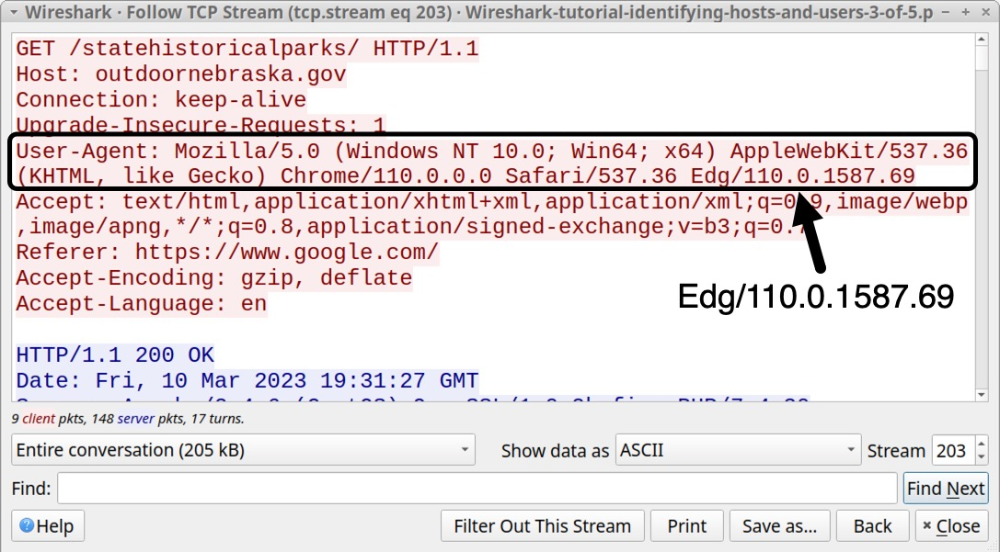

Figure 11. TCP stream with the User-Agent line and its final characters that identify the web browser.

User-Agent lines generated by Google Chrome or Chromium-based web browsers like Microsoft Edge include strings for Safari and AppleWebKit. This is most likely to ensure compatibility when viewing pages optimized for Apple’s Safari web browser.

Unencrypted HTTP web traffic generated by Android devices might also reveal the brand name and model of the device.

Open our fourth pcap Wireshark-tutorial-identifying-hosts-and-users-4-of-5.pcap in Wireshark. Use our basic web filter, select the first HTTP GET request for www.pcapworkshop\[.\]net and follow the TCP stream as illustrated below in Figure 12.

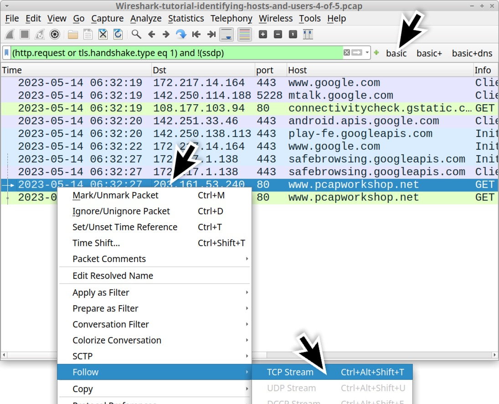

Figure 12. Our fourth pcap filtered Wireshark, where we follow a TCP stream.

This activity was captured from a Google Pixel Android phone, and the web traffic to www.pcapworkshop\[.\]net was generated using Google’s Chrome browser for Android phones and tablets. The TCP stream for this web traffic is shown below in Figure 13, highlighting the User-Agent line that identifies the device and browser.

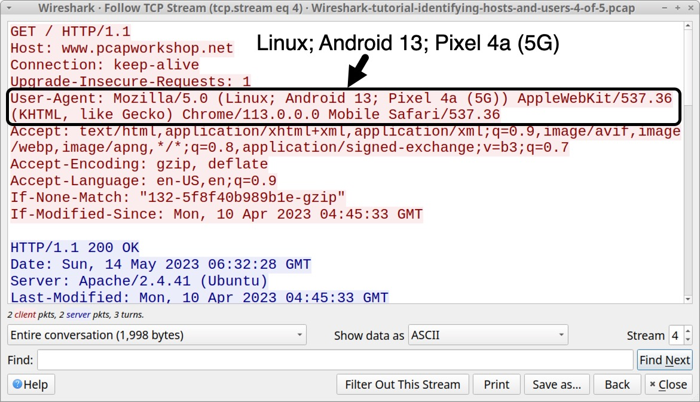

Figure 13. TCP stream with the User-Agent line generated by Chrome running on a Pixel phone.

Collected on May 14, 2023, this traffic reveals (Linux; Android 13; Pixel 4a (5G)) in the User-Agent line. Current versions of Chrome will now report this same device as (Linux; Android 10; K) because of Google’s [User-Agent reduction](https://www.chromium.org/updates/ua-reduction/#sample-ua-strings-final-reduced-state) effort.

While User-Agent reduction applies to Android devices running Chrome or Chromium-based browsers, we did not notice any reduction when using the Safari browser on an Apple mobile device.

Open our fifth pcap Wireshark-tutorial-identifying-hosts-and-users-5-of-5.pcap in Wireshark. Use our basic web filter, select the first HTTP GET request for www.pcapworkshop\[.\]net and follow the TCP stream as shown below in Figure 14.

![Image 14 is a Wireshark screenshot. The filter is set to (hhtp.request or tls.handshael.type eq 1) and !(ssdp). The filter selection is “Basic.” The pcapworkshop[.]net row in the traffic is selected. Follow > TCP Stream is selected from the menu.](assets/word-image-130507-14.jpeg)

Figure 14. Our fifth pcap filtered Wireshark, where we follow a TCP stream.

This activity was captured from an Apple iPhone running iOS 16.4.1, and the web traffic towww.pcapworkshop\[.\]net was generated using Apple’s Safari mobile web browser on April 10, 2023. The TCP stream for this web traffic is shown below in Figure 15, highlighting the User-Agent line that identifies the device and OS version.

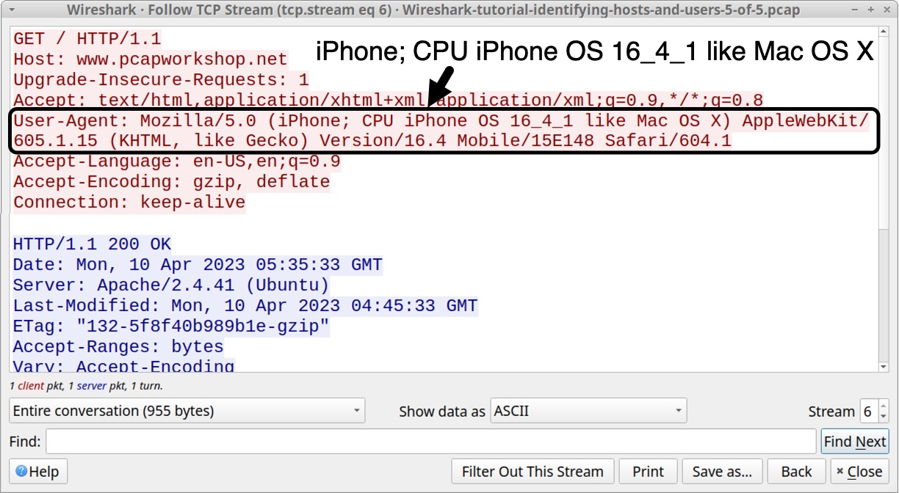

Figure 15. TCP stream with the User-Agent line generated by Safari running on an iPhone.

Since more websites are using HTTPS, this method of host identification has become increasingly difficult, because HTTP headers and content are not visible in encrypted HTTPS traffic. However, for those who find unencrypted HTTP web traffic during their investigation, this method can provide more information to help identify a host.

Identifying Users in an Active Directory (AD) Environment
---------------------------------------------------------

Perhaps the most important information when resolving an incident is determining the user associated with an infected host. For Windows clients in an AD environment, we can determine the user from user account names in [Kerberos](https://learn.microsoft.com/en-us/windows-server/security/kerberos/kerberos-authentication-overview) traffic.

Let’s return to our third pcap Wireshark-tutorial-identifying-hosts-and-users-3-of-5.pcap and open it in Wireshark.

This pcap is from a Windows host in the following AD environment:

*   Domain: www.pcapworkshop\[.\]net
*   Network segment: 172.16.1\[.\]0/24 (172.16.1\[.\]0 - 172.16.1\[.\]255)
*   Domain controller IP: 172.16.1\[.\]16
*   Domain controller hostname: PCAPWORKSHOP-DC
*   Segment gateway: 172.16.1\[.\]1
*   Broadcast address: 172.16.1\[.\]255
*   Windows client: 172.16.1\[.\]141

While this is an environment with both IPv4 and IPv6 enabled, the Kerberos traffic is IPv4 only.

Open the pcap in Wireshark and filter on kerberos.CNameString. Select the first frame. Go to the frame details section and expand the lines, as shown in Figure 16. Select the line with CNameString: desktop-hsjd5r8$ and apply it as a column.

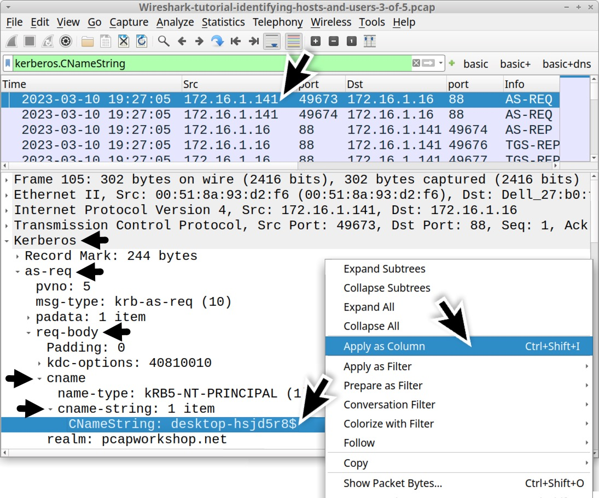

Figure 16. Finding the CNameString value and applying it as a column.

This will create a new column titled CNameString. Scroll down to the last frames in the column display. The CNameString column reveals a user account name for rene.mccollum in traffic between the domain controller at 172.16.1\[.\]16 and the Windows client at 172.16.1\[.\]141, as noted below in Figure 17.

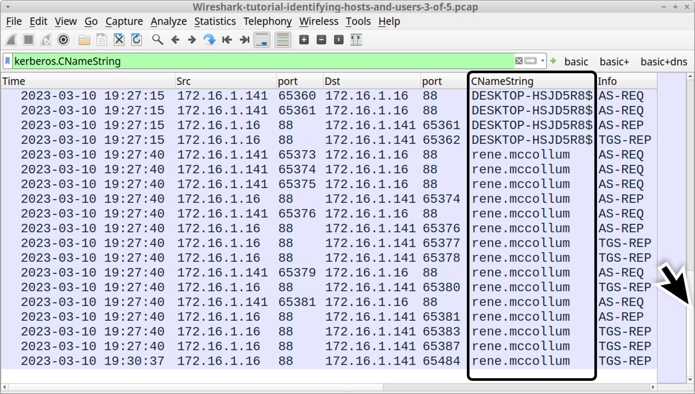

Figure 17. Finding the Windows user account name in our newly created CNameString column.

Besides Kerberos traffic, we might find a first and last name or other identifiers of the user in Lightweight Directory Access Protocol (LDAP) traffic. Use the following Wireshark filter:

ldap contains "CN=Users"

This should reveal the string "CN=Rene McCollum, under the Info column, as shown below in Figure 18.

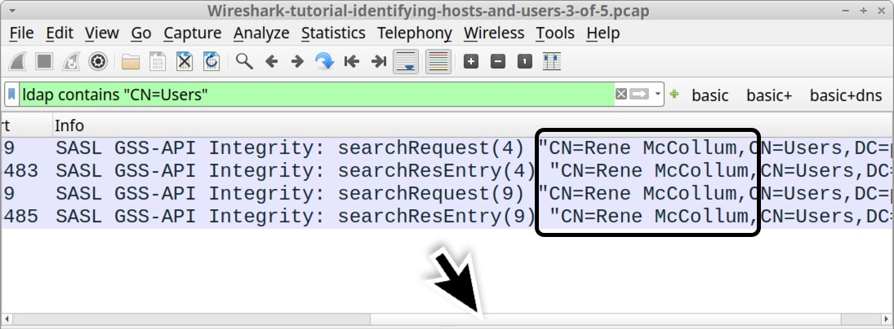

Figure 18. Finding the first and last name in LDAP traffic.

Default Windows Hostnames
-------------------------

The default hostname for Windows 10 and Windows 11 computers is a 15-character string that starts with DESKTOP- and ends with seven random alpha-numeric characters.

Search for this identifier in our third pcap using ip contains "DESKTOP-" in the Wireshark filter. This finds the plaintext ASCII string DESKTOP- in any traffic at the IP layer or higher. For example, this search would find if the string appears in TCP from [SMB](https://en.wikipedia.org/wiki/Server_Message_Block) or Kerberos activity, but it also includes traffic that uses UDP like DNS or DHCP.

After applying this filter, review the Info column, as shown below in Figure 19.

Figure 19. Searching for a default Windows 10 or Windows 11 hostname.

This search is case sensitive, and this identifier also appears as a lower-case string in our pcap.

An even better way to find the DESKTOP- string is to clear the Wireshark filter and use the Find Packet function under Wireshark’s Edit menu, as shown below in Figure 20.

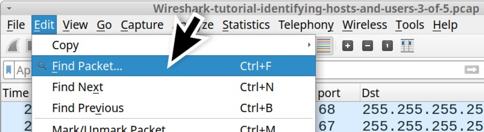

Figure 20. Using the Find Packet feature in Wireshark.

This brings up Wireshark’s search panel immediately under the search filter bar. Select “Packet Details” and “String” as our search options before typing desktop- as the search string. See Figure 21 for an example.

Figure 21. Finding the string “desktop-” in the packet details.

Each time we click the Find button in our search panel, the string is highlighted in the frame details section, as noted above in Figure 21.

Conclusion
----------

Properly identifying hosts and users from network traffic is essential when investigating an infected host. Following the methods from this tutorial, we can better utilize Wireshark to help identify affected hosts and users.

Our [next tutorial in this series](https://unit42.paloaltonetworks.com/using-wireshark-exporting-objects-from-a-pcap/) reviews how to export objects from a pcap.

Additional Resources
--------------------

*   [Wireshark Tutorial: Changing Your Column Display](https://unit42.paloaltonetworks.com/unit42-customizing-wireshark-changing-column-display/) - Unit 42, Palo Alto Networks
*   [Wireshark Tutorial: Display Filter Expressions](https://unit42.paloaltonetworks.com/using-wireshark-display-filter-expressions/) - Unit 42, Palo Alto Networks
*   [Wireshark Tutorial: Exporting Objects From a Pcap](https://unit42.paloaltonetworks.com/using-wireshark-exporting-objects-from-a-pcap/) - Unit 42, Palo Alto Networks
*   [Wireshark Tutorial: Decrypting HTTPS Traffic](https://unit42.paloaltonetworks.com/wireshark-tutorial-decrypting-https-traffic/) - Unit 42, Palo Alto Networks
*   [Wireshark Tutorial: Wireshark Workshop Videos Now Available](https://unit42.paloaltonetworks.com/wireshark-workshop-videos/) - Unit 42, Palo Alto Networks
*   [Full list of Wireshark Tutorials and Quizzes](https://unit42.paloaltonetworks.com/tag/wireshark-tutorial/) - Unit 42, Palo Alto Networks

Most Read Articles
------------------

[Wireshark Tutorial: Exporting Objects From a Pcap](https://unit42.paloaltonetworks.com/using-wireshark-exporting-objects-from-a-pcap/)

218,102

people reacted

### [Wireshark Tutorial: Exporting Objects From a Pcap](https://unit42.paloaltonetworks.com/using-wireshark-exporting-objects-from-a-pcap/)

*   By [Brad Duncan](https://unit42.paloaltonetworks.com/author/bduncan/ "Posts byBrad Duncan")
*   March 1, 2024 at 6:00 AM

129

12 min. read

[The Art of Domain Deception: Bifrost's New Tactic to Deceive Users](https://unit42.paloaltonetworks.com/new-linux-variant-bifrost-malware/)

5,440

people reacted

### [The Art of Domain Deception: Bifrost's New Tactic to Deceive Users](https://unit42.paloaltonetworks.com/new-linux-variant-bifrost-malware/)

*   By [Anmol Maurya](https://unit42.paloaltonetworks.com/author/anmol-maurya/ "Posts byAnmol Maurya") and [Siddharth Sharma](https://unit42.paloaltonetworks.com/author/siddharth-sharma/ "Posts bySiddharth Sharma")
*   February 29, 2024 at 3:00 AM

15

6 min. read

[Threat Group Assessment: Muddled Libra (Updated)](https://unit42.paloaltonetworks.com/muddled-libra/)

34,284

people reacted

### [Threat Group Assessment: Muddled Libra (Updated)](https://unit42.paloaltonetworks.com/muddled-libra/)

*   By [Kristopher Russo](https://unit42.paloaltonetworks.com/author/kristopher-russo/ "Posts byKristopher Russo"), [Austin Dever](https://unit42.paloaltonetworks.com/author/austin-dever/ "Posts byAustin Dever") and [Amer Elsad](https://unit42.paloaltonetworks.com/author/amer-elsad/ "Posts byAmer Elsad")
*   March 8, 2024 at 2:58 PM

37

13 min. read

#### Get updates from  

Palo Alto  
Networks!

Sign up to receive the latest news, cyber threat intelligence and research from us

By submitting this form, you agree to our [Terms of Use](https://www.paloaltonetworks.com/legal-notices/terms-of-use) and acknowledge our [Privacy Statement](https://www.paloaltonetworks.com/legal-notices/privacy).

pcap

Wireshark

Wireshark Tutorial