[Wireshark Tutorial: Display Filter Expressions](https://unit42.paloaltonetworks.com/using-wireshark-display-filter-expressions/)
=================================================================================================================================

2023-09-08共 39738 字阅读需 158 分钟

> This is a tutorial about using Wireshark, a follow-up to "Customizing Wireshark – Changing Your Column Display." It offers guidelines for using Wireshark filters to review and better understand pcaps of infection activity.

This post is also available in: [日本語(Japanese)](https://unit42.paloaltonetworks.jp/using-wireshark-display-filter-expressions/)

Executive Summary
-----------------

Security professionals occasionally use Wireshark to review packet captures (pcaps) of malware-generated network traffic. To more efficiently review this type of activity, we suggest users customize their Wireshark installation.

In [our previous tutorial](https://unit42.paloaltonetworks.com/unit42-customizing-wireshark-changing-column-display/), we customized Wireshark's column display. This tutorial introduces display filter expressions useful to review pcaps of malicious network traffic from infected Windows hosts.

This blog is the second in [a series of Wireshark tutorials](https://unit42.paloaltonetworks.com/tag/wireshark-tutorial/) that provide customization options helpful for investigating malicious network traffic. It was first published in January 2019 and has been updated for 2023.

The pcaps in this tutorial contain traffic generated by Windows-based malware. Palo Alto Networks customers receive protection from these threats through [Cortex XDR](https://www.paloaltonetworks.com/cortex/cortex-xdr) and our [Next-Generation Firewall](https://www.paloaltonetworks.com/network-security/next-generation-firewall) with [Cloud-Delivered Security Services](https://www.paloaltonetworks.com/network-security/security-subscriptions) that include [WildFire](https://www.paloaltonetworks.com/network-security/wildfire) and [Advanced Threat Prevention](https://www.paloaltonetworks.com/network-security/advanced-threat-prevention).

| **Related Unit 42 Topics** | [**pcap**](https://unit42.paloaltonetworks.com/tag/pcap/)**,** [**Wireshark**](https://unit42.paloaltonetworks.com/tag/wireshark/)**,** [**Wireshark Tutorial**](https://unit42.paloaltonetworks.com/tag/wireshark-tutorial/) |
| -------------------------- | ------------------------------------------------------------ |

Table of Contents
-----------------

Requirements and Supporting Material
------------------------------------

This tutorial requires readers to have reviewed and understand [our previous Wireshark tutorial](https://unit42.paloaltonetworks.com/unit42-customizing-wireshark-changing-column-display/). Requirements also include using a recent version of Wireshark, at least version 3.6.2 or later. This tutorial uses Wireshark version 4.0.7 with a customized column display from the previous tutorial. As always, we recommend using the most recent version of Wireshark available for your environment.

Our requirements also include a basic knowledge of network traffic. Part of this knowledge is understanding the [three-way handshake](https://www.akamai.com/blog/security/tcp-three-way-handshake) used for TCP connections. Furthermore, some of the pcaps for this tutorial contain malicious content from Windows-based infections, so we recommend using Wireshark in a non-Windows environment like BSD, Linux or macOS.

The five pcap files used in this tutorial are contained in a password-protected ZIP archive hosted at our [GitHub repository](https://github.com/PaloAltoNetworks/Unit42-Wireshark-tutorials/blob/main/Wireshark-tutorial-filter-expressions-5-pcaps.zip). Download the ZIP file named Wireshark-tutorial-filter-expressions-5-pcaps.zip. Use _infected_ as the password to extract the pcap files, as shown below in Figure 1.

Figure 1. Acquiring pcap files for this tutorial.

The five extracted pcap files for this tutorial are:

*   Wireshark-tutorial-filter-expressions-1-of-5.pcap
*   Wireshark-tutorial-filter-expressions-2-of-5.pcap
*   Wireshark-tutorial-filter-expressions-3-of-5.pcap
*   Wireshark-tutorial-filter-expressions-4-of-5.pcap
*   Wireshark-tutorial-filter-expressions-5-of-5.pcap

Before continuing, we should ensure we are using a personal Wireshark profile, not the default.

Profile Check
-------------

During this tutorial, we save Wireshark filter expressions as filter buttons. Like the column changes from [our previous tutorial](https://unit42.paloaltonetworks.com/unit42-customizing-wireshark-changing-column-display/), filter buttons will also be saved to your current Wireshark profile. The name of the personal profile from our previous tutorial is “Customized.”

To ensure you are using a personal profile, check the right side of the status bar, which shows the name of your current profile. You can also select “Configuration Profiles…” under the Edit menu to verify. Both options are shown below in Figure 2, revealing the customized profile name from our previous tutorial.

Figure 2. Checking your current configuration profile in Wireshark.

After confirming use of a personal profile, we can examine the Wireshark display filter.

The Wireshark Display Filter
----------------------------

In Wireshark's default configuration, the display filter is a bar located immediately above the column display. This is where we type expressions to filter our view of Ethernet frames, IP packets or TCP segments from a pcap. When typing in the display filter bar, Wireshark offers a list of suggestions based on the typed text, as shown below in Figure 3.

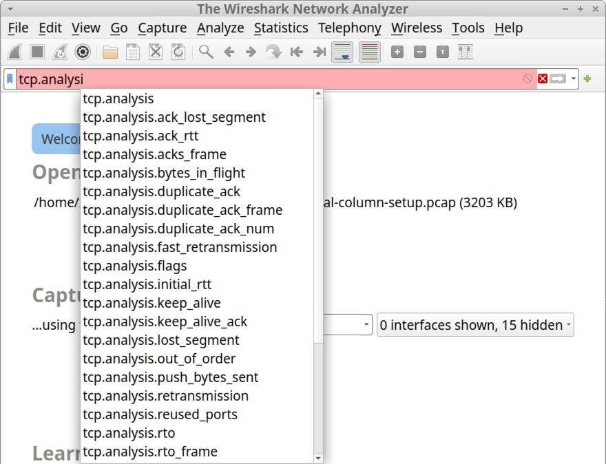

Figure 3. Wireshark’s display filter offers suggestions based on what you type.

As long as the display filter bar remains red, the expression will not be accepted. Note the filter bar’s red color in Figure 3.

Open our first pcap named Wireshark-tutorial-filter-expressions-1-of-5.pcap in Wireshark. Type http.request in the display filter and hit Enter. If the filter bar is green, the expression has been accepted, and it should work properly, as shown below in Figure 4.

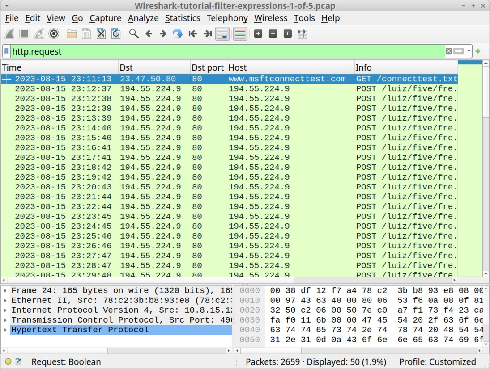

Figure 4. Wireshark's display filter accepts an expression, and it works as intended.

If the filter bar turns yellow, the expression is accepted, but it may not work as intended. Yellow filter bar results are more common in earlier versions of Wireshark. For example, Figure 5 shows the filter expression dns && ip.addr || http.request using Wireshark version 3.6.2. This produces a yellow result in the filter bar, with a suggested solution at the bottom in the status bar.

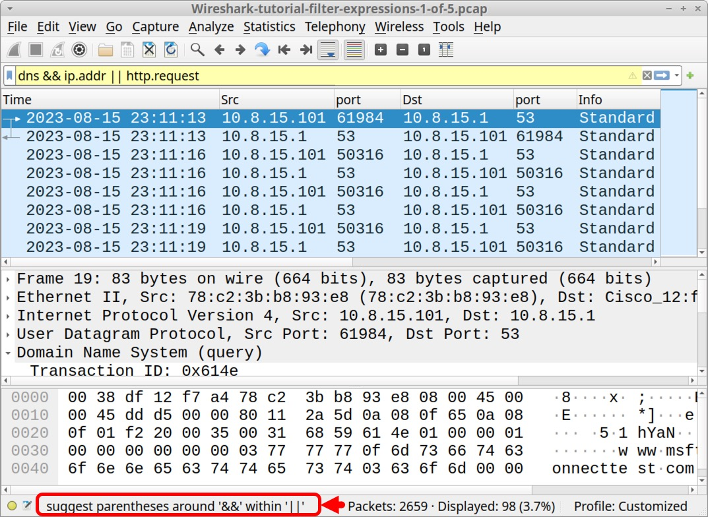

Figure 5. Bad filter expression for our first pcap in Wireshark version 3.6.2.

The results in Figure 5 reveal no HTTP request lines among the results in our column display. But using the same filter on the same pcap with Wireshark version 4.0.7 provides a green result and displays HTTP request lines, as shown below in Figure 6.

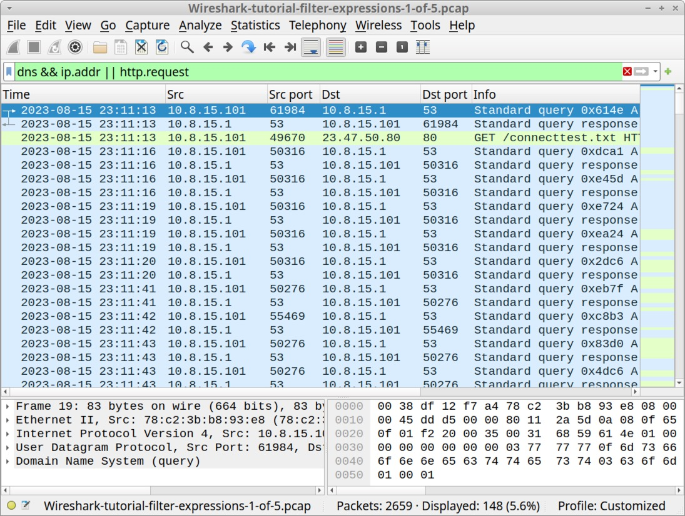

Figure 6. The same filter expression for our first pcap is green in Wireshark version 4.0.7.

This illustrates one of the differences between Wireshark’s version 3 series and version 4. As stated earlier, we recommend using the latest version of Wireshark available for your system.

Wireshark's display filter uses [Boolean expressions](https://en.wikipedia.org/wiki/Boolean_expression), so we can specify values and chain them together. Below, Table 1 lists common Boolean operators used in Wireshark filter expressions.

<table><tbody><tr><td><b>Boolean Operator</b></td><td><b>Expression</b></td><td><b>Alternate Expression</b></td></tr><tr><td>Equals</td><td>==</td><td>eq</td></tr><tr><td>Not</td><td>!</td><td>not</td></tr><tr><td>And</td><td>&amp;&amp;</td><td>and</td></tr><tr><td>Or</td><td>||</td><td>or</td></tr></tbody></table>

_Table 1. Boolean functions used in Wireshark display filter expressions._

Random examples of Wireshark display filter expressions include:

*   ip.addr eq 10.8.15\[.\]1 and dns.qry.name.len > 36
*   http.request && ip.addr == 10.8.15\[.\]101
*   http.request || http.response
*   dns.qry.name contains microsoft or icmp

Filtering for **Web Traffic**
-----------------------------

Our [previous Wireshark tutorial](https://unit42.paloaltonetworks.com/unit42-customizing-wireshark-changing-column-display/) used the following filter for web traffic:

http.request or tls.handshake.type eq 1

The expression http.request reveals URLs for HTTP requests, and tls.handshake.type eq 1 shows domain names used in HTTPS or SSL/TLS traffic.

For web traffic generated by Windows hosts, results from this filter include HTTP requests over UDP port 1900. This HTTP traffic is [Simple Service Discovery Protocol (SSDP)](https://en.wikipedia.org/wiki/Simple_Service_Discovery_Protocol). SSDP is used to discover plug-and-play devices and is not associated with normal web traffic. We can exclude SSDP traffic in our results by modifying our filter expression to:

(http.request or tls.handshake.type eq 1) and !(ssdp)

While parentheses in the above filter expression are not required in Wireshark version 4, we suggest including them to ensure filter expression compatibility with older versions of Wireshark. Use this filter on our first pcap, Wireshark-tutorial-filter-expressions-1-of-5.pcap and the results should appear similar to Figure 7.

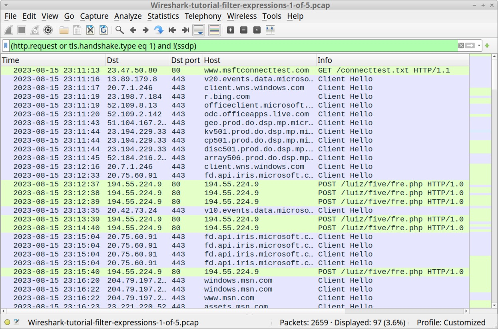

Figure 7. Using the basic web filter in our first pcap.

Reviewing the traffic shown in Figure 7 reveals several lines of unencrypted HTTP POST requests associated with [Loki Bot malware](https://malpedia.caad.fkie.fraunhofer.de/details/win.lokipws) to the URL hxxp://194.55.224\[.\]9/liuz/five/fre.php, which was [reported to Threatfox](https://threatfox.abuse.ch/ioc/1149105/) in August 2023.

To examine the traffic, click on any of the lines for traffic to 194.55.224\[.\]9 to select the frame, then right-click to bring up a menu. From the menu, select “Follow” then “TCP Stream” or “HTTP Stream,” as shown below in Figure 8.

Figure 8. Following a TCP stream in Wireshark.

This will bring up a new window, and we can review an ASCII representation of the content of this unencrypted HTTP traffic. Review this on your own to become familiar with Loki Bot command and control (C2) traffic.

Open our second pcap Wireshark-tutorial-filter-expressions-2-of-5.pcap in Wireshark. This is traffic from a [standard variant IcedID (Bokbot)](https://www.proofpoint.com/us/blog/threat-insight/fork-ice-new-era-icedid) infection. It contains HTTP traffic to vrondafarih\[.\]com and HTTPS traffic to both magiketchinn\[.\]com and magizanqomo\[.\]com. All three were [identified as IcedID-related domains in July 2023](https://threatfox.abuse.ch/browse.php?search=malware%3Aicedid).

Figure 9 shows these IcedID-associated domains in our second pcap using the basic web filter in Wireshark.

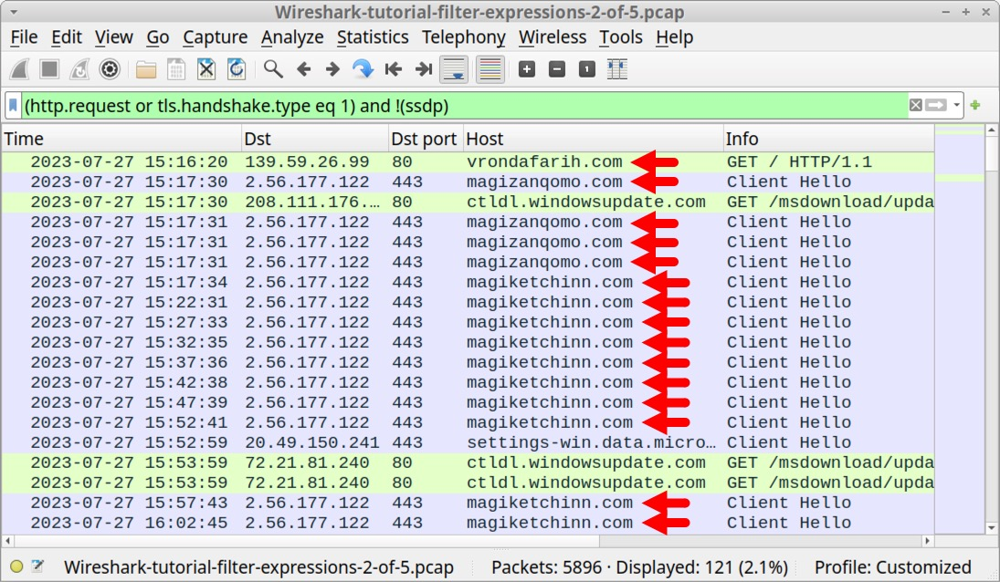

Image 9 is a Wireshark screenshot. Red arrows pointing to the rows of traffic indicate the domains associated with an IcedID infection.

Creating Filter Buttons
-----------------------

Complex filter expressions are very tedious to type in Wireshark's filter bar every time you need them. Fortunately, we can save any of our typed expressions as filter buttons.

On the right side of the Wireshark filter bar is a plus sign to add a filter button. Ensure we are still using the basic web filter shown in Figures 7, 8 and 9. After ensuring this filter has been implemented, click on the plus sign as shown below in Figure 10.

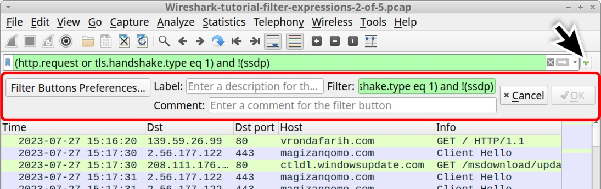

Figure 10. Clicking the plus sign to add a filter button.

Clicking the plus sign generates a temporary panel immediately under the filter bar, as noted above in Figure 10. This panel has three fields: Label, Filter and Comment. The Filter field should contain the expression already implemented in the filter bar. Since this is our basic web filter, type basic in the Label field and click the OK button as shown below in Figure 11.

Figure 11. Creating our basic web filter button.

This should create a button to the right of Wireshark's filter bar labeled "basic" as shown below in Figure 12. Wireshark filter buttons have no borders and look like labels, but they function as buttons. Anytime you need this basic web filter, just left-click on it.

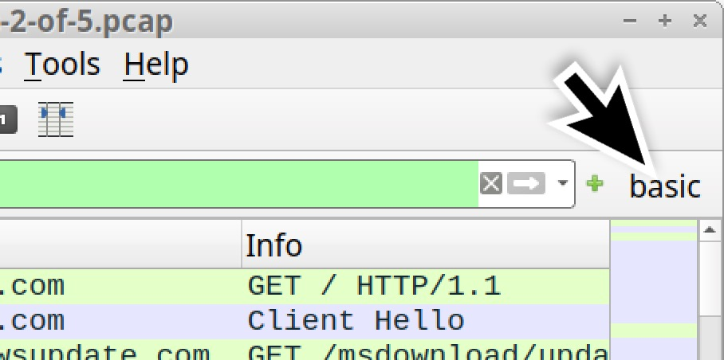

Figure 12. The button for our basic web filter.

For this tutorial, we should create the following filter buttons listed below in Table 2.

<table><tbody><tr><td><b>Button Label</b></td><td><b>Filter Expression</b></td></tr><tr><td>basic</td><td>basic (http.request or tls.handshake.type eq 1) and !(ssdp)</td></tr><tr><td>basic+</td><td>basic (http.request or tls.handshake.type eq 1 or (tcp.flags.syn eq 1 and tcp.flags.ack eq 0)) and !(ssdp)</td></tr><tr><td>basic+dns</td><td>basic (http.request or tls.handshake.type eq 1 or (tcp.flags.syn eq 1 and tcp.flags.ack eq 0) or dns) and !(ssdp)</td></tr></tbody></table>

_Table 2. Filter buttons to more fully investigate malicious web traffic._

When examining suspicious traffic in Wireshark, we should use a progressive method. Start simple with our basic web filter, then check for other non-web traffic using the “basic+” filter.

In Table 2, the “basic+” filter expression displays the same information as our “basic” filter, but it includes TCP segments with the SYN flag and not the ACK flag by adding or (tcp.flags.syn eq 1 and tcp.flags.ack eq 0). This displays TCP SYN segments that reveal the start of a TCP stream. With this filter, we can find non-web traffic in a pcap.

The “basic+” filter also reveals any TCP connection attempts that failed. Depending on the IP address, repeated and failed TCP connection attempts could indicate a C2 server that was off-line when the pcap was recorded.

After checking the “basic+” filter, we should review the “basic+dns” filter to check for any notable DNS activity.

In Table 2, the “basic+dns” filter expression shows the same data as our “basic+” filter, but it includes or dns. This filter reveals any DNS queries in the pcap. It is very helpful for determining domain names associated with non-web traffic.

Furthermore, if a malware sample’s C2 server is offline when the pcap was recorded, this filter could reveal one or more C2 domains associated with any failed connection attempts. Finally, this filter might reveal examples of [DNS tunneling](https://www.paloaltonetworks.com/cyberpedia/what-is-dns-tunneling).

Add the “basic+” and “basic+dns” filters as shown below in Figure 13 and Figure 14. After adding the filter buttons, we should see all three to the right of Wireshark’s filter bar as shown below in Figure 15.

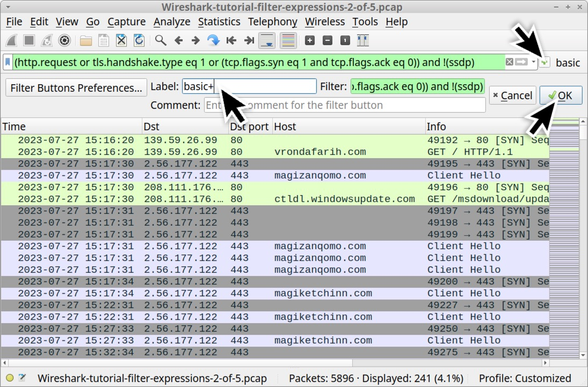

Figure 13. Creating the “basic+” filter button.

Figure 14. Creating the “basic+dns” filter button.

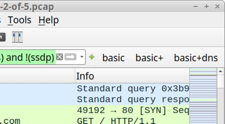

Figure 15. Our newly created filter buttons beside the Wireshark filter bar.

With our three newly created filter buttons in place, we can explore other types of malicious traffic.

Filtering for Non-Web Traffic
-----------------------------

Open our third pcap Wireshark-tutorial-filter-expressions-3-of-5.pcap in Wireshark. This pcap contains post-infection traffic generated by a Remote Access Tool (RAT) malware called [Ave Maria RAT (also known as Warzone RAT)](https://malpedia.caad.fkie.fraunhofer.de/details/win.ave_maria).

Using our basic web filter, nothing obvious stands out in the traffic. However, by using our “basic+dns” web filter and scrolling through the results, we can see things more clearly. We can find a DNS query for adaisreal.ddns\[.\]net that resolves to 87.121.221\[.\]212, then a TCP segment to that IP address with the SYN flag over TCP port 7888, as shown below in Figure 16.

Figure 16. Ave Maria RAT C2 traffic found in our third pcap.

This is just one example, but different RATs and other types of malware also generate similar types of non-web traffic. Our “basic+dns” filter provides a way to search for malicious non-web activity.

Filtering for FTP Traffic
-------------------------

Some infection traffic uses common protocols that Wireshark can easily decode. Our fourth pcap Wireshark-tutorial-filter-expressions-4-of-5.pcap contains post-infection activity caused by a [malware executable that generates FTP traffic](https://bazaar.abuse.ch/sample/adfa401cdfaac06df0e529bc9d54b74cea9a28d4266a49edafa5b8e04e3b3594/). Our “basic+dns” filter reveals traffic over TCP port 21 and another TCP port after a DNS query to valvulasthermovalve\[.\]cl as shown below in Figure 17.

Figure 17. Finding FTP traffic from our fourth pcap.

In Figure 17, we can also see HTTPS traffic to api.ipify\[.\]org immediately before the FTP activity. While this domain is not inherently malicious, malware often uses the service to check the IP address of an infected host.

Our “basic+dns” filter can help find unencrypted FTP traffic, but other filter expressions would better fit an FTP search. Two basic Wireshark filters for unencrypted FTP traffic are shown below in Table 3.

<table><tbody><tr><td><b>Filter Expression</b></td><td><b>Description</b></td></tr><tr><td>ftp</td><td>FTP activity in the control channel (TCP port 21)</td></tr><tr><td>ftp-data</td><td>FTP activity in the data channel (ephemeral TCP port)</td></tr></tbody></table>

_Table 3. Basic FTP searches for Wireshark._

A general-purpose filter expression to review unencrypted FTP activity is:

ftp.request.command or (ftp-data and tcp.seq eq 1)

Type the above expression into Wireshark’s display filter bar and hit enter. The results should look similar to the screenshot in Figure 18.

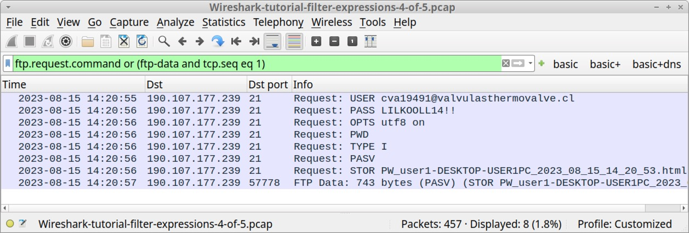

Figure 18. Filtering to see the flow of FTP activity in Wireshark.

Figure 18 shows the username and password for this compromised FTP site, then a STOR command to send an HTML file to the FTP server. This represents stolen data being exfiltrated from the infected Windows host. We can follow the TCP streams to review the FTP commands and examine the stolen data. If needed, you can save this filter expression as a filter button for future use.

Filtering for Email (Spambot) Traffic
-------------------------------------

In addition to FTP, malware can use other common protocols for malicious traffic. Spambot malware can turn an infected host into a spambot designed to constantly send email messages. This is characterized by a large amount of DNS requests to various mail servers followed by SMTP traffic on TCP ports 25, 465, 587 and other ports less-commonly associated with SMTP traffic.

Our fifth pcap, Wireshark-tutorial-filter-expressions-5-of-5.pcap, contains post-infection spambot traffic. Open that pcap and type the following expression into Wireshark’s filter bar:

smtp or dns

The results should look similar to Figure 19.

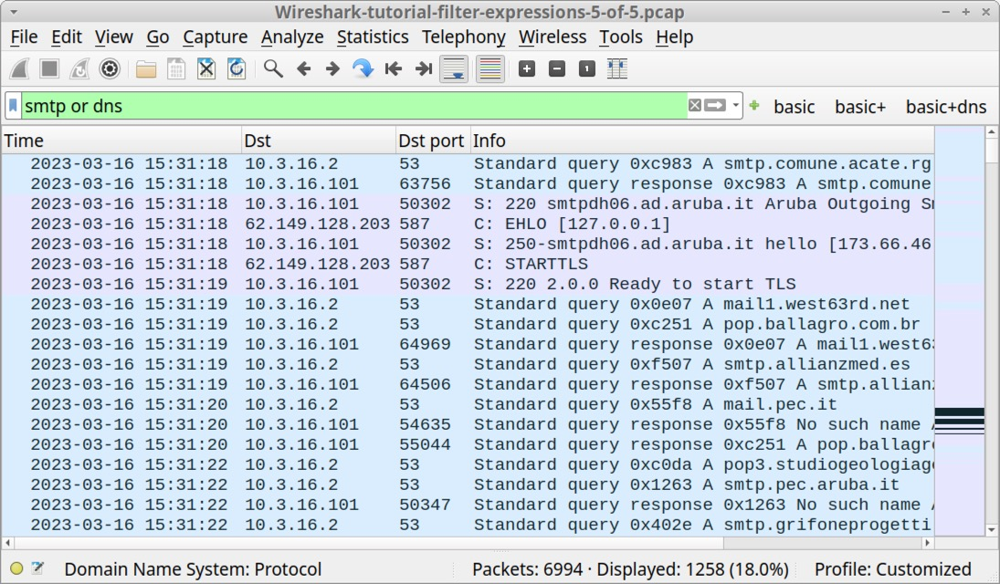

Figure 19. Quick review of spambot activity in our fifth pcap.

If you scroll through the results, you should find several DNS queries for various mail server domains and different SMTP statements on the far right under the “Info” column.

Now type the following filter into the filter bar:

smtp.req.command

The results shown below in Figure 20 reveal the infected host contacted several different IP addresses for mail servers in a relatively short amount of time. Note how most of these SMTP requests state STARTTLS, which establishes an encrypted tunnel after the initial SMTP connection. Most email traffic is encrypted, and most spambot activity is also encrypted.

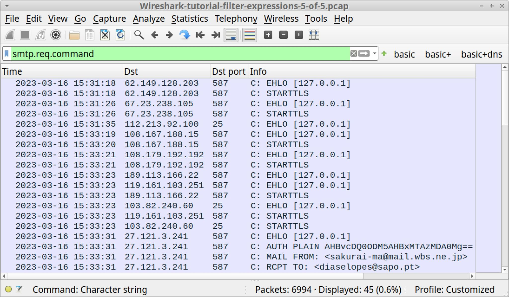

Figure 20. Filtering on smtp.req.command in our fifth pcap.

However, spambot traffic might have unencrypted email messages we can review. To find these messages, type the following expression in Wireshark’s filter bar:

smtp.data.fragment

This should reveal seven results in the column display as shown below in Figure 21. We can follow the TCP stream for any of these to further investigate these messages.

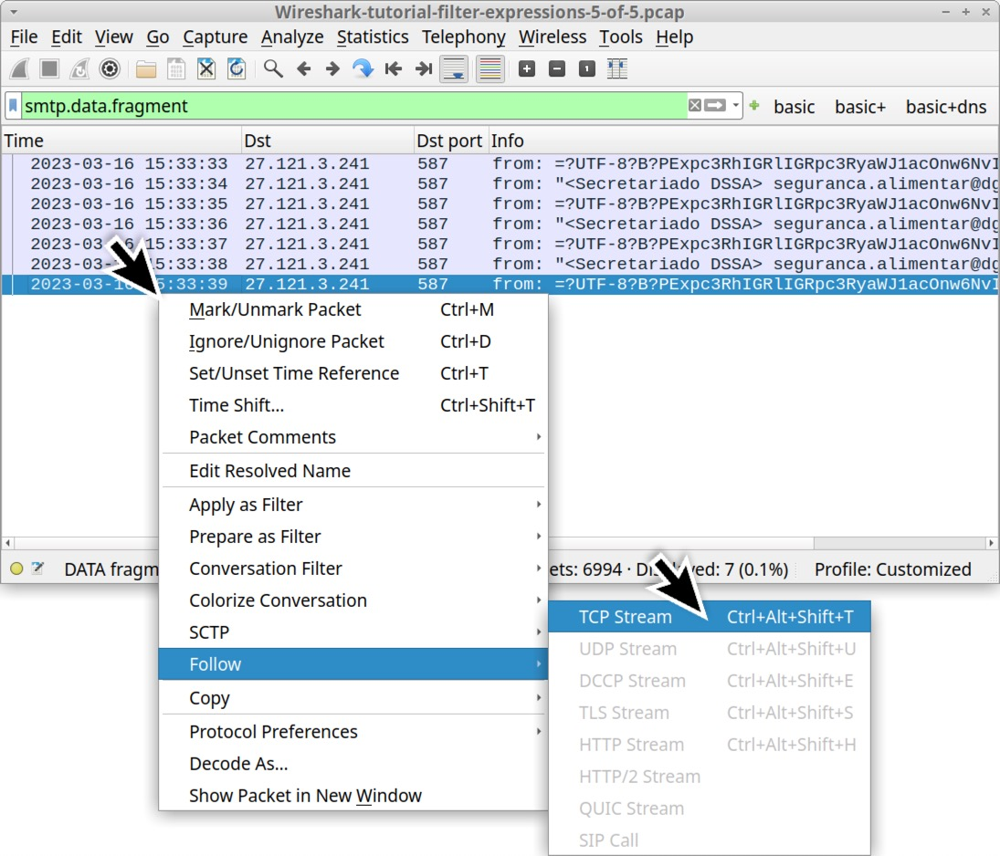

Figure 21. Filtering for emails sent over unencrypted spambot traffic.

While not extensive, these are the most common filter expressions useful for examining spambot traffic.

Conclusion
----------

Wireshark display filter expressions are necessary to understand the contents of a pcap. When combined with an optimized column display, effective filters can immensely help security professionals investigate suspicious network activity.

Our [next tutorial in this series](https://unit42.paloaltonetworks.com/using-wireshark-identifying-hosts-and-users/) reviews how to identify hosts and users when investigating suspicious network activity.

Pcaps used in this tutorial contain traffic generated by Windows-based malware. Palo Alto Networks customers receive protection from these threats through [Cortex XDR](https://www.paloaltonetworks.com/cortex/cortex-xdr) and our [Next-Generation Firewall](https://www.paloaltonetworks.com/network-security/next-generation-firewall) with [Cloud-Delivered Security Services](https://www.paloaltonetworks.com/network-security/security-subscriptions) that include [WildFire](https://www.paloaltonetworks.com/network-security/wildfire), [Advanced Threat Prevention](https://www.paloaltonetworks.com/network-security/advanced-threat-prevention) and [Advanced URL Filtering](https://www.paloaltonetworks.com/network-security/advanced-url-filtering).

If you think you might have been compromised or have an urgent matter, contact the [Unit 42 Incident Response team](https://start.paloaltonetworks.com/contact-unit42.html) or call:

*   North America Toll-Free: 866.486.4842 (866.4.UNIT42)
*   EMEA: +31.20.299.3130
*   APAC: +65.6983.8730
*   Japan: +81.50.1790.0200

Palo Alto Networks has shared these findings, including file samples and indicators of compromise, with our fellow Cyber Threat Alliance (CTA) members. CTA members use this intelligence to rapidly deploy protections to their customers and to systematically disrupt malicious cyber actors. Learn more about the [Cyber Threat Alliance](https://www.cyberthreatalliance.org).

Indicators of Compromise
------------------------

The following are indicators of malicious activity from the pcaps used in this tutorial.

<table><tbody><tr><td><strong>URL</strong></td><td>hxxp://194.55.224[.]9/liuz/five/fre.php</td></tr><tr><td><strong>Description</strong></td><td>Loki Bot C2 URL noted as early as 2023-08-15</td></tr><tr><td><strong>IcedID C2 domains noted on 2023-07-27:</strong></td><td><ul><li aria-level="1">vrondafarih[.]com- HTTP traffic</li><li aria-level="1">magiketchinn[.]com- HTTPS traffic</li><li aria-level="1">magizanqomo[.]com- HTTPS traffic</li></ul></td></tr></tbody></table>

<table><tbody><tr><td><strong>URL</strong></td><td>87.121.221[.]212:7888 - tcp://adaisreal.ddns[.]net:7888/</td></tr><tr><td><strong>Description</strong></td><td>C2 for Ave Maria RAT (Warzone RAT) noted as early as 2023-06-05</td></tr><tr><td><strong>SHA256 hash</strong></td><td>adfa401cdfaac06df0e529bc9d54b74cea9a28d4266a49edafa5b8e04e3b3594</td></tr><tr><td><strong>File size</strong></td><td>604,672 bytes</td></tr><tr><td><strong>Filename</strong></td><td>unknown</td></tr><tr><td><strong>File description</strong></td><td>Windows executable (EXE), info stealer using FTP for data exfiltration</td></tr></tbody></table>

<table><tbody><tr><td><strong>URL</strong></td><td>190.107.177[.]239:21 - fxp://valvulasthermovalve[.]cl/</td></tr><tr><td><strong>Description</strong></td><td>Noted as early as 2023-06-07, FTP server on legitimate site used for data exfiltration, also used by the above malware sample</td></tr><tr><td><strong>SHA256 hash</strong></td><td>f24259e65a935722c36ab36f6e4429a1d0f04c0ac3600e4286cc717acc5b03d7</td></tr><tr><td><strong>File size</strong></td><td>134,140 bytes</td></tr><tr><td><strong>Filename</strong></td><td>Details-3922941.one</td></tr><tr><td><strong>File description</strong></td><td>OneNote file as an attachment in unencrypted spambot emails for Emotet on 2023-03-16</td></tr></tbody></table>

Additional Resources
--------------------

*   *   [Wireshark Tutorial: Changing Your Column Display](https://unit42.paloaltonetworks.com/unit42-customizing-wireshark-changing-column-display/) - Unit 42, Palo Alto Networks
    *   [Wireshark Tutorial: Identifying Hosts and Users](https://unit42.paloaltonetworks.com/using-wireshark-identifying-hosts-and-users/) - Unit 42, Palo Alto Networks
    *   [Wireshark Tutorial: Exporting Objects from a Pcap](https://unit42.paloaltonetworks.com/using-wireshark-exporting-objects-from-a-pcap/) - Unit 42, Palo Alto Networks
    *   [Wireshark Tutorial: Decrypting HTTPS Traffic](https://unit42.paloaltonetworks.com/wireshark-tutorial-decrypting-https-traffic/) - Unit 42, Palo Alto Networks
    *   [Wireshark Tutorial: Wireshark Workshop Videos Now Available](https://unit42.paloaltonetworks.com/wireshark-workshop-videos/) - Unit 42, Palo Alto Networks
    *   [Full list of Wireshark Tutorials and Quizzes](https://unit42.paloaltonetworks.com/tag/wireshark-tutorial/) - Unit 42, Palo Alto Networks

#### Get updates from  

Palo Alto  
Networks!

Sign up to receive the latest news, cyber threat intelligence and research from us

By submitting this form, you agree to our [Terms of Use](https://www.paloaltonetworks.com/legal-notices/terms-of-use) and acknowledge our [Privacy Statement](https://www.paloaltonetworks.com/legal-notices/privacy).

Advanced Threat Prevention

Cloud-Delivered Security Services

Cortex XDR

next-generation firewall

pcap

WildFire

Wireshark

Wireshark Tutorial