[Wireshark Tutorial: Decrypting RDP Traffic](https://unit42.paloaltonetworks.com/wireshark-tutorial-decrypting-rdp-traffic/)
============================================================================================================================

2021-04-01共 38082 字阅读需 152 分钟

> We help security professionals with decrypting RDP traffic in Wireshark, including how to prepare the environment and obtain a decryption key.

This post is also available in: [日本語(Japanese)](https://unit42.paloaltonetworks.jp/wireshark-tutorial-decrypting-rdp-traffic/)

Executive Summary
-----------------

In recent years, Remote Desktop Protocol (RDP) has been exploited by attackers to access unsecured servers and enterprise networks. Since 2017, RDP has become a significant vector in malware attacks using ransomware. Security professionals have increasingly focused their attention on this protocol by writing signatures to detect RDP vulnerabilities and prevent attacks.

As a proprietary protocol from Microsoft, RDP supports several operating modes that encrypt network traffic. Unfortunately, this encryption makes writing RDP signatures difficult because RDP content is hidden.

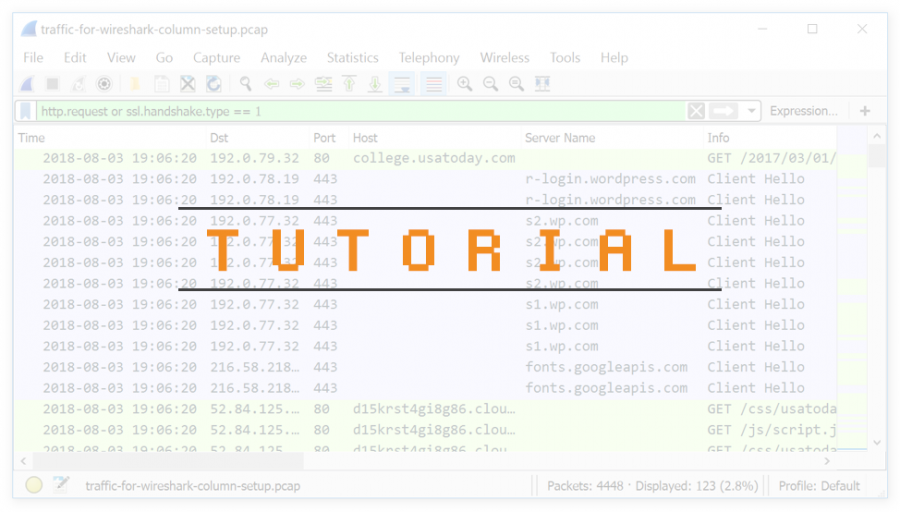

Fortunately, we can establish a test environment that provides a key file, and we can use that key to decrypt a packet capture (pcap) of the RDP traffic in Wireshark.

This blog demonstrates how to prepare the environment, obtain a decryption key and use it to decrypt RDP traffic.

Requirements
------------

The following are necessary to get the most value from this tutorial:

*   A virtual environment to run two Windows hosts like VirtualBox or VMware.
*   An understanding of how to set up and use RDP.
*   An RDP client. We use a host running Windows 10 Professional for this tutorial.
*   An RDP server. This can be another Windows host with RDP enabled, or it can be a non-Windows host running FreeRDP.
*   A way to record the network traffic between these two hosts. This is most easily done within a virtual environment.
*   Wireshark version 3.0 or better.
*   A basic knowledge of network traffic fundamentals.

Overall Process
---------------

The overall process follows seven general steps:

Step 1: Set up a virtual environment with two hosts, one acting as an RDP client and one acting as an RDP server.

Step 2: Remove forward secrecy ciphers from the RDP client.

Step 3: Obtain the RDP server's private encryption key.

Step 4: Capture RDP traffic between the RDP server and Windows client.

Step 5: Open the pcap in Wireshark.

Step 6: Load the key in Wireshark.

Step 7: Examine RDP data.

#### Step 1: Set Up Virtual Environment

The two most common virtual environments for this type of analysis are [VirtualBox](https://www.virtualbox.org/) or VMware Workstation for Windows and Linux. VMWare Fusion is used for macOS. VirtualBox is free, while VMware is a commercial product.

This tutorial does not cover setting up virtual machines (VMs) in a virtual environment. The basic structure of our lab used for this tutorial is shown below in Figure 1.

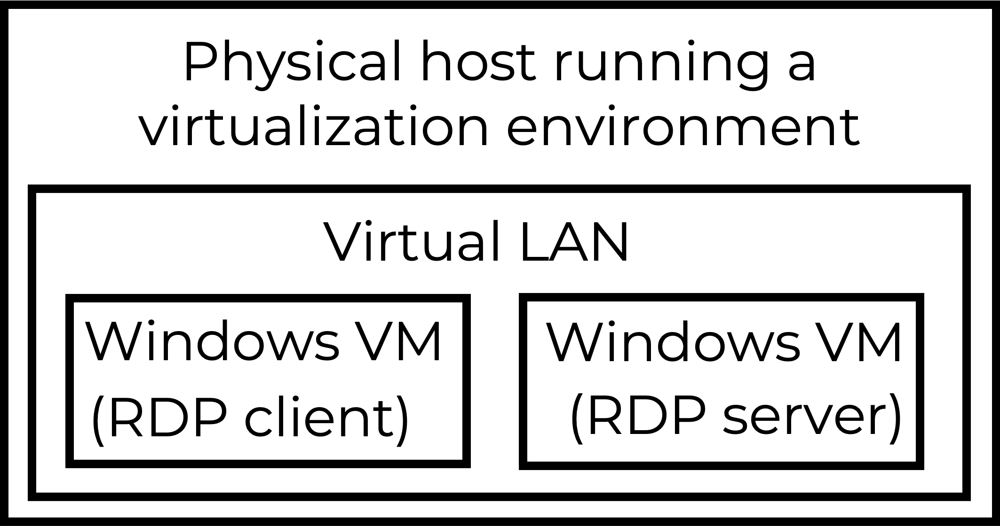

Figure 1. Lab setup used for this tutorial.

Our lab environment contained two Windows 10 hosts. One of the hosts acted as an RDP client, and the other acted as an RDP server. We recorded network traffic from an RDP session between these two hosts from the virtual LAN.

#### Step 2: Remove Forward Secrecy Ciphers From RDP Client

Some encryption ciphers provide [forward secrecy](https://www.keycdn.com/blog/perfect-forward-secrecy), which is also known as perfect forward secrecy. These types of ciphers create multiple session keys for an SSL/TLS connection. With forward secrecy, we cannot decrypt SSL/TLS traffic using a single private encryption key from the RDP server. Therefore, we had to remove configuration options that support forward secrecy on the RDP client.

For this tutorial, our RDP client was a host running Windows 10 Pro. This host has a built-in RDP client.

Microsoft has published details on removing configuration options that support forward secrecy in the articles, “[Manage Transport Layer Security (TLS)](https://docs.microsoft.com/en-us/windows-server/security/tls/manage-tls)” and “[Prioritizing Schannel Cipher Suites](https://docs.microsoft.com/en-us/windows/win32/secauthn/prioritizing-schannel-cipher-suites).” Below is a step-by-step process that we used.

Open the Group Policy Management Console **_gpedit.msc_** as an administrator as shown below in Figure 2.

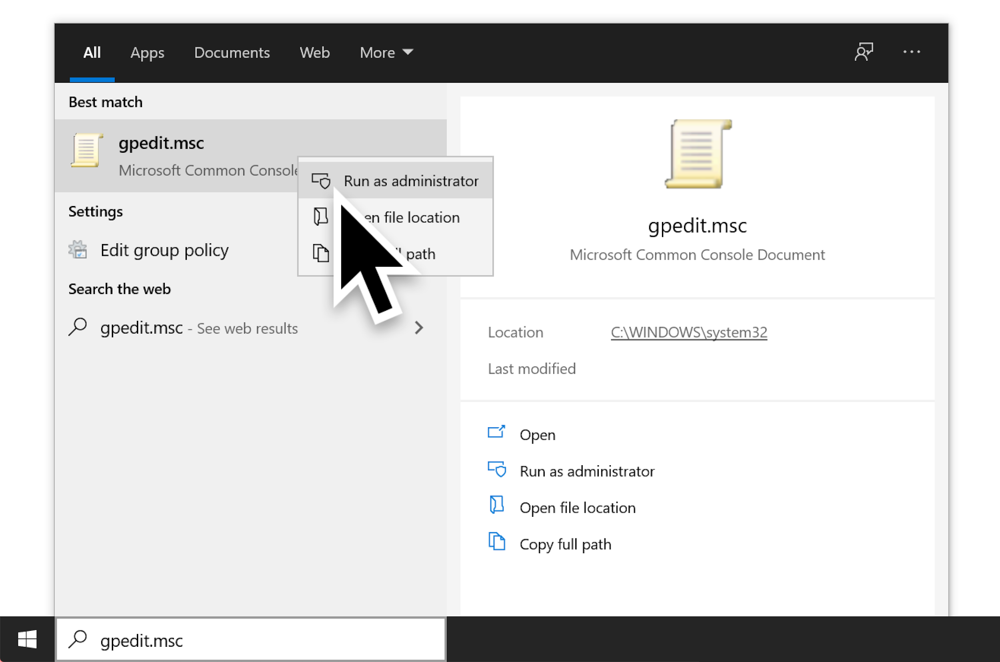

Figure 2. Running the Group Policy Editor in Windows 10 Pro as an administrator.

From the console, use the following menu path:

*   Computer Configuration.
*   Administrative Templates.
*   Network.
*   SSL Configuration Settings.

Below, Figure 3 shows how to find SSL Configuration Settings.

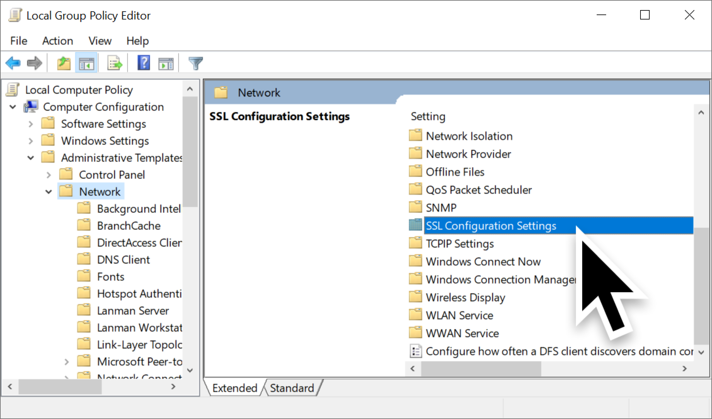

Figure 3. Getting to the SSL Configuration Settings.

Under SSL Configuration Settings, double-click the entry for **_SSL Cipher Suite Order_** as shown below in Figure 4.

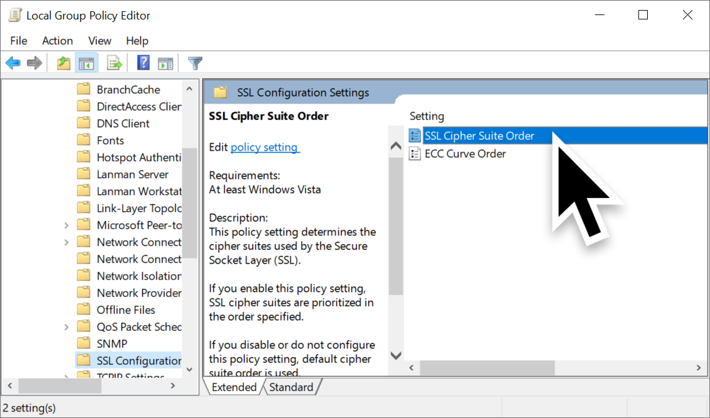

Figure 4. Getting to the SSL Cipher Suite Order.

Under the SSL Cipher Suite Order, click the **_Enabled_** option as shown below in Figure 5.

Figure 5. Enabling the SSL Cipher Suite Order.

Next, double-click the list of ciphers and select the entire list as shown below in Figure 6.

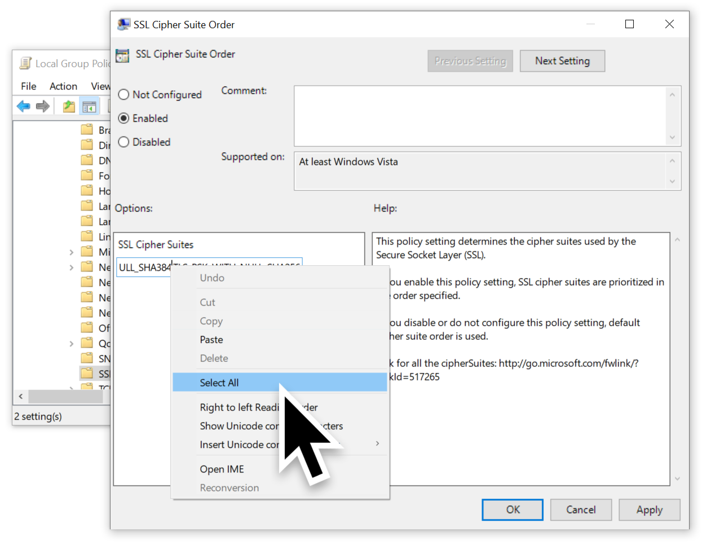

Figure 6. Selecting the list of ciphers.

Once the list has been selected, copy it as shown below in Figure 7.

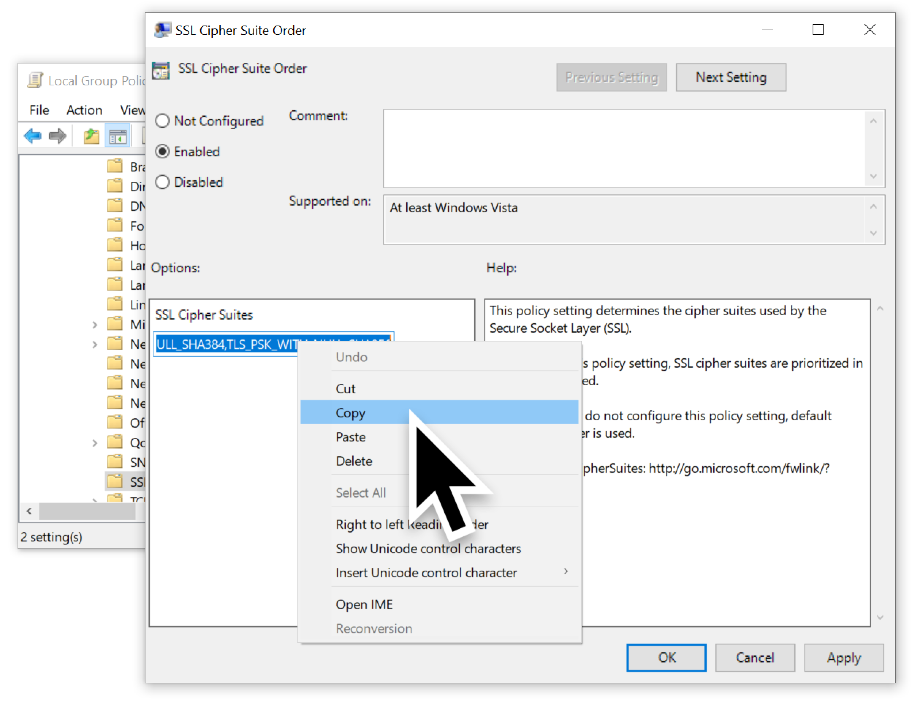

Figure 7. Copying the list of ciphers.

Copy this list of ciphers into a text editor such as Notepad. Remove any ciphers that support Elliptic Curve cryptography using Diffie-Hellman Ephemeral (ECDHE) or Digital Signature Algorithm (ECDSA) encryption. These should be any entries with ECDHE and/or ECDSA in the name. In the example shown below in Figure 8, these ciphers were all located sequentially, so they were easy to delete from the text.

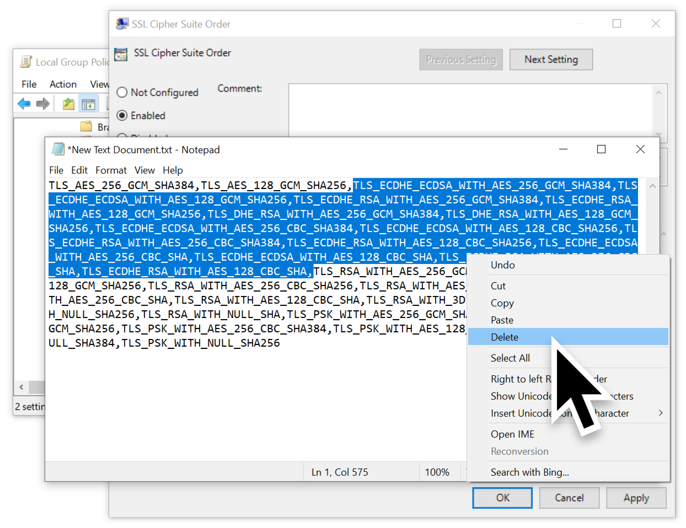

Figure 8. Deleting entries for ECDHE and ECDSA.

Our updated list of ciphers from Figure 8 is listed below in Table 1.

<table><tbody><tr><td>TLS_AES_256_GCM_SHA384,TLS_AES_128_GCM_SHA256,TLS_RSA_WITH_AES_256_GCM_SHA384,TLS_RSA_WITH_AES_128_GCM_SHA256,TLS_RSA_WITH_AES_256_CBC_SHA256,TLS_RSA_WITH_AES_128_CBC_SHA256,TLS_RSA_WITH_AES_256_CBC_SHA,TLS_RSA_WITH_AES_128_CBC_SHA,TLS_RSA_WITH_3DES_EDE_CBC_SHA,TLS_RSA_WITH_NULL_SHA256,TLS_RSA_WITH_NULL_SHA,TLS_PSK_WITH_AES_256_GCM_SHA384,TLS_PSK_WITH_AES_128_GCM_SHA256,TLS_PSK_WITH_AES_256_CBC_SHA384,TLS_PSK_WITH_AES_128_CBC_SHA256,TLS_PSK_WITH_NULL_SHA384,TLS_PSK_WITH_NULL_SHA256</td></tr></tbody></table>

_Table 1. Updated list after removing forward secrecy ciphers._

Paste the updated cipher list back into the SSL Cipher Suites Field, making sure to overwrite the original list. Click the Apply button, then click OK to close the window. You have now updated the list and can close the Group Policy Editor.

After we accomplished this step, we had to obtain the RDP server’s private key.

#### Step 3: Obtain RDP Server's Private Key

FreeRDP is one option to use as an RDP server. You can get FreeRDP from [this GitHub repository](https://github.com/FreeRDP), as well as [build instructions](https://github.com/FreeRDP/FreeRDP/wiki/Compilation). Make sure to set the **_WITH\_SERVER=ON_** flag when creating the server. Once the server is built, you must provide it with a private key, or use one that comes with FreeRDP.

For our RDP server in this tutorial, we used another host running Windows 10 Pro. Then we extracted the private key from the host’s operating system.

To ensure our second Windows host acted as an RDP server, we enabled RDP. To enable RDP on a host running Windows 10 Pro, go to Windows Settings from the Start Menu, then select the **_System_** icon as shown below in Figure 9.

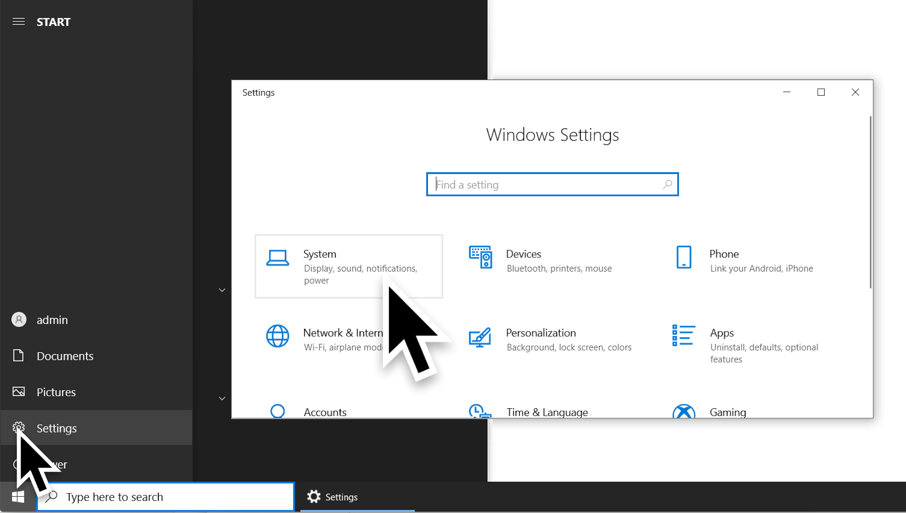

Figure 9. Getting to the Windows System settings.

Under the system settings, select **_Remote Desktop_** and click the switch for **_Enable Remote Desktop_** as shown below in Figure 10.

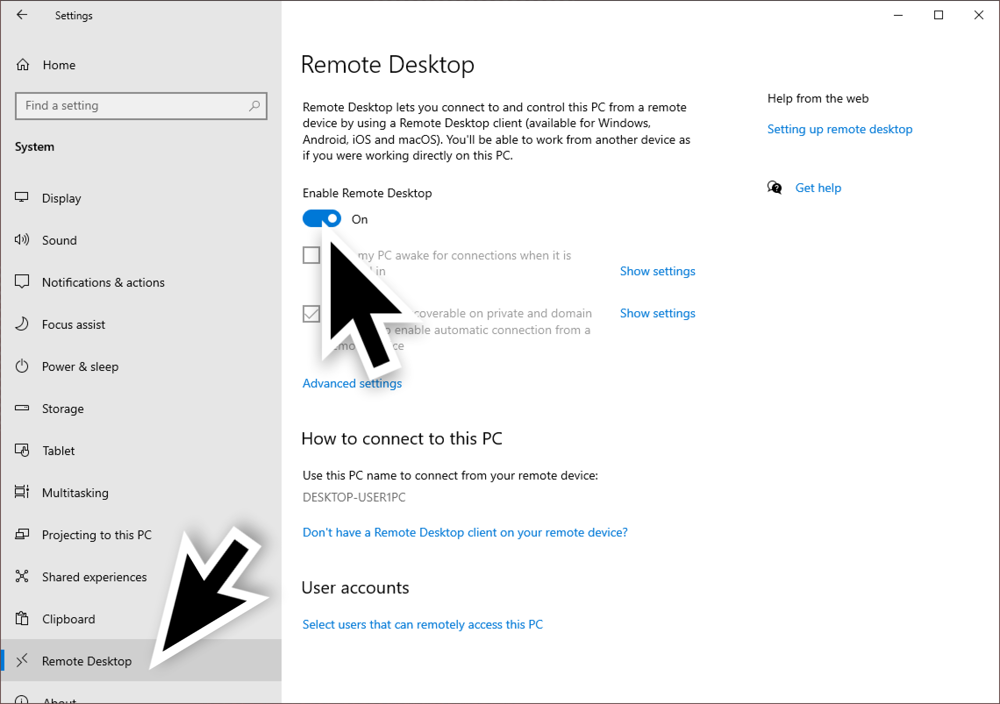

Figure 10. Enabling RDP in WIndows 10.

After setting up our second Windows host as an RDP server, we extracted the private key from its operating system.

To extract the server key, we could either use either Jailbreak or [Mimikatz](https://www.varonis.com/blog/what-is-mimikatz/). We chose Jailbreak.

[Jailbreak](https://github.com/iSECPartners/jailbreak) is a tool by iSECPartners that can export the server's RDP certificate. From the exported certificate, we could extract the private key.

To use Jailbreak, we downloaded the following Jailbreak binaires from [this GitHub repository](https://github.com/iSECPartners/jailbreak/tree/master/binaries) on our newly established RDP server:

*   EasyHook64.dll
*   jailbreak64.exe
*   jailbreakhook64.dll
*   jbstore2\_64.exe

Note: The above files were used on a Windows 10 Pro 64-bit host downloaded on March 4, 2021. A screenshot of the GitHub page is shown below in Figure 11.

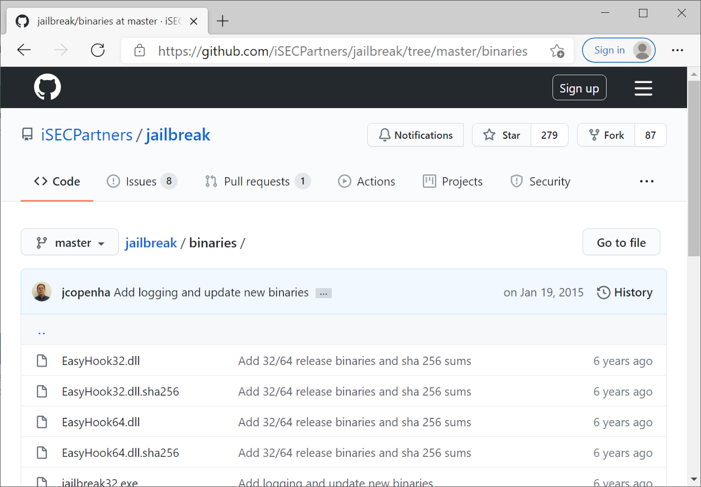

Figure 11. GitHub page for Jailbreak binaries.

After we downloaded the Jailbreak binaries, we opened a Command prompt with administrator privileges as shown below in Figure 12.

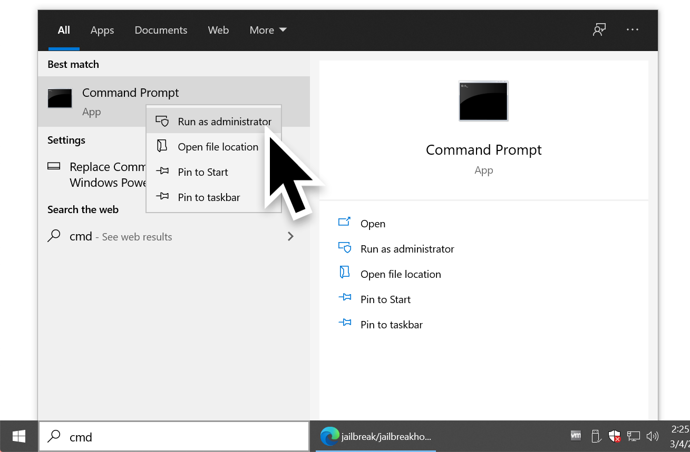

Figure 12. Opening a command prompt as an administrator.

In the command prompt, we went to the directory with the downloaded Jailbreak binaries. We ran the following command from this directory:

*   jailbreak64.exe %WINDIR%\\system32\\mmc.exe %WINDIR%\\system32\\certlm.msc -64

If we were running a 32-bit version of Windows, we would use:

*   jailbreak32.exe %WINDIR%\\system32\\mmc.exe %WINDIR%\\system32\\certlm.msc -32

See Figure 13 below for an example of running the 64-bit command on our Windows host acting as the RDP server.

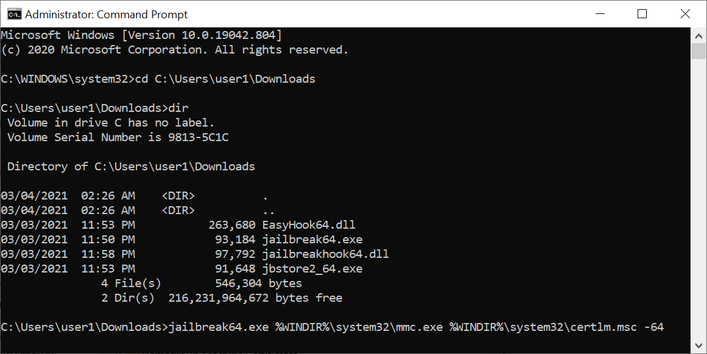

Figure 13. Running Jailbreak from the command prompt.

This command opened the certificate manager for our local machine. From the left column, we expanded **_Remote Desktop_** and went to the **_Certificates_** folder. This showed one certificate. If there had been more than one certificate, we would have selected the one with the most recent expiration date. We right-clicked on the certificate, selected **_All Tasks_** then used **_Export_** as shown below in Figure 14.

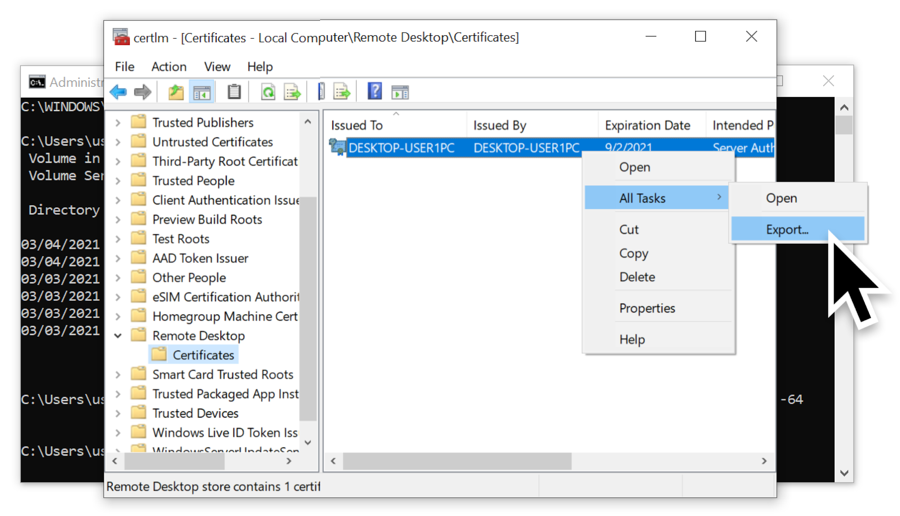

Figure 14. Exporting the RDP certificate.

When exporting the certificate, we made sure to select the option to export the private key as shown below in Figure 15.

Figure 15. Ensuring the private key is exported with the certificate.

For our host, we could only export the certificate as a PKCS #12 (.PFX) file as shown below in Figure 16.

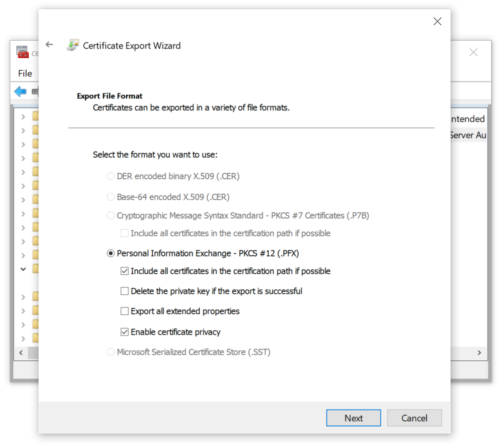

Figure 16. Could only export the certificate as a .pfx file.

As shown below in Figure 17, the certificate had to have a password. Fortunately, we had no complexity requirements, so we used a single letter as the password.

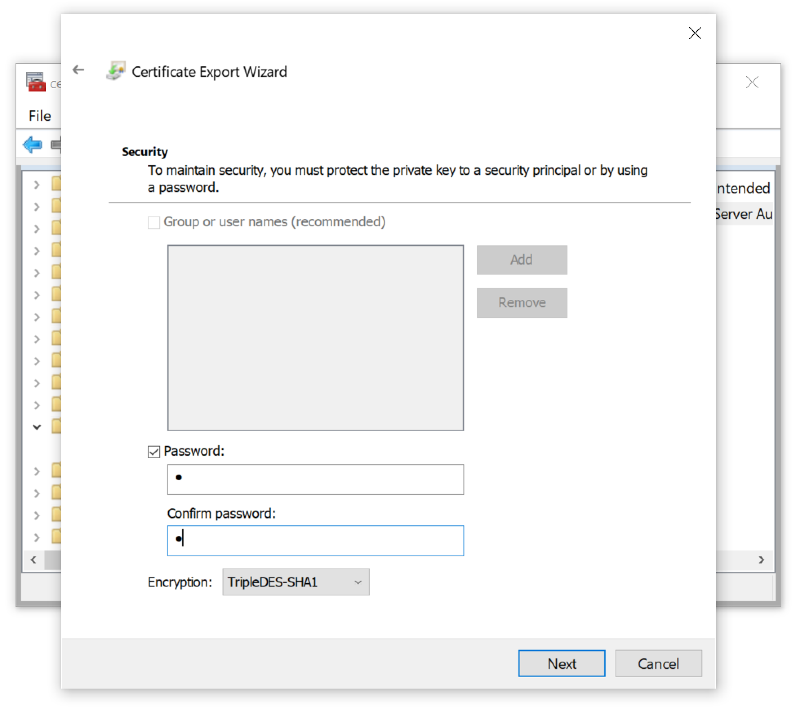

Figure 17. The export process required a password for the certificate.

Finally, we exported our certificate with the private key as shown below in Figure 18.

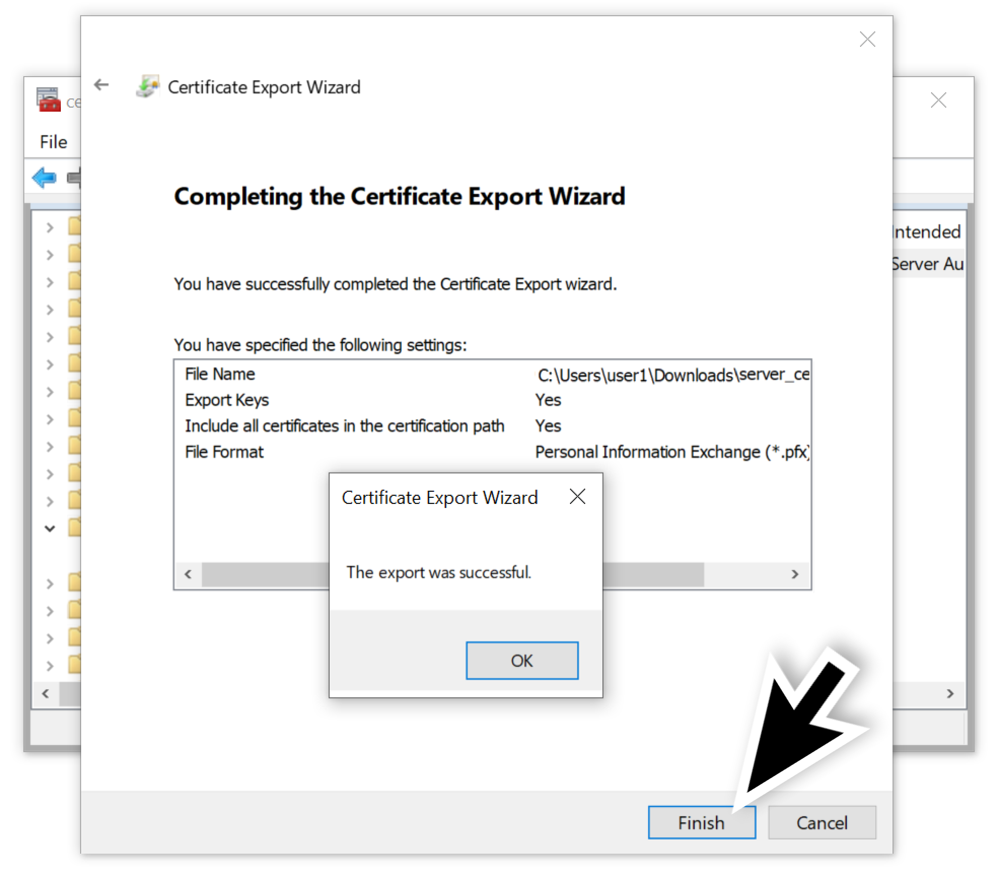

Figure 18. Completing our certificate export.

As an alternative, we could have extracted the server’s certificate using Mimikatz instead of Jailbreak. The instructions for using Mimikatz to get the RDP server certificate are listed on [GitHub](https://github.com/FreeRDP/FreeRDP/wiki/Mimikatz).

Since our certificate was obtained using Jailbreak, we moved it to a Linux host and used OpenSSL to extract the key. First, we used the following OpenSSL command to extract the key in PEM format:

*   openssl pkcs12 -in server\_certificate.pfx -nocerts -out server\_key.pem -nodes

To remove the passphrase form the key, we also used the following command:

*   openssl rsa -in server\_key.pem -out server.key

This provided us with the RDP server’s private key as shown below in Figure 19.

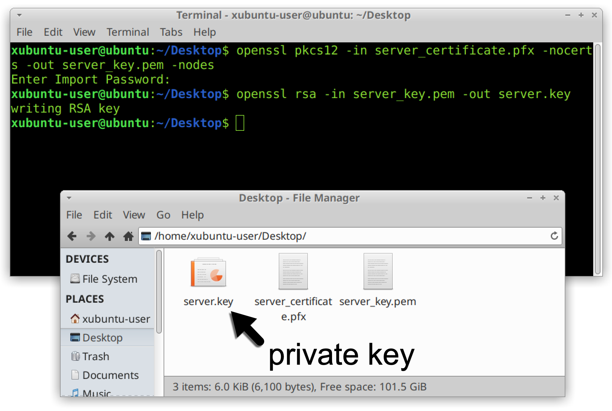

Figure 19. Private server key extracted from the certificate.

Before we could use the private server key, we needed to record an RDP session between our two Windows hosts and save it as a pcap.

#### Step 4: Capture RDP Traffic

With our two Windows hosts in the same virtual environment, we could use a tool like [dumpcap](https://www.wireshark.org/docs/man-pages/dumpcap.html), [tcpdump](https://www.tcpdump.org/) or Wireshark itself to record network traffic in the VLAN using promiscuous mode. Once the recording started, our WIndows client used RDP to log in to the other Windows host acting as an RDP server. The host name of the server was **_DESKTOP-USER1PC_**.

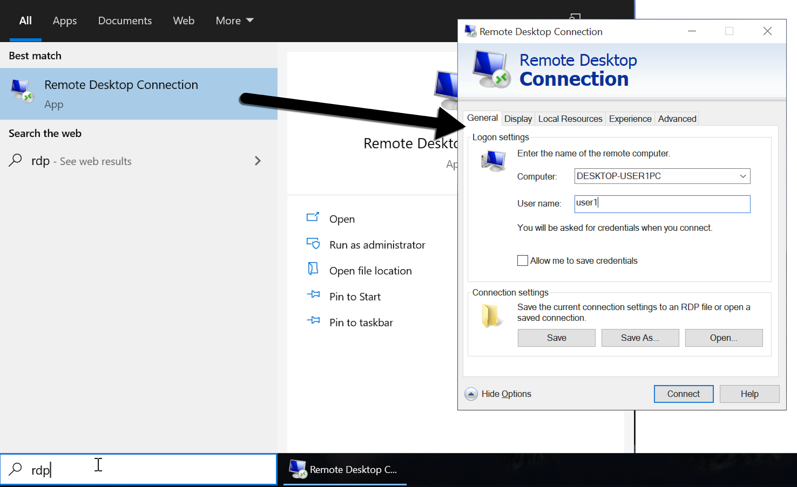

Figure 20. Using the Remote Desktop Connection tool to log into our RDP server.

While the pcap was being recorded, we logged into **_DESKTOP-USER1PC_** and performed some basic tasks like opening documents and web browsing.

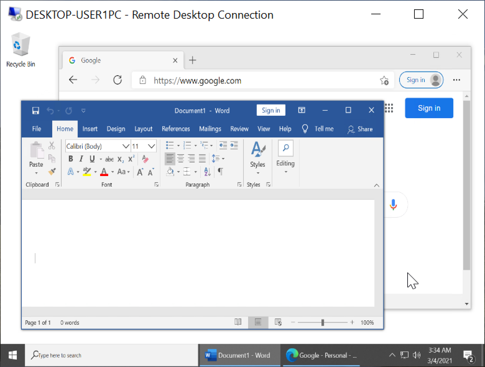

Figure 21. Performing some common desktop tasks through RDP.

After a minute or so, we logged off RDP and stopped recording network traffic from our VLAN.

#### Step 5: Open the pcap in Wireshark

We opened the pcap of our RDP session in Wireshark. When filtering on **_rdp_** in our Wireshark display filter, we saw no results because the RDP traffic was encrypted. Figure 22 shows the blank column display we saw when filtering for RDP in our pcap.

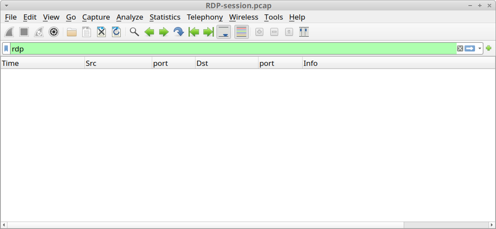

Figure 22. Filtering for RDP information, but no results, due to encrypted RDP traffic.

However, when we used our private server key to decrypt RDP traffic in Wireshark, the results looked much different.

#### Step 6: Load the Key in Wireshark

In the pcaps we recorded, the RDP server **_DESKTOP-USER1PC_** was at IP address **_10.3.4.138_**, and RDP traffic took place over TCP port 3389. We needed this information to properly decrypt RDP traffic in Wireshark.

In Wireshark, we used the Preferences window and expanded the **_Protocols_** section as shown below in Figure 23.

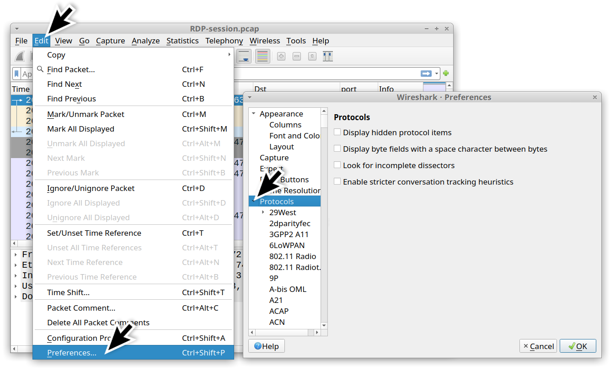

Figure 23. Getting to the Protocols section of Wireshark’s preferences menu.

With Wireshark 3.x, use the **_TLS_** entry. If you are using Wireshark 2.x, use the **_SSL_** entry. For this section, there should be a button to edit the **_RSA keys list_**. We clicked the button and added the IP address of the RDP server, the RDP port (3389) and the location of the private key file. Our example is shown below in Figure 24.

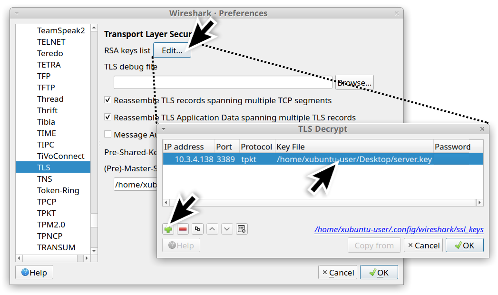

Figure 24. Go to the TLS section and add the private key to the RSA keys list.

After Wireshark was set up to decrypt RDP traffic, we had much better results when reviewing the pcap.

#### Step 7: Examine RDP Data

After our key was loaded, our column display was no longer blank when filtering for RDP. We had several results as shown below in Figure 25.

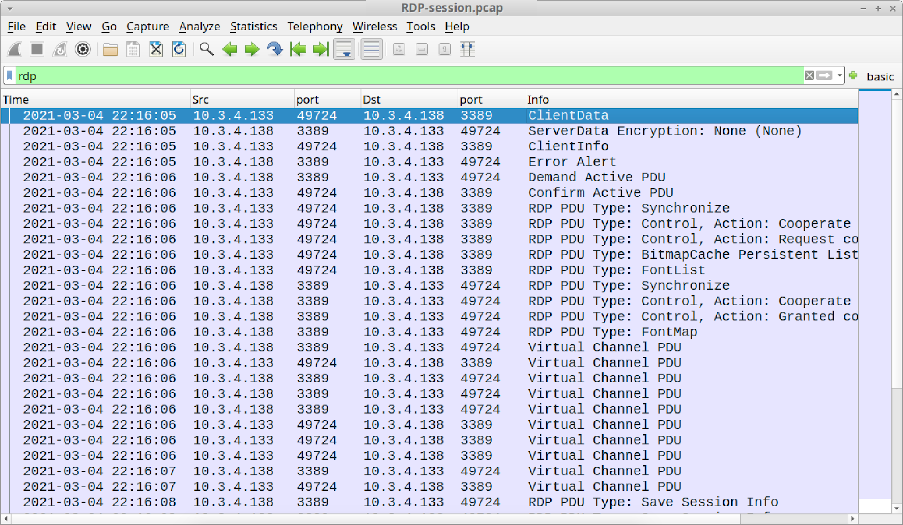

Figure 25. Viewing the same RDP activity after the private key was loaded in Wireshark.

For security professionals who write signatures to find RDP vulnerabilities and attacks, the type of information revealed above in Figure 25 is critical to their work.

Conclusion
----------

This blog reviewed how to establish an environment to decrypt traffic from an RDP session. This is easiest to do in a virtual LAN with two hosts running Windows 10 Professional. After ensuring the client did not use any forward secrecy ciphers, we extracted the private key from our Windows host acting as the RDP server. Then we easily recorded a pcap of network traffic. After the session finished, we were able to decrypt RDP traffic using the server’s private key.

This type of environment can help security professionals when writing signatures to detect RDP vulnerabilities and attacks.

For more help with Wireshark, see our previous tutorials:

*   [Wireshark Tutorial: Examining Emotet Infection Traffic](https://unit42.paloaltonetworks.com/wireshark-tutorial-emotet-infection/)
*   [Changing Your Column Display](https://unit42.paloaltonetworks.com/unit42-customizing-wireshark-changing-column-display/)
*   [Display Filter Expressions](https://unit42.paloaltonetworks.com/using-wireshark-display-filter-expressions/)
*   [Identifying Hosts and Users](https://unit42.paloaltonetworks.com/using-wireshark-identifying-hosts-and-users/)
*   [Exporting Objects from a Pcap](https://unit42.paloaltonetworks.com/using-wireshark-exporting-objects-from-a-pcap/)
*   [Examining Trickbot Infections](https://unit42.paloaltonetworks.com/wireshark-tutorial-examining-trickbot-infections/)
*   [Examining Ursnif Infections](https://unit42.paloaltonetworks.com/wireshark-tutorial-examining-ursnif-infections/)
*   [Examining Qakbot Infections](https://unit42.paloaltonetworks.com/tutorial-qakbot-infection/)
*   [Decrypting HTTPS Traffic](https://unit42.paloaltonetworks.com/wireshark-tutorial-decrypting-https-traffic/)
*   [Examining Dridex Infection Traffic](https://unit42.paloaltonetworks.com/wireshark-tutorial-dridex-infection-traffic/)

Most Read Articles
------------------

[Wireshark Tutorial: Exporting Objects From a Pcap](https://unit42.paloaltonetworks.com/using-wireshark-exporting-objects-from-a-pcap/)

218,107

people reacted

### [Wireshark Tutorial: Exporting Objects From a Pcap](https://unit42.paloaltonetworks.com/using-wireshark-exporting-objects-from-a-pcap/)

*   By [Brad Duncan](https://unit42.paloaltonetworks.com/author/bduncan/ "Posts byBrad Duncan")
*   March 1, 2024 at 6:00 AM

129

12 min. read

[The Art of Domain Deception: Bifrost's New Tactic to Deceive Users](https://unit42.paloaltonetworks.com/new-linux-variant-bifrost-malware/)

5,803

people reacted

### [The Art of Domain Deception: Bifrost's New Tactic to Deceive Users](https://unit42.paloaltonetworks.com/new-linux-variant-bifrost-malware/)

*   By [Anmol Maurya](https://unit42.paloaltonetworks.com/author/anmol-maurya/ "Posts byAnmol Maurya") and [Siddharth Sharma](https://unit42.paloaltonetworks.com/author/siddharth-sharma/ "Posts bySiddharth Sharma")
*   February 29, 2024 at 3:00 AM

15

6 min. read

[Threat Group Assessment: Muddled Libra (Updated)](https://unit42.paloaltonetworks.com/muddled-libra/)

34,286

people reacted

### [Threat Group Assessment: Muddled Libra (Updated)](https://unit42.paloaltonetworks.com/muddled-libra/)

*   By [Kristopher Russo](https://unit42.paloaltonetworks.com/author/kristopher-russo/ "Posts byKristopher Russo"), [Austin Dever](https://unit42.paloaltonetworks.com/author/austin-dever/ "Posts byAustin Dever") and [Amer Elsad](https://unit42.paloaltonetworks.com/author/amer-elsad/ "Posts byAmer Elsad")
*   March 8, 2024 at 2:58 PM

37

13 min. read

#### Get updates from  

Palo Alto  
Networks!

Sign up to receive the latest news, cyber threat intelligence and research from us

By submitting this form, you agree to our [Terms of Use](https://www.paloaltonetworks.com/legal-notices/terms-of-use) and acknowledge our [Privacy Statement](https://www.paloaltonetworks.com/legal-notices/privacy).

RDP

Windows

Wireshark

Wireshark Tutorial