[Wireshark Tutorial: Exporting Objects From a Pcap](https://unit42.paloaltonetworks.com/using-wireshark-exporting-objects-from-a-pcap/)
=======================================================================================================================================

2024-03-01共 51496 字阅读需 205 分钟

> This Wireshark tutorial guides the reader in exporting different packet capture objects. It builds on a foundation of malware traffic analysis skills.


This post is also available in: [日本語(Japanese)](https://unit42.paloaltonetworks.jp/using-wireshark-exporting-objects-from-a-pcap/)

**Executive Summary**
---------------------

When reviewing a packet capture (pcap) of suspicious activity, security professionals may need to export objects from the pcap for a closer examination. This tutorial offers tips on how to export malware and other types of objects from a pcap.

This is the fourth article in [a series of tutorials](https://unit42.paloaltonetworks.com/tag/wireshark-tutorial/) to help analysts better utilize Wireshark. This article was first published in July 2019 and has been updated for 2024.

Palo Alto Networks customers are better protected from the malware samples in this tutorial through [Cortex XDR](https://www.paloaltonetworks.com/cortex/cortex-xdr) and [XSIAM](https://www.paloaltonetworks.com/cortex/cortex-xsiam). Customers are also protected through our [Next-Generation Firewall](https://www.paloaltonetworks.com/network-security/next-generation-firewall) with [Cloud-Delivered Security Services](https://www.paloaltonetworks.com/network-security/security-subscriptions), including [Advanced WildFire](https://www.paloaltonetworks.com/network-security/advanced-wildfire), [DNS Security](https://www.paloaltonetworks.com/network-security/dns-security), [Advanced Threat Prevention](https://docs.paloaltonetworks.com/advanced-threat-prevention) and [Advanced URL Filtering](https://www.paloaltonetworks.com/network-security/advanced-url-filtering).

If you think you might have been compromised or have an urgent matter, contact the [Unit 42 Incident Response team](https://start.paloaltonetworks.com/contact-unit42.html).

| **Related Unit 42 Topics** | [**pcap**](https://unit42.paloaltonetworks.com/tag/pcap/)**,** [**Wireshark**](https://unit42.paloaltonetworks.com/tag/wireshark/)**,** [**Wireshark Tutorial**](https://unit42.paloaltonetworks.com/tag/wireshark-tutorial/) |
| -------------------------- | ------------------------------------------------------------ |

**Table of Contents**
---------------------

**Requirements and Supporting Material**
----------------------------------------

In order to use Wireshark, readers must have a basic knowledge of network traffic to comprehend information revealed in a pcap file. Before reviewing this article, readers should also understand the material covered from our previous tutorials on [customizing Wireshark’s column display](https://unit42.paloaltonetworks.com/unit42-customizing-wireshark-changing-column-display/), [using display filter expressions](https://unit42.paloaltonetworks.com/using-wireshark-display-filter-expressions/) and [identifying hosts and users](https://unit42.paloaltonetworks.com/using-wireshark-identifying-hosts-and-users/).

Requirements also include a relatively up-to-date version of Wireshark, at least version 3.6.2 or later. This article features Wireshark version 4.2.2 with a customized column used in our previous tutorials. We strongly recommend using the most recent version of Wireshark available for your operating system (OS).

Some of the pcaps in this tutorial contain malware or malicious code targeting Microsoft Windows. Because of this, we recommend using Wireshark in a non-Windows environment to review the pcaps for this tutorial. Operating systems like BSD, Linux or macOS provide an ideal environment for Wireshark when reviewing malicious traffic targeting Windows.

The pcaps used in this tutorial are contained in a password-protected ZIP archive located at our [GitHub repository](https://github.com/PaloAltoNetworks/Unit42-Wireshark-tutorials/blob/main/Wireshark-tutorial-extracting-objects-5-pcaps.zip). Download the file named Wireshark-tutorial-extracting-objects-5-pcaps.zip. Use _infected_ as the password and extract the five pcaps, as shown below in Figure 1.


Figure 1. Acquiring the pcaps for this tutorial.

The five extracted pcaps are:

*   Wireshark-tutorial-extracting-objects-from-a-pcap-1-of-5.pcap
*   Wireshark-tutorial-extracting-objects-from-a-pcap-2-of-5.pcap
*   Wireshark-tutorial-extracting-objects-from-a-pcap-3-of-5.pcap
*   Wireshark-tutorial-extracting-objects-from-a-pcap-4-of-5.pcap
*   Wireshark-tutorial-extracting-objects-from-a-pcap-5-of-5.pcap

As a network packet analyzer, Wireshark combines data from multiple IP packets and the associated TCP frames to reveal the content of a pcap. We can extract some of these objects revealed by Wireshark. Our next section discusses how to export files from HTTP traffic.

**Exporting Files From HTTP Traffic**
-------------------------------------

Some Windows-based infections involve malware binaries or malicious code sent over unencrypted HTTP traffic. We can extract these objects from the pcap. An example of this is found in our first pcap named Wireshark-tutorial-extracting-objects-from-a-pcap-1-of-5.pcap. Open this pcap in Wireshark and filter on http.request as shown below in Figure 2.


Figure 2. Filtering on http.request for our first pcap in Wireshark.

After filtering on http.request, find the two GET requests to smart-fax\[.\]com. The first request ends with .doc, indicating the first request may have returned a Microsoft Word document. The second request ends with .exe, indicating the second request may have returned a Windows executable file. The HTTP GET requests are listed below.

*   smart-fax\[.\]com - GET /Documents/Invoice&MSO-Request.doc
*   smart-fax\[.\]com - GET /knr.exe

We can export these objects from the HTTP object list by using the menu path:

*   File → Export Objects → HTTP...

Figure 3 shows this menu path in Wireshark.

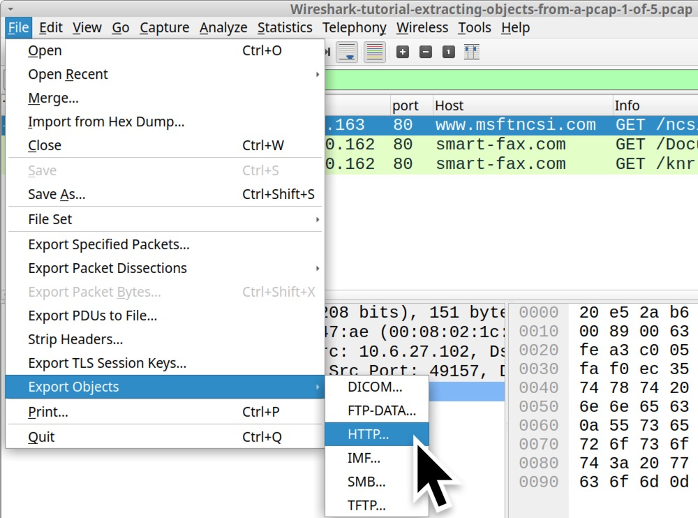

Figure 3. Menu path to export HTTP objects in Wireshark.

This menu path results in a window titled “Wireshark Export HTTP object list” as shown in Figures 4 and 5. Select the first line with Invoice&MSO-Request.doc as the filename and save it as shown in Figure 4. Select the second line with knr.exe as the filename and save it as shown in Figure 5.

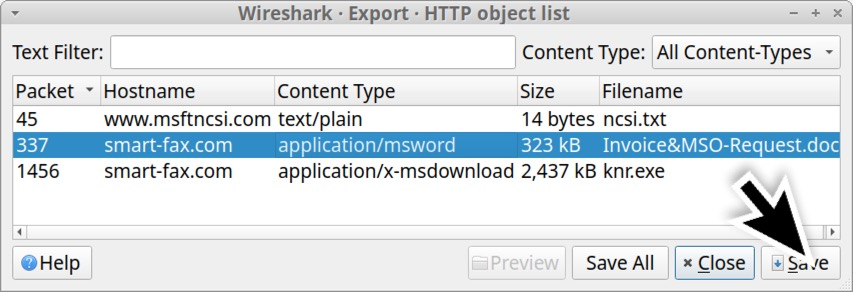

Figure 4. Saving the suspected Word document from the HTTP object list.

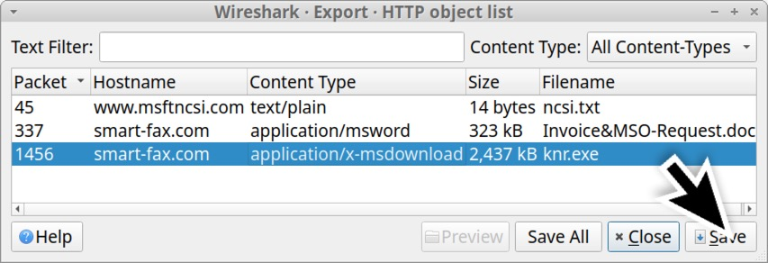

Figure 5. Saving the suspected Windows executable file from the HTTP object list.

Of note, the Content Type column from the HTTP object list shows what the server identified the file as in its HTTP response headers. In some cases, a server hosting malware will intentionally label Windows executables as a different type of file in an effort to avoid detection. Fortunately, the first pcap in this tutorial is a very straight-forward example.

After extracting these files from the pcap, we should confirm the file types. In a MacBook or Linux environment, we can use a terminal window or command line interface (CLI) for the following commands:

*   file _\[filename\]_
*   shasum -a 256 _\[filename\]_

The file command identifies the type of file. The shasum command returns the file hash, in this case a SHA256 file hash. Figure 6 shows using these commands in a CLI on an Xubuntu-based Linux host.

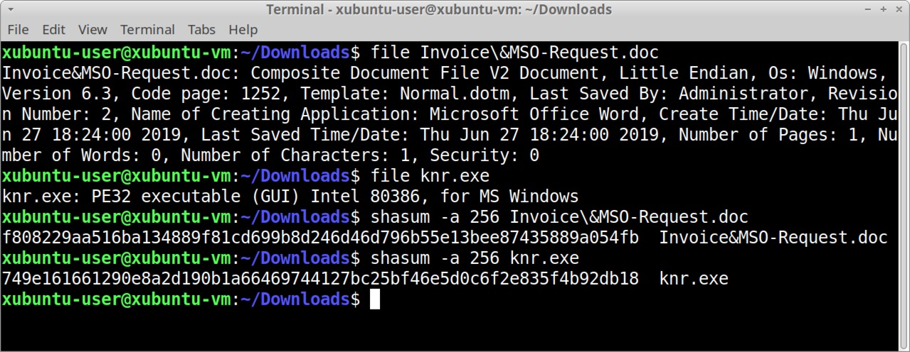

Figure 6. Determining the file type and hash of our two objects exported from the pcap.

The commands and their results from Figure 6 are listed below.

```
Command:$file Invoice&MSO-Request.doc

Result:Invoice&MSO-Request.doc:Composite Document File V2 Document,Little Endian,Os:Windows,Version6.3,Code page:1252,Template:Normal.dotm,Last Saved By:Administrator,Revision Number:2,Name of Creating Application:Microsoft Office Word,Create Time/Date:Thu Jun2718:24:002019,Last Saved Time/Date:Thu Jun2718:24:002019,Number of Pages:1,Number of Words:0,Number of Characters:1,Security:0

Command:$file knr.exe

Result:knr.exe:PE32 executable(GUI)Intel80386,forMS Windows

Command:$shasum-a256Invoice&MSO-Request.doc

Result:f808229aa516ba134889f81cd699b8d246d46d796b55e13bee87435889a054fb Invoice&MSO-Request.doc

Command:$shasum-a256knr.exe 

Result:749e161661290e8a2d190b1a66469744127bc25bf46e5d0c6f2e835f4b92db18knr.exe
```

The information above confirms our suspected Word document is in fact a Microsoft Word document. It also confirms the suspected Windows executable file is indeed a Windows executable. We can check the SHA256 hashes against VirusTotal to see if these files are detected as malware. We can also do an internet search on the SHA256 hashes to possibly find additional information.

In addition to these Windows executables or other malware files, we can also extract webpages from unencrypted HTTP traffic.

Use Wireshark to open our second pcap for this tutorial, Wireshark-tutorial-extracting-objects-from-a-pcap-2-of-5.pcap. This pcap contains traffic of someone entering login credentials on a fake PayPal login page.

When reviewing network traffic from a phishing site, we might want to know what the phishing webpage actually looks like. We can extract the HTML pages, images and other web content using the Export HTTP object menu as shown in Figure 7. In this case, we can extract and view just the initial HTML page. After extracting that initial HTML page, viewing it in a web browser should reveal the page shown below in Figure 8.


Figure 7. Exporting the fake PayPal login page from our second pcap.

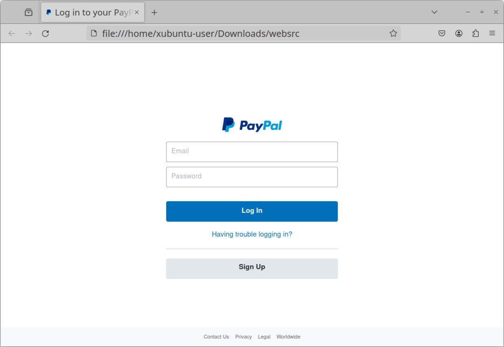

Figure 8. The exported fake PayPal login page viewed in a web browser.

Use this method with caution. If you extract malicious HTML code from a pcap and view it in a web browser, the HTML might call out to malicious domains, which is why we recommend doing this in an isolated test environment.

**Exporting Files from SMB Traffic**
------------------------------------

Some malware uses Microsoft's Server Message Block (SMB) protocol to spread across an Active Directory (AD)-based network. A banking Trojan known as Trickbot added a worm module [as early as July 2017](https://securityintelligence.com/news/trickbot-learns-from-wannacry-and-petya-by-adding-self-spreading-worm-module/) that uses an exploit based on [EternalBlue](https://www.wired.co.uk/article/what-is-eternal-blue-exploit-vulnerability-patch) to spread across a network over SMB. Trickbot is no longer an active malware family, but this section contains a June 2019 Trickbot infection that is ideal for this tutorial.

Use Wireshark to open our third pcap for this tutorial, Wireshark-tutorial-extracting-objects-from-a-pcap-3-of-5.pcap. This pcap contains a Trickbot infection from June 2019 where malware is sent over SMB traffic from an infected client to the domain controller.

This pcap takes place in the following AD environment:

*   Domain: cliffstone\[.\]net
*   Network segment: 10.6.26\[.\]0 through 10.6.26\[.\]255 (10.6.26\[.\]0/24)
*   Domain controller IP: 10.6.26\[.\]6
*   Domain controller hostname: CLIFFSTONE-DC
*   Segment gateway: 10.6.26\[.\]1
*   Broadcast address: 10.6.26\[.\]255
*   Windows client: QUINN-OFFICE-PC at 10.6.26\[.\]110

In this pcap, a Trickbot infection uses SMB to spread from an infected client at 10.6.26\[.\]110 to its domain controller at 10.6.26\[.\]6. To see the associated malware, use the following menu path shown below in Figure 9:

*   File → Export Objects → SMB...

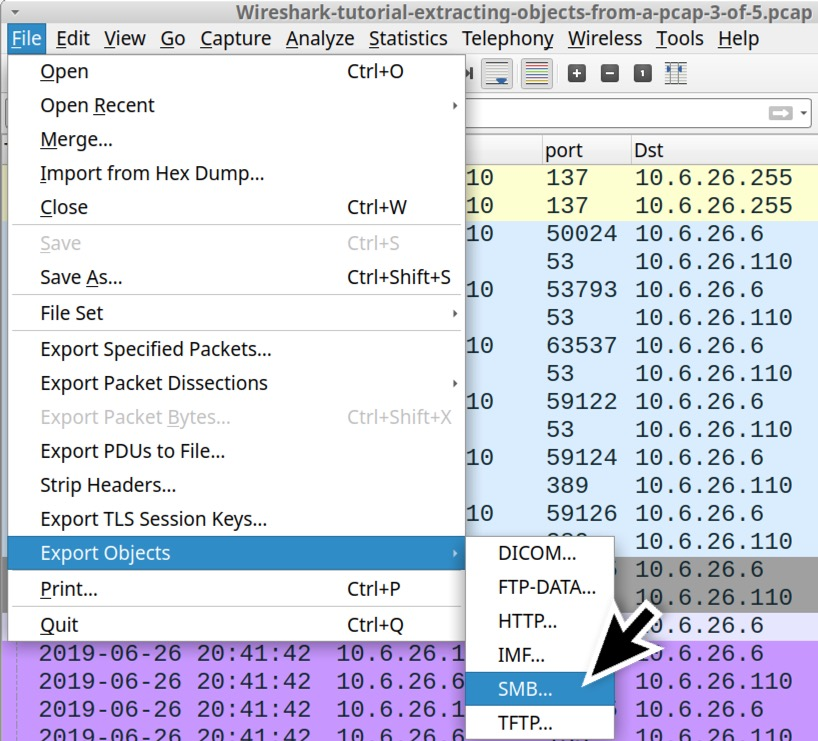

Figure 9. Menu path to export SMB objects from the pcap.

This brings up an Export SMB object list, listing the SMB objects we can export from the pcap as shown below in Figure 10.

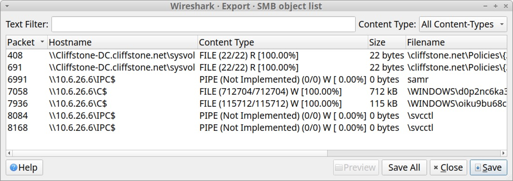

Figure 10. Wireshark's window for the export SMB object list.

Two entries near the middle of the list have \\\\10.6.26\[.\]6\\C$ as the hostname. A closer examination of their respective filename fields indicates these are two Windows executable files. See Table 1 below for details.

<table><tbody><tr><td><b>Packet Number&nbsp; &nbsp; &nbsp; &nbsp; &nbsp; &nbsp; &nbsp; &nbsp;&nbsp;</b></td><td><b>Hostname</b></td><td><b>Content Type</b></td><td><b>Size</b></td><td><b>Filename</b></td></tr><tr><td><span>7058</span></td><td><span>\\10.6.26[.]6\C$</span></td><td><span>FILE (712704/712704) W [100.0%]</span></td><td><span>712 kB</span></td><td><span>\WINDOWS\d0p2nc6ka3f_fixhohlycj4ovqfcy_smchzo_ub83urjpphrwahjwhv_o5c0fvf6.exe</span></td></tr><tr><td><span>7936</span></td><td><span>\\10.6.26[.]6\C$</span></td><td><span>FILE (115712/115712) W [100.0%]</span></td><td><span>115 kB</span></td><td><span>\WINDOWS\oiku9bu68cxqenfmcsos2aek6t07_guuisgxhllixv8dx2eemqddnhyh46l8n_di.exe</span></td></tr></tbody></table>

_Table 1. Data from the Export SMB objects list on our two Windows executable files._

In the Content Type column, we need \[100.00%\] to export a correct copy of these files. Any number less than 100 percent indicates there was some data loss in the network traffic, resulting in a corrupt or incomplete copy of the file. These Trickbot-related files from the pcap have SHA256 file hashes as shown in Table 2.

<table><tbody><tr><td><b>SHA256 hash&nbsp;&nbsp;&nbsp;&nbsp;&nbsp;&nbsp;&nbsp;&nbsp;&nbsp;&nbsp;&nbsp;&nbsp;</b></td><td><b>File size</b></td></tr><tr><td><span>59896ae5f3edcb999243c7bfdc0b17eb7fe28f3a66259d797386ea470c010040</span></td><td><span>712 kB</span></td></tr><tr><td><span>cf99990bee6c378cbf56239b3cc88276eec348d82740f84e9d5c343751f82560</span></td><td><span>115 kB</span></td></tr></tbody></table>

_Table 2. SHA256 file hashes for the Windows executable files from SMB traffic in our third pcap._

**Exporting Emails from SMTP Traffic**
--------------------------------------

Certain types of malware are designed to turn an infected Windows host into a spambot. These spambot hosts send hundreds of spam messages or malicious emails every minute. If any of these messages are sent using unencrypted SMTP, we can export these messages from a pcap of the traffic.

One such example is from our next pcap, Wireshark-tutorial-extracting-objects-from-a-pcap-4-of-5.pcap. In this pcap, an infected Windows client sends [sextortion spam](https://www.eff.org/deeplinks/2018/07/sextortion-scam-what-do-if-you-get-latest-phishing-spam-demanding-bitcoin). This pcap contains five seconds of spambot traffic from a single infected Windows host.

Open the pcap in Wireshark and filter on smtp.data.fragment as shown below in Figure 11. This should reveal 50 examples of subject lines in the Info column on our Wireshark column display.

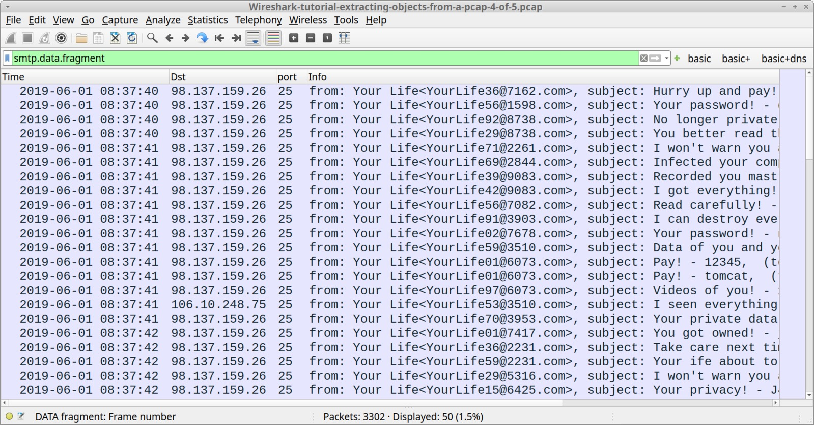

Figure 11. Filtering for email senders and subject lines in unencrypted SMTP traffic from our fourth pcap.

We can export these messages using the following menu path as shown in Figure 12:

*   File → Export Objects → IMF...

IMF stands for [Internet Message Format](https://www.loc.gov/preservation/digital/formats/fdd/fdd000393.shtml), which is saved as a name with an .eml file extension.


Figure 12. Menu path to export emails from a pcap in Wireshark.

The sextortion spam messages are all listed with an .eml file extension in the IMF object list as shown in Figure 13.

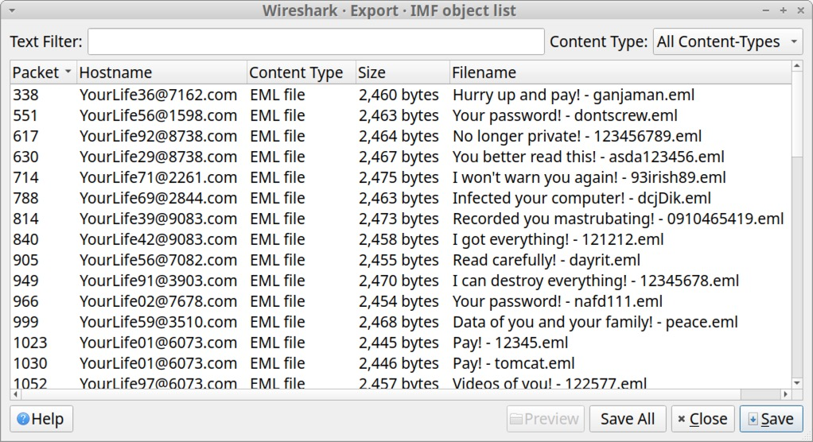

Figure 13. List of exportable email files in the IMF object list.

The exported .eml files can be reviewed with a text editor or an email client like Thunderbird as shown in Figure 14.


Figure 14. Using Thunderbird to view an email exported from the pcap.

**Exporting Files from FTP Traffic**
------------------------------------

Some malware families use FTP during malware infections. Our next pcap contains malware executables retrieved from an FTP server. It also contains stolen information sent from the infected Windows host back to the same FTP server.

Our final pcap for this tutorial is Wireshark-tutorial-extracting-objects-from-a-pcap-5-of-5.pcap. Open the pcap in Wireshark and use the following filter:

*   ftp.request.command or (ftp-data and tcp.seq eq 1)

The results are shown below in Figure 15. We should see USER for the username and PASS for the password. This is followed by RETR statements, which are requests to retrieve files. The filtered results show RETR statements for the following files:

*   RETR q.exe
*   RETR w.exe
*   RETR e.exe
*   RETR r.exe
*   RETR t.exe

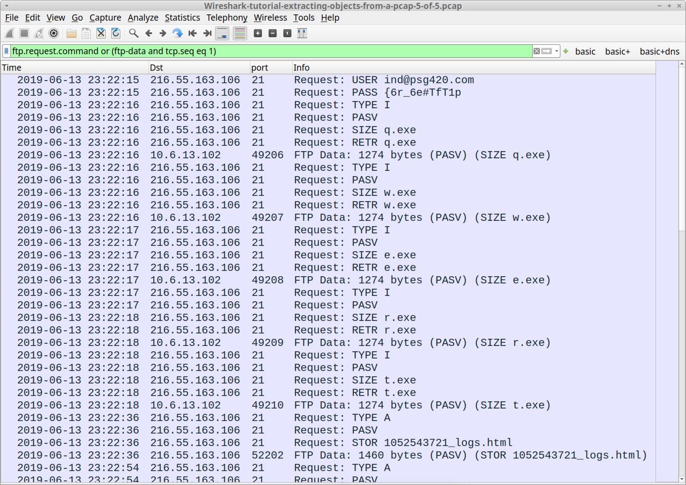

Figure 15. Filtering for FTP activity in our fifth pcap using Wireshark.

In Figure 15, this Wireshark filter also shows the start of files sent over the FTP data channel. After the RETR statements for the .exe files, our column display should reveal STOR statements representing store requests to send HTML-based log files back to the same FTP server approximately every 18 seconds.

In Wireshark version 4.0.0 or newer, we can export files from the FTP data channel using the following menu path as shown in Figure 16:

*   File → Export Objects → FTP-DATA...

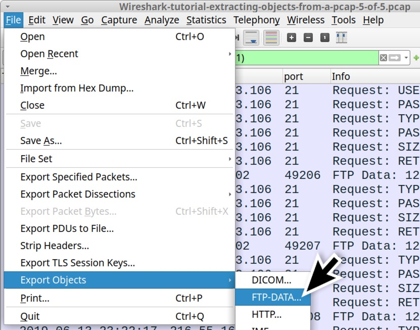

Figure 16. Menu path to export FTP objects from our fifth pcap in Wireshark

This brings up a Window listing the FTP data objects we can export as shown below in Figure 17. This lists all of the HTML files sent to the FTP server containing information stolen from the infected Windows host.

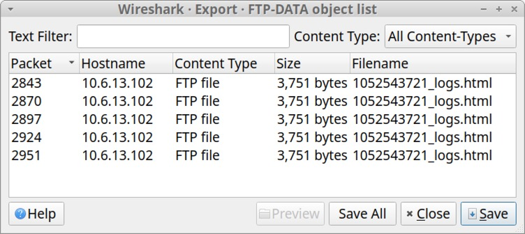

Figure 17. FTP-DATA object list.

We can view the exported files in a text editor or a browser as shown below in Figure 18. These files contain login credentials from the infected host’s email client and web browser.

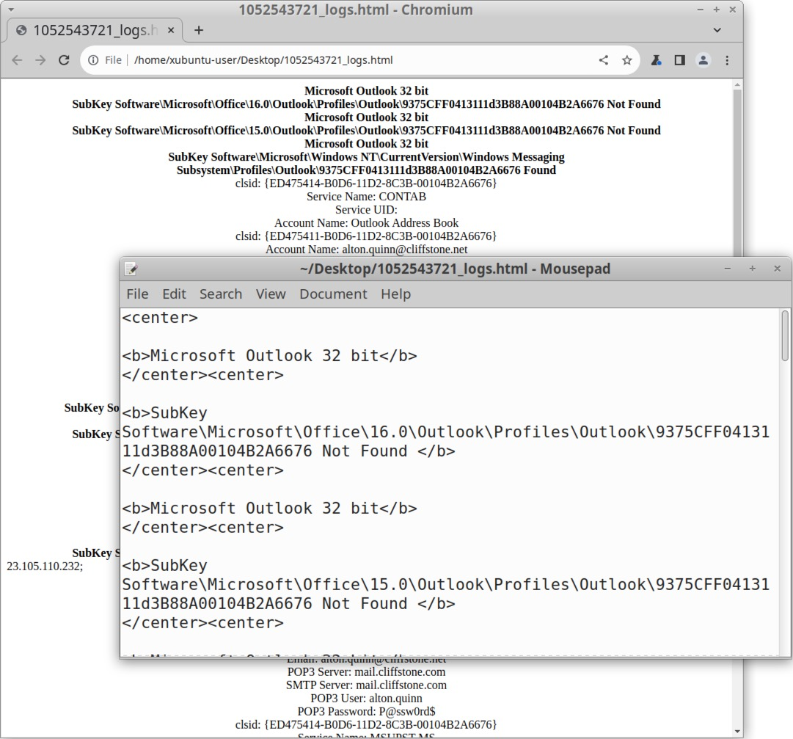

Figure 18. Exported .html files viewed in a text editor or web browser.

While this export FTP-DATA function works for the .html files, it did not present us with any of the .exe files retrieved from the FTP server. We must export these using another method.

This method involves finding the start of FTP data streams for each of the .exe files returned from the FTP server. To find these TCP frames, use the following Wireshark filter:

*   ftp-data.command contains ".exe" and tcp.seq eq 1

The results are shown below in Figure 19, revealing an FTP data stream for each of the .exe files.

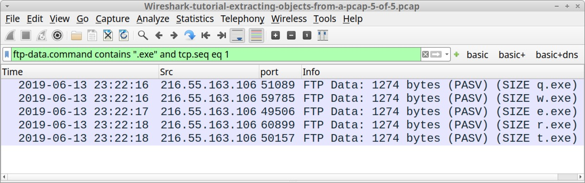

Figure 19. Finding the start of FTP data streams for .exe files returned from the FTP server.

We can follow the TCP stream for each of the frames shown in the Wireshark column display in Figure 19, and we can export these files from the TCP stream window. First, follow the TCP stream for the first result that shows (SIZE q.exe) in the Info column as shown below in Figure 20.

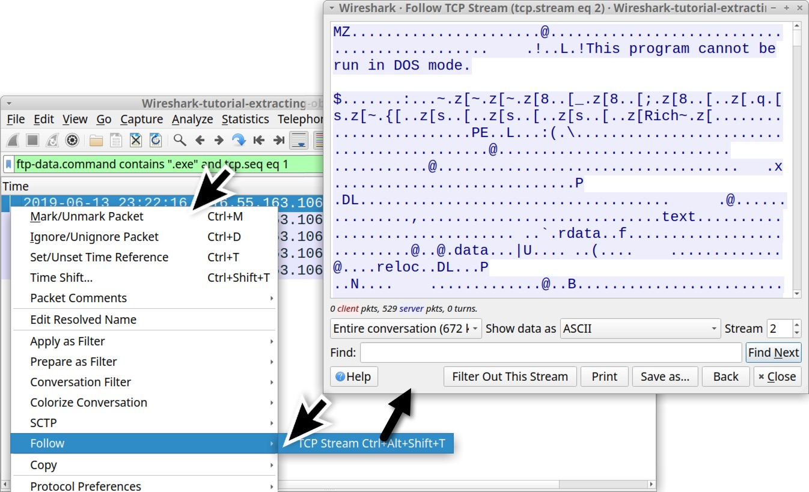

Figure 20. Following the TCP stream for our first FTP data result.

The TCP stream window shows hints that this is a Windows executable or DLL file. The first two bytes are the ASCII characters MZ. The TCP stream also reveals the string This program cannot be run in DOS mode.

But to confirm this is a Windows executable or DLL file, we must export it from the TCP stream. To do this, select “Raw” in the "Show data as" menu. See Figure 21 for how to do this.

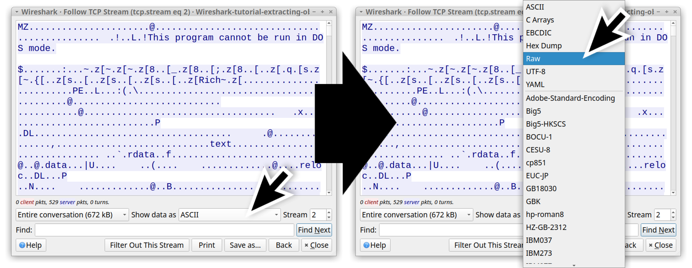

Figure 21. Showing information in Wireshark’s TCP stream windows as raw data.

The TCP stream now shows the information in hexadecimal text, and we can export this raw data as a file using the "Save as..." button as shown below in Figure 22. This is an FTP data stream for a file named q.exe, and we have to manually type that when saving the file.

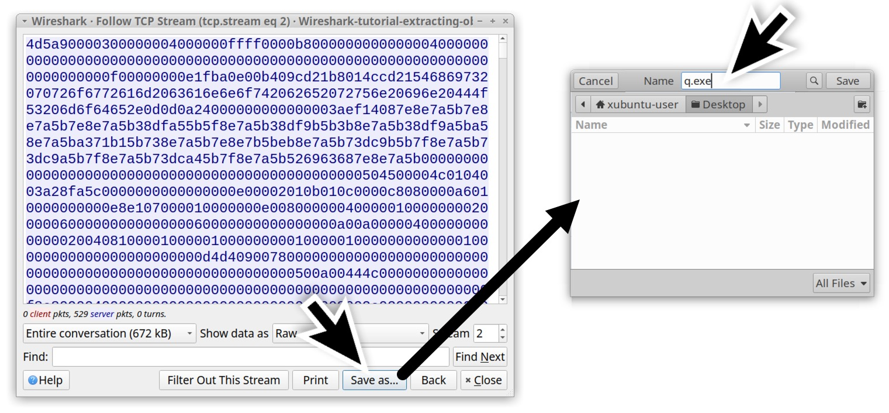

Figure 22. Saving the raw data from a TCP stream window as a file.

When saving the file as q.exe in a Linux or similar CLI environment, we can confirm this is a Windows executable file and get the SHA256 hash using the commands shown below.

```
Command:fileq.exe

Result:q.exe:PE32 executable(GUI)Intel80386,forMS Windows

Command:shasum-a256q.exe

Result:ca34b0926cdc3242bbfad1c4a0b42cc2750d90db9a272d92cfb6cb7034d2a3bdq.exe
```

This SHA256 hash shows a [high detection rate as malware on VirusTotal](https://www.virustotal.com/gui/file/ca34b0926cdc3242bbfad1c4a0b42cc2750d90db9a272d92cfb6cb7034d2a3bd). Follow the same process to export the other .exe files in the pcap.

This should give you the following files as shown below in Table 3.

<table><tbody><tr><td><b>SHA256 hash&nbsp;&nbsp;&nbsp;&nbsp;&nbsp;&nbsp;&nbsp;&nbsp;&nbsp;&nbsp;&nbsp;&nbsp;</b></td><td><b>Filename</b></td></tr><tr><td><span>ca34b0926cdc3242bbfad1c4a0b42cc2750d90db9a272d92cfb6cb7034d2a3bd</span></td><td><span>q.exe</span></td></tr><tr><td><span>08eb941447078ef2c6ad8d91bb2f52256c09657ecd3d5344023edccf7291e9fc</span></td><td><span>w.exe</span></td></tr><tr><td><span>32e1b3732cd779af1bf7730d0ec8a7a87a084319f6a0870dc7362a15ddbd3199</span></td><td><span>e.exe</span></td></tr><tr><td><span>4ebd58007ee933a0a8348aee2922904a7110b7fb6a316b1c7fb2c6677e613884</span></td><td><span>r.exe</span></td></tr><tr><td><span>10ce4b79180a2ddd924fdc95951d968191af2ee3b7dfc96dd6a5714dbeae613a</span></td><td><span>t.exe</span></td></tr></tbody></table>

_Table 3. Executable files from the FTP data traffic in the pcap._

These five .exe files are all Windows executables, and they all have a high detection rate as malware on VirusTotal.

**Conclusion**
--------------

Wireshark does an excellent job of combining data from multiple IP packets and the associated TCP frames to show objects sent over unencrypted network traffic. Using the methods outlined in this tutorial, we can also use Wireshark to extract these objects from a pcap. This can be extremely helpful if you need to examine items during an investigation of suspicious activity.

Our [next tutorial in this series](https://unit42.paloaltonetworks.com/wireshark-tutorial-decrypting-https-traffic/) reviews how to decrypt HTTPS traffic in a pcap.

Palo Alto Networks customers are better protected from the malware samples in this tutorial through [Cortex XDR](https://www.paloaltonetworks.com/cortex/cortex-xdr) and [XSIAM](https://www.paloaltonetworks.com/cortex/cortex-xsiam). Customers are also protected through our [Next-Generation Firewall](https://www.paloaltonetworks.com/network-security/next-generation-firewall) with [Cloud-Delivered Security Services](https://www.paloaltonetworks.com/network-security/security-subscriptions), including [Advanced WildFire](https://www.paloaltonetworks.com/network-security/advanced-wildfire), [DNS Security](https://www.paloaltonetworks.com/network-security/dns-security), [Advanced Threat Prevention](https://docs.paloaltonetworks.com/advanced-threat-prevention) and [Advanced URL Filtering](https://www.paloaltonetworks.com/network-security/advanced-url-filtering).

If you think you might have been compromised or have an urgent matter, contact the [Unit 42 Incident Response team](https://start.paloaltonetworks.com/contact-unit42.html) or call:

*   North America Toll-Free: 866.486.4842 (866.4.UNIT42)
*   EMEA: +31.20.299.3130
*   APAC: +65.6983.8730
*   Japan: +81.50.1790.0200

**Indicators of Compromise**
----------------------------

URLs that hosted malware mentioned in the tutorial:

*   hxxp://smart-fax\[.\]com/Documents/Invoice&MSO-Request.doc
*   hxxp://smart-fax\[.\]com/knr.exe

SHA256 hashes for malware mentioned in this tutorial:

*   08eb941447078ef2c6ad8d91bb2f52256c09657ecd3d5344023edccf7291e9fc
*   10ce4b79180a2ddd924fdc95951d968191af2ee3b7dfc96dd6a5714dbeae613a
*   32e1b3732cd779af1bf7730d0ec8a7a87a084319f6a0870dc7362a15ddbd3199
*   4ebd58007ee933a0a8348aee2922904a7110b7fb6a316b1c7fb2c6677e613884
*   59896ae5f3edcb999243c7bfdc0b17eb7fe28f3a66259d797386ea470c010040
*   749e161661290e8a2d190b1a66469744127bc25bf46e5d0c6f2e835f4b92db18
*   cf99990bee6c378cbf56239b3cc88276eec348d82740f84e9d5c343751f82560
*   ca34b0926cdc3242bbfad1c4a0b42cc2750d90db9a272d92cfb6cb7034d2a3bd
*   f808229aa516ba134889f81cd699b8d246d46d796b55e13bee87435889a054fb

**Additional Resources**
------------------------

*   [Wireshark Tutorial: Changing Your Column Display](https://unit42.paloaltonetworks.com/unit42-customizing-wireshark-changing-column-display/) - Unit 42, Palo Alto Networks
*   [Wireshark Tutorial: Display Filter Expressions](https://unit42.paloaltonetworks.com/using-wireshark-display-filter-expressions/) - Unit 42, Palo Alto Networks
*   [Wireshark Tutorial: Identifying Hosts and Users](https://unit42.paloaltonetworks.com/using-wireshark-identifying-hosts-and-users/) - Unit 42, Palo Alto Networks
*   [Wireshark Tutorial: Decrypting HTTPS Traffic](https://unit42.paloaltonetworks.com/wireshark-tutorial-decrypting-https-traffic/) - Unit 42, Palo Alto Networks
*   [Wireshark Tutorial: Wireshark Workshop Videos Now Available](https://unit42.paloaltonetworks.com/wireshark-workshop-videos/) - Unit 42, Palo Alto Networks
*   [Full list of Wireshark Tutorials and Quizzes](https://unit42.paloaltonetworks.com/tag/wireshark-tutorial/) - Unit 42, Palo Alto Networks

#### Get updates from  

Palo Alto  
Networks!

Sign up to receive the latest news, cyber threat intelligence and research from us

By submitting this form, you agree to our [Terms of Use](https://www.paloaltonetworks.com/legal-notices/terms-of-use) and acknowledge our [Privacy Statement](https://www.paloaltonetworks.com/legal-notices/privacy).

Advanced Threat Prevention

Advanced URL Filtering

Advanced WildFire

Cloud-Delivered Security Services

Cortex XDR

Cortex XSIAM

DNS security

next-generation firewall

pcap

Wireshark

Wireshark Tutorial