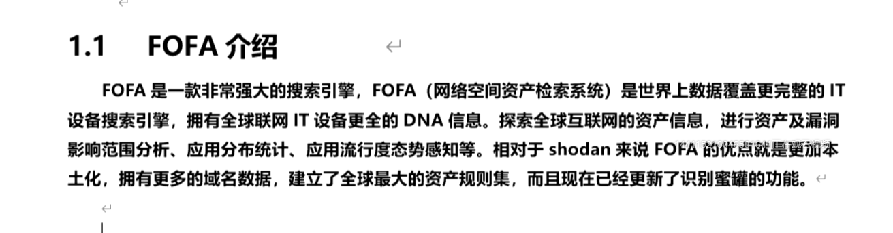

**1、FOFA通过title网站标题**

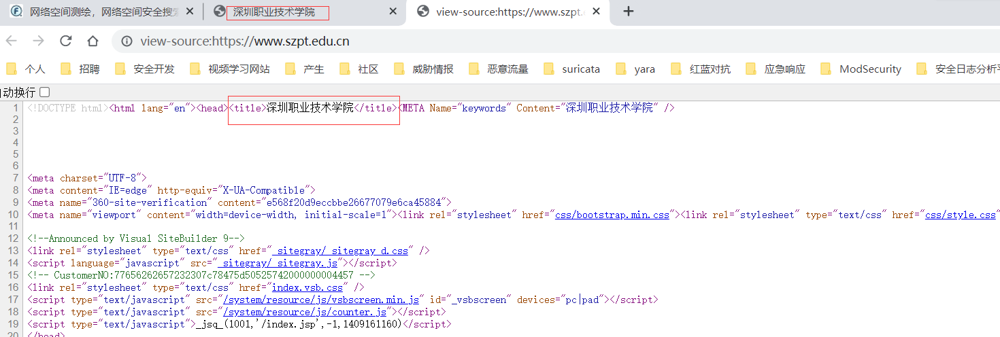


**fofa语句：**

```fofa
title="深圳职业技术学院"
```

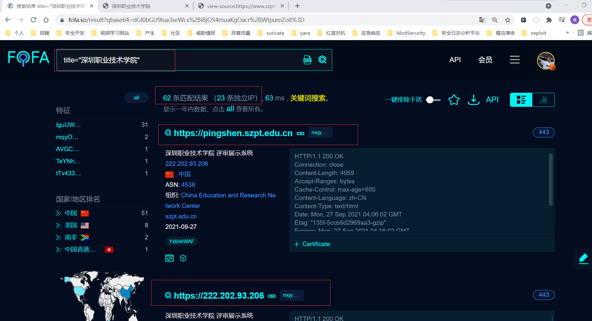


**2、FOFA通过body页面内容**

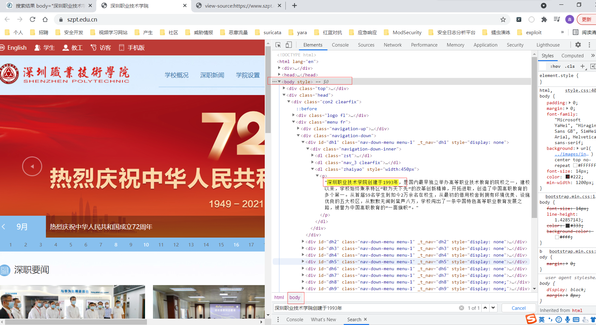


**fofa语句：**

```fofa
body="深圳职业技术学院创建于1993年"
```

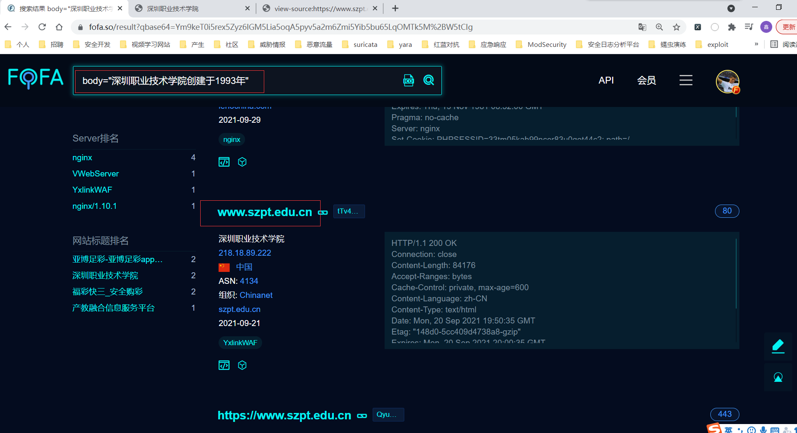


**3、FOFA通过domain可以搜索子域名**

**fofa语句：**

```fofa
domain="szpt.edu.cn"
```

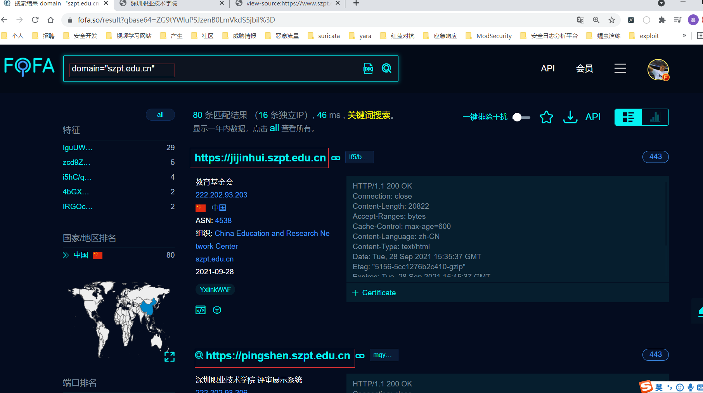


**4、FOFA根据地区搜索**

country="CN" 搜索指定国家(编码)的资产

region="Xinjiang"  搜索指定行政区的资产

city="beijing" 搜索指定城市的资产


**0x01 fofa语句：国家**

```fofa
title="深圳职业技术学院" && country="CN"
```

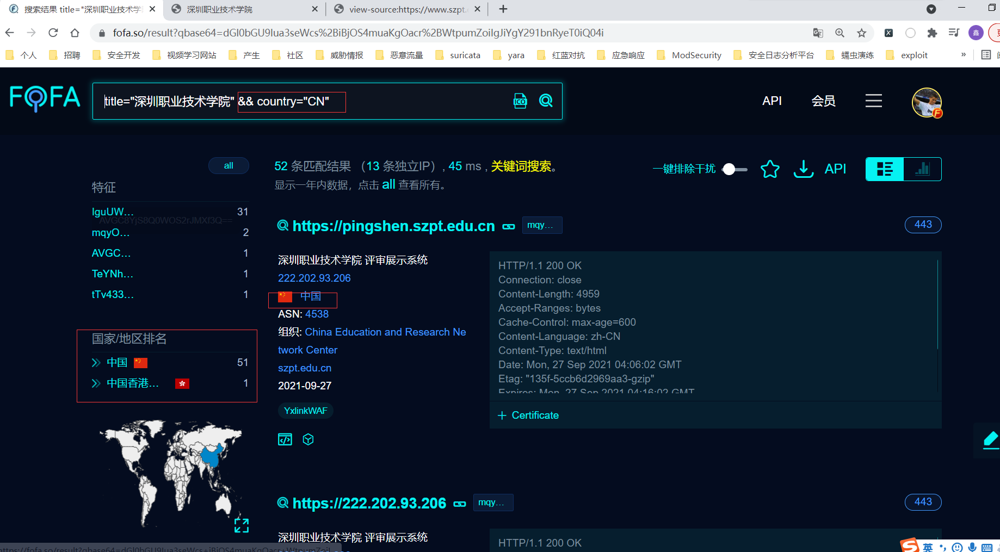


**0x02 fofa语句：地区**

```fofa
domain="xuegod.cn" && region="HK"
```

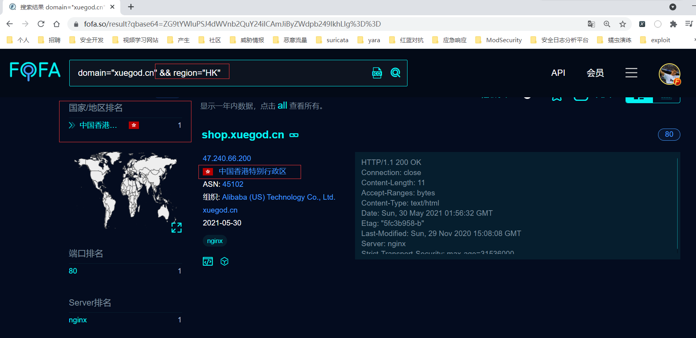


**5、FOFA通过icon图标搜索资产**

**0x01 获取ico图片**

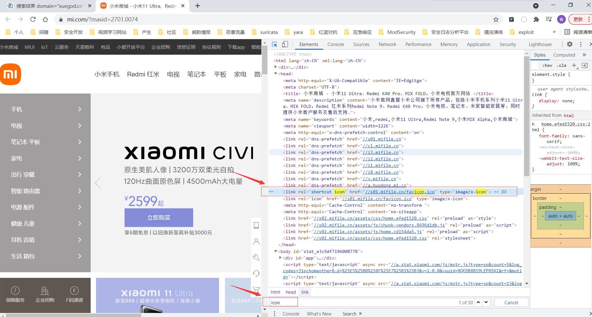


**0x02 上传icon图标**

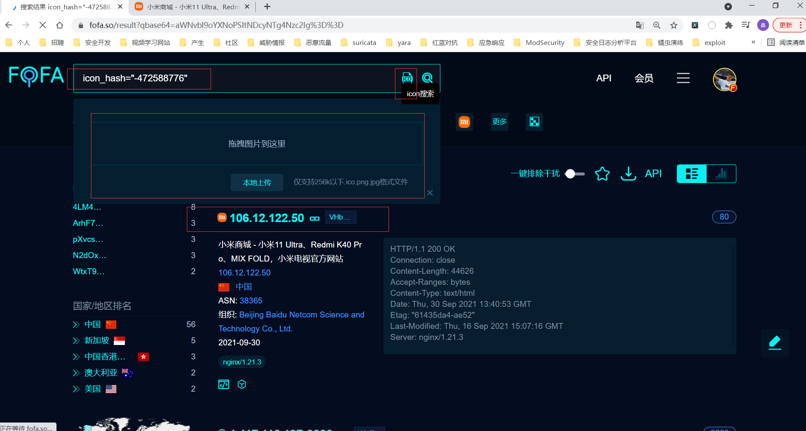


**6、FOFA通过JavaScript文件查询**

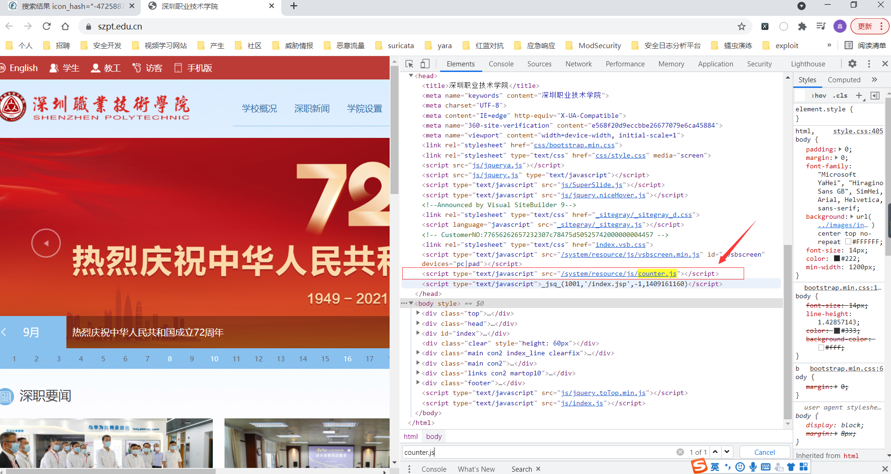


**fofa语句：**

```fofa
js_name="/system/resource/js/counter.js" && domain="szpt.edu.cn"
```

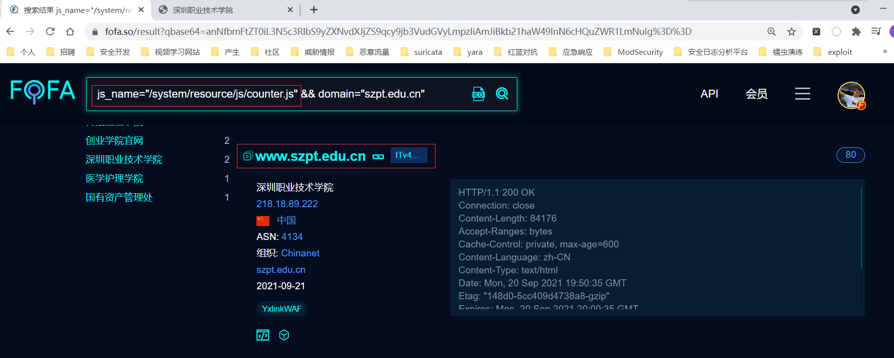


**7、通过使用FOFA规则列表搜索CMS资产**

**0x01 点击规则列表**

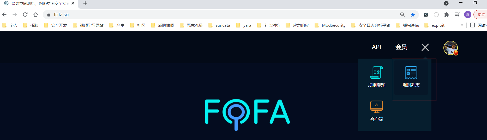

**0x02 可以通过< >左右翻页，点击其中"PHPSHE"进行搜索**

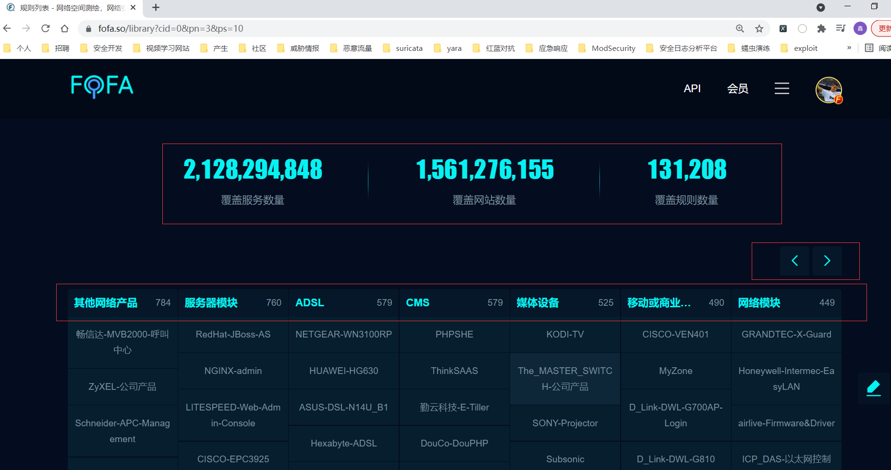


**fofa语句：**

```fofa
app="PHPSHE"
```

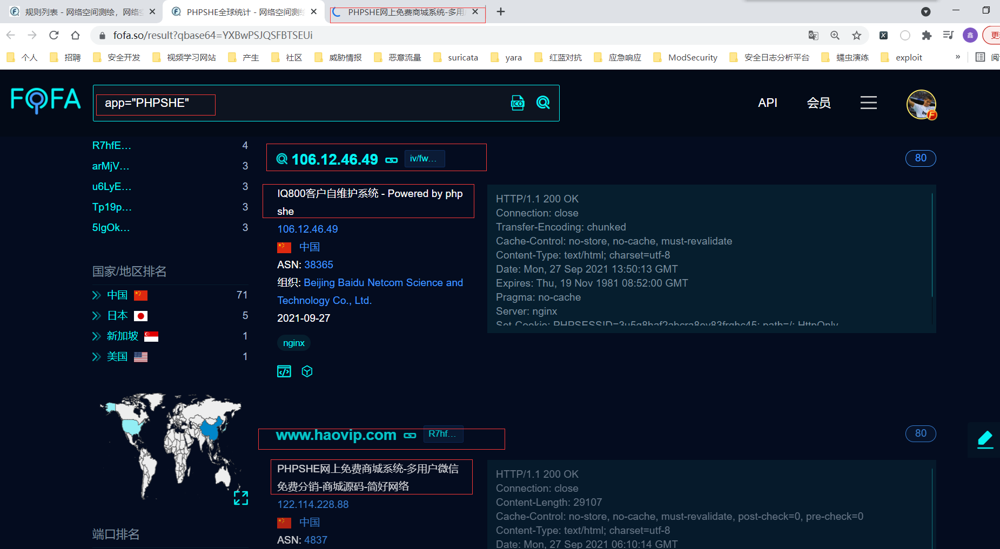


**结束！**

