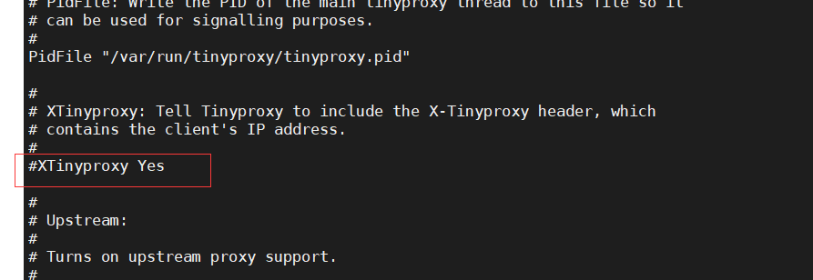
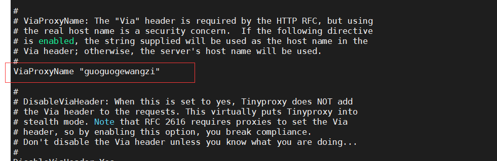

http代理--tinyproxy


安装：

```shell
[root@VM-0-10-centos home]# yum install tinyproxy -y
```

 修改配置文件：

```shell
[root@VM-0-10-centos home]# vi /etc/tinyproxy/tinyproxy.conf
```


`Port 8888` 端口：


`XTinyproxy`:请求头会包含真实ip：




如：


 


`Allow 127.0.0.1`:只要指定主机可以访问，注释掉，让所有主机可以访问


`ViaProxyName "guoguogewangzi"`:代理服务器会在原始请求头或响应头中，添加`"Via": "1.1 guoguogewangzi (tinyproxy/1.8.3)",`




如：`"Via": "1.1 guoguogewangzi (tinyproxy/1.8.3)",`头


`DisableViaHeader`:隐身模式，请求头中不再显示`"Via"选项`，`RFC 2616`要求代理设置via请求头，开启这个选项会打破规定（违法）


`RFC`:它是一系列以编号排定的文件，文件收集了有关互联网相关信息以及UNIX和互联网社区的软件文件，其还额外加入许多标准内的论题，因此所有的互联网标准都有收录在这个文件中


如：没有`Via`头


配置完成后，重启`tinyproxy`服务，防火墙放行8888端口，或关闭防火墙

```shell
[root@VM-0-10-centos home]# systemctl restart tinyproxy
[root@VM-0-10-centos home]# systemctl status firewalld.service
● firewalld.service - firewalld - dynamic firewall daemon
   Loaded: loaded (/usr/lib/systemd/system/firewalld.service; disabled; vendor preset: enabled)
   Active: inactive (dead)
     Docs: man:firewalld(1)
```


客户端设置代理

```shell
[root@s2 home]# export http_proxy="http://175.24.115.4:8888"
[root@s2 home]# echo $http_proxy
http://175.24.115.4:8888
```


测试：出现`"Via"`代理成功，可以注释`DisableViaHeader`，不显示`Via选项`

```shell
[root@s2 home]# curl -I www.baidu.com
HTTP/1.0 200 OK
Via: 1.1 guoguogewangzi (tinyproxy/1.8.3)   
Content-Type: text/html
Etag: "575e1f7c-115"
Server: bfe/1.0.8.18
Cache-Control: private, no-cache, no-store, proxy-revalidate, no-transform
Pragma: no-cache
Date: Thu, 11 Nov 2021 02:58:15 GMT
Last-Modified: Mon, 13 Jun 2016 02:50:36 GMT
Content-Length: 277
Accept-Ranges: bytes
```


注释掉`DisableViaHeader，XTinyproxy`,查看请求头，`http://httpbin.org/get?show_env=1`,该地址会把请求头当作响应体返回


参考：

https://www.bilibili.com/video/BV1v7411V7f3?from=search&seid=12229409737063859160&spm_id_from=333.337.0.0


结束！