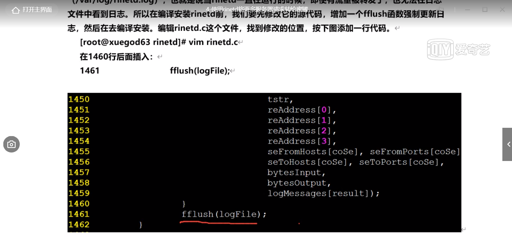

Github地址：

https://github.com/desaster/kippo

 

安装依赖

yum install python-zope-interface python-pyasn1 -y

yum install -y python-twisted*

yum -y install python-devel mysql-devel

yum install -y python2-paramiko

yum -y install epel-release

yum -y install python-pip

pip install  twisted==15.2.0

pip install mysql-python

pip install pycrypto

 

useradd -d /kippo kippo

 

git clone https://github.com/desaster/kippo.git

cp -r kippo/ /kippo/

chown -R kippo:kippo /kippo

 

yum install mariadb-server mariadb -y

systemctl start mariadb

 

进入数据库

mysql

 

create database kippo;

 

创建用户

GRANT ALL PRIVILEGES ON kippo.* TO kippo@localhost IDENTIFIED BY '123456';

 

exit

 

mysql -ukippo -p123456

 

导入数据

mysql -ukippo -p -Dkippo < /kippo/kippo/doc/sql/mysql.sql

mysql -ukippo -p123456

use kippo;

show tables;

Exit

 

 

[root@VM-0-10-centos kippo]# cd /kippo/kippo/

[root@VM-0-10-centos kippo]# ls

data  doc     honeyfs  kippo.cfg.dist  log     start.sh  txtcmds

dl   fs.pickle  kippo   kippo.tac    README.md  stop.sh  utils

[root@VM-0-10-centos kippo]# cp kippo

kippo/      kippo.cfg.dist  kippo.tac

[root@VM-0-10-centos kippo]# cp kippo.cfg.dist kippo.cfg

[root@VM-0-10-centos kippo]# ls

data  doc     honeyfs  kippo.cfg    kippo.tac  README.md  stop.sh  utils

dl   fs.pickle  kippo   kippo.cfg.dist  log     start.sh  txtcmds

[root@VM-0-10-centos kippo]# vi kippo.cfg

 

 

 

[root@VM-0-10-centos kippo]# su - kippo

[kippo@VM-0-10-centos ~]$ ls

kippo

[kippo@VM-0-10-centos ~]$ cd kippo/

[kippo@VM-0-10-centos kippo]$ ./start.sh

twistd (the Twisted daemon) 15.2.0

Copyright (c) 2001-2015 Twisted Matrix Laboratories.

See LICENSE for details.

Starting kippo in the background...

Loading dblog engine: mysql

Generating new RSA keypair...

Done.

Generating new DSA keypair...

Done.

 

 

 

 

kippo的使用方法

 

[kippo@VM-0-10-centos kippo]$ netstat -pantu |grep :2222

(Not all processes could be identified, non-owned process info

 will not be shown, you would have to be root to see it all.)

tcp     0    0 0.0.0.0:2222       0.0.0.0:*        LISTEN    30600/python2

[kippo@VM-0-10-centos kippo]$ cd data/

[kippo@VM-0-10-centos data]$ ls

ssh_host_dsa_key  ssh_host_dsa_key.pub  ssh_host_rsa_key  ssh_host_rsa_key.pub  userdb.txt

[kippo@VM-0-10-centos data]$ vi userdb.txt

给黑客用的账号密码

 

 

实时查看记录日志

[kippo@VM-0-10-centos data]$ tail -f /kippo/kippo/log/kippo.log

 

 

 

 

ssh连接蜜罐

ssh admin@175.24.115.4 -p 2222

 

 

查看回访

[kippo@VM-0-10-centos kippo]$ cd log/

[kippo@VM-0-10-centos log]$ ls
kippo.log  tty
[kippo@VM-0-10-centos log]$ cd tty/
[kippo@VM-0-10-centos tty]$ ls
20211001-200352-3825.log
[kippo@VM-0-10-centos tty]$ /kippo/kippo/utils/playlog.py 20211001-200352-3825.log

使用rinetd将更多服务器请求转发给蜜罐

下载地址：

https://github.com/samhocevar/rinetd/releases

https://github.com/boutell/rinetd

创建文件夹，编译时用到：

 mkdir -p /usr/man/man8

修改配置文件：

[root@s2 rinetd-0.73]# vi /root/rinetd-0.73/rinetd.conf

47.243.25.182 22 175.24.115.4 2222

logfile /var/log/rinetd.log

运行：

rinetd

./bootstrap

./configure

make

查看日志：

rinetd转发服务器上

[root@s2 dhcpd]# tail -f /var/log/rinetd.log
04/Oct/2021:04:39:11    59.40.83.153    0.0.0.0 4444    175.24.115.4    2222    0       0       opened
04/Oct/2021:04:39:11    59.40.83.153    0.0.0.0 4444    175.24.115.4    2222    0       0       opened

蜜罐服务器上

[root@VM-0-10-centos tty]# tail -f /kippo/kippo/log/kippo.log
2021-10-04 04:40:39+0800 [-] root failed auth password
2021-10-04 04:40:39+0800 [-] unauthorized login:
2021-10-04 04:40:39+0800 [HoneyPotTransport,1674,159.65.117.223] Got remote error, code 11
        reason: Normal Shutdown, Thank you for playing
2021-10-04 04:40:39+0800 [HoneyPotTransport,1674,159.65.117.223] connection lost
2021-10-04 04:40:46+0800 [-] New connection: 68.183.213.196:41648 (172.17.0.10:2222) [session: 1675]
2021-10-04 04:40:47+0800 [-] Remote SSH version: SSH-2.0-libssh2_1.9.0
2021-10-04 04:40:47+0800 [HoneyPotTransport,1675,68.183.213.196] kex alg, key alg: diffie-hellman-group-exchange-sha1 ssh-rsa
2021-10-04 04:40:47+0800 [HoneyPotTransport,1675,68.183.213.196] outgoing: aes128-ctr hmac-sha1 none
2021-10-04 04:40:47+0800 [HoneyPotTransport,1675,68.183.213.196] incoming: aes128-ctr hmac-sha1 none
2021-10-04 04:40:48+0800 [HoneyPotTransport,1675,68.183.213.196] NEW KEYS
2021-10-04 04:40:48+0800 [HoneyPotTransport,1675,68.183.213.196] starting service ssh-userauth
2021-10-04 04:40:48+0800 [SSHService ssh-userauth on HoneyPotTransport,1675,68.183.213.196] zhangchengcheng trying auth password
2021-10-04 04:40:48+0800 [-] login attempt [zhangchengcheng/123456] failed
2021-10-04 04:40:49+0800 [-] zhangchengcheng failed auth password
2021-10-04 04:40:49+0800 [-] unauthorized login:
2021-10-04 04:40:50+0800 [HoneyPotTransport,1675,68.183.213.196] Got remote error, code 11
        reason: Normal Shutdown, Thank you for playing
2021-10-04 04:40:50+0800 [HoneyPotTransport,1675,68.183.213.196] connection lost
2021-10-04 04:40:57+0800 [-] New connection: 159.65.117.223:54996 (172.17.0.10:2222) [session: 1676]
2021-10-04 04:40:57+0800 [-] Remote SSH version: SSH-2.0-libssh2_1.9.0
2021-10-04 04:40:57+0800 [HoneyPotTransport,1676,159.65.117.223] kex alg, key alg: diffie-hellman-group-exchange-sha1 ssh-rsa
2021-10-04 04:40:57+0800 [HoneyPotTransport,1676,159.65.117.223] outgoing: aes128-ctr hmac-sha1 none
2021-10-04 04:40:57+0800 [HoneyPotTransport,1676,159.65.117.223] incoming: aes128-ctr hmac-sha1 none
2021-10-04 04:40:58+0800 [HoneyPotTransport,1676,159.65.117.223] NEW KEYS
2021-10-04 04:40:59+0800 [HoneyPotTransport,1676,159.65.117.223] starting service ssh-userauth
2021-10-04 04:40:59+0800 [SSHService ssh-userauth on HoneyPotTransport,1676,159.65.117.223] root trying auth password
] failed04 04:40:59+0800 [-] login attempt [root/1q2w3e4r5t6y
2021-10-04 04:41:00+0800 [-] root failed auth password
2021-10-04 04:41:00+0800 [-] unauthorized login:
2021-10-04 04:41:00+0800 [HoneyPotTransport,1676,159.65.117.223] Got remote error, code 11
        reason: Normal Shutdown, Thank you for playing
2021-10-04 04:41:00+0800 [HoneyPotTransport,1676,159.65.117.223] connection lost
2021-10-04 04:41:01+0800 [-] New connection: 68.183.213.196:40250 (172.17.0.10:2222) [session: 1677]
2021-10-04 04:41:01+0800 [-] Remote SSH version: SSH-2.0-libssh2_1.9.0
2021-10-04 04:41:01+0800 [HoneyPotTransport,1677,68.183.213.196] kex alg, key alg: diffie-hellman-group-exchange-sha1 ssh-rsa
2021-10-04 04:41:01+0800 [HoneyPotTransport,1677,68.183.213.196] outgoing: aes128-ctr hmac-sha1 none
2021-10-04 04:41:01+0800 [HoneyPotTransport,1677,68.183.213.196] incoming: aes128-ctr hmac-sha1 none
2021-10-04 04:41:03+0800 [HoneyPotTransport,1677,68.183.213.196] NEW KEYS
2021-10-04 04:41:03+0800 [HoneyPotTransport,1677,68.183.213.196] starting service ssh-userauth
2021-10-04 04:41:03+0800 [SSHService ssh-userauth on HoneyPotTransport,1677,68.183.213.196] zhangchengcheng trying auth password
2021-10-04 04:41:03+0800 [-] login attempt [zhangchengcheng/zhangchengcheng] failed
2021-10-04 04:41:04+0800 [-] CMD: id
2021-10-04 04:41:04+0800 [-] Command found: id
2021-10-04 04:41:04+0800 [-] zhangchengcheng failed auth password
2021-10-04 04:41:04+0800 [-] unauthorized login:
2021-10-04 04:41:05+0800 [HoneyPotTransport,1677,68.183.213.196] Got remote error, code 11
        reason: Normal Shutdown, Thank you for playing
2021-10-04 04:41:05+0800 [HoneyPotTransport,1677,68.183.213.196] connection lost
2021-10-04 04:41:05+0800 [-] CMD: pwd
2021-10-04 04:41:05+0800 [-] Command found: pwd
2021-10-04 04:41:07+0800 [SSHChannel session (0) on SSHService ssh-connection on HoneyPotTransport,1663,47.243.25.180] Received unhandled keyID: '\x08'
2021-10-04 04:41:07+0800 [SSHChannel session (0) on SSHService ssh-connection on HoneyPotTransport,1663,47.243.25.180] Received unhandled keyID: '\x08'
2021-10-04 04:41:07+0800 [SSHChannel session (0) on SSHService ssh-connection on HoneyPotTransport,1663,47.243.25.180] Received unhandled keyID: '\x08'
2021-10-04 04:41:07+0800 [SSHChannel session (0) on SSHService ssh-connection on HoneyPotTransport,1663,47.243.25.180] Received unhandled keyID: '\x08'
2021-10-04 04:41:08+0800 [SSHChannel session (0) on SSHService ssh-connection on HoneyPotTransport,1663,47.243.25.180] Received unhandled keyID: '\x08'
2021-10-04 04:41:10+0800 [-] CMD: whoami
2021-10-04 04:41:10+0800 [-] Command found: whoami

参考：

https://blog.51cto.com/u_15083133/2705622

定义自动触发录屏功能录制黑客的一切操作

script命令录屏功能演示

[root@s2 rinetd-0.73]# script -t 2>xuegod.file -a xuegod
Script started, file is xuegod
[root@s2 rinetd-0.73]# ls
aclocal.m4      CHANGES.md     configure     index.html   Makefile.in  rinetd.8        src
autom4te.cache  config.log     configure.ac  Makefile     README.md    rinetd.conf     xuegod
bootstrap       config.status  COPYING       Makefile.am  rinetd       rinetd.vcxproj  xuegod.file
[root@s2 rinetd-0.73]# cd
[root@s2 ~]# id
uid=0(root) gid=0(root) 组=0(root)
[root@s2 ~]# pwd
/root
[root@s2 ~]# exit
exit
Script done, file is xuegod
[root@s2 rinetd-0.73]# ls
aclocal.m4      CHANGES.md     configure     index.html   Makefile.in  rinetd.8        src
autom4te.cache  config.log     configure.ac  Makefile     README.md    rinetd.conf     xuegod
bootstrap       config.status  COPYING       Makefile.am  rinetd       rinetd.vcxproj  xuegod.file
[root@s2 rinetd-0.73]#

播放

[root@s2 rinetd-0.73]# scriptreplay xuegod.file xuegod
[root@s2 rinetd-0.73]# ls
aclocal.m4      CHANGES.md     configure     index.html   Makefile.in  rinetd.8        src
autom4te.cache  config.log     configure.ac  Makefile     README.md    rinetd.conf     xuegod
bootstrap       config.status  COPYING       Makefile.am  rinetd       rinetd.vcxproj  xuegod.file
[root@s2 rinetd-0.73]# cd
[root@s2 ~]# id
uid=0(root) gid=0(root) 组=0(root)
[root@s2 ~]# pwd
/root
[root@s2 ~]# exit
[root@s2 rinetd-0.73]#

快10倍播放：-d 10

[root@s2 rinetd-0.73]# scriptreplay -d 10  xuegod.file xuegod

自动录制：

[root@s2 ~]# mkdir -p /etc/dhcpd/

[root@s2 ~]# vi /etc/profile

script -t -f -q 2>/etc/dhcpd/$USER-$UID-`date +%Y%m%d%H%M%S`.time -a /etc/dhcpd/$USER-$UID-`date +%Y%m%d%H%M%S`.his
if [ "$SHLVL" = 1 ];then                         #解释“=”:为字符串运算符，判断两个字符串是否相等，整型可当做字符串使用
    exit
fi

查看回访

[root@s2 dhcpd]# scriptreplay  -d 10 root-0-20211004014957.time  root-0-20211004014957.his

解释：进入shell时，启动录屏命令script，一切操作在script进程下操作，相当于启动shell----启动script-----启动bash,此时$SHLVL为2，所以当黑客执行exit退出当前shell时，其实是在退出录屏功能，同时在真正shell下执行exit命令真正地退出shell，欺骗黑客

[root@s2 ~]# echo $SHLVL
1

[root@s2 ~]# pstree -p |grep ssh
           |-sshd(21067)-+-sshd(4993)-+-bash(5001)---script(5034)---script(5038)---bash(5039)  #被录屏的bash
           |             |-sshd(4999)---sftp-server(5067)
           |             |-sshd(9516)---bash(9525)-+-grep(11142) #当前shell
           |             |-sshd(9523)---sftp-server(9588)
           |             `-sshd(24571)---sftp-server(24636)

[root@s2 ~]# ps aux |grep ssh
root      4993  0.0  0.6 157516  6128 ?        Ss   02:59   0:00 sshd: root@pts/1
root      4999  0.0  0.5 157516  5872 ?        Ss   02:59   0:00 sshd: root@notty
root      5067  0.0  0.2  72292  2908 ?        Ss   02:59   0:00 /usr/libexec/openssh/sftp-server
root      9516  0.0  0.5 157516  6072 ?        Ss   03:06   0:00 sshd: root@pts/3
root      9523  0.0  0.5 157516  5872 ?        Ss   03:06   0:00 sshd: root@notty
root      9588  0.0  0.2  72292  2912 ?        Ss   03:06   0:00 /usr/libexec/openssh/sftp-server
root     11212  0.0  0.0 112828   980 pts/3    R+   03:08   0:00 grep --color=auto ssh
root     21067  0.0  0.0 112940   708 ?        Ss   9月27   0:03 /usr/sbin/sshd -D
root     24571  0.0  0.5 157516  5848 ?        Ss   02:27   0:00 sshd: root@notty
root     24636  0.0  0.2  72292  2836 ?        Ss   02:27   0:00 /usr/libexec/openssh/sftp-server
[root@s2 ~]# ps aux |grep script
root      5034  0.0  0.0 114292   820 pts/1    S+   02:59   0:00 script -t -f -q -a /etc/dhcpd/root-0-20211004025913.his
root      5038  0.0  0.0 114596   532 pts/1    S+   02:59   0:00 script -t -f -q -a /etc/dhcpd/root-0-20211004025913.his
root     11336  0.0  0.0 112828   980 pts/3    R+   03:08   0:00 grep --color=auto script

