# [openssl用法详解](https://www.cnblogs.com/yangxiaolan/p/6256838.html)

OpenSSL 是一个开源项目，其组成主要包括一下三个组件：

- openssl：多用途的命令行工具
- libcrypto：加密算法库
- libssl：加密模块应用库，实现了ssl及tls

openssl可以实现：秘钥证书管理、对称加密和非对称加密 。

#### 1、对称加密

对称加密需要使用的标准命令为 enc ，用法如下：

```css
openssl enc -ciphername [-in filename] [-out filename] [-pass arg] [-e] [-d] [-a/-base64]
       [-A] [-k password] [-kfile filename] [-K key] [-iv IV] [-S salt] [-salt] [-nosalt] [-z] [-md]
       [-p] [-P] [-bufsize number] [-nopad] [-debug] [-none] [-engine id]
```

常用选项有：

-in filename：指定要加密的文件存放路径

-out filename：指定加密后的文件存放路径

-salt：自动插入一个随机数作为文件内容加密，默认选项

-e：可以指明一种加密算法，若不指的话将使用默认加密算法

-d：解密，解密时也可以指定算法，若不指定则使用默认算法，但一定要与加密时的算法一致

-a/-base64：使用-base64位编码格式

```stata
示例：
加密：]# openssl enc -e -des3 -a -salt -in 2.pcap -out jiami         #jiami：为ASCII text
解密：]# openssl enc -d -des3 -a -salt -in jiami -out jiemi.pcap     #可以在指定-k：密码
```


查看`jiami文件`:

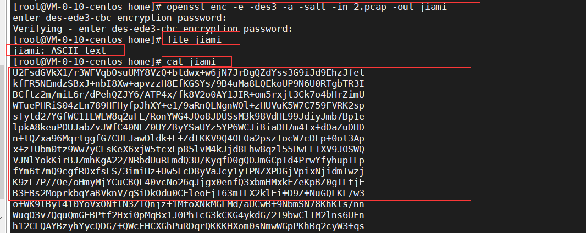


#### 2、单向加密

单向加密需要使用的标准命令为 dgst ，用法如下：

```inform7
openssl dgst [-md5|-md4|-md2|-sha1|-sha|-mdc2|-ripemd160|-dss1] [-c] [-d] [-hex] [-binary]
       [-out filename] [-sign filename] [-keyform arg] [-passin arg] [-verify filename] [-prverify
       filename] [-signature filename] [-hmac key] [file...]
```

常用选项有：

[-md5|-md4|-md2|-sha1|-sha|-mdc2|-ripemd160|-dss1] ：指定一种加密算法

-out filename：将加密的内容保存到指定文件中

示例如下：

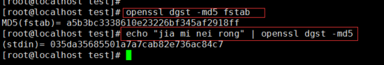

单向加密除了 openssl dgst 工具还有： md5sum，sha1sum，sha224sum，sha256sum ，sha384sum，sha512sum

示例如下：

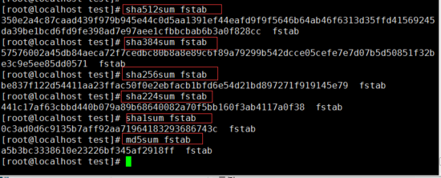

#### 3、生成密码

生成密码需要使用的标准命令为 passwd ，用法如下：

```css
openssl passwd [-crypt] [-1] [-apr1] [-salt string] [-in file] [-stdin] [-noverify] [-quiet] [-table] {password}
```

常用选项有：

-1：使用md5加密算法

-salt string：加入随机数，最多8位随机数

-in file：对输入的文件内容进行加密

-stdion：对标准输入的内容进行加密

示例如下：

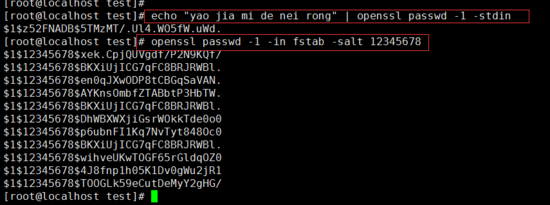

#### 4、生成随机数

生成随机数需要用到的标准命令为 rand ，用法如下：

```css
openssl rand [-out file] [-rand file(s)] [-base64] [-hex] num
```

常用选项有：

-out file：将生成的随机数保存至指定文件中

-base64：使用base64 编码格式

-hex：使用16进制编码格式

示例如下：

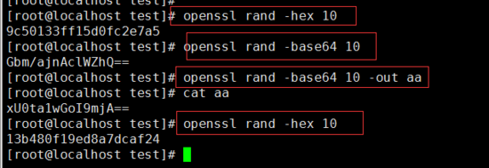

#### 5、生成秘钥对

首先需要先使用 genrsa 标准命令生成私钥，然后再使用 rsa 标准命令从私钥中提取公钥。

genrsa 的用法如下：

```css
openssl genrsa [-out filename] [-passout arg] [-des] [-des3] [-idea] [-f4] [-3] [-rand file(s)] [-engine id] [numbits]
```

常用选项有：

-out filename：将生成的私钥保存至指定的文件中

-des|-des3|-idea：不同的加密算法

numbits：指定生成私钥的大小，默认是2048

一般情况下秘钥文件的权限一定要控制好，只能自己读写，因此可以使用 umask 命令设置生成的私钥权限，示例如下：

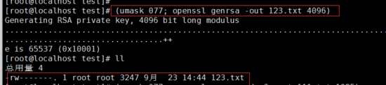

ras 的用法如下：

```css
openssl rsa [-inform PEM|NET|DER] [-outform PEM|NET|DER] [-in filename] [-passin arg] [-out filename] [-passout arg]
       [-sgckey] [-des] [-des3] [-idea] [-text] [-noout] [-modulus] [-check] [-pubin] [-pubout] [-engine id]
```

常用选项：

-in filename：指明私钥文件

-out filename：指明将提取出的公钥保存至指定文件中 

-pubout：根据私钥提取出公钥 

示例如下：

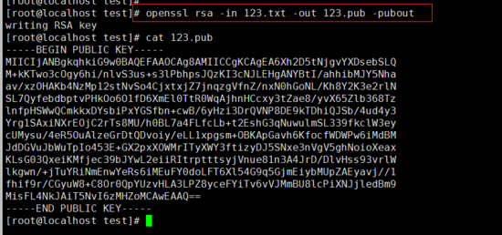

#### 6、创建CA和申请证书

使用openssl工具创建CA证书和申请证书时，需要先查看配置文件，因为配置文件中对证书的名称和存放位置等相关信息都做了定义，具体可参考 /etc/pki/tls/openssl.cnf 文件。

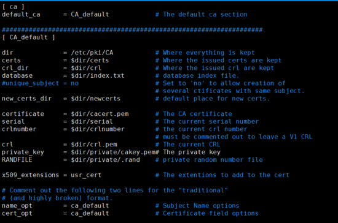

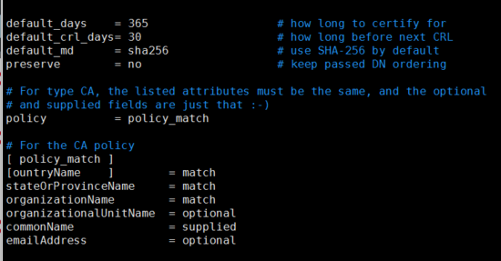

#### （1）、创建自签证书

第一步：创建为 CA 提供所需的目录及文件

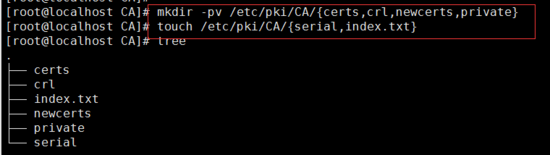

第二步：指明证书的开始编号

]# echo 01 >> serial 

第三步：生成私钥，私钥的文件名与存放位置要与配置文件中的设置相匹配；

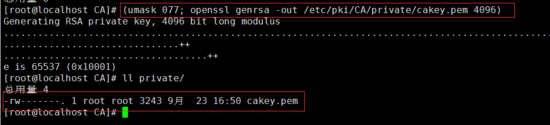

第四步：生成自签证书，自签证书的存放位置也要与配置文件中的设置相匹配，生成证书时需要填写相应的信息；

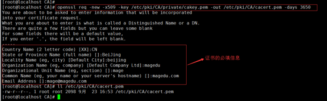

命令中用到的选项解释：

-new：表示生成一个新证书签署请求

-x509：专用于CA生成自签证书，如果不是自签证书则不需要此项

-key：生成请求时用到的私钥文件

-out：证书的保存路径

-days：证书的有效期限，单位是day（天），默认是365天

#### （2）颁发证书

在需要使用证书的主机上生成证书请求，以 httpd 服务为例，步骤如下：

第一步：在需要使用证书的主机上生成私钥，这个私钥文件的位置可以随意定

第二步：生成证书签署请求

第三步：将请求通过可靠方式发送给 CA 主机

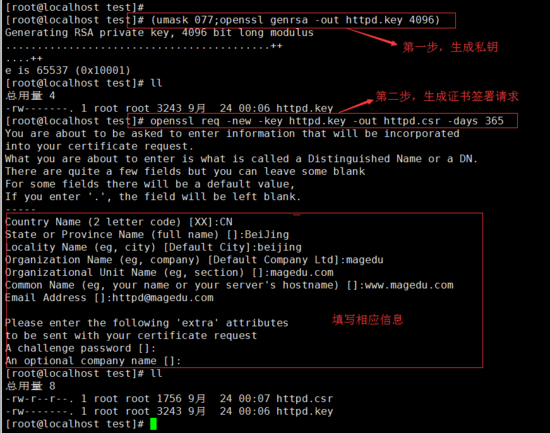

第四步：CA 服务器拿到证书签署请求文件后颁发证书，这一步是在 CA 服务器上做的

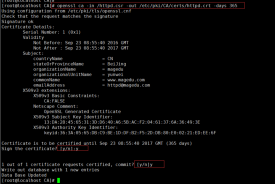

查看证书信息的命令为：

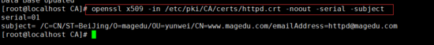

#### （3）吊销证书

吊销证书的步骤也是在CA服务器上执行的，以刚才新建的 httpd.crt 证书为例，吊销步骤如下：

第一步：在客户机上获取要吊销证书的 serial 和 subject 信息 

第二步：根据客户机提交的 serial 和 subject 信息，对比其余本机数据库 index.txt 中存储的是否一致 

第三步：执行吊销操作

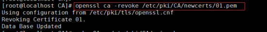

第四步：生成吊销证书的吊销编号 （第一次吊销证书时执行）

]# echo 01 > /etc/pki/CA/crlnumber

第五步：更新证书吊销列表

]# openssl ca -gencrl -out /etc/pki/CA/crl/ca.crl

查看 crl 文件命令：

]# openssl crl -in /etc/pki/CA/crl/ca.crl -noout -text


原文 [http://www.178linux.com/48764](http://www.178linux.com/48764?utm_source=tuicool&utm_medium=referral)