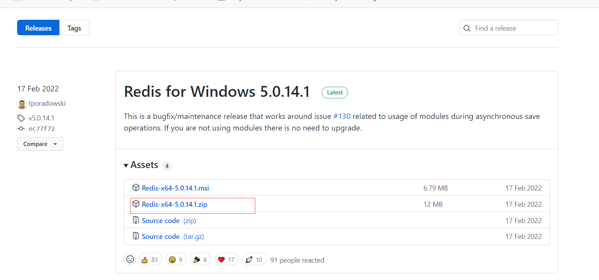
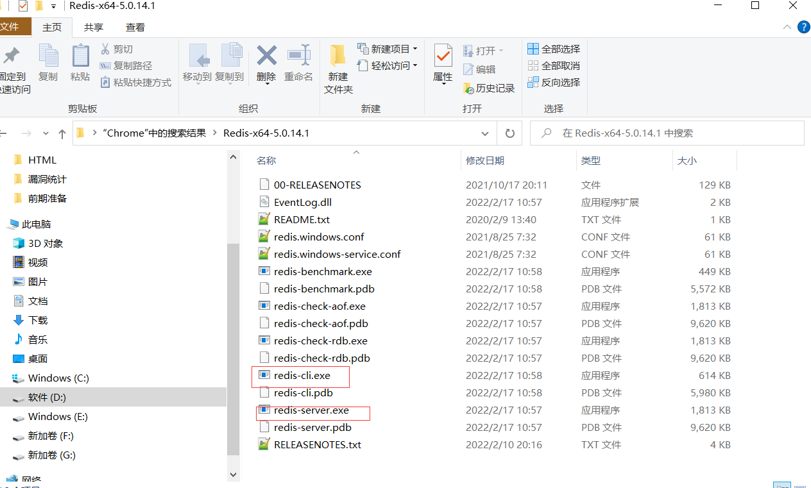
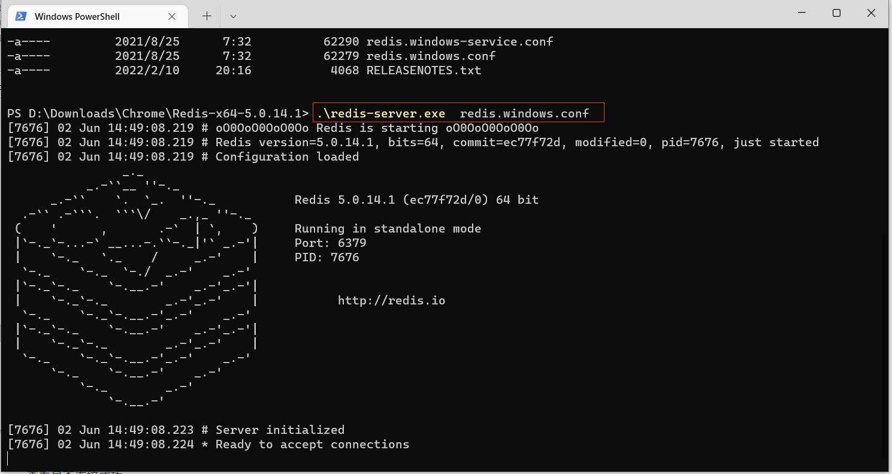
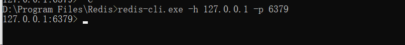
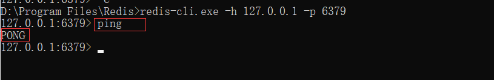
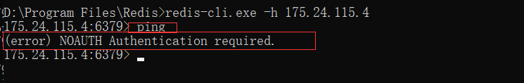
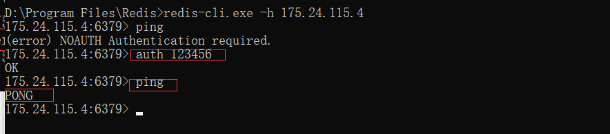
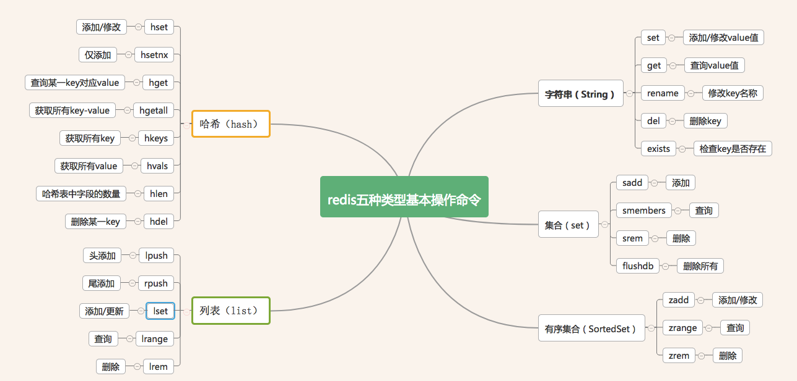

安装

参考：
https://www.runoob.com/redis/redis-install.html


Windows版下载地址：
https://github.com/tporadowski/redis/releases


如：
Redis-x64-5.0.14.1.zip




解压即可用：




启动服务器：
redis-server.exe redis.windows.conf




客户端连接
redis-cli.exe -h 127.0.0.1 -p 6379




连接成功：




连接不成功，如：



身份认证，auth+密码




[Redis五种数据类型的简单增删改查命令](http://t.zoukankan.com/epipremnum-aureum-p-8619092.html)
===============================================================================

**安装目录下执行命令：**

redis-cli -h 127.0.0.1 -p 6379

进入指定端口

**或者redis-cli进入默认端口（个人习惯一般不会使用）**

Redis五种基本数据类型简单命令：



**  
Redis简单增删改查例子**

**一、字符串（String）类型**

**1、增加一个key为ay\_key的值**

```
127.0.0.1:6379> set ay_key "ay"
OK
```

**2、查询一个key为ay\_key的值**

```
127.0.0.1:6379> get ay_key
"ay"
```

**3、修改ay\_key的值**

```
127.0.0.1:6379> set ay_key "new_ay"
OK
127.0.0.1:6379> get ay_key
"new_ay"
```

**4、修改ay\_key名称**

```
127.0.0.1:6379> rename ay_key new_ay_key
OK
127.0.0.1:6379> keys *
1) "new_ay_key"
```

**5、删除ay\_key**

```
127.0.0.1:6379> del ay_key
(integer) 0
```

**6、查询是否存在ay\_key**

```
127.0.0.1:6379> exists ay_key
(integer) 0
```

**二、集合（Set）类型**

**1、删除当前选择数据库中的所有key**

```
127.0.0.1:6379> flushdb
OK
```

**2、生成set集合，添加多个数据**

```
127.0.0.1:6379> sadd set_ay_key "ay" "al" "xy" "xl"
(integer) 4
```

**3、查询set里面所有值**

```
127.0.0.1:6379> smembers set_ay_key
1) "xy"
2) "al"
3) "ay"
4) "xl"
```

**4、`删除value为"xl" , 返回 1 如果没有返回 0`**

```
127.0.0.1:6379> srem set_ay_key "xl"
(integer) 1
127.0.0.1:6379> smembers set_ay_key
1) "xy"
2) "al"
3) "ay"
```

**5、`添加value为"x1"`**

```
127.0.0.1:6379> sadd set_ay_key "xl"
(integer) 1
127.0.0.1:6379> smembers set_ay_key
1) "xy"
2) "al"
3) "ay"
4) "xl"
```

**6、添加value为"xl"  添加不进去，但也不报错，set是不允许重复的**

```
127.0.0.1:6379> sadd set_ay_key "xl"
(integer) 0
127.0.0.1:6379> sadd set_ay_key "xl1"
(integer) 1
```

**三、列表（List）类型**

**1、添加key为list\_ay\_key的list集合**

```
127.0.0.1:6379> lpush list_ay_key "x1" "y1" "z1" "n1"
(integer) 4
```

**2、查询key为list\_ay\_key的集合**

```
127.0.0.1:6379> lrange list_ay_key 0 -1
1) "xl"
2) "xy"
3) "al"
4) "ay"
```

**3、往list尾部添加元素**

```
127.0.0.1:6379> rpush list_ay_key "together"
(integer) 5
```

**4、往list头部添加元素**

```
127.0.0.1:6379> lpush list_ay_key "first"
(integer) 6
```

**5、更新index为0的值**

```
127.0.0.1:6379> lset list_ay_key 0 "update_first"
OK
127.0.0.1:6379> lrange list_ay_key 0 -1
1) "update_first"
2) "xl"
3) "xy"
4) "al"
5) "ay"
6) "together"
```

**6、删除index为1的值**

```
127.0.0.1:6379> lrem list_ay_key 1 "update_first"
(integer) 1
127.0.0.1:6379> lrange list_ay_key 0 -1
1) "xl"
2) "xy"
3) "al"
4) "ay"
5) "together"
```

**四、哈希(Hash)类型**

**1、生成hash集合，并添加key 为uuid\_one value 为"12345"**

```
#将哈希表 key 中的字段 field 的值设为 value
127.0.0.1:6379> hset hash_ay_key "uuid_one" "12345"
(integer) 1
#只有在字段 field 不存在时，设置哈希表字段的值
127.0.0.1:6379> hsetnx hash_ay_key "uuid_one" "12345"
(integer) 0
127.0.0.1:6379> hsetnx hash_ay_key "uuid_two" "12345"
(integer) 1
```

**2、获取哈希表中字段的数量**

```
127.0.0.1:6379> hlen hash_ay_key
(integer) 2
```

**3、返回集合所有的key**

```
127.0.0.1:6379> hkeys hash_ay_key
1) "uuid_one"
2) "uuid_two"
```

**4、返回集合所有的value**

```
127.0.0.1:6379> hvals hash_ay_key
1) "12345"
2) "12345"
```

**5、集合添加值**

```
127.0.0.1:6379> hset hash_ay_key "uuid_three" "test"
(integer) 1
```

**6、获得key为uuid\_one的值**

```
127.0.0.1:6379> hget hash_ay_key uuid_one
"12345"
```

**7、删除key为uuid\_three的值**

```
127.0.0.1:6379> hdel hash_ay_key uuid_three
(integer) 1
127.0.0.1:6379> hkeys hash_ay_key
1) "uuid_one"
2) "uuid_two"
```

**8、获得所有，包括key和value**

```
127.0.0.1:6379> hgetall hash_ay_key
1) "uuid_one"
2) "12345"
3) "uuid_two"
4) "12345"
```

**9、更新key为uuid\_one的值**

```
127.0.0.1:6379>  hset hash_ay_key uuid_one "11111"
(integer) 0
127.0.0.1:6379> hgetall hash_ay_key
1) "uuid_one"
2) "11111"
3) "uuid_two"
4) "12345"
127.0.0.1:6379> hset hash_ay_key "uuid_one" "11112"
(integer) 0
127.0.0.1:6379> hgetall hash_ay_key
1) "uuid_one"
2) "11112"
3) "uuid_two"
4) "12345"
```

**五、有序集合（**SortedSet**）类型**

**1、sorted set添加值ay 排序值为 1**

```
127.0.0.1:6379> zadd zset_ay_key 1 "ay"
(integer) 1
127.0.0.1:6379> zadd zset_ay_key 2 "al"
(integer) 1
127.0.0.1:6379> zadd zset_ay_key 3 "xy"
(integer) 1
127.0.0.1:6379> zadd zset_ay_key 4 "xl"
(integer) 1
```

**2、查询所有的值**

```
127.0.0.1:6379> zrange zset_ay_key 0 -1
1) "ay"
2) "al"
3) "xy"
4) "xl"
```

**3、删除所有的值**

```
127.0.0.1:6379> zrem zet_ay_key "xl"
(integer) 0
127.0.0.1:6379> zrange zset_ay_key 0 -1
1) "ay"
2) "al"
3) "xy"
4) "xl"
```


