# [内网端口转发之reGeorg结合proxychains代理链(HTTP隧道)](https://www.freesion.com/article/3884747889/)

### reGeorg和端口转发是什么

reGeorg是用 python 写的利用Web进行代理的工具，流量只通过 http 传输，也就是http隧道。
内网端口转发主要是把内网服务器的端口通过http/https隧道转发到本机，形成一个回路。用于目标服务器在内网或做了端口策略的情况下连接目标服务器内部开放端口。

比如说攻击机拿下win7主机的一个web服务器权限，探测到内网存在其他的机器。所以要用内网转发的一些技术，使得我们自己的攻击机可以直接访问与操作内网中的其他机器。

因为方便实验，所以把nat当作为外网IP，设置lan作为一个内网网段。

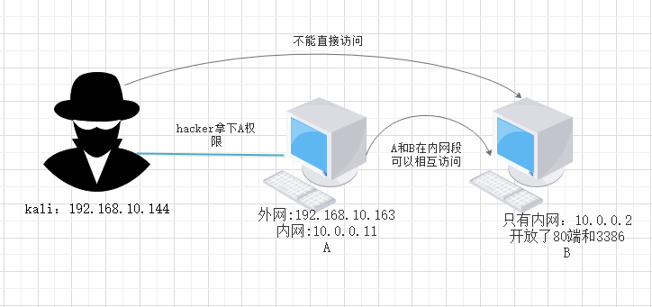

------

### 配置一个简单的内网环境

Win10 192.168.10.1 kali(攻击机)192.168.10.144 win7双网卡(nat:192.168.10.163, lan:10.0.0.11) win3(10.0.0.2)

Win3 如下配置，直接选一个lan区段

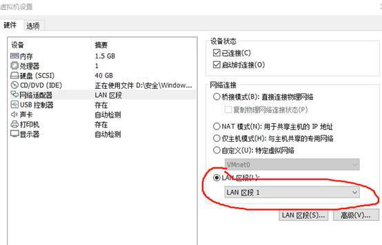

然后如下配置，看个人喜欢，但一定要和win7同一个网段

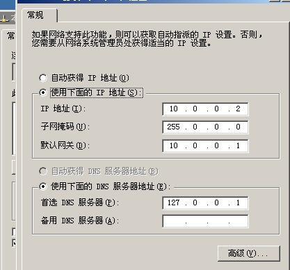

Win7设置双网卡，一个连win10(能出外网)一个连win3(内网)，配置完后的效果图

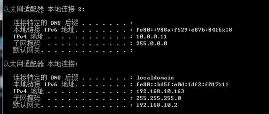

检测连通性：攻击机能与win7(192.168.10.163)相互ping、但ping不了win3(10.0.0.2)

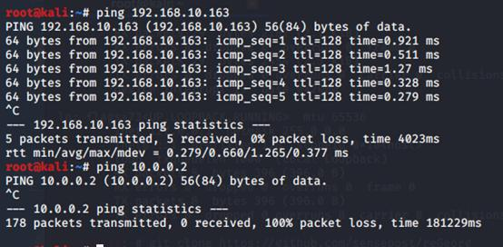

03开启web服务器简单架设一个html页面，07去访问

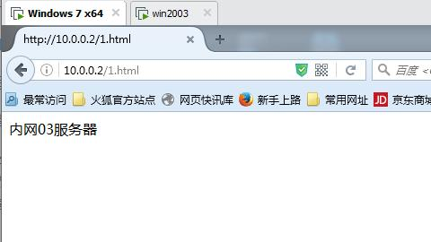

------

### 实战模拟:

假设现在win7假设的web服务权限是被拿下了的。

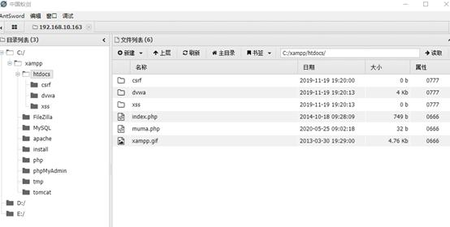

Kali下载安装reGeorg`https://github.com/sensepost/reGeorg`

因为是php搭建的环境，所以上传对应的php文件，通过蚂蚁把tunnel.nosocket.php上传到web服务器的根目录下

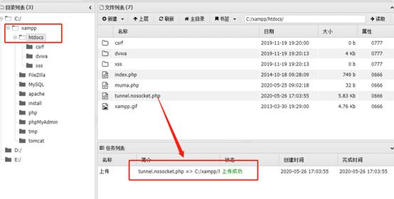

此时访问一下上传的文件对了，就是这个熟悉的画面

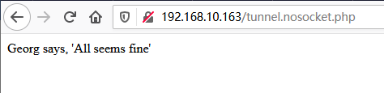

```apache
python reGeorgSocksProxy.py -l 0.0.0.0 -p 9999 -u http://192.168.10.163/tunnel.nosocket.php
```

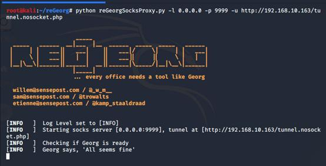

然后配置proxychains代理链的配置文件vi /etc/proxychains.conf ，将代理设置成本机的9999端口：socks5 127.0.0.1 9999 (端口号个人喜欢，最好不要设置有冲突的端口

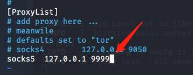

proxychains curl 10.0.0.2(目标内网)

**但是失败了，搜索了很多资料也找不到解决的方法，后来在某篇文章上看到有原因:regeorg转发端口后，如果目标服务器的php版本小于5.4，无法连接的，但是坑点在于，php5.4以后的版本并不适用与win2003。**

以下是错误的图：

HTTP [200]: Status: [FAIL]: Message [RemoteSocket read filed] Shutting down

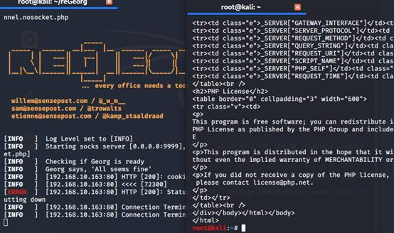

但是遇到了这样的问题，我要想办法，如果目标10.0.0.2主机开发了3386端口呢。那就能远程连桌面了，（因为当时我怕出现了其他错误，所以把9999端口改回1080端口。 果然成功了）

```armasm
proxychains rdesktop 目标内网ip
```

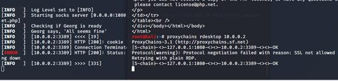

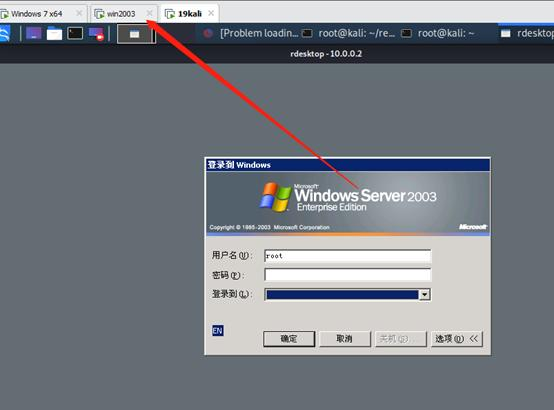

### 实验总结

regeorg转发端口后，如果目标web服务器的php版本小于5.4，是无法连接的，但是坑点在于，php5.4以后的版本并不适用与win2003。

关于reGeorg大概的一个流量走向(猜测)
流量->kaili(本地)1080端口->win7服务器的80端口(通过上传的php文件进行流量转发)->内网服务器->win7服务器的80端口->kali(本地)1080端口


参考：

https://www.freesion.com/article/3884747889/

https://github.com/sensepost/reGeorg


其他：

https://www.ddosi.org/neo-regeorg/

https://github.com/L-codes/Neo-reGeorg