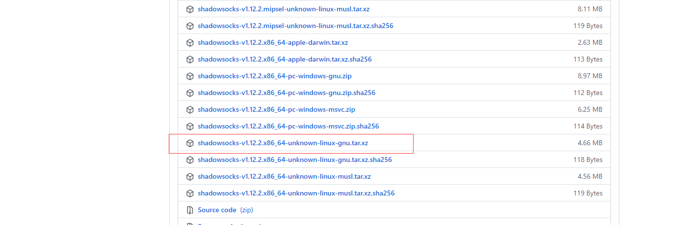
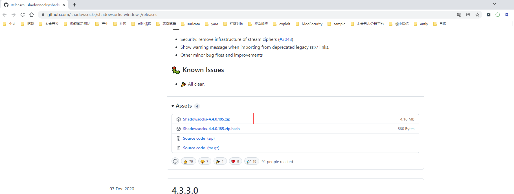
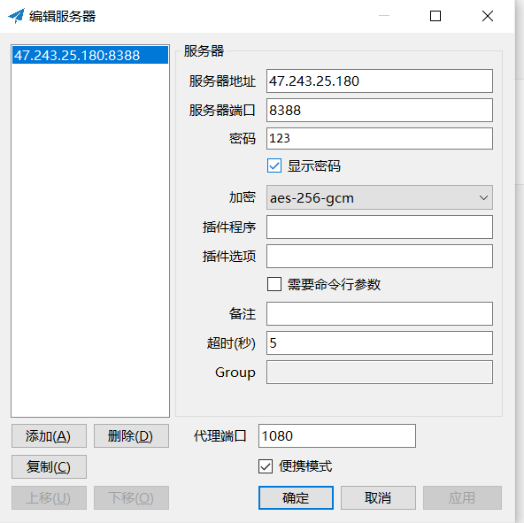
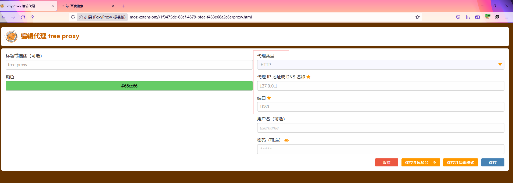
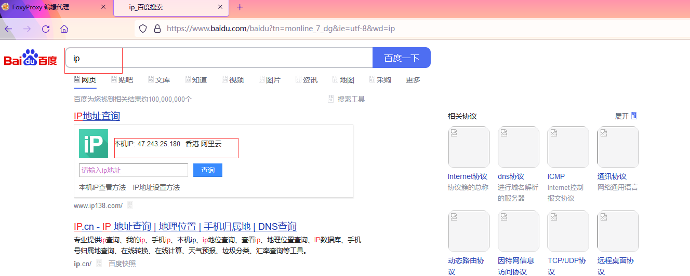
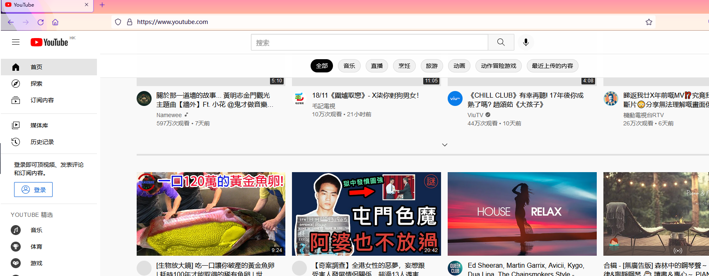

# shadowsocks-科学上网


shadowsocks服务端下载：

https://github.com/shadowsocks/shadowsocks-rust/releases





解压：

```shell
[root@xuegod63 ~]# xz -d shadowsocks-v1.12.2.x86_64-unknown-linux-gnu.tar.xz
[root@xuegod63 ~]# mkdir shadowsocks
[root@xuegod63 ~]# cd shadowsocks
[root@xuegod63 shadowsocks]# mv ../shadowsocks-v1.12.2.x86_64-unknown-linux-gnu.tar .
[root@xuegod63 shadowsocks]# ll
total 27752
-rw-r--r-- 1 root root 28416000 Nov 19 18:23 shadowsocks-v1.12.2.x86_64-unknown-linux-gnu.tar
[root@xuegod63 shadowsocks]# tar xvf shadowsocks-v1.12.2.x86_64-unknown-linux-gnu.tar
sslocal
ssserver
ssurl
ssmanager
[root@xuegod63 shadowsocks]# ll
total 55504
-rw-r--r-- 1 root root 28416000 Nov 19 18:23 shadowsocks-v1.12.2.x86_64-unknown-linux-gnu.tar
-rwxr-xr-x 1 lisa  121 10289840 Nov 16 16:09 sslocal
-rwxr-xr-x 1 lisa  121  7535112 Nov 16 16:08 ssmanager
-rwxr-xr-x 1 lisa  121  7370928 Nov 16 16:09 ssserver
-rwxr-xr-x 1 lisa  121  3213064 Nov 16 16:08 ssurl
```


添加配置文件`config.json`

```shell
[root@xuegod63 shadowsocks]# vi config.json
[root@xuegod63 shadowsocks]# cat config.json
{
    "server": "0.0.0.0",                        #服务器监听所有ip
    "server_port": 8388,                        #服务器端口
    "password": "123",                           #服务器密码
    "method": "aes-256-gcm",                    #加密类型
    // ONLY FOR `sslocal`
    // Delete these lines if you are running `ssserver` or `ssmanager`
    "local_address": "127.0.0.1",              
    "local_port": 1080
}

```


启动服务器`ssserver`：

```shell
[root@xuegod63 shadowsocks]# ./ssserver -c config.json
./ssserver: /lib64/libc.so.6: version `GLIBC_2.18' not found (required by ./ssserver)   #报错
```


报错解决：

https://blog.csdn.net/lj2048/article/details/112425892

```shell
[root@xuegod63 ~]# strings /usr/lib64/libstdc++.so.6 | grep GLIBC     #查看是否包含GLIBC_2.18
GLIBCXX_3.4
GLIBCXX_3.4.1
GLIBCXX_3.4.2
GLIBCXX_3.4.3
GLIBCXX_3.4.4
GLIBCXX_3.4.5
GLIBCXX_3.4.6
GLIBCXX_3.4.7
GLIBCXX_3.4.8
GLIBCXX_3.4.9
GLIBCXX_3.4.10
GLIBCXX_3.4.11
GLIBCXX_3.4.12
GLIBCXX_3.4.13
GLIBCXX_3.4.14
GLIBCXX_3.4.15
GLIBCXX_3.4.16
GLIBCXX_3.4.17
GLIBCXX_3.4.18
GLIBCXX_3.4.19
GLIBC_2.3
GLIBC_2.2.5
GLIBC_2.14
GLIBC_2.4
GLIBC_2.3.2
GLIBCXX_DEBUG_MESSAGE_LENGTH
[root@xuegod63 ~]# yum install gcc
[root@xuegod63 ~]# mkdir software && cd software
[root@xuegod63 software]# wget http://ftp.gnu.org/gnu/glibc/glibc-2.18.tar.gz
--2021-11-19 18:40:42--  http://ftp.gnu.org/gnu/glibc/glibc-2.18.tar.gz
Resolving ftp.gnu.org (ftp.gnu.org)... 209.51.188.20, 2001:470:142:3::b
Connecting to ftp.gnu.org (ftp.gnu.org)|209.51.188.20|:80... connected.
HTTP request sent, awaiting response... 200 OK
Length: 23428909 (22M) [application/x-gzip]
Saving to: ‘glibc-2.18.tar.gz’

100%[===================================================>] 23,428,909  5.37MB/s   in 4.2s

2021-11-19 18:40:47 (5.37 MB/s) - ‘glibc-2.18.tar.gz’ saved [23428909/23428909]

[root@xuegod63 software]# ll
total 22880
-rw-r--r-- 1 root root 23428909 Aug 13  2013 glibc-2.18.tar.gz
[root@xuegod63 software]# tar zxf glibc-2.18.tar.gz
[root@xuegod63 software]# cd glibc-2.18
[root@xuegod63 glibc-2.18]# mkdir build
[root@xuegod63 glibc-2.18]# cd build/
[root@xuegod63 build]# ../configure --prefix=/usr              
[root@xuegod63 build]# sudo make -j4                    #等待几分钟
[root@xuegod63 build]# sudo make install
[root@xuegod63 build]# strings /usr/lib64/libstdc++.so.6 | grep GLIBC     #查看，但仍然没有，没关系，继续启动服务器

```


成功启动服务：

```shell
[root@xuegod63 shadowsocks]# ./ssserver -c config.json
2021-11-19T19:01:36.108888756+08:00 INFO  shadowsocks server 1.12.2 build 2021-11-16T08:08:35.305971730+00:00
2021-11-19T19:01:36.109958919+08:00 INFO  shadowsocks tcp server listening on 0.0.0.0:8388, inbound address 0.0.0.0:8388

```


shadowsocks-windows客户端下载：

https://github.com/shadowsocks/shadowsocks-windows/releases




添加配置并确定：



浏览器设置代理：




代理成功：




测试：https://www.youtube.com/



