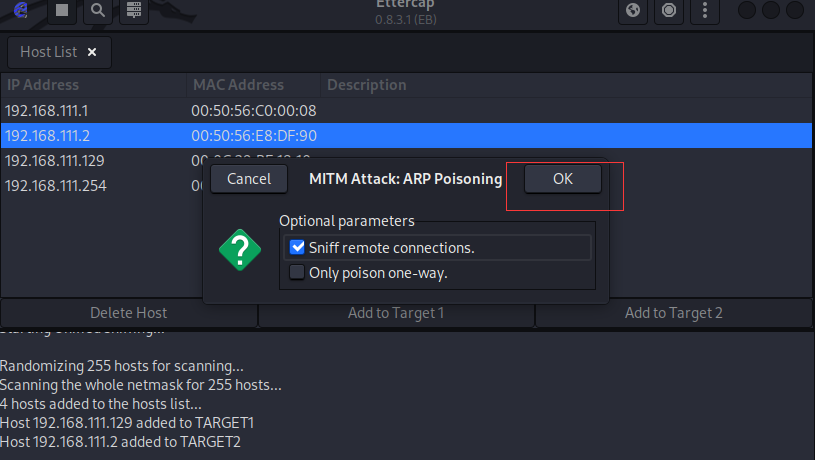

### 演练环境

| 角色   |   IP |  MAC  |
| :-------: | :-----: | :--: |
| 攻击者 | 192.168.111.128 |  00:0c:29:13:10:dd   |
| 受害者   |   192.168.111.129 |  00:0c:29:bf:18:10  |
| 网关     |    192.168.111.2 | 00:50:56:e8:df:90 |

### 1.启动ettercap工具

`sudo ettercap -G`，点击√，开启

### 2.点击搜索，开始搜索该网段下的存活主机，所以不能随便连接WIFI,并进行网站登录操作

### 3.查看结果：

### 4.选中192.168.111.129，点击 Add to Target1，选中192.168.111.2,点击 Add to Target2

解释：

1.欺骗受害者：192.168.111.129发包给网关时，网关是我：00:0c:29:13:10:dd

2.欺骗网关：192.168.111.2回包时，接收者是我：00:0c:29:13:10:dd

3.然后将受害者：192.168.111.129的流量转发到网关：192.168.111.2

毒化前受害者:192.168.111.129的arp表

### 5.开始arp毒化攻击：

点击OK

毒化后受害者:192.168.111.129的arp表：

### 6.受害者：192.168.111.129,登录7k7k账号：http://www.7k7k.com/

### 7.抓取结果：`HTTP : 113.96.147.69:80 -> USER: qweqwe  PASS: qeqweqwe  INFO: http://www.7k7k.com/`

### 7k7k登录数据包：

### 网络中ettercap工具不断的在欺骗，192.168.111.2和192.168.111.129的mac地址是我：00:0c:29:13:10:dd

