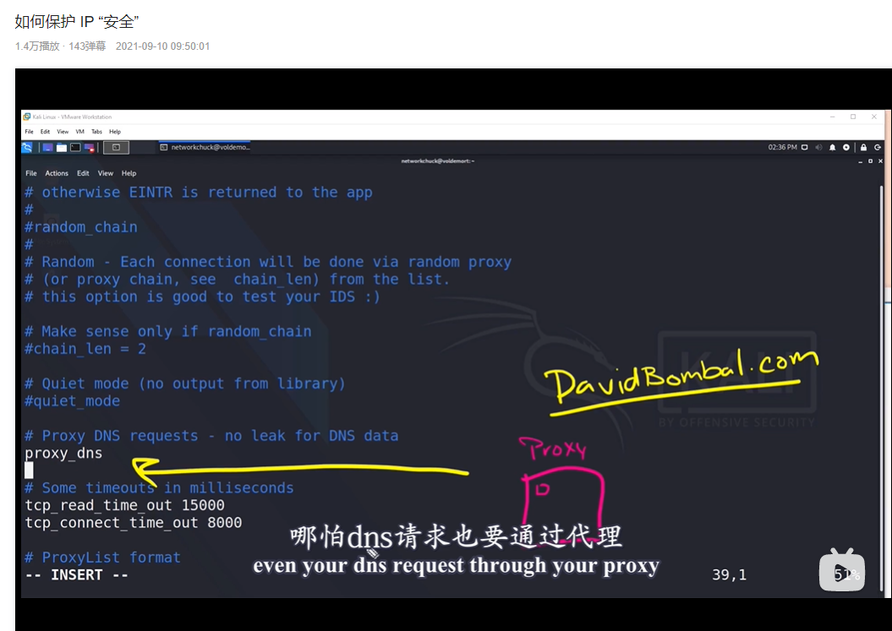

**代理链--proxychains应用**

**1、需要查每一台代理服务器上的日志才能找到真实ip**

**2、获得proxychains的配置文件：/etc/proxychains4.conf**

┌──(kali㉿kali)-[~/桌面]

└─$ locate proxychains

**3、修改proxychains4.conf配置文件**

┌──(kali㉿kali)-[~/桌面]

└─$ sudo vi /etc/proxychains4.conf

**3.1 设置为dynamic\_chain：动态模式，注释strict\_\_chain：严格模式，round\_robin\_chain：随机模式**

**3.2 动态模式，动态遍历列表中每个代理**

**3.3 随机模式，ip地址都会不一样，如果其中一个代理坏了，自动更换**

**3.4 默认开启dns代理，dns请求也要通过代理**

**3.5 添加新行：socks 5 192.168.111.1 1090,保存退出（可以添加对行，多层代理），并注释：socks4 127.0.0.1 9050**

设置代理的设置格式说明：

格式：协议类型 代理ip 代理端口 用户名（如果有） 密码（如果有）

**4、确认是否生效，goole.com可以访问，则生效**

┌──(kali㉿kali)-[~/桌面]

└─$ proxychains firefox google.com

**5、执行nmap命令，有误报，不准确**

┌──(kali㉿kali)-[~/桌面]

└─$ proxychains nmap -sT -p 80,443,65522,21,1111 175.24.115.4

**6、实际上**

**7、加一层代理：http 3.236.52.219 8888**

**8、效果:可以看到125.26.99.228请求dns,获得google.com的iP:172.217.2.110**

**攻击链：125.26.99.228-->3.236.52.219-->172.217.2.110**

**9、攻击:proxychains nmap -sT --p 80,443 217.160.0.69**

**攻击链：125.26.99.228-->3.236.52.219-->217.160.0.69**

**10、获取代理软件，谷歌搜索：free proxy sever list**

参考：

https://www.bilibili.com/video/BV1NQ4y1r7Fa?from=search&seid=782483086958192376&spm_id_from=333.337.0.0

**结束！**
