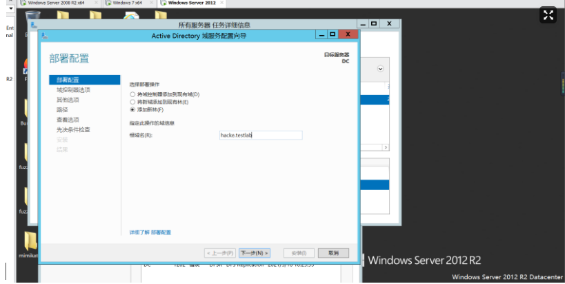
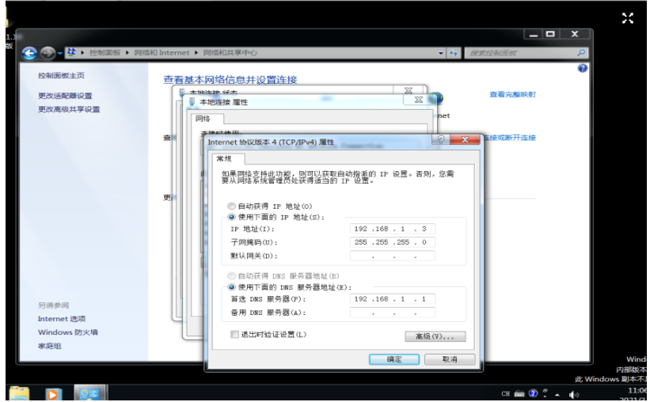

# [内网渗透|初识域基础及搭建简单域](https://forum.butian.net/share/494)

# 第一部分 内网基础知识点

**内网**也指局域网，是指在某一区域由多台计算机互连而成的计算机组。

## 1工作组

对局域网中的计算机进行分类，使得网络更有序。计算机的管理依然是各自为政，所有计算机依然是对等的，松散会员制，可以随意加入和退出，且不同工作组之间的共享资源可以相互访问。

## 2.域

分类：单域、子域、父域、域树、域森林、DNS域名服务器

“域”是一个有安全边界的计算机组合（一个域中的用户无法访问另一个域中的资源），域内资源由一台域控制器（Domain Controller，DC）集中管理，用户名和密码是放在域控制器去验证的。

优点：通过组策略来统一管理。

单域：即只有一个域的网络环境，一般需要两台DC，一台DC，另一台备用DC（容灾）

父子域：类比公司总部和公司分部的关系，总部的域称为父域，各分部的域称为该域的子域。使用父子域的好处：

• 减小了域之间信息交互的压力（域内信息交互不会压缩，域间信息交互可压缩）

• 不同的子域可以指定特定的安全策略

父子域中域名使用一个.表示一个层次，类似于DNS域名表示方式，子域只能使用父域的名字作为域名后缀

域树：多个域通过建立信任关系组成的集合。若两个域之间需要相互访问，需要建立信任关系（Trust Relation），通过信任关系可以将父子域连接成树状结构

域森林：多个域树通过建立信任关系组成的集合。

域名服务器：实现域名到IP地址的转换。由于域中计算机使用DNS来定位DC、服务器和其他计算机的，所以域的名字就是DNS域的名字。

内网渗透中，大都是通过寻找DNS服务器来确定域控制器位置（因为DNS服务器和域控制器通常配置在一台机器上）

## 3.活动目录

活动目录（Active Directory，AD）是指域环境中提供目录服务的组件，用于存储有关网络对象（用户、组、计算机、共享资源、联系人）的信息。基于活动目录有目录服务，用于帮助用户从活动目录中快速找到所需的消息。活动目录使得企业可以对网络环境进行集中管理。（可类比为内网中的索引，里面存储有内网里所有资源的快捷方式）

活动目录的逻辑结构包含组织单元、域、域树、域森林。域树内的所有域共享一个活动目录，因此非常适合进行统一管理。

活动目录的功能：

• 账号集中管理

• 软件集中管理

• 环境集中管理

• 增强安全性

• 更可靠、更短的宕机时间

**域和活动目录的区别：**要实现域环境，其实就是要安装AD。一台计算机安装了AD之后就变成了DC。

## 4.安全域的划分

1.内网（安全级别最高）：分为核心区（存储企业最重要的数据，只有很少的主机能够访问）和办公区（员工日常工作区，一般能够访问DMZ，部分主机可以访问核心区）

2.DMZ（Demilitarized Zone，边界网络，隔离区，安全级别中等）：作为内网中安全系统和非安全系统之间的缓冲区，用于对外提供服务，一般可以放置一些必须公开的服务器设施

3.外网（Internet，安全级别最低）

拥有DMZ的网络需要制定一些访问控制策略：

1. 内网可以访问外网

2. 内网可以访问DMZ

3. 外网不能访问内网

4. 外网可以访问DMZ

5. DMZ不能访问内网

6. DMZ不能访问外网
   ## 5.域中计算机的分类

   域控制器、成员服务器、客户机、独立服务器

   • 域控制器：用于管理所有的网络访问，存储有域内所有的账户和策略信息。允许网络中拥有多台域控制器（容灾）

   • 成员服务器：安装了服务器操作系统并加入了域，但没有安装活动目录的计算机，主要任务是提供网络资源

   • 客户机：安装了其他操作系统的计算机，利用这些计算机和域中的账户就可以登录到域。

   • 独立服务器：和域无关，既不加入域，也没有活动目录

   ## 6.域内权限

   • 域本地组：

   • 多域用户访问单域资源

   • （访问同一个域），主要用于授予本域内资源的访问权限，可以从任何域中添加用户账号、通用组和全局组。域本地组无法嵌套在其他组中

   • 全局组：

   • 单域用户访问多域资源

   • （必须是同一个域中的用户），只能在创建该全局组的域中添加用户和全局组，但可以在域森林中的任何域内指派权限，也可以嵌套在其他组中

   • 通用组：多域用户访问多域资源，成员信息不保存在域控制器中，而是保存在全局编录（GC）中，任何变化都会导致全林复制

   ## 7.A-G-DL-P策略：

   A：用户账户

   G：全局组

   DL：域本地组

   P：许可，资源权限

   先将用户账号添加至全局组中，再将全局组添加至域本地组中，然后为域本地组分配资源权限。

   ## 8.域内权限解读

   域本地组：来自全林作用于本域

   全局组：来自本域作用于全林

   通用组：来自全林作用于全林

   本地域组的权限

   Administrators（管理员组） ————最重要的权限

   Remote Desktop Users（远程登录组）

   Print Operators（打印机操作员组）

   Account Operators（帐号操作员组）

   Server Operaters（服务器操作员组）

   Backup Operators（备份操作员组）

   全局组、通用组的权限

   Domain Admins（域管理员组）————最最最重要的权限，一般来说域渗透是看重这个

   Enterprise Admins（企业系统管理员组）————最重要的权限，其次是去看重这个权限

   Schema Admins（架构管理员组）————最重要的权限

   Domain Users（域用户组)

7. 通常DNS服务器与域控制器会在同一台机器上

8. 一个域内至少需要两台DC，需要一台用作备份 ## 9.域的优点(为什么使用域)

1、权限管理比较集中，管理成本降低
域环境中，所有的网络资源，包括用户均是在域控制器上维护的，便于集中管理，所有用户只要登入到域，均能在域内进行身份验证，管理人员可以较好的管理计算机资源，管理网络的成本大大降低；同时在域环境中也可以防止企业员工在域成员主机上违规安装软件，增强客户端安全性，减少客户端故障，降低维护成本。

2、保密性加强
有利于企业的一些保密资料的管理，可以单独对资源进行权限控制，允许或拒绝特定的域账户对资源的请求。

3、安全性加强
使用漫游账户和文件夹重定向，个人账户的工作文件及数据等可以存储在服务器上，进行统一备份及管理，使用户的数据更加安全有保障；同时域控制器能够分发应用程序、系统补丁，用户可以选择安装，也可以由系统管理员指派自动安装，数据及系统安全性大大提高。

4、提高了便捷性
可由管理员指派登陆脚本映射，用户登录后就可以像使用本地盘符一样，使用网络上的资源，且不需要再次输入密码。

基于以上原因，很多企业的内网均会采用域环境，所以作为一名合格的渗透测试人员，域渗透的常规思路和技巧要熟练掌握。

# 第二部分 常用工具分类

## 1.主机平台及常用工具总结：

• WCE（Windows凭据管理器）

• minikatz（从内存中获取明文密码）

• Responder（嗅探网络中所有的LLMNR包，获取主机的信息）

• BeEF（一款针对浏览器的渗透测试工具）

• DSHashes（从NTDSXtract中提取用户易于理解的散列值）

• PowerSploit（一款基于PowerShell的后渗透测试框架）

• Nishang（一款针对Powershell的渗透测试工具）

• Empire（一款内网渗透测试利器）

• ps_encoder.py（使用Base64编码封装的Powershell命令包）

• smbexec（一个使用samba工具的快速psExec工具）

• 后门制造工厂（对PE、ELF等二进制注入Shellcode）

• Veil（用于生成绕过常见杀软的Metasploit有效载荷）

• Metasploit（计算机安全漏洞项目框架）

• Cobalt Strike（一款优秀的后渗透测试平台）

## 2.Windows渗透常用工具

• Nmap（一款免费的网络发现和安全审计工具）

• Wireshark（一款免费且开源的网络协议和数据包解析器）

• PuTTY（一款免费且开源的SSH和Telnet客户端）

• SQLMap（一款免费且开源的SQL注入工具）

• BurpSuite（一款针对Web应用程序进行安全测试的代理工具）

• Hydra（一个网络登录暴力破解工具）

• Getif（一款收集SNMP设备信息的工具）

• Cain&Abel（一个密码恢复工具，集成嗅探等多种功能）

• PowerSploit（一款基于PowerShell的后渗透测试框架）

• Nishang（一款针对Powershell的渗透测试工具）

## 3.PowerShell基本命令

#### 1.查看Powershell版本

Get-Host
$PSVersionTable.PSVERSION

### 2.Powershell 常用命令

New-Item hack -ItemType Directory #新建目录

New-Item ailx0000.txt -ItemType File #新建文件

Set-Content .\ailx0000.txt -Value “hi hacker ailx10…” #写文件

Add-Content .\ailx0000.txt -Value “ooops~” #追加内容

Get-Content .\ailx0000.txt #显示内容

Clear-Content .\ailx0000.txt #清楚内容

Remove-Item .\ailx0000.txt #删除文件

### 3.常见用途：

1、绕过本地权限并执行

2、从网站服务器中下载脚本，绕过本地权限并偷偷执行

3、使用Base64对PowerShell命令进行编码

# 第三部分：内网环境搭建

## 实验：搭建内网环境

1.搭建域环境

实验环境

工具： vmvare、winserver2012、winserver2008、win7镜像

1.首先配置win12的ip地址。

2.在控制面板-系统和安全-计算机名、域和工作组-计算机名—更改—计算机名

3.安装域控制器和dns服务。

4.升级服务器

5.安装

6.创建ACtive Director用户

7.然后下一步下一步，最后再添加testuser用户

**win7**

1.先更改ip地址，然后设置dns地，然后ping一下试试。

2.ping通，说明前半部分搭建成功。

3.更改计算机名，更改为win7-X64-test，将域名更改为hacke.testdb

4.然后输入域管理员的账号和密码，登录成功。

**win2008**

1.其实win2008和win7配置方法一样。先配置ip地址和dns地址。

2.将主机加到域中，改计算机名字。

3.然后登录

4.这样就搭建了一个小型内网。

## 2.搭建其他服务器环境

• Metasploit2

• Metasploit3

• OwaspBWA

• DVWA

参考

https://forum.butian.net/share/494