**十分钟带你了解HTTPS、CA（Certificate Authority）、自签名证书**

**一、HTTPS工作原理**

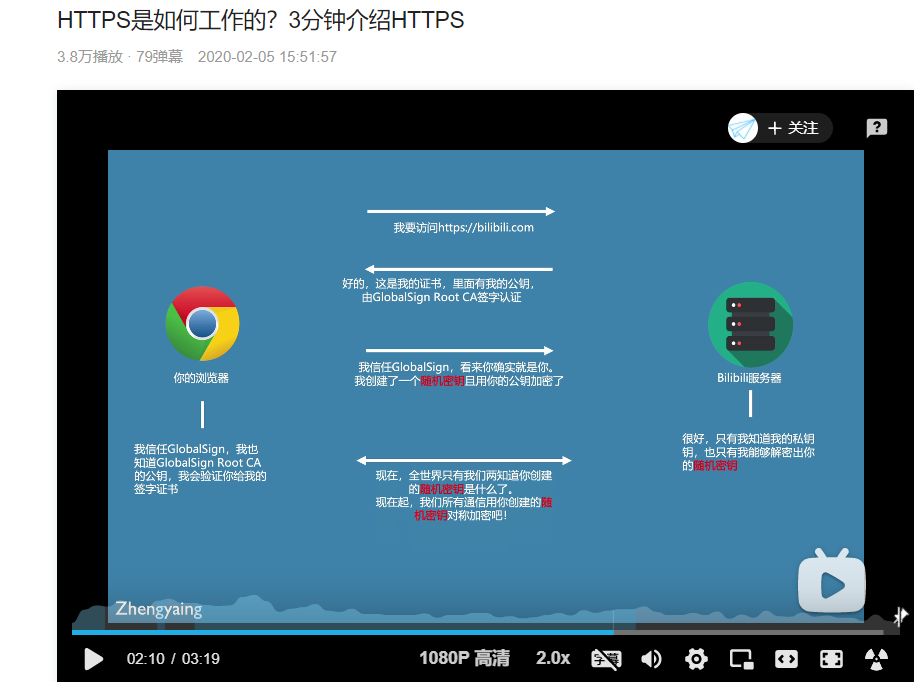

**1、交互过程**

0x01 浏览器：请求 youtube.com资源

0x02 服务器：Youtube.com网站会回应说：这是我的证书，该证书包含我的公钥，随便说一下，这个证书是由Google认证机构签署的，

0x03 浏览器：看起来你就是你所说的你看，因为我信任你，我已经创建了一个随机的对称密码串，我已经用你的公钥加密了这个随机的对称密码串（我相信谷歌，我也知道Google CA’s 的公钥，因此，我将验证该证书是否真的由Google证书颁发机构签署）

0x04 服务器：浏览器智能的选择，只有我的私钥能解密这个，现在我有了新的秘密，你也可以随机的创建它

0x05 然后双方都意识到整个互联网仅有的两台机器，从现在开始，只有他们知道这个新的秘密钥匙，让我们用这个新建的来加密我们所有通信

0x06 基于我们之前信任的原则，我们现在已经在浏览器和服务器之间创建了一个安全的通信通道

0x07 所有潜在攻击者都可能看到的是一个用youtube公钥加密的消息，因为攻击者不会有你的私钥


**2、简单解释：**

0x01浏览器：请求资源

0x02服务器：给证书

0x03浏览器：生成随机密码，并用证书上的公钥加密该密码

0x04服务器：用私钥解密，获取该密码

建立成功：两者就可以加密通信


**二、什么是认证机构Certificate Authority，简称:CA，到目前为止他们的证书是如何签署的？**

你如何确保你所交谈的对象实际上是他们自称的那个人，这就是认证机构的用武之地


**1、签名目前理解为：将私钥复制到证书上，别人可以用公钥证实**

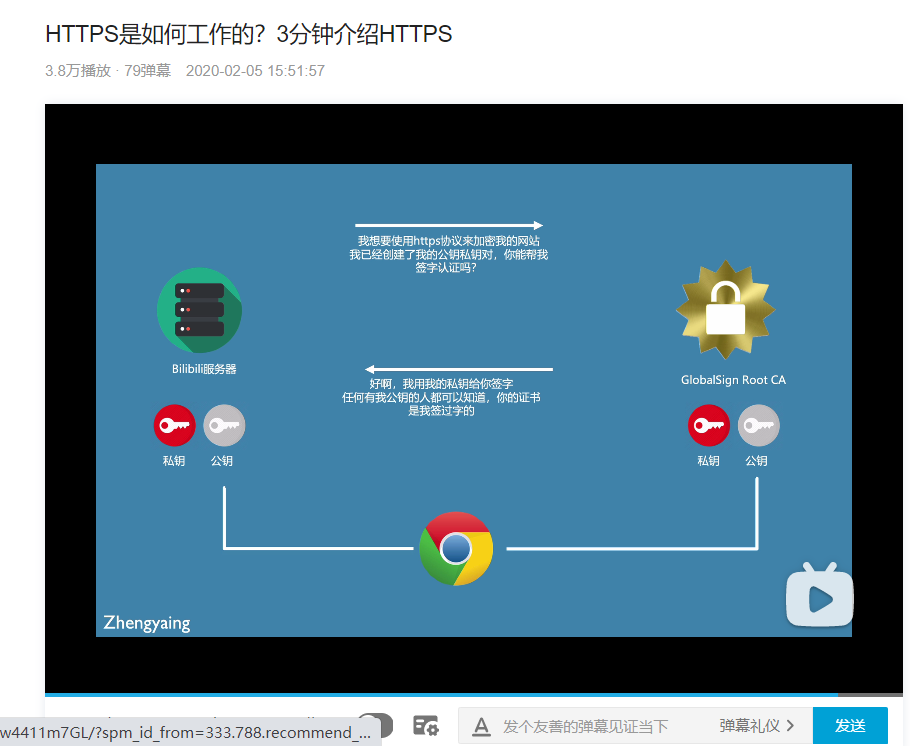


**2、交互过程：**

0x01 服务器：已经创建了一个证书签名请求，用我的密钥对，您（Gooogle证书颁发机构）能签个名吗

0x02 Google CA：我已经用我的私钥签署了你的请求，任何一个拥有我的公钥的人都可以证实大多数浏览器，当它们被交付时，已经有了一个受信任的证书列表，这些证书是由已知的证书颁发机构颁发的（谷歌就是其中之一）

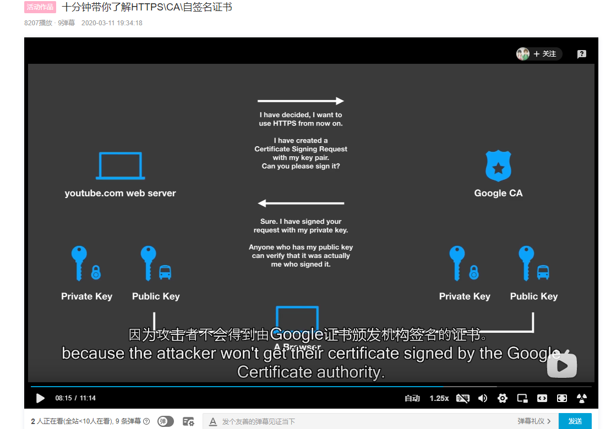


**三、什么是自签名证书？**

**1、再创建一对秘钥，也可以理解为刚刚创建了自己的证书颁发机构**

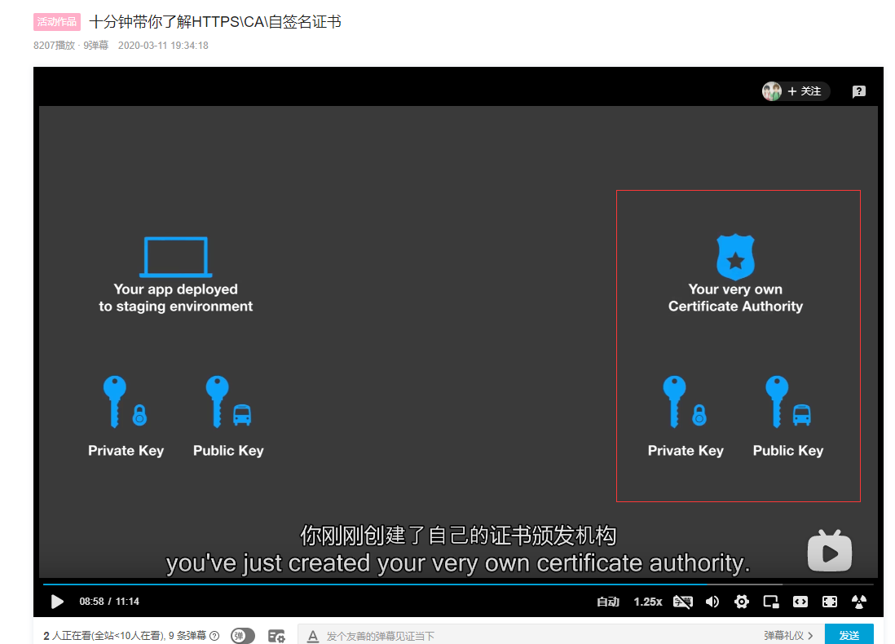


**2、签署请求并将其发送给认证机构**

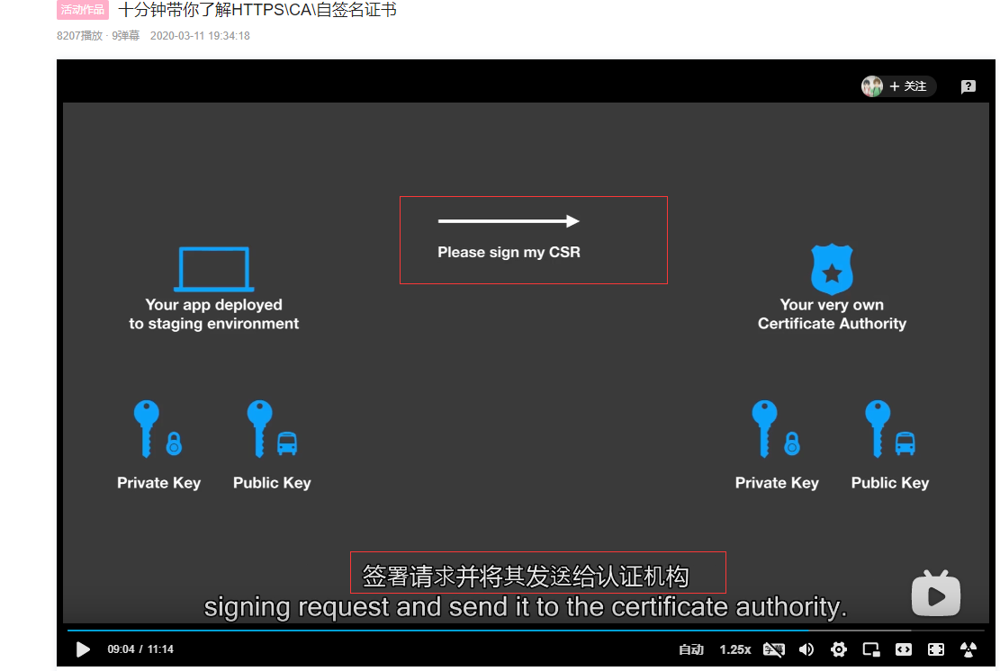


**3、进行签名，任何有我的公钥的人都可以验证它是由我签名的**

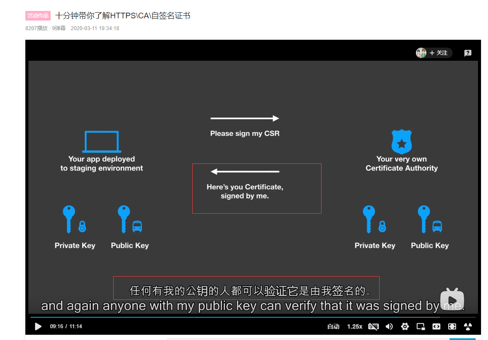


**4、现在第二款应用要和第一款应用进行交互**

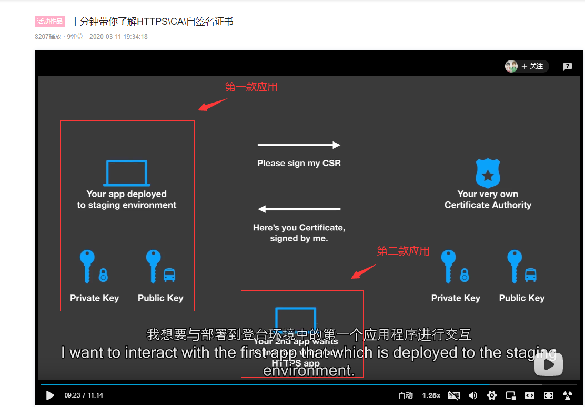

**交互过程：**

0x01第二款应用：意识到你的应用想使用https，因此，它查看证书并在那里找到一个公钥

0x02第一款应用：这个证书现在说，我是有我自己的认证机构签署的

0x03第二款应用：你的第二次访问，发现这不是一个值得信赖的权威，我不会相信证书

0x04第一款应用：如果你信任我所指的证书认证机构，它包含了这个公钥，然后你可以用它来验证我们部署的第一个应用程序的公钥

0x05第二款应用：是的，只要我们信任这个证书颁发机构，我们可以在这里使用https

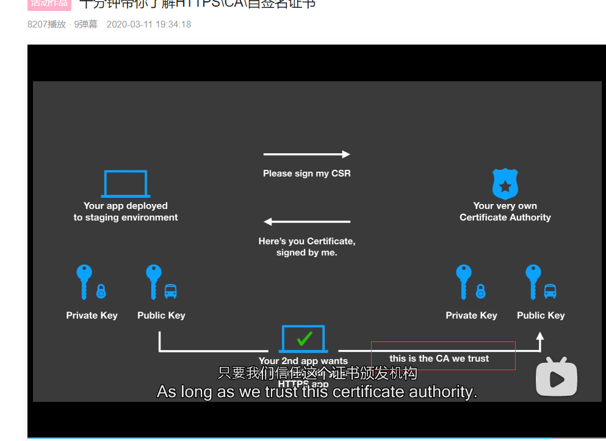


**参考：**

<https://www.bilibili.com/video/BV1NE411K7V6?from=search&seid=11775034753391709356&spm\_id\_from=333.337.0.0>


**实战-实现HTTPS通信：**

**1、openssl生成自签名证书，结果：当前目录多出：local.test.pem文件**

    [root@VM-0-10-centos home]# openssl req -new -x509 -keyout local.test.pem -out local.test.pem -days 365 -nodes -subj "/C=US/ST=CA/L=LA/O=Test/CN=www.youwant.com"
    
    Generating a 2048 bit RSA private key
    
    ........................................................................+++
    
    ..........................................+++
    
    writing new private key to 'local.test.pem'
    
    -----
    
    [root@VM-0-10-centos home]# 


**2、解释：**

req      :伪命令req大致有3个功能：生成证书请求文件、验证证书请求文件和创建根CA

-new    :说明生成证书请求文件

-x509   :说明生成自签名证书

-keyout  :指定私钥保存位置（本次位置为：local.test.pem文件里）

-out    :你的证书存在的位置  (指定生成的证书请求或者自签名证书名称)（本次位置为：local.test.pem文件里）

-day   :所颁发的证书有效期

-nodes  :私钥不加密

-subj  :证书的内容（如果不加，就会有提示输入证书信息）

本次key和cert都存放在了```local.test.pem```文件里，如图:

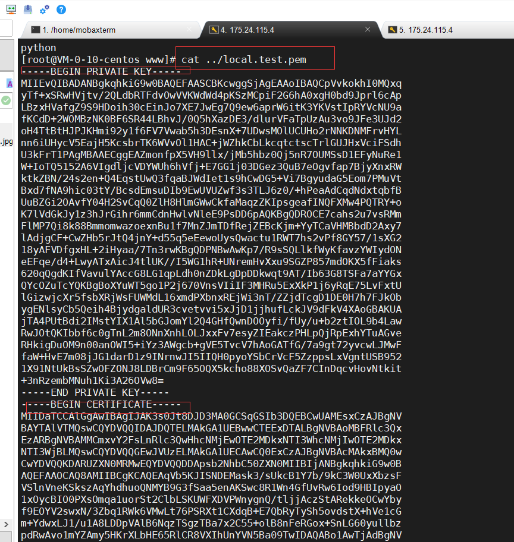


**3、通过python3 -m http.server或python2 -m SimpleHTTPServer方式可以开启http服务，本次执行simple-https-server.py脚本开启http服务如下：**

    import http.server,ssl
    server_ip = '0.0.0.0'
    server_port = 4443
    server_address = (server_ip,server_port)
    server_cert = '../local.test.pem'
    
    httpd = http.server.HTTPServer(server_address,http.server.SimpleHTTPRequestHandler)
    httpd.socket = ssl.wrap_socket(httpd.socket,
                                   server_side=True,
                                   certfile=server_cert,
                                   ssl_version=ssl.PROTOCOL_TLS)
    
    print("Server HTTPS on " + server_ip + " port " + str(server_port) + " (https://" + server_ip + ":" + str(server_port) + ") ...")
    
    httpd.serve_forever()


**4、将local.test.pem证书和simple-https-server.py脚本放到：/home/路径下**

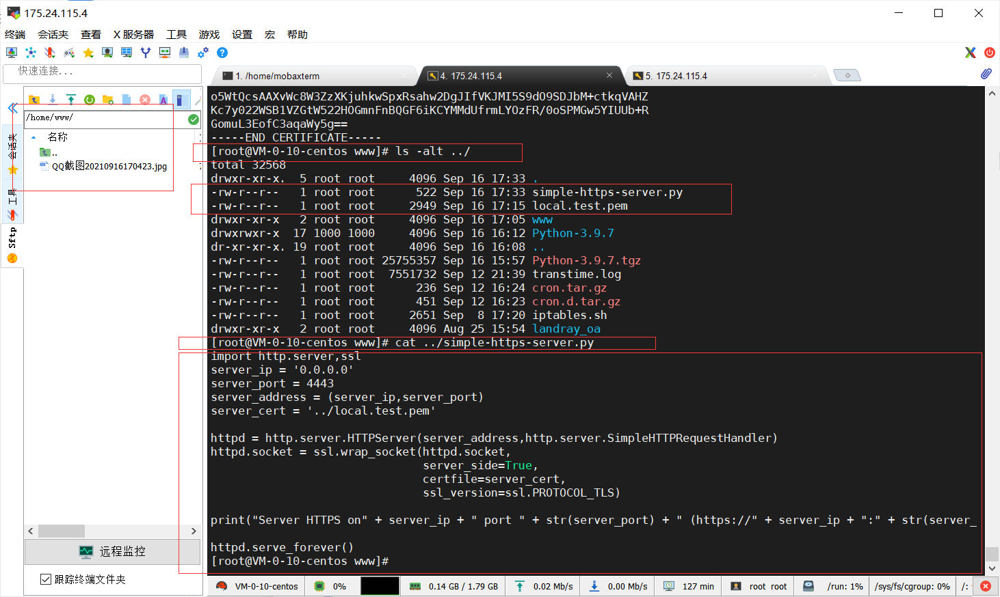


**5、启动http服务，在/home路径下创建www文件夹并进入且执行simple-https-server.py，这样在访问http服务器时就看不到local.test.pem证书文件**

    [root@VM-0-10-centos home]# mkdir www && cd www
    
    [root@VM-0-10-centos www]# python ../simple-https-server.py   #在上一级目录执行脚本，但web根目录在当前目录
    
    Server HTTPS on0.0.0.0 port 4443 (https://0.0.0.0:4443) ...


**6、成功访问:https://175.24.115.4:4443/**

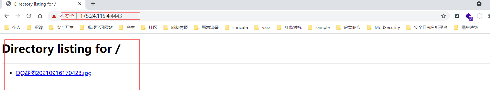

**参考：**

<https://www.bilibili.com/video/BV1Dy4y117eg?from=search&seid=11775034753391709356&spm\_id\_from=333.337.0.0>


**结束！**

