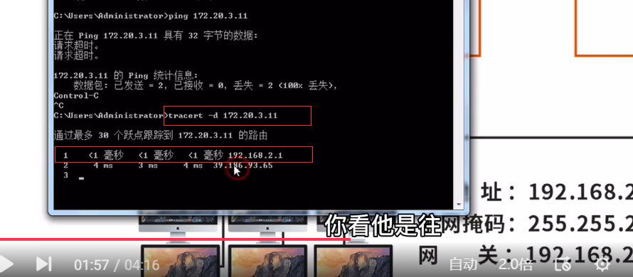
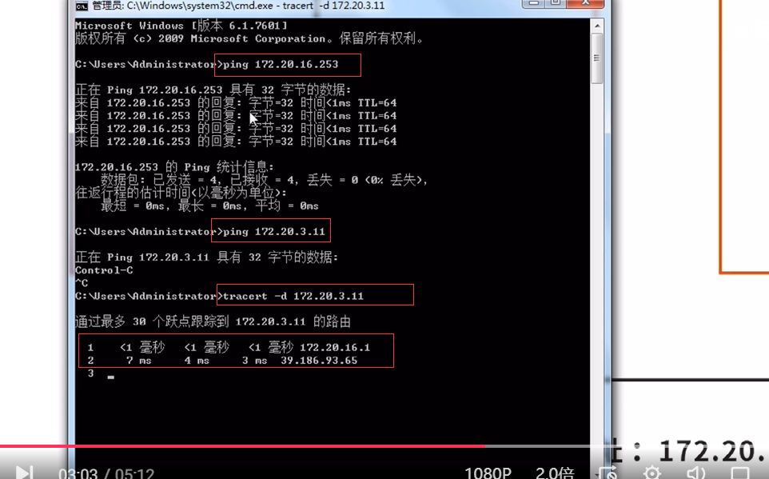
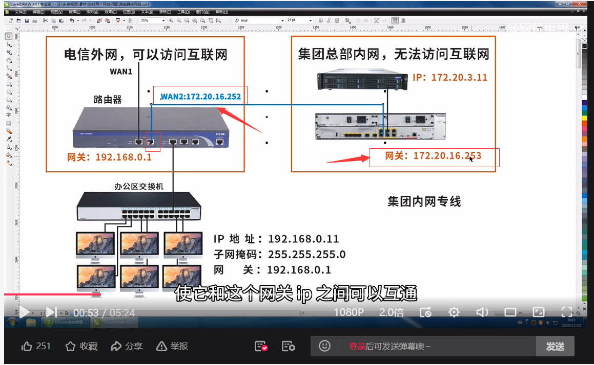

# 即可访问内网又可访问外网


## 方法一：个人主机

**0x01 拓扑图：**

网段一：电信外网：192.168.2.0/24

网段二：集团内网专线：172.20.16.0/24


**0x02 这是可以上网的ip:192.168.2.11**


**0x03 点击高级,添加ip:172.20.16.2**


**0x04 即可ping该网关：172.20.16.253**

```shell
ping 172.20.16.253
```


**0x05 此时ping不通集团内网ip:172.20.3.11**

```
ping 172.20.3.11
```


**0x06 因为跟踪路由发现，网关走的是:192.168.2.1**

```shell
tracert -d 172.20.3.11
```





**0x07 因此需要添加路由，告诉机器访问：172.20.3.0/24网段时，走网关：172.20.16.253**

```shell
route add 172.20.3.0 mask 255.255.255.0 172.20.16.253 -p

解释：
172.20.3.0：目标：将要访问的目标网段
172.20.16.253：网关：访问目标网络需要走的网关
255.255.255.0：子网掩码
-p：表示永久路由

route print -4   #可通过该命令查看IPV4路由表
route delete  172.20.3.0   #可通过该命令删除刚刚添加的永久路由，参数：delte+目的网段网络地址
```


**0x08 添加成功，成功ping通目标ip:172.20.3.11，并再次追踪路由，可以看到，走的网关是刚刚添加的ip：172.20.16.253**

```shell
ping 172.20.3.11
tracert -d 172.20.3.11
```


这个方法有个缺点：

每台电脑都要设置双ip以及静态路由，电脑多的话设置起来太麻烦，还有改进的方法！


**参考：**

https://www.ixigua.com/6904812037722145291


## 方法二：路由器动脑筋


**0x01 拓扑图：**


**0x02 将路由器网段改成和集团网关一个段，登录路由器web修改ip地址为：172.20.16.1**


**0x03 拓扑图就变为:**


**0x04 查看个人电脑ip为：172.20.16.97，网关为：172.20.16.1**


**0x05 可以ping通172.20.16.253网关，但ping不通集团内网ip:172.20.3.11**

跟踪路由发现走到172.20.16.1网关后，没有走：172.20.16.253集团内网专线网关，还是从电信的外网：39.186.93.65走的




**0x06 设置静态路由**

 所以需要设置静态路由，可以在个人电脑上设置，如果电脑多就很麻烦，也可以在路由器设置，本次在路由器上设置


**0x07 成功访问：可以ping通:172.20.3.11**


这个方法有个缺点：

需要更改原来的网段，还有改进的方法！


**参考：**

https://www.ixigua.com/6824266718953603598?id=6905542814256333325&logTag=18bd6b00655ff5fa59f9


## 方法三：用双WAN口路由器


**0x01 拓扑图：**




**0x02 路由器设置：**

**0x03 WAN1口设置为手动模式：**


**0x04 WAN2设置为：静态模式**

```
ip地址：172.20.16.252
子网掩码：255.255.255.0
网关：172.20.16.253
```


**0x05 成功ping通集团内网专线网关：172.20.16.253，说明路由器和这个网关之间已经打通了**


**0x06 但是ping不通集团内网ip:172.20.3.11**


**0x07 添加静态路由**

跟踪路由，发现走到网关：192.168.0.1后直接去电信的外网：60.190.27.77，没有往WAN2口走，缺少静态路由

```shell
tracert -d 172.20.3.11
```


所以需要在路由器上添加静态路由

```
下一跳地址（集团内网专线网关）：172.20.16.253
目的地址（访问的目的网段）：172.20.3.0
子网掩码：255.255.255.0
出接口：WAN2
```


**0x08 追踪172.20.3.11的路由：可以发现192.168.0.1的下一跳变为了集团内网网关：172.20.16.253**

```
tracert -d 172.20.3.11
```


**0x09 成功访问，可以ping通集团内网ip:172.20.3.11，追踪路由可以看到，访问外网直接从电信的网关出去，访问集团的ip是从集团的网关走**

```
ping 172.20.3.11
tracert -d www.baidu.com
tracert -d 172.20.3.11
```


**参考：**

https://www.ixigua.com/6824266718953603598?id=6909282711307977228&logTag=c4381bf90775fc91b1b6


**结束!**