# 如何将github上下载的开源项目打包成jar并使用


## 第一步 下载并安装maven


参考：

https://blog.csdn.net/weixin_41594119/article/details/121340581


下载：

http://maven.apache.org/download.cgi

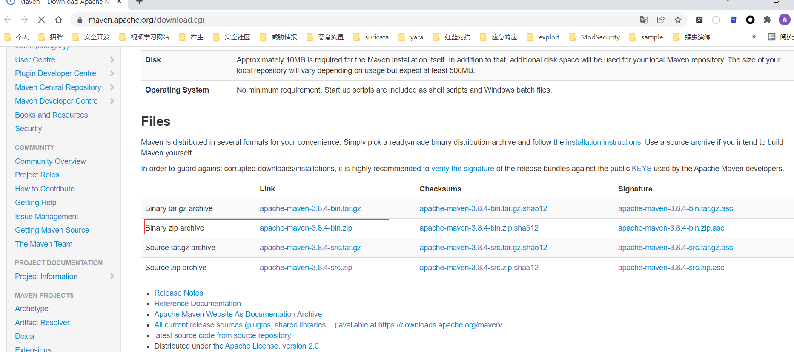


解压至D:\apache-maven-3.8.4-bin

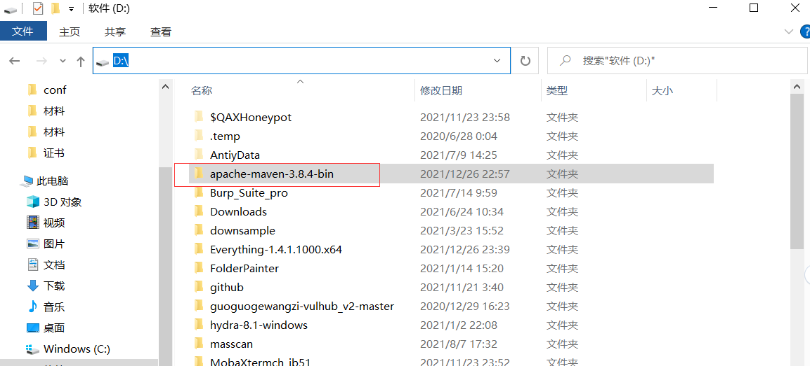


配置环境变量

新建：MAVEN_HOME，值为：D:\apache-maven-3.8.4-bin\apache-maven-3.8.4

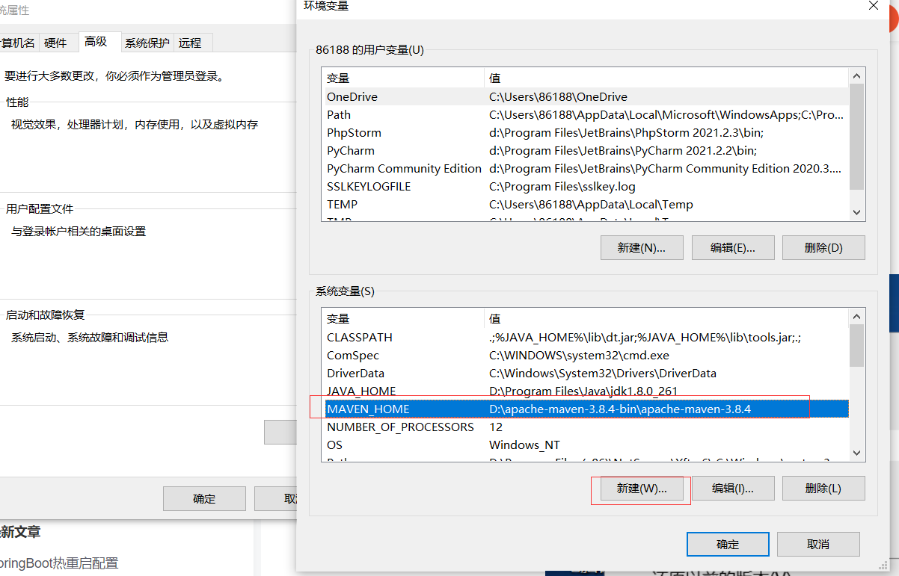


在path环境变量中添加：%MAVEN_HOME%\bin

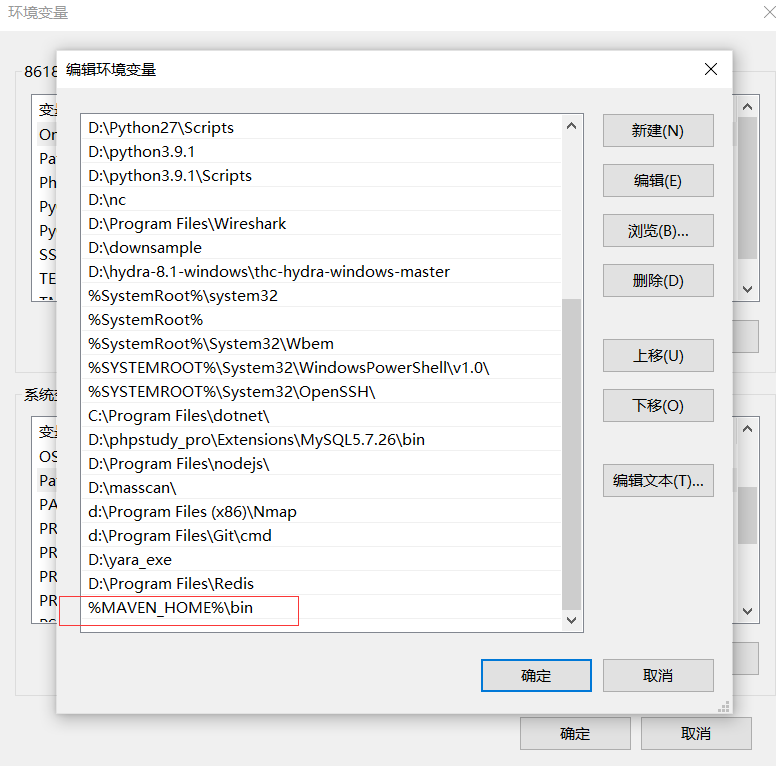


测试：mvn -v

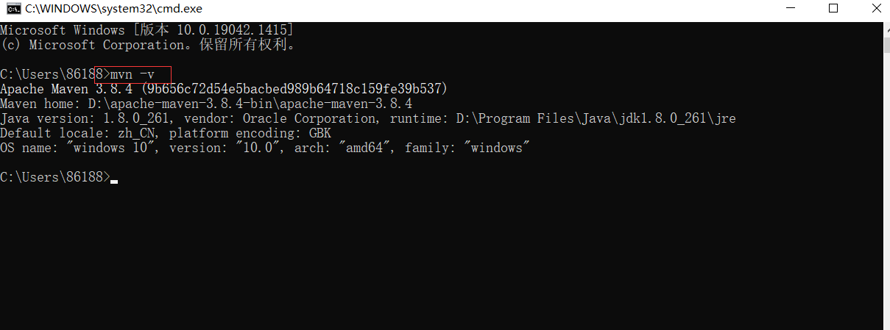


配置阿里云的仓库：

修改文件：D:\apache-maven-3.8.4-bin\apache-maven-3.8.4\conf\settings.xml


在  <mirrors>标签中注释以下内容：

```xml
	<!--
    <mirror>
      <id>maven-default-http-blocker</id>
      <mirrorOf>external:http:*</mirrorOf>
      <name>Pseudo repository to mirror external repositories initially using HTTP.</name>
      <url>http://0.0.0.0/</url>
      <blocked>true</blocked>
    </mirror>
	-->
```

添加如下内容：

```xml
	<mirror>
	  <id>nexus-aliyun</id>
	  <mirrorOf>*</mirrorOf>
	  <name>Nexus aliyun</name>
	  <url>http://maven.aliyun.com/nexus/content/groups/public</url>
	</mirror>
```

如图：

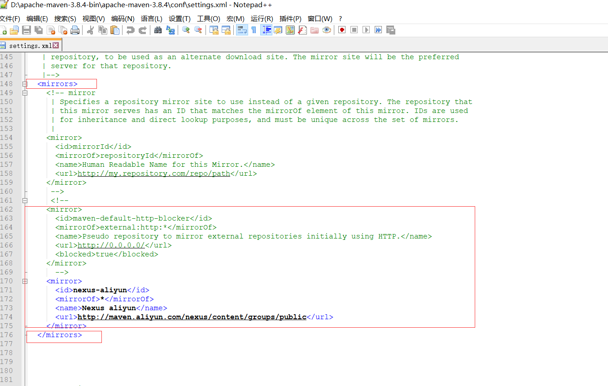


maven安装结束！


## 第二步：打包为jar包


项目：https://github.com/r00tSe7en/JNDIMonitor


1.将项目下载下来：可以直接点Download ZIP下载


2.下载后解压

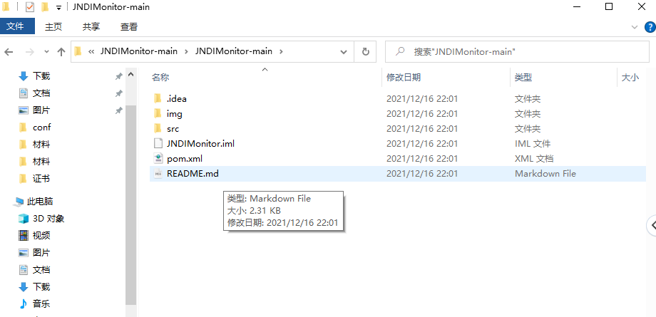


3.解压后，打开命令提示符窗口，进入到源码所在目录，执行命令`mvn package`

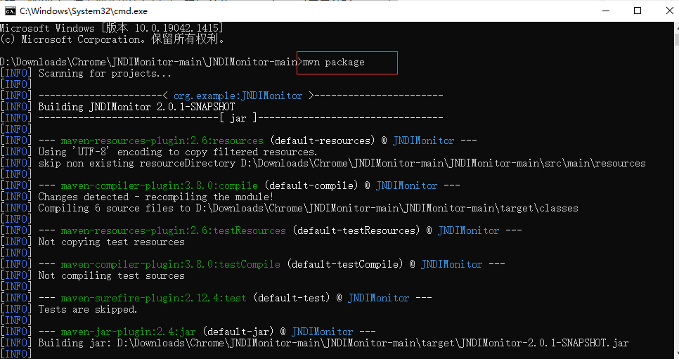


打包成功：

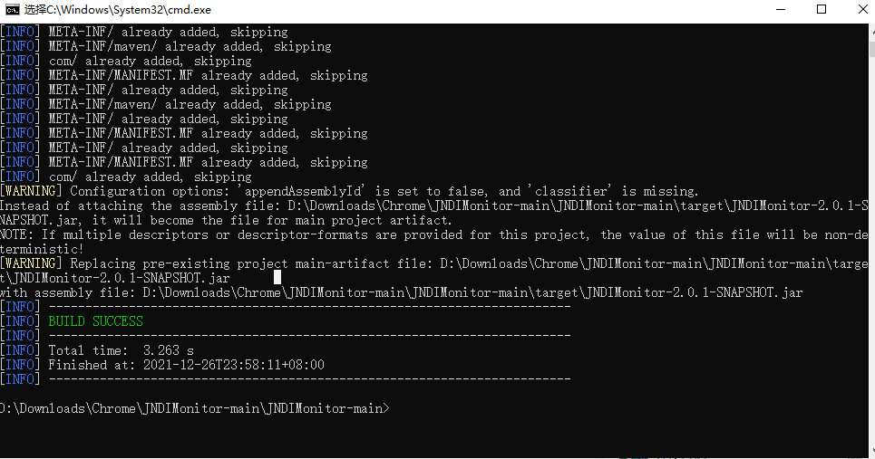


会生成`target文件夹`，在target目录下可以找到`jar包`

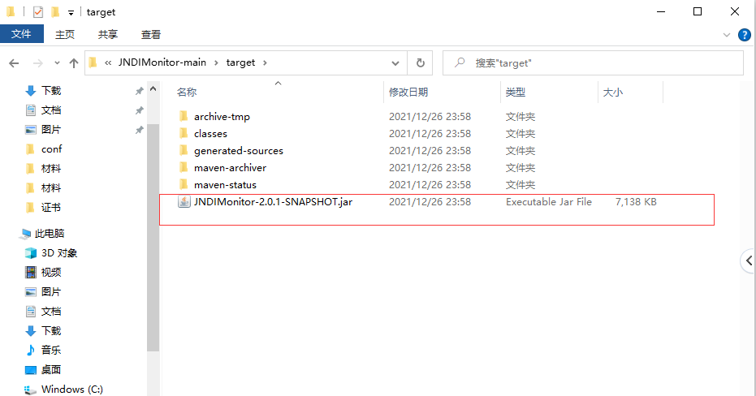


成功使用jar包：`java -jar JNDIMonitor-2.0.1-SNAPSHOT.jar`

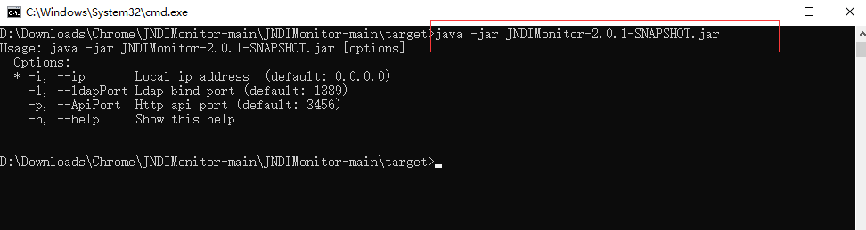


参考：

https://blog.csdn.net/weixin_40927846/article/details/82532054


结束！
