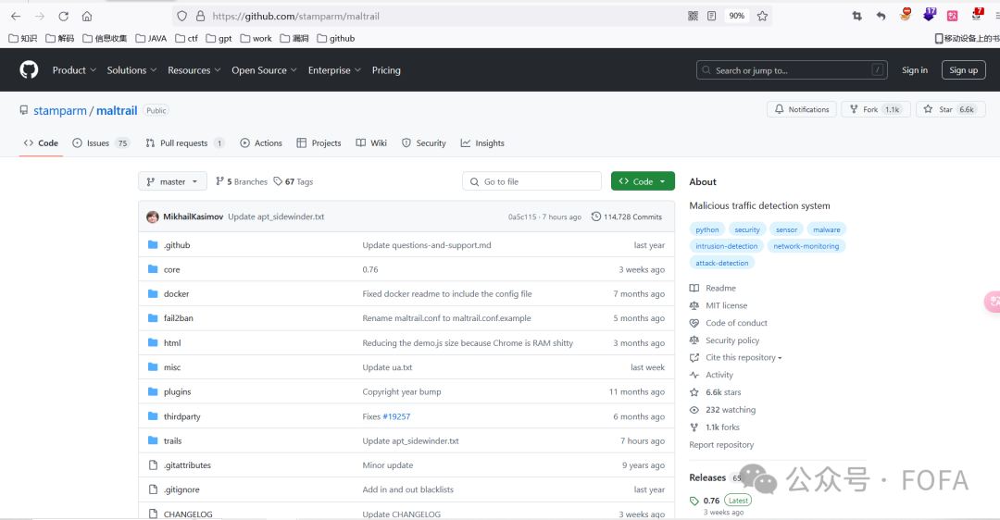
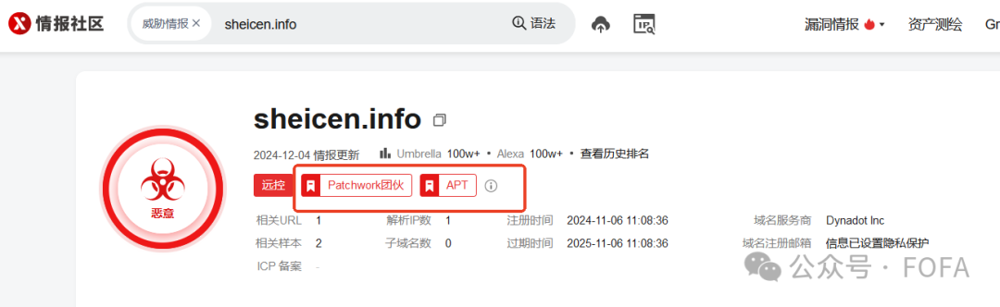
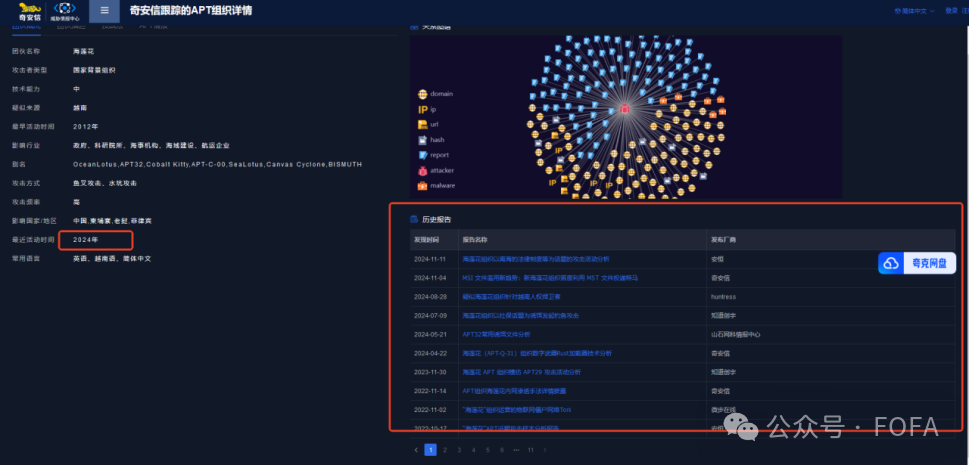

[通过FOFA进行威胁情报发现全攻略](https://mp.weixin.qq.com/s/hVwv1IZC-Elw5N7HSAMMAQ)
======================================================================

2025年01月21日 14:00共 12606 字阅读需 50.5 分钟


****▌**概述**

之前我们发布了一系列精彩纷呈的资产拓线实战记录文章，涵盖了 COLDRIVER、Ducktail 犯罪组织、响尾蛇 APT 组织等多个极具代表性的案例，还深入剖析了 ObserverStealer 窃密木马以及 APT Bitter 追踪实战，为广大读者揭开了网络威胁背后的神秘面纱，展示了如何利用 FOFA 在复杂的网络环境中抽丝剥茧，不断扩大搜索范围，挖掘出更多有价值的威胁情报，收获了非常多反馈和好评，因此我们决定将内部fofa资产拓线手册公开~

本文将系统地梳理资产拓线的全流程，从基础流程的输入源场景、样本获取渠道、IOC 归属组织确认方法，到核心操作要点中的依据相关因素构建 FOFA 语法、处理误报、结果验证等内容逐一展开，为大家呈现一套完整的FOFA威胁情报发现全攻略。

**▌工作流程图**


**▌输入源**

场景
--

*   已知组织找最新存活的IOC资产（我们主动的找某APT组织去拓线，如海莲花组织，则针对性的根据海莲花组织获取最新活跃的样本）

*   已知IOC拓线找该IOC对应组织最新存活资产（若是未知组织的IP，则直接跳到步骤二去确认组织归属。若是能确认组织，则可以直接去确认组织相关信息；若是未知组织或组织未被命名，则直接进行拓线）


样本获取渠道
------

以下提供几个定期更新APT组织最新样本的渠道，我们可以针对性的对某APT组织找案源进行资产拓线：

### 一、情报网站

*   360APT全景雷达 

https://apt.360.net/aptlist

*   天际友盟威胁情报中心\_情报查询\_情报订阅 

https://redqueen.tj-un.com/home/advanced

*   奇安信威胁情报中心 

https://ti.qianxin.com/apt/?type=map

*   安全星图平台 

https://ti.dbappsecurity.com.cn/apt/list

### 二、GitHub开源项目

```
https://github.com/stamparm/maltrail
https://github.com/blackorbird/APT_REPORT
```



### 三、公众号APT组织分析文章

以下分享几个会定期更新APT组织情报的公众号：

*   360威胁情报中心

*   腾讯安全威胁情报中心

*   奇安信威胁情报中心

*   绿盟科技威胁情报

*   安恒威胁情报中心

*   安天AVL威胁情报中心

*   威胁猎人Threat Hunter

*   国家网络威胁情报共享开放平台

*   ThreatPage全球威胁情报

### 四、Twitter公开情报

Twitter上有很多优秀的安全研究员或团队会输出一些有价值的情报，这些情报往往具备很强的时效性。由于篇幅有限，现仅列举历史拓线推文中曾引用推文的作者：

*   Yogesh Londhe：https://x.com/suyog41

*   Cyber Team：https://x.com/Cyberteam008

*   Group-IB Threat Intelligence：https://x.com/GroupIB\_TI

*   Chris Duggan：https://x.com/TLP\_R3D

五、样本库

```
https://bazaar.abuse.ch/browse/
https://app.any.run/
https://ata.360.net/
https://www.virustotal.com/gui/
https://s.threatbook.com/
```


**▌****确认IOC归属组织及组织相关信息**

IOC若为已知组织，则直接获取该组织相关信息；若为未知组织则需要先确认其归属组织，再获取该组织的相关信息。

确认归属组织
------

一般优先选择将IP/域名在各个威胁情报平台查找，看是否有打威胁组织标签。另外，还提供一种辅助方法为直接Google搜索，此方法需人工验证。
---------------------------------------------------------------------

如：初始IOC为IP 45.41.204\[.\]18 分别在微步在线情报社区和奇安信威胁情报中心打标签为“海莲花团伙”，则可以推断该组织为海莲花APT组织，又名OceanLotus。


如：域名为sheicen\[.\]info分别在微步在线情报社区和奇安信威胁情报中心打标签为“Patchwork团伙”，则可以推断该组织为摩诃草组织，又名Patchwork。




除此之外，还有以下的情况：域名neger\[.\]site只在微步在线情报社区有打"响尾蛇组织"标签，域名mofagov\[.\]live只在奇安信威胁情报中心打"响尾蛇组织"标签，是由于各平台的属性不同，我们需要在多个威胁情报平台交叉验证，来确定组织。


### 常见威胁情报社区

1\. 微步在线情报社区

链接：https://x.threatbook.com/

2\. 奇安信威胁情报中心

链接：https://ti.qianxin.com/

3. Virustotal

链接：https://www.virustotal.com/

4\. 安全星图平台

链接：https://ti.dbappsecurity.com.cn/

5\. 天际友盟威胁情报中心-RedQueen

链接：https://redqueen.tj-un.com/home/index

6\. 360安全大脑

链接：https://ti.360.net/

7\. 安天威胁情报中心

链接：https://www.antiycloud.com/

8\. VenusEye-威胁情报中心

链接：https://www.venuseye.com.cn/ip/

9\. 腾讯安全-威胁情报中心

链接：https://tix.qq.com/

10\. 绿盟威胁情报中心

链接：https://ti.nsfocus.com/

### Google

直接搜域名sheicen\[.\]info，通过人工辅助判断该域名为Patchwork团伙所控的C2域名。


获取组织的相关信息
---------

在确认了IOC所属的APT组织之后，获取该APT组织的相关信息至关重要。正所谓“知己知彼，百战不殆”。这不仅有助于加深对该组织的理解，还可以辅助进一步的情报收集和分析工作，即拓线。

通常我们需要收集以下背景信息：

*   组织名称：确定并记录APT组织的正式或别名。

*   来源：了解该组织的起源地、资助方等信息。

*   主要影响国家/地区：识别受影响最严重的地理位置。

*   影响行业：确定被攻击的主要领域，如政府、金融、能源等。

*   组织活跃时间：明确该组织的历史活动时期及其当前状态。

*   攻击方式：研究APT使用的特定技术和战术，如钓鱼邮件、零日漏洞利用、恶意软件等

上文分享的情报网站基本覆盖了所有APT组织背景信息，我们可以直接搜索组织的名称，去快速了解以上组织的背景信息。样本活跃时间的确定需要通过分析文章加入人工判断。

如：在奇安信威胁情报中心搜组织“海莲花”，在团伙概述模块有该组织的基本背景信息，如：攻击者类型、疑似来源、影响行业、攻击方式等等。




样本活跃时间的确定：

在奇安信威胁情报中心打开离我们做拓线分析时间最接近的文章，《MSI 文件滥用新趋势：新海莲花组织首度利用 MST 文件投递特马》，文章中提到了“简历.pdf”是首次 使用 MSI 文件滥用的新手法，其创建时间文件为 10 月 9 日。由此可以确认该组织这批样本从十月份就已经开始活跃。


**▌拓线（IOC共同特征提取）**

总结我们获取到的IOC，如果是多个则根据他们的共同特征进行提取，如果是单个则直接提取其特征，形成FOFA规则。

哪些字段可用于拓线
---------

单一的字段有时不能完全代表网站的所有特征，通常我们需要组合字段形成FOFA语法，以下提供一些可以用于拓线的字段：

```
fid（FOFA聚合多个关键特征形成的唯一标识符。通过FID，用户可以快速找到具有相似特征的网站资产‌）jarm（JARM 是一个活动的传输层安全 (TLS)服务器指纹识别工具）header_hash（FOFA的header_hash特征是指HTTP响应头信息的哈希值）body_hash (HTML正文计算的hash值)banner（协议banner信息）cert（证书）header（HTTP头信息）server（网站server）port（开放端口）icon_hash（标识设备的图标哈希值‌）certs_issuer_org（证书颁发者组织）certs_issuer_cn（证书颁发者通用名称）certs_subject_org（证书持有者组织）certs_subject_cn（ 证书持有者通用名称）lastupdatetime（FOFA最后更新时间）tls_ja3s（JA3S 用于 SSL/TLS 通信的服务器端，指纹是使用 ServerHello 数据包中的属性 SSL 版本、密码和 SSLExtension生成的）tls_version（TLS 协议版本）
```

特征选取
----

特征的选取通常基于以下几个因素：

唯一性：选择那些能够独特标识APT组织活动的特征，以减少误报和提高准确性。

稳定性：选择那些不易频繁变化的特征，如某些特定的技术栈或服务配置。

可探测性：选择那些可以通过网络扫描或情报收集轻易探测到的特征。

相关性：选择与APT组织行为模式紧密相关联的特征。

哪些特征可用于拓线我们已经知道了，那如何快速锁定APT组织相关资产呢，以下是一些可优先选取的特征及其理由：

*   证书特征：首先优先选取证书特征，因为证书信息相对稳定，不易频繁变化，可以作为APT组织资产识别的重要特征。证书提供了关于服务器身份的详细信息，包括颁发者、有效期、公钥等。证书的某些属性，如颁发机构（Issuer）和主题（Subject）中的组织名称，可以作为识别APT组织资产的重要线索。

*   TLS指纹：其次，选取TLS指纹，如JARM或JA3S指纹。这些指纹基于TLS握手过程中的详细信息，可以唯一标识一个服务器的TLS配置。TLS指纹可以帮助识别即使在IP地址或域名变化的情况下，仍然保持相同TLS配置的APT资产。

*   HTTP响应头特征：HTTP响应头特征，如Server头、Content-Type、Content-Length等。这些特征可以提供关于服务器软件、页面内容和响应大小的信息。通过分析这些特征，可以识别出与APT组织相关的特定服务器配置或行为模式并且这些信息相对稳定，易于通过网络扫描探测到。

*   HTTP响应Banner特征：Banner特征，如HTTP响应中的服务版本信息，也可以作为识别APT资产的线索。这些信息可能在APT组织的攻击基础设施中保持一致，从而帮助识别相关的资产。

### 1\. 基于证书的指纹关联


服务器证书包括以下几种信息：

*   Issuer (证书的发布机构)

*   Valid from , Valid to (证书的有效期)

*   Public key (公钥)

*   Subject (证书所有者)

*   Signature algorithm (签名所使用的算法)

*   Thumbprint, Thumbprint algorithm (指纹以及指纹算法)

例如：推特上一名安全研究员Cyber Team发布的一篇帖子分享了一个Lazarus组织常用的证书，该证书被重复用于多个域名。根据该证书的Serial Number可以唯一确定该证书。


通过此特征最终拓线该组织6条独立IP和多个关联域名。


### 2\. 基于TLS指纹关联


*   JA3方法用于收集Client Hello数据包中以下字段的十进制字节值：版本、可接受的密码、扩展列表、椭圆曲线密码和椭圆曲线密码格式，有助于识别客户端。JA3/S方法用于 SSL/TLS 通信的服务器端，指纹是使用 ServerHello 数据包中的属性 SSL 版本、密码和 SSLExtension生成的。JA3、JA3/S主要基于流量，服务器面对不同客户端产生不同的JA3S指纹。

*   JARM则是完全主动的扫描并生成指纹，服务器可以生产唯一的JARM指纹。是一个活动的传输层安全 (TLS)服务器指纹识别工具，可以快速验证组中的所有服务器是否具有相同的 TLS 配置。

例：可以通过特殊的JARM指纹来分辨服务器是否部署C2服务，例如，在 Github 上，由 ProjectDiscovery团队开发并维护的项目 “nuclei-templates”，其脚本可用于识别 C2 服务。


其中使用cobalt-strike-c2的jarm指纹在FOFA搜索结果如下，显然数据量并不正常。


这里还可以通过对app="COBALTSTRIKE-团队服务器"搜索结果的JARM反向搜索：


这里比对两次搜索结果的数据量，很显然JARM指纹等于C2指纹≠该服务是C2。结合我们上述的实践可以得出一个结论：JARM其实对识别CobaltStrike等上层应用软件并不十分可靠，仅仅能够起到一个辅助的作用，实际工作中还是要结合多方面的信息来进行判断。

### 3\. 基于Header的指纹关联


HTTP header中包括以下几种信息：

*   **Content-Type：**代表内容的媒体类型和编码格式。

*   **Content-Length：**表示传输的请求／响应的Body的长度。

*   **Server：**用于返回服务器相关的软件信息。

*   **header\_hash：**将HTTP或HTTPS响应头信息去掉value值后生成一个hash值。

以下是推特上一名安全研究员9823f\_分享的拓线例子：

使用HEDnsExtractor(一款专门用于提取 DNS 流量中的数据包或域名的工具)和Httpx(一个快速的web应用侦查工具，它的模块可以高效的处理http请求和响应)借助分析。

```
HEDnsExtractor -target 206.188.196.37 -silent | httpx -title -tech-detect -location -radom-agent -silentHEDnsExtractor -target 206.188.196.37 -silent   针对目标ip206.188.196.37获取与该 IP 地址相关联的域名信息，同时减少输出的冗余信息。httpx -title -tech-detect -location -radom-agent -silent  识别刚刚所得域名的标题、网站指纹、重定向位置，同时随机化User-agent模拟正常的用户行为。-title 显示网站标题-tech-detect 显示基于wappalyzer的探测网站指纹-location 显示重定向的location头-radom-agent 代理-silent 简洁模式
```

输出结果为：

```
http://hmaajijghahmhij.top [http://www.google.com] [Nginx 1.18.0,Ubuntu]
http://mjjagccfegadkej.top [http://www.google.com] [Nginx 1.18.0,Ubuntu]
```

根据结果，总结其共同特征：

```
组织均为“BLNWX”
http响应的重定向位置均为"Location: http://www.google.com"
server均为nginx/1.18.0 (Ubuntu)
域名不为空
```

组合形成最终的FOFA语法：

```
org="BLNWX" && header="Location: http://www.google.com" && header="Server: nginx/1.18.0 (Ubuntu)" && domain!=""
```

```
拓线结果为33个该模板类型的独立ip。
```

### 4\. 基于Banner的指纹关联


Banner信息，也称为服务标识或服务Banner，是在客户端与服务器建立连接时，服务器发送给客户端的初始信息。这些信息通常包含了服务器的名称、版本号、操作系统、支持的协议等。然而，由于Banner可以进行人为修改、伪装或模糊，这使得单纯基于Banner的字段信息进行资产探测与识别的准确率无法得到保证。大家可以参考文章[《FOFA资产拓线实战系列：COLDRIVER》](https://mp.weixin.qq.com/s?__biz=MzkyNzIwMzY4OQ==&mid=2247489406&idx=1&sn=e1fb225476f26dfa0a24203c2f83d25c&scene=21#wechat_redirect)，里面利用C2的banner、port的特征组合进行拓线。

### 5\. 基于端口的指纹关联

端口作为服务器上开放的通信接口，往往承载着重要的网络连接信息。在某些情况下，攻击者会在远程访问工具（RAT）或钓鱼邮件中硬编码回连的端口号，以便与目标服务器建立隐蔽的连接。此外，在僵尸网络中，攻击者也可能通过开启诸如Telnet、SSH等协议来实现对受控设备的管理和控制。因此，通过对特定端口的监测和分析，可以揭示出潜在的目标服务器，进而追踪并防御这些恶意活动。

例如：在一次APT追踪实战中，我们发现APT组织在攻击路由器成功后会在目标上开放22端口，并且banner信息均带有“SSH-2.0-OpenSSH\_6.7p2”特征。因此可以通过先获取该路由资产再通过port关联的方式将可能沦为僵尸网络的路由筛选出来。

首先通过iocn\_hash收集这批路由器资产

```
icon_hash="-1438236046"
```

发现结果明显有误报，这时我们可以借助Gofofa工具批量去搜索符合以下特征的目标。

```
目标上开放22端口
banner中含有"SSH-2.0-OpenSSH_6.7p2"
```

生成Gofofa的命令为：

```
fofa search -i 1.txt --template "ip={} && port=22 && banner=SSH-2.0-OpenSSH_6.7p2" -o 2.csv## -i 批量搜索的ip文件##-template 批量搜索## -o 输出文件
```


输出结果为符合失陷路由器特征的IP。

通用思路
----

参考[《FOFA资产拓线实战系列：响尾蛇APT组织》](https://mp.weixin.qq.com/s?__biz=MzkyNzIwMzY4OQ==&mid=2247489202&idx=1&sn=3bb931ee03b8eac819a4302060a4a9da&scene=21#wechat_redirect)的拓线思路：

```
IOC：
neger[.]site
semain[.]tech
```

使用FOFA依次对这两个域名进行查询，观察他们的特征。


在观察的过程中，发现三个IOC 的FOFA所搜结果内容，其中header均包含以下两个特征：

```
HTTP/1.1 404 Not Found 
Content-Type: text/html
```

但是所含这个两个特征的网站结果太多，可以暂时忽略。然后发现ASN组织等信息，都各不相同，也没有所谓的相同的title等。最后通过多方面观察和寻找共同点，发现他们有相同的JARM指纹，提取：

```
jarm="3fd3fd0003fd3fd21c3fd3fd3fd3fd703dc1bf20eb9604decefea997eabff7"
```

单一特征判断存在很大的误差，所以需要去查找三条IOC的其他共性特征。发现前两个域名的header都存在404 Not Found、Server: nginx、Content-Type: text/html、Content-Length都为183或535个字符串，可以把这些特征也加入FOFA语法中继续查询。则目前语法为：

```
jarm="3fd3fd0003fd3fd21c3fd3fd3fd3fd703dc1bf20eb9604decefea997eabff7" && header="HTTP/1.1 404 Not Found" && header="Server: nginx" && header="Content-Type: text/html" && (header="Content-Length: 183" || header="Content-Length: 535")
```

**▌误报处理**

根据上述拓线后的结果进行误报判断，如果出现符合以下误报情况，则进行去除误报步骤，去除误报完毕，再对现在拓线结果进行再次的误报判断，反复此过程，直到排除所有可判断的误报，输出最后的拓线结果。误报处理流程如下图：


误报情况判断
------

### 1\. 数据量过大

当查询结果数量是以上万的规模，该结果从数量上判断，存在误报的可能性较高（通常APT组织资产短时间不会暴露那么多在互联网，僵尸网络资产除外），此时需要再结合其他特征进行过滤，来控制结果数量到一个可以人工干预（例如：后续用于主动探测二次判断）的数量级。

如：仅仅查“banner="404 Not Found"”，有316493580个拓线结果。细看之后发现，选取的特征没有独特性，结果中网站明显有很大的差异。


### 2\. 存在明显误报

#### 国内的IP

一般情况下国外背景的APT组织使用的VPS位于国外，如果拓线结果中国内样本占有一定比例，可能要考虑属于误报了。但是不排除特殊情况，比如APT组织以当前受害者作傀儡机继续使用，需要特殊判断。

### 3\. 拓线结果与组织活跃时间差距大

将FOFA拓线结果样本的最后更新时间与我们获取到的组织活跃时间相比较，如果更新时间与情报事件所处时间相差太大则置信度较低。

如：在十月中旬做海莲花拓线时，根据已有线索可以推测该组织这批样本从十月份就已经开始活跃，但是在拓线结果发现有一条ip位置为国内，且最近更新时间为2024-01-01，与我们最初推测活跃时间相差过大，所以考虑为误报情况。


### 4\. 情报社区覆盖低或无覆盖

将拓线结果在开源情报社区检测是否被已打上APT组织名称标签，如果都无标签覆盖或覆盖样本数在拓线结果占比极低，但是有其他辅助验证方法（如特殊路径碰撞），则选取其他方式验证。若无其他辅助验证方法，只从情报社区看，低于30%需要对拓线语法再次核对。

**特殊情况：**从IOC拓线出全网只有三四条资产，但只有IOC被情报社区标定了APT组织标签，拓线新增的资产都没被标记，可能是因为资产数量少，考虑是可信的，需人工再次判断。

去除误报
----

去除误报首先选择的方法便是重新调整我们总结的FOFA字段，其他方法做补充。

### 1\. 重新调整FOFA字段或取交集

FOFA规则的构造并非一蹴而就，单一的特征可能会出现成千上万条结果，明显存在很多误报。我们需要根据结果不断地去重复调整总结的FOFA规则，首先要思考选取的FOFA字段是否合理，是否有遗漏的关键信息。如已知C2的IP是否在时间上具有特征，其被探测出端口的时间，证书的注册时间等；证书颁发者是否是同一厂商；使用的服务器是不是有相同特征。

比如：[《FOFA资产拓线实战系列：COLDRIVER》](https://mp.weixin.qq.com/s?__biz=MzkyNzIwMzY4OQ==&mid=2247489406&idx=1&sn=e1fb225476f26dfa0a24203c2f83d25c&scene=21#wechat_redirect)对已有C2拓线

```
C2:
45.133.216[.]15:3000
```


**线索一：**通过3000端口及端口的banner信息查询，发现17条记录16个IP。

```
banner="x15x03x03x00x02x022" && port="3000"
```


观察这17条数据后发现他们端口及banner信息高度相似，但是还是存在明显的数据误报。所以仅仅通过banner跟端口这种方式去查找不行需要进一步添加条件，于是我们把证书条件也进行添加，使用以下FOFA语法，得到了5条数据。

```
banner="x15x03x03x00x02x022" && port="3000" && cert="Internet Widgits Pty Ltd"
```

**线索二：**通过证书查找，我们发现证书的 Organization:Internet Widgits Pty Ltd 应该是配置证书时的默认值。分析发现了一个较为关键的线索就是证书有效期。我们通过证书有效期跟证书默认组织名进行搜索。


```
cert="Internet Widgits Pty Ltd" && cert="2023-06-23 15:59 UTC"
```

将线索一二取交集，得到三条数据，发现为2023年8月到2023年10月。恰好位于Google威胁分析小组认为该组织活跃的时间内。

```
banner="x15x03x03x00x02x022" && port="3000" && cert="Internet Widgits Pty Ltd" && cert="2023-06-23 15:59 UTC"
```

### 2\. 路径碰撞

此方法可以在总结IOC特征时，若发现下载后门的固定下载路径则可以借助fofax辅助去判断。

如：在文章[《FOFA资产拓线实战系列：Ducktail犯罪组织》](https://mp.weixin.qq.com/s?__biz=MzkyNzIwMzY4OQ==&mid=2247489357&idx=1&sn=a694631c1a7fd68bf36936aa2a95718a&scene=21#wechat_redirect)中对已有C2拓线，根据特征形成语法后发现拓线结果有上万个，由于该模板误报率过高，所以需要前期IOC分析时获取到的路径/api/check结合判断。这里的路径来自对样本的跟踪分析，通过跟踪初始IOC文件hash，放入VT沙箱跟踪其通联路径发现存在图片马，主动访问目标获得样本，继续分析得到该地址。除了在线沙箱也可以通过逆向分析，主动连接（虚拟机下尝试，注意避免命令执行）获取到目标更多的信息。

```
IP
138.201.8[.]186
FOFA语法
header="404 Not Found" && header="Transfer-Encoding: chunked" && header="Server: Microsoft-IIS" && icon_hash="" && title="" && header_hash="-324809210"
```

```
使用Fofax和Httpx（这里推荐使用官方开发的工具Gofofa~）进一步去除误报
```

```
fofax -q 'header="404 Not Found" && header="Transfer-Encoding: chunked" && header="Server: Microsoft-IIS" && icon_hash="" && title="" && header_hash="-324809210"' -fs 10000 | httpx -path /api/check -sc -cl -mc 200 --ml 355

#-fs 返回结果数量
#-path 要探测的路径
#-sc  显示响应的状态码
#-cl  显示响应从内容长度
#-mc  匹配具有指定状态码的响应
#-ml  匹配具有指定内容长度的响应
```

得到一批新的存活IOC：


### 3\. 逆向分析

当IOC以钓鱼网站的形式出现时，其上可能存留有APK等形式的附件，对附件进行逆向分析，归纳出其特点，对FOFA查询结果上的地址获取附件进行分析能够有效地增强拓线结果的信服力。以[《FOFA资产拓线实战系列：APT-C-23 Android端》](https://mp.weixin.qq.com/s?__biz=MzkyNzIwMzY4OQ==&mid=2247489312&idx=1&sn=bca81d4ffc475438c9bd0704991901a1&scene=21#wechat_redirect)为例，通过对APK逆向分析发现该类APP安装时会检测是否安装另一个APP。

> 跳到声明GConfig.PT\_PACKAGE\_NAME的地方，PT\_PACKAGE\_NAME字段通过拼接的方式获取最终包名，经过拼接显示该包名为com.video.graphics，因此该应用会检测是否安装了另一个app，如果没有安装则提示更新为用户下载com.video.graphics并安装，行为模式一致，所以不用做进一步的分析了。


### 4\. 其他情况

有这样一个场景，通过分析IOC发现目标域名全部是https://\*\*\*.com 且无子域名，这种情况下仅依赖FOFA语法已无法实现需求所以需要对结果进行二次筛选。类似的情况在实际分析中一定还会遇到，所以需要具体情况具体分析。

**▌验证拓线结果**

统计学
---

将拓线结果在其他威胁情报平台搜索，看是否有打该组织标签，如果包含打标签的占了一定比例则说明此拓线结果有一定的可信度。

如：用以下FOFA语法拓线，结果有6个ip

```
banner="HTTP/1.1 404 Not Found" && banner="Server: nginx" && (port="4443" || port="8443") && banner="Content-Length: 146" && banner="Content-Type: text/html; charset=utf-8" && jarm="21d19d00021d21d00042d43d0000005ad20eceaf7f71ae0887d2ff117bf97f" && country!="CN"
```

```
在其他威胁情报网站进行验证，结果如下：
```

<table><colgroup><col width="163"><col width="163"><col width="163"><col width="161"><col width="52"></colgroup><tbody><tr><td colspan="1" rowspan="1" width="129.33333333333334"><section><span>ip</span></section></td><td colspan="1" rowspan="1" width="100.33333333333331"><section><span>奇安信</span></section></td><td colspan="1" rowspan="1"><section><span>微步</span></section></td><td colspan="1" rowspan="1" width="60.33333333333333"><section><span>virustotal</span></section></td></tr><tr><td colspan="1" rowspan="1" width="15.000000000000014"><section><span>103.106.231[.]87</span></section></td><td colspan="1" rowspan="1" width="100.33333333333331"><section><span>-</span></section></td><td colspan="1" rowspan="1"><section><span>-</span></section></td><td colspan="1" rowspan="1" width="60.33333333333333"><section><span>-</span></section></td></tr><tr><td colspan="1" rowspan="1" width="15.000000000000014"><section><span>103.91.67[.]74</span></section></td><td colspan="1" rowspan="1" width="100.33333333333331"><section><span>海莲花组织</span></section></td><td colspan="1" rowspan="1"><section><span>海莲花组织</span></section></td><td colspan="1" rowspan="1" width="60.33333333333333"><section><span>恶意</span></section></td></tr><tr><td colspan="1" rowspan="1" height="64" width="15.000000000000014"><section><span>190.211.254[.]203</span></section></td><td colspan="1" rowspan="1" height="64" width="100.33333333333331"><section><span>海莲花组织</span></section></td><td colspan="1" rowspan="1" height="64"><section><span>海莲花组织</span></section></td><td colspan="1" rowspan="1" width="60.33333333333333" height="64"><section><span>-</span></section></td></tr><tr><td colspan="1" rowspan="1" width="15.000000000000014"><section><span>223.165.5[.]187</span></section></td><td colspan="1" rowspan="1" width="100.33333333333331"><section><span>-</span></section></td><td colspan="1" rowspan="1"><section><span>-</span></section></td><td colspan="1" rowspan="1" width="60.33333333333333"><section><span>-</span></section></td></tr><tr><td colspan="1" rowspan="1" width="15.000000000000014"><section><span>193.138.195[.]192</span></section></td><td colspan="1" rowspan="1" width="100.33333333333331"><section><span>海莲花组织</span></section></td><td colspan="1" rowspan="1"><section><span>海莲花组织</span></section></td><td colspan="1" rowspan="1" width="60.33333333333333"><section><span>-</span></section></td></tr><tr><td colspan="1" rowspan="1" width="15.000000000000014"><section><span>45.41.204[.]18</span></section></td><td colspan="1" rowspan="1" width="100.33333333333331"><section><span>海莲花组织</span></section></td><td colspan="1" rowspan="1"><section><span>海莲花组织</span></section></td><td colspan="1" rowspan="1" width="60.33333333333333"><section><span>恶意</span></section></td></tr></tbody></table>

则说明这个FOFA语法的拓线结果可信度比较高。

**▌总结**

本文中，我们详细了解了 FOFA 资产拓线的输入源、样本获取渠道以及 IOC 归属组织的确认方法等关键步骤，并深入探讨了如何基于已获取的信息，运用 FOFA 进行更精准、高效的资产拓线操作，包括如何选取合适的特征构建 FOFA 语法以及如何处理拓线过程中可能出现的误报情况等重要内容。

至此，我们完整地呈现了通过FOFA进行威胁情报发现的全攻略，希望这篇文章可以帮助师傅们更好地利用 FOFA 进行资产拓线和信息收集，并最大化地发挥 FOFA 的价值。

**▌****References**

1.  https://ti.qianxin.com/blog/articles/new%20-trend-in-msi-file-abuse-new-oceanlotus-group-first-to-use-mst-files-to-deliver-special-trojan-cn/

2.  https://mobile.x.com/Cyberteam008/status/1789156897318207976

3.  https://github.com/projectdiscovery/nuclei-templates/tree/main/network/jarm/c2

4.  https://github.com/FofaInfo/GoFOFA

5.  [FOFA资产拓线实战系列：响尾蛇APT组织](https://mp.weixin.qq.com/s?__biz=MzkyNzIwMzY4OQ==&mid=2247489202&idx=1&sn=3bb931ee03b8eac819a4302060a4a9da&scene=21#wechat_redirect)

6.  [FOFA资产拓线实战系列：COLDRIVER](https://mp.weixin.qq.com/s?__biz=MzkyNzIwMzY4OQ==&mid=2247489406&idx=1&sn=e1fb225476f26dfa0a24203c2f83d25c&scene=21#wechat_redirect)

7.  [FOFA资产拓线实战系列：Ducktail犯罪组织](https://mp.weixin.qq.com/s?__biz=MzkyNzIwMzY4OQ==&mid=2247489357&idx=1&sn=a694631c1a7fd68bf36936aa2a95718a&scene=21#wechat_redirect)

8.  [FOFA资产拓线实战系列：APT-C-23 Android端](https://mp.weixin.qq.com/s?__biz=MzkyNzIwMzY4OQ==&mid=2247489312&idx=1&sn=bca81d4ffc475438c9bd0704991901a1&scene=21#wechat_redirect)

**▌tip**

后续我们将持续对文章内容进行优化与完善，最新版本可以在 https://github.com/FofaInfo/Awesome-FOFA中查看，欢迎大家随时关注并提出宝贵建议~

**▌End**

欢迎各位白帽师傅们加入我们的社区大家庭，一起交流技术、生活趣事、奇闻八卦，结交无数白帽好友。

也欢迎投稿到 FOFA，审核通过后可获得F点奖励，快来加入微信群体验吧~~~

微信群：扫描下方二维码，加入 FOFA 社群！获取更多一手信息！

