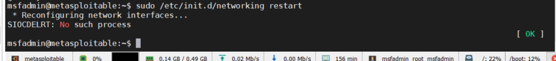

1-实战-使用Metasploitable2搭建实验靶场

改为静态ip

msfadmin@metasploitable:~$ sudo vi /etc/network/interfaces


重启网卡

msfadmin@metasploitable:~$ sudo /etc/init.d/networking restart




修改root密码

msfadmin@metasploitable:~$ sudo passwd root
Enter new UNIX password:                                   #123
Retype new UNIX password:								#123
passwd: password updated successfully
msfadmin@metasploitable:~$


2-实战-使用HTTrack网站镜像工具克隆网站


3-实战-使用setoolkit做一个钓鱼网站记录用户帐号和密码

root@kali:~# setoolkit

选择第一个


选择第二个


翻译：


选择第三个：


选择第二个


使用：默认端口，输入目标地址：http://192..168.111.130/dvwa


结果：成功访问钓鱼网站：http://192.168.111.141，输入用户名：admin，密码：pass


点击登录，通过日志获得useraname和password，同时浏览器调转至真正的服务器登录地址：http://192.168.111.130/dvwa/login.php,

正常人认为输入的用户名或密码错误，不会察觉，导致正确的用户名密码被钓鱼网站记录


实战：

参考

https://github.com/trustedsec/social-engineer-toolkit

安装;

```shell
git clone https://github.com/trustedsec/social-engineer-toolkit/ setoolkit/
cd setoolkit
pip3 install -r requirements.txt
python3 setup.py
```


运行:

setoolkit


目标网站：

https://www.weimob.com/website/login.html